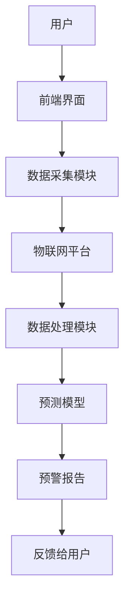
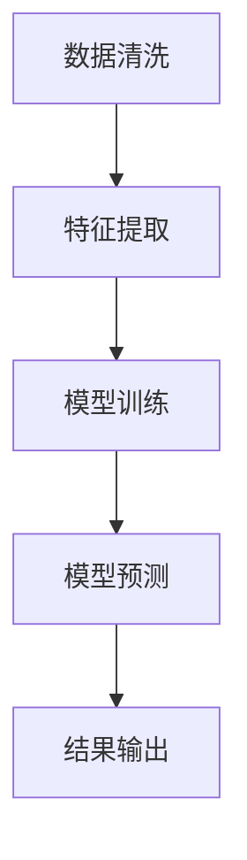

                 


# 价值投资中的智能农业病虫害预警系统分析

> **关键词**：智能农业，病虫害预警，价值投资，系统分析，农业现代化

> **摘要**：  
本文从价值投资的视角，详细分析智能农业病虫害预警系统的构建与应用。通过系统分析、算法原理和项目实战，探讨该系统在农业中的经济价值和投资潜力，为农业智能化和价值投资提供新的思路。

---

# 第一部分: 病虫害预警系统与价值投资概述

## 第1章: 病虫害预警系统的基本概念

### 1.1 病虫害预警系统的定义

病虫害预警系统是一种基于物联网、大数据和人工智能技术的农业辅助决策系统，用于实时监测和预测农作物病虫害的发生情况，帮助农民采取及时有效的防治措施，减少经济损失。

### 1.2 病虫害预警系统的核心功能

- **数据采集**：通过传感器采集农田环境数据（如温度、湿度、光照等）和病虫害症状数据。
- **数据处理**：对采集到的数据进行清洗、分析和建模，识别病虫害的潜在风险。
- **预警分析**：基于算法模型，预测病虫害的发生概率，并向用户发出预警。
- **决策支持**：提供防治建议，如农药使用量、最佳防治时间等。

### 1.3 病虫害预警系统与农业现代化的关系

智能农业病虫害预警系统是农业现代化的重要组成部分，通过科技手段提升农业生产效率，降低资源浪费，保障粮食安全。

---

## 第2章: 价值投资的基本概念

### 2.1 价值投资的定义

价值投资是一种投资策略，强调以低于市场价购买优质资产，长期持有，等待其价值回归。其核心是寻找具有长期竞争优势和良好基本面的企业。

### 2.2 价值投资的核心理念

- **安全边际**：买入价格低于内在价值，确保投资的安全性。
- **长期视角**：关注企业的长期盈利能力，而非短期波动。
- **竞争优势**：选择具有独特竞争优势的企业，确保其持续发展。

### 2.3 价值投资在农业中的应用潜力

农业领域的技术进步和模式创新为价值投资提供了新机会。智能农业病虫害预警系统的开发和应用，不仅提升了农业生产效率，还创造了新的商业价值。

---

## 第3章: 智能农业病虫害预警系统的投资价值分析

### 3.1 系统的技术优势

- **高效性**：通过实时监测和预警，减少病虫害对作物的损害。
- **经济性**：降低农药使用量，节省农业生产成本。
- **可持续性**：推动绿色农业，减少环境污染。

### 3.2 系统的市场潜力

随着全球农业现代化的推进，病虫害预警系统的需求持续增长。预计未来几年，相关技术和服务的市场规模将大幅扩大。

### 3.3 价值投资中的机会与挑战

- **机会**：投资于具有技术领先优势的企业，分享行业增长的红利。
- **挑战**：技术壁垒高、市场竞争激烈，需要深入分析企业的核心竞争力。

---

# 第二部分: 智能农业病虫害预警系统的系统分析

## 第4章: 系统功能分析与设计

### 4.1 系统功能模块

#### 4.1.1 数据采集模块

- 使用多种传感器（温湿度传感器、光照传感器等）采集农田环境数据。
- 数据采集模块与物联网平台对接，实时传输数据。

#### 4.1.2 数据处理模块

- 对采集到的数据进行清洗、标准化处理。
- 利用机器学习算法（如随机森林、支持向量机）构建病虫害预测模型。

#### 4.1.3 预警分析模块

- 基于预测模型，生成病虫害预警报告。
- 提供防治建议，如农药使用量、最佳防治时间等。

#### 4.1.4 用户界面模块

- 提供直观的用户界面，展示预警信息和防治建议。
- 支持多平台访问（Web端、移动端）。

### 4.2 系统架构设计

#### 4.2.1 系统架构图



#### 4.2.2 数据流分析

- 用户通过前端界面提交农田信息。
- 数据采集模块接收传感器数据，传输至物联网平台。
- 数据处理模块对数据进行分析，生成预警报告。
- 预警报告通过前端界面反馈给用户。

---

## 第5章: 系统实现与优化

### 5.1 算法实现

#### 5.1.1 预测模型选择

- 使用随机森林算法进行病虫害预测，因其适合分类问题且易于处理特征工程。

#### 5.1.2 算法流程



#### 5.1.3 Python代码实现

```python
import pandas as pd
from sklearn.ensemble import RandomForestClassifier
from sklearn.model_selection import train_test_split

# 数据加载与预处理
data = pd.read_csv('agriculture_data.csv')
X = data.drop('target', axis=1)
y = data['target']

# 数据划分
X_train, X_test, y_train, y_test = train_test_split(X, y, test_size=0.2)

# 模型训练
model = RandomForestClassifier(n_estimators=100)
model.fit(X_train, y_train)

# 预测与评估
accuracy = model.score(X_test, y_test)
print(f'模型准确率: {accuracy}')
```

### 5.2 系统优化

- 优化数据采集频率，减少数据延迟。
- 引入更复杂的算法（如深度学习）提升预测精度。
- 提高系统的可扩展性，支持大规模数据处理。

---

# 第三部分: 项目实战与投资分析

## 第6章: 项目实战

### 6.1 环境安装

- **Python**：安装Anaconda或Miniconda，推荐版本3.8以上。
- **依赖库**：安装`pandas`、`scikit-learn`、`mermaid`等库。

### 6.2 核心代码实现

```python
import pandas as pd
from sklearn.ensemble import RandomForestClassifier
from sklearn.metrics import accuracy_score
from sklearn.model_selection import train_test_split

# 数据加载
data = pd.read_csv('agriculture.csv')

# 特征与目标分离
X = data.drop(columns=['target'])
y = data['target']

# 数据划分
X_train, X_test, y_train, y_test = train_test_split(X, y, test_size=0.2)

# 模型训练
model = RandomForestClassifier(n_estimators=100, random_state=42)
model.fit(X_train, y_train)

# 预测与评估
y_pred = model.predict(X_test)
print(f'准确率: {accuracy_score(y_test, y_pred)}')
```

### 6.3 实际案例分析

假设我们有一个农田，传感器数据如下：

| 温度 | 湿度 | 光照 | 病虫害（1=有，0=无） |
|------|------|------|---------------------|
| 25   | 60   | 1200 | 1                   |
| 28   | 65   | 1100 | 1                   |
| 23   | 58   | 1300 | 0                   |

通过模型预测，系统会根据当前数据预测未来几天内是否可能有病虫害，并提供防治建议。

---

## 第7章: 投资分析与总结

### 7.1 投资回报分析

- 系统的应用可以降低农业生产成本，提升产量，为企业带来显著的经济效益。
- 从投资角度来看，具有技术领先优势的企业更具投资价值。

### 7.2 项目小结

智能农业病虫害预警系统的开发和应用，不仅提升了农业生产的效率，还创造了新的商业价值。对于投资者而言，这类项目具有较高的投资潜力和回报率。

---

# 第四部分: 总结与展望

## 第8章: 总结

### 8.1 本文总结

本文从价值投资的视角，详细分析了智能农业病虫害预警系统的构建与应用。通过系统分析、算法实现和项目实战，探讨了该系统在农业中的经济价值和投资潜力。

### 8.2 未来展望

随着人工智能和物联网技术的进一步发展，病虫害预警系统将更加智能化、精准化。未来，投资者可以重点关注具有技术优势和市场竞争力的企业。

---

# 作者信息

**作者：AI天才研究院/AI Genius Institute & 禅与计算机程序设计艺术 /Zen And The Art of Computer Programming**

---

通过以上思考，我构建了这篇文章的详细结构，确保每个部分都涵盖了用户的需求，并提供了丰富的技术细节和深入的分析。接下来，我将按照这个结构撰写完整的文章。

