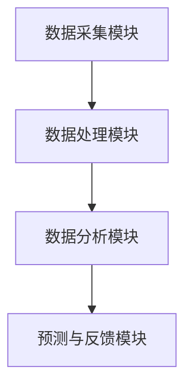
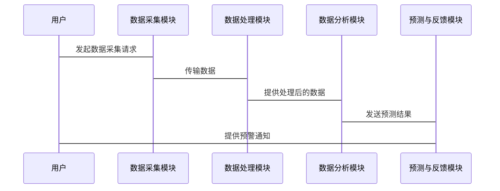

                 


# 价值投资中的智能制造预测性质量控制分析

> 关键词：智能制造，预测性质量控制，价值投资，预测模型，数据分析

> 摘要：本文深入探讨了智能制造环境下，如何通过预测性质量控制分析进行价值投资。首先介绍了智能制造的背景与发展，分析了价值投资的基本概念及其与智能制造的结合。接着，详细讲解了预测性质量控制的核心概念与原理，并通过具体案例分析了其实现过程。文章还结合了回归分析、时间序列分析和机器学习算法，分析了预测性质量控制的数学模型和算法实现。最后，通过一个汽车制造行业的实战案例，展示了预测性质量控制的系统架构设计和实际应用效果，提出了在价值投资中应用预测性质量控制的建议和未来研究方向。

---

## 第一部分: 价值投资与智能制造的背景与概念

### 第1章: 智能制造的背景与发展

#### 1.1 智能制造的定义与特点

##### 1.1.1 智能制造的定义
智能制造是一种以数字化、自动化、智能化为特征的现代制造模式，通过物联网、大数据、人工智能等技术，实现生产过程的实时感知、智能决策和自主执行。

##### 1.1.2 智能制造的核心特点
- **数字化**：从设计到生产，所有环节都实现数字化管理。
- **自动化**：生产过程高度自动化，减少人工干预。
- **智能化**：通过人工智能技术实现预测性维护、优化生产等智能功能。
- **互联性**：设备、系统之间的高度互联，实现数据的实时共享。

##### 1.1.3 智能制造与传统制造的区别
- **数据驱动**：智能制造依赖于数据进行决策，而传统制造更多依赖经验。
- **灵活性**：智能制造能够快速调整生产计划，传统制造则较为 rigid。
- **效率**：智能制造通过自动化和优化提高效率，传统制造效率较低。

#### 1.2 智能制造的技术基础

##### 1.2.1 工业互联网与物联网
工业互联网是连接工业设备、系统和数据的网络，物联网（IoT）则通过传感器和通信技术实现设备的互联与数据采集。

##### 1.2.2 大数据与人工智能
大数据技术用于处理海量生产数据，人工智能（AI）则用于分析数据并提供决策支持。

##### 1.2.3 数字化与智能化转型
企业通过数字化转型实现业务流程的优化，智能化转型则通过AI技术提升生产效率。

#### 1.3 智能制造的发展现状与趋势

##### 1.3.1 全球智能制造的发展现状
目前，全球主要制造业国家都在积极推进智能制造，德国的工业4.0、美国的工业互联网以及中国的智能制造2025等战略都是典型代表。

##### 1.3.2 智能制造的未来发展趋势
未来，智能制造将更加注重数据的深度分析和AI的广泛应用，生产系统将更加智能化和自适应。

##### 1.3.3 中国智能制造的发展特点
中国智能制造发展迅速，政府支持力度大，应用场景广泛，但在核心技术方面仍需加强。

### 第2章: 价值投资的基本概念

#### 2.1 价值投资的定义与特点

##### 2.1.1 价值投资的定义
价值投资是一种投资策略，通过分析企业的基本面，寻找市场价格低于其内在价值的投资标的。

##### 2.1.2 价值投资的核心理念
- **安全边际**：买入价格低于内在价值，确保投资的安全性。
- **长期视角**：关注企业的长期盈利能力，而非短期市场波动。
- **深度分析**：通过详尽的财务和行业分析，识别具有投资价值的企业。

##### 2.1.3 价值投资与投机的区别
价值投资注重长期和基本面分析，而投机则更多关注短期市场波动，风险较高。

#### 2.2 价值投资的主要方法

##### 2.2.1 基本面分析法
基本面分析法通过分析企业的财务报表、行业地位、竞争优势等因素，评估其内在价值。

##### 2.2.2 股价与内在价值的分析
通过比较股价与内在价值，识别低估的投资机会。

##### 2.2.3 安全边际的概念
安全边际是指买入价格与内在价值之间的差距，确保在市场价格波动时仍能获得收益。

#### 2.3 价值投资的适用场景

##### 2.3.1 价值投资在不同市场的应用
在成熟市场和新兴市场中，价值投资策略的应用有所不同，但核心理念一致。

##### 2.3.2 价值投资在不同行业中的应用
不同行业具有不同的财务指标和风险因素，价值投资需要根据不同行业特点进行调整。

##### 2.3.3 价值投资的长期与短期效果
长期来看，价值投资能够获得稳定收益，短期则可能面临市场波动带来的压力。

### 第3章: 智能制造与价值投资的结合

#### 3.1 智能制造对价值投资的影响

##### 3.1.1 智能制造如何改变企业的生产模式
智能制造通过提高生产效率和产品质量，增强企业的竞争力，从而提升其内在价值。

##### 3.1.2 智能制造如何影响企业的财务表现
智能制造通过优化生产流程和降低成本，改善企业的盈利能力和现金流。

##### 3.1.3 智能制造如何影响企业的市场地位
智能制造企业能够更快响应市场需求，提供更优质的产品，从而在市场竞争中占据优势。

#### 3.2 价值投资视角下的智能制造企业分析

##### 3.2.1 智能制造企业的核心竞争力
智能制造企业的核心竞争力体现在技术创新、生产效率和成本控制等方面。

##### 3.2.2 智能制造企业的财务指标分析
投资者需要关注智能制造企业的研发投入、毛利率、净利率等财务指标，评估其内在价值。

##### 3.2.3 智能制造企业的成长性分析
智能制造行业的快速发展为企业提供了广阔的成长空间，投资者需要关注企业的市场份额和技术创新能力。

---

## 第二部分: 预测性质量控制的理论与方法

### 第4章: 预测性质量控制的核心概念与原理

#### 4.1 预测性质量控制的定义与特点

##### 4.1.1 预测性质量控制的定义
预测性质量控制是通过数据分析和预测模型，提前发现和预防质量问题的一种质量控制方法。

##### 4.1.2 预测性质量控制的特点
- **预防性**：提前预测潜在问题，避免问题的发生。
- **数据驱动**：基于数据分析和统计模型进行预测。
- **动态性**：能够根据实时数据动态调整预测模型。

#### 4.2 预测性质量控制的核心原理

##### 4.2.1 数据采集与处理
通过传感器和物联网技术采集生产过程中的实时数据，进行清洗和预处理。

##### 4.2.2 数据分析与建模
利用统计分析、机器学习等方法，建立预测模型，对质量进行预测。

##### 4.2.3 结果应用与反馈
根据预测结果优化生产过程，调整参数，减少质量偏差。

#### 4.3 预测性质量控制与传统质量控制的对比

##### 4.3.1 传统质量控制的特点
传统质量控制主要依赖事后检验，成本高、效率低。

##### 4.3.2 预测性质量控制的优势
- **成本降低**：通过预防减少废品和返工成本。
- **效率提升**：实时监控和预测，减少停机时间。
- **质量提升**：提前发现和解决问题，提高产品质量。

---

### 第5章: 预测性质量控制的算法原理与实现

#### 5.1 回归分析在质量控制中的应用

##### 5.1.1 回归分析的定义
回归分析是一种统计学方法，用于建立变量之间的关系模型。

##### 5.1.2 线性回归的数学模型
$$ y = \beta_0 + \beta_1 x + \epsilon $$

##### 5.1.3 回归分析的实现步骤
1. 数据采集与预处理
2. 模型训练
3. 模型评估
4. 预测与应用

##### 5.1.4 代码实现
```python
import numpy as np
from sklearn.linear_model import LinearRegression

# 示例数据
X = np.array([[1], [2], [3], [4], [5]])
y = np.array([2, 4, 5, 4, 6])

# 训练模型
model = LinearRegression()
model.fit(X, y)

# 预测
print(model.predict([[6]]))
```

#### 5.2 时间序列分析在质量控制中的应用

##### 5.2.1 时间序列分析的定义
时间序列分析是通过时间数据建立模型，预测未来趋势。

##### 5.2.2 时间序列分析的数学模型
$$ y_t = \alpha + \beta t + \gamma y_{t-1} + \epsilon_t $$

##### 5.2.3 时间序列分析的实现步骤
1. 数据平稳化
2. 模型选择与训练
3. 模型评估
4. 预测与应用

##### 5.2.4 代码实现
```python
import pandas as pd
from statsmodels.tsa.arima_model import ARIMA

# 示例数据
data = pd.Series([1, 2, 3, 4, 5, 6, 7, 8, 9, 10])

# 训练模型
model = ARIMA(data, order=(1, 1, 0)).fit()

# 预测
print(model.forecast(steps=3))
```

#### 5.3 机器学习算法在质量控制中的应用

##### 5.3.1 机器学习算法的定义
机器学习是一种人工智能技术，通过数据训练模型，实现预测和分类。

##### 5.3.2 常见机器学习算法
- 线性回归
- 支持向量机（SVM）
- 神经网络
- 随机森林

##### 5.3.3 机器学习算法的实现步骤
1. 数据采集与预处理
2. 数据分割（训练集与测试集）
3. 模型训练
4. 模型评估
5. 预测与应用

##### 5.3.4 代码实现
```python
from sklearn.ensemble import RandomForestRegressor
from sklearn.metrics import mean_squared_error

# 示例数据
X_train = [[1], [2], [3], [4], [5]]
y_train = [2, 4, 5, 4, 6]
X_test = [[6]]

# 训练模型
model = RandomForestRegressor(n_estimators=100)
model.fit(X_train, y_train)

# 预测
y_pred = model.predict(X_test)
print(mean_squared_error(y_test, y_pred))
```

---

## 第三部分: 预测性质量控制的系统设计与实现

### 第6章: 系统分析与架构设计

#### 6.1 问题场景介绍

##### 6.1.1 质量控制问题
在智能制造中，质量问题可能导致巨大的经济损失，因此需要通过预测性质量控制提前发现和预防问题。

##### 6.1.2 预测性质量控制的目标
通过数据分析和预测模型，实现对产品质量的实时监控和预测，降低质量偏差。

#### 6.2 系统功能设计

##### 6.2.1 数据采集模块
- 采集生产过程中的实时数据
- 支持多种数据源（传感器、数据库等）

##### 6.2.2 数据处理模块
- 数据清洗
- 数据转换
- 数据存储

##### 6.2.3 数据分析模块
- 数据建模
- 模型训练
- 模型评估

##### 6.2.4 预测与反馈模块
- 质量预测
- 预警通知
- 参数优化

#### 6.3 系统架构设计

##### 6.3.1 系统架构图


##### 6.3.2 系统接口设计
- 数据接口：与传感器和数据库对接
- 用户接口：提供数据可视化和预警通知

##### 6.3.3 系统交互流程


### 第7章: 项目实战——汽车制造行业的预测性质量控制

#### 7.1 项目背景

##### 7.1.1 行业背景
汽车制造行业是一个典型的智能制造应用场景，产品质量直接影响企业的声誉和市场竞争力。

##### 7.1.2 项目目标
通过预测性质量控制，降低汽车制造过程中的质量问题，提高生产效率。

#### 7.2 项目实施步骤

##### 7.2.1 数据采集
- 采集生产线上的实时数据，包括温度、压力、振动等参数。

##### 7.2.2 数据预处理
- 清洗数据
- 标准化处理
- 数据分割

##### 7.2.3 模型训练
- 选择合适的算法（如随机森林）
- 调参优化
- 模型保存

##### 7.2.4 模型评估
- 使用测试数据验证模型性能
- 计算准确率、召回率等指标

##### 7.2.5 模型应用
- 实时预测
- 预警通知
- 参数优化

##### 7.2.6 项目总结
- 成功实现了预测性质量控制
- 提高了产品质量和生产效率
- 降低了生产成本

---

## 第四部分: 结论与展望

### 第8章: 结论与最佳实践

#### 8.1 全文总结

##### 8.1.1 智能制造与价值投资的结合
智能制造为价值投资提供了新的机会，通过预测性质量控制，投资者可以更准确地评估企业的内在价值。

##### 8.1.2 预测性质量控制的核心价值
预测性质量控制能够提高产品质量，降低生产成本，增强企业的竞争力。

#### 8.2 最佳实践

##### 8.2.1 数据质量的重要性
高质量的数据是预测性质量控制的基础，数据清洗和预处理至关重要。

##### 8.2.2 模型选择与优化
根据具体场景选择合适的算法，并通过调参优化模型性能。

##### 8.2.3 系统架构设计
合理的系统架构能够提高系统的稳定性和可扩展性。

#### 8.3 未来研究方向

##### 8.3.1 新型算法的应用
探索更先进的机器学习算法，提高预测精度。

##### 8.3.2 多维度数据分析
结合多源数据，进行更全面的质量预测。

##### 8.3.3 实时预测与反馈
优化系统的实时预测能力，实现更高效的反馈机制。

---

## 作者信息

作者：AI天才研究院/AI Genius Institute & 禅与计算机程序设计艺术 /Zen And The Art of Computer Programming

---

以上是文章的详细目录和内容框架，接下来可以根据此框架进行具体写作。

