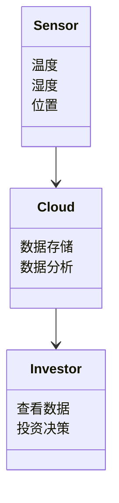
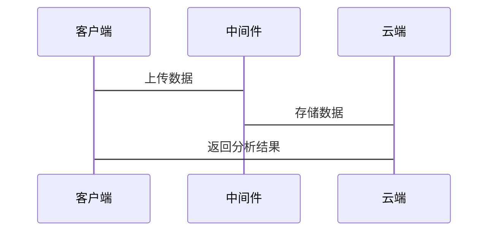

                 


# 价值投资中的智能包装技术发展趋势

> 关键词：智能包装技术，价值投资，物联网，传感器，数据采集与分析，区块链，投资决策

> 摘要：随着智能包装技术的快速发展，其在价值投资中的应用日益广泛。本文从智能包装技术的核心概念出发，详细分析其在价值投资中的应用场景、核心技术、算法原理及系统架构，最后结合实际案例进行实战分析，为投资者提供科学的决策支持。

---

# 第一章: 智能包装技术概述

## 1.1 智能包装技术的定义与特点

### 1.1.1 智能包装技术的定义
智能包装技术是一种结合物联网（IoT）、传感器、数据采集与分析等技术的新型包装形式。它能够实时感知环境数据（如温湿度、地理位置、包装状态等），并通过无线通信技术将数据传输到云端，为用户提供动态信息。

**特点：**
- **实时感知**：通过传感器实时采集环境数据。
- **智能分析**：利用数据分析技术对采集的数据进行处理和预测。
- **远程监控**：通过物联网技术实现远程监控和管理。

### 1.1.2 智能包装技术的核心特点
- **数据驱动**：依赖传感器和物联网技术，数据是核心。
- **动态更新**：能够实时更新包装状态和环境信息。
- **多维度感知**：能够感知温度、湿度、位置、压力等多种环境参数。

### 1.1.3 智能包装技术与传统包装的区别
| 特性         | 传统包装             | 智能包装             |
|--------------|----------------------|----------------------|
| 感知能力     | 无感知               | 多维度感知           |
| 数据处理     | 无数据处理           | 数据采集与分析       |
| 连接性       | 无网络连接           | 支持物联网连接         |
| 应用场景     | 单一包装保护         | 多场景应用，支持投资决策 |

---

## 1.2 价值投资中的智能包装技术背景

### 1.2.1 价值投资的基本概念
价值投资是一种投资策略，旨在通过分析企业的内在价值，寻找市场价格低于内在价值的投资标的。传统的价值投资依赖于财务报表、行业分析等静态数据。

### 1.2.2 智能包装技术在价值投资中的应用背景
随着全球贸易的复杂化，商品的流通环节涉及更多的变量，如运输条件、存储环境等。智能包装技术能够实时监控这些变量，为投资者提供动态数据支持。

### 1.2.3 智能包装技术对投资决策的影响
智能包装技术能够提供商品在运输和存储过程中的实时数据，帮助投资者评估商品的真实价值，优化投资决策。

---

## 1.3 智能包装技术的现状与发展趋势

### 1.3.1 智能包装技术的现状分析
- **技术成熟度**：目前，智能包装技术已应用于高端食品、药品等领域。
- **市场接受度**：部分投资者开始关注智能包装技术，但尚未普及。

### 1.3.2 智能包装技术的发展趋势
- **技术融合**：与区块链、人工智能等技术进一步融合。
- **应用场景扩展**：从高端商品扩展至更多领域。
- **数据共享**：通过区块链技术实现数据的可信共享。

### 1.3.3 智能包装技术对投资价值的影响
智能包装技术能够提升商品的透明度和信任度，从而提升其市场价值。

---

## 1.4 本章小结
智能包装技术通过实时感知和数据驱动的方式，为价值投资提供了新的数据支持。其核心技术包括物联网、传感器、数据采集与分析等，未来将与区块链等技术深度融合，进一步提升投资决策的科学性。

---

# 第二章: 智能包装技术的核心技术

## 2.1 物联网技术在智能包装中的应用

### 2.1.1 物联网技术的基本原理
物联网技术通过传感器、通信网络和云端计算，实现设备间的互联和数据共享。

### 2.1.2 物联网技术在智能包装中的应用场景
- **实时监控**：通过传感器实时监控商品的温湿度、地理位置等。
- **数据传输**：通过通信网络将数据传输到云端。
- **数据存储与分析**：云端存储数据并进行分析，为投资决策提供支持。

### 2.1.3 物联网技术对投资决策的支持
- **数据实时性**：提供实时的环境数据，帮助投资者评估商品状态。
- **远程监控**：投资者可以随时随地查看商品状态，优化投资策略。

---

## 2.2 智能传感器技术

### 2.2.1 智能传感器的定义与特点
智能传感器是一种能够感知环境参数并进行初步数据处理的设备。

### 2.2.2 智能传感器在智能包装中的应用
- **温湿度传感器**：用于监控商品的温湿度状态。
- **地理位置传感器**：用于监控商品的地理位置变化。
- **压力传感器**：用于监控商品的包装完整性。

### 2.2.3 智能传感器对投资决策的支持
通过智能传感器实时监控商品状态，投资者可以评估商品的运输和存储条件，从而判断其价值。

---

## 2.3 数据采集与分析技术

### 2.3.1 数据采集技术的基本原理
数据采集技术通过传感器采集环境数据，并将其传输到云端进行存储和分析。

### 2.3.2 数据分析技术在智能包装中的应用
- **数据清洗**：对采集的数据进行去噪和归一化处理。
- **数据建模**：利用机器学习算法对数据进行建模和预测。
- **数据可视化**：通过图表形式展示数据，帮助投资者理解商品状态。

### 2.3.3 数据分析技术对投资价值的影响
通过数据分析技术，投资者可以发现商品状态的变化趋势，从而优化投资策略。

---

## 2.4 区块链技术在智能包装中的应用

### 2.4.1 区块链技术的基本原理
区块链技术是一种去中心化的分布式账本技术，具有不可篡改和可追溯的特点。

### 2.4.2 区块链技术在智能包装中的应用场景
- **数据可信性**：通过区块链技术保证数据的不可篡改性。
- **数据追溯**：通过区块链技术实现商品的全生命周期追溯。
- **数据共享**：通过区块链技术实现多方数据的可信共享。

### 2.4.3 区块链技术对投资决策的支持
通过区块链技术，投资者可以信任商品的数据真实性，从而提升投资决策的准确性。

---

## 2.5 本章小结
智能包装技术的核心技术包括物联网、智能传感器、数据采集与分析和区块链技术。这些技术相互结合，为价值投资提供了实时、动态、可信的数据支持。

---

# 第三章: 智能包装技术的算法原理与数学模型

## 3.1 数据采集与分析技术的算法原理

### 3.1.1 数据采集与分析的基本流程
1. **数据采集**：通过传感器采集环境数据。
2. **数据预处理**：对采集的数据进行去噪和归一化处理。
3. **数据建模**：利用机器学习算法对数据进行建模和预测。
4. **数据可视化**：通过图表形式展示数据。

### 3.1.2 数据建模的数学模型
假设我们有一个商品的温湿度数据，希望通过线性回归模型预测商品的存储时间。

**数学模型：**
$$ y = \beta_0 + \beta_1x + \epsilon $$
其中，\( y \) 是商品的存储时间，\( x \) 是温湿度数据，\( \beta_0 \) 和 \( \beta_1 \) 是模型参数，\( \epsilon \) 是误差项。

### 3.1.3 算法实现
```python
import pandas as pd
from sklearn.linear_model import LinearRegression

# 假设data是包含温湿度数据和存储时间的数据框
data = pd.read_csv('data.csv')

# 定义特征和目标变量
X = data[['湿度', '温度']]
y = data['存储时间']

# 训练线性回归模型
model = LinearRegression()
model.fit(X, y)

# 预测存储时间
y_pred = model.predict(X)
```

---

## 3.2 区块链技术的算法原理

### 3.2.1 区块链技术的核心算法
区块链技术的核心算法包括共识算法（如PoW、PoS）、加密算法（如哈希函数）和智能合约。

### 3.2.2 智能合约的实现
智能合约是一种自动执行的程序，用于实现数据的可信共享。

**代码示例：**
```solidity
// SPDX-License-Identifier: MIT
pragma solidity ^0.8.0;

contract SmartContract {
    event DataUpdate(uint256 indexed timestamp, uint256 value);

    function updateData(uint256 value) public {
        emit DataUpdate(block.timestamp, value);
    }
}
```

---

## 3.3 本章小结
智能包装技术的算法原理主要包括数据采集与分析的线性回归模型和区块链技术的智能合约实现。这些算法为智能包装技术提供了强大的技术支持。

---

# 第四章: 智能包装技术的系统分析与架构设计

## 4.1 项目背景介绍
本项目旨在通过智能包装技术实现商品的实时监控和数据共享，为投资者提供科学的决策支持。

---

## 4.2 系统功能设计

### 4.2.1 领域模型设计


### 4.2.2 系统架构设计


### 4.2.3 系统接口设计
- **传感器接口**：传感器将数据传输到中间件。
- **云端接口**：云端接收数据并进行存储和分析。
- **投资者接口**：投资者通过客户端查看数据。

### 4.2.4 系统交互流程


---

## 4.3 本章小结
智能包装技术的系统架构设计包括领域模型设计、系统架构设计和系统交互流程设计。这些设计为系统的实现提供了清晰的指导。

---

# 第五章: 智能包装技术的项目实战

## 5.1 环境安装

### 5.1.1 安装Python环境
```bash
# 安装Python
python --version
```

### 5.1.2 安装依赖库
```bash
pip install pandas scikit-learn
```

---

## 5.2 核心代码实现

### 5.2.1 数据采集与分析代码
```python
import pandas as pd
from sklearn.linear_model import LinearRegression

# 读取数据
data = pd.read_csv('data.csv')

# 定义特征和目标变量
X = data[['湿度', '温度']]
y = data['存储时间']

# 训练模型
model = LinearRegression()
model.fit(X, y)

# 预测结果
y_pred = model.predict(X)
```

### 5.2.2 区块链代码实现
```solidity
// SPDX-License-Identifier: MIT
pragma solidity ^0.8.0;

contract SmartContract {
    event DataUpdate(uint256 indexed timestamp, uint256 value);

    function updateData(uint256 value) public {
        emit DataUpdate(block.timestamp, value);
    }
}
```

---

## 5.3 案例分析与结果解读

### 5.3.1 案例分析
假设我们有一个商品的温湿度数据，通过线性回归模型预测其存储时间。

### 5.3.2 结果解读
- **模型训练**：训练出的模型能够较好地预测商品的存储时间。
- **数据可视化**：通过图表展示商品的存储时间变化趋势。

---

## 5.4 项目小结
通过项目实战，我们掌握了智能包装技术的核心代码实现和案例分析方法，为后续的应用提供了参考。

---

# 第六章: 总结与展望

## 6.1 总结
智能包装技术通过实时感知和数据驱动的方式，为价值投资提供了新的数据支持。其核心技术包括物联网、传感器、数据采集与分析和区块链技术。

## 6.2 展望
未来，智能包装技术将与更多新技术深度融合，进一步提升投资决策的科学性和准确性。

---

# 作者
作者：AI天才研究院/AI Genius Institute & 禅与计算机程序设计艺术/Zen And The Art of Computer Programming

