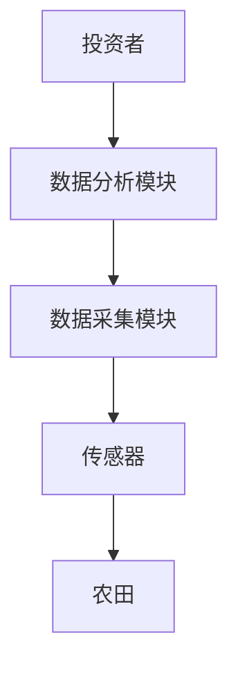
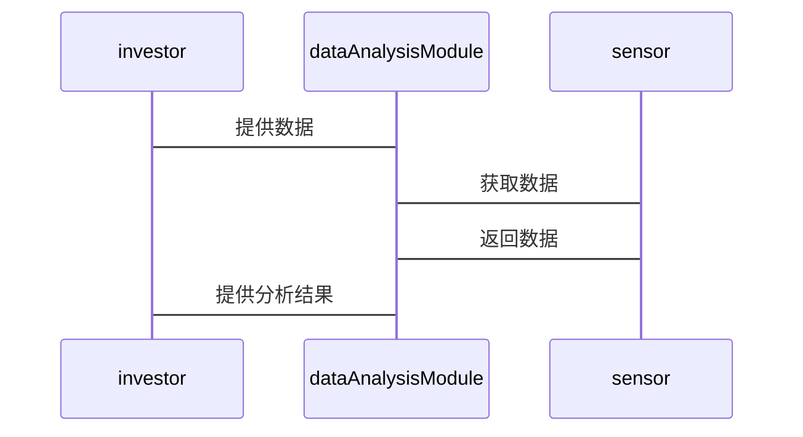

                 


# 价值投资中的智能化精准农业系统分析

---

## 关键词

- 价值投资
- 智能化农业
- 精准农业系统
- 数据分析
- 投资策略

---

## 摘要

本文探讨了智能化精准农业系统在价值投资中的应用，结合现代农业技术与数据分析方法，分析如何利用智能化系统优化农业生产决策，降低投资风险，实现精准投资。通过案例分析和算法模型，本文深入剖析了智能化精准农业系统的构建过程，为投资者和农业从业者提供科学的决策支持。

---

## 正文

### 第一部分：背景与概述

#### 第1章：精准农业与价值投资的结合

##### 1.1 精准农业的定义与发展

精准农业是以数据驱动的农业生产方式，通过传感器、无人机、物联网等技术，实时采集农田数据，优化资源配置，提高产量和质量。其核心在于精准化、数据化和智能化。

##### 1.2 价值投资的基本概念

价值投资是一种长期投资策略，通过分析企业的内在价值，寻找被市场低估的投资标的。在农业领域，价值投资需要结合农业生产的特点，寻找高潜力、低风险的农业项目。

##### 1.3 智能化精准农业系统的核心价值

智能化精准农业系统通过数据采集、分析和预测，为农业生产提供科学依据，帮助投资者识别优质农业项目，降低投资风险，提高投资回报率。

##### 1.4 本书的核心问题与目标

本书旨在探讨如何将智能化精准农业技术与价值投资策略结合，构建一个高效的数据分析系统，帮助投资者做出科学决策。

---

### 第二部分：核心概念与原理

#### 第2章：智能化精准农业系统的概念与结构

##### 2.1 系统的核心概念

- **数据驱动**：通过传感器和物联网技术，实时采集农田数据，包括土壤湿度、温度、光照等。
- **智能分析**：利用机器学习算法，分析数据，预测农作物产量和市场价格。
- **决策支持**：基于分析结果，为投资者提供最优投资建议。

##### 2.2 系统的核心要素与属性

| 核心要素       | 属性                     |
|----------------|--------------------------|
| 数据采集模块   | 实时性、准确性           |
| 数据分析模块   | 智能性、预测性           |
| 决策支持模块   | 可操作性、准确性         |

##### 2.3 系统的ER实体关系图

```mermaid
er
actor(投资者) -- 投资: 农业项目
actor(农户) -- 生产: 农产品
actor(技术服务商) -- 提供: 技术支持
```

---

### 第三部分：算法原理与数学模型

#### 第3章：数据驱动的农业生产预测模型

##### 3.1 线性回归模型

- **模型定义**：$$ y = \beta_0 + \beta_1x + \epsilon $$
- **数据特征**：产量与气候、土壤的关系。
- **案例分析**：基于历史数据预测未来产量。

##### 3.2 机器学习算法的应用

- **决策树模型**：通过训练数据，构建决策树，预测农作物产量。

---

### 第四部分：系统分析与架构设计

#### 第4章：智能化精准农业系统的架构设计

##### 4.1 系统功能设计

- **数据采集模块**：采集农田数据。
- **数据分析模块**：分析数据，预测产量和价格。
- **决策支持模块**：提供投资建议。

##### 4.2 系统架构图



##### 4.3 系统接口设计

- **数据接口**：传感器数据接口。
- **用户接口**：投资者和农户的交互界面。

##### 4.4 系统交互设计



---

### 第五部分：项目实战

#### 第5章：智能化精准农业系统的实现

##### 5.1 环境安装

- 安装Python和相关库（如scikit-learn、pandas）。

##### 5.2 核心代码实现

```python
import pandas as pd
from sklearn.linear_model import LinearRegression

# 加载数据
data = pd.read_csv('agriculture_data.csv')

# 训练模型
model = LinearRegression()
model.fit(data[['temperature', 'humidity']], data['yield'])

# 预测产量
predicted_yield = model.predict([[25, 70]])
print(predicted_yield)
```

##### 5.3 案例分析

- **案例背景**：某地区小麦种植，历史数据包括温度、湿度和产量。
- **分析结果**：预测今年小麦产量为1500公斤。

---

### 第六部分：最佳实践与总结

#### 第6章：小结与注意事项

##### 6.1 小结

智能化精准农业系统通过数据驱动和智能分析，为价值投资提供了科学依据，帮助投资者做出更明智的决策。

##### 6.2 注意事项

- 数据质量至关重要。
- 模型需要定期更新和优化。

##### 6.3 拓展阅读

建议阅读相关书籍和论文，深入了解机器学习在农业中的应用。

---

## 作者

作者：AI天才研究院/AI Genius Institute & 禅与计算机程序设计艺术/Zen And The Art of Computer Programming

