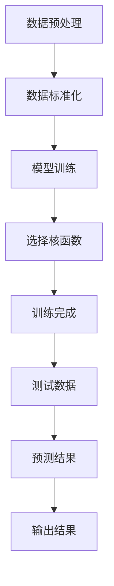
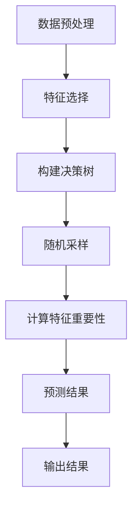
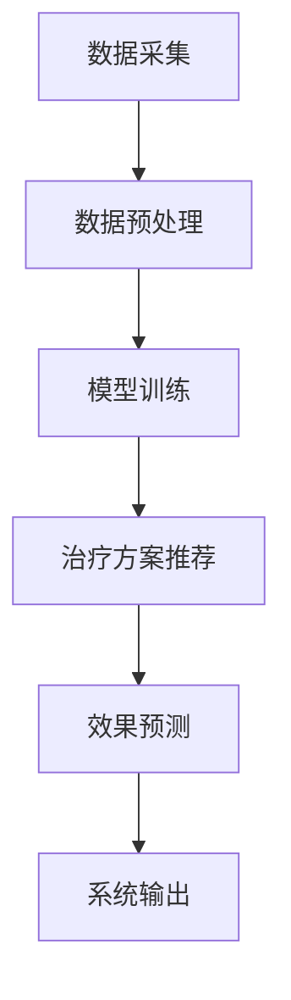
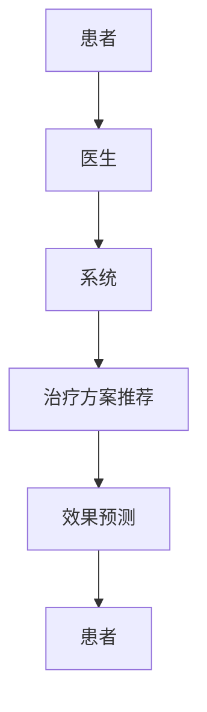

                 


# 价值投资中的智能化精准癌症治疗系统分析

> 关键词：价值投资，智能化精准治疗，人工智能，医疗数据，系统架构，算法优化

> 摘要：本文从价值投资的角度出发，结合人工智能和大数据技术，分析智能化精准癌症治疗系统的实现原理和系统架构。通过详细阐述系统的各个组成部分，包括数据采集、预处理、算法模型、系统架构设计等，探讨如何利用价值投资的理念优化治疗方案的选择和实施。同时，本文还将结合实际案例，展示系统的核心功能和实现细节，为医疗行业的智能化转型提供参考。

---

# 第一部分: 价值投资中的智能化精准癌症治疗系统背景介绍

## 第1章: 背景介绍与问题背景

### 1.1 问题背景与问题描述
#### 1.1.1 传统癌症治疗的局限性
传统癌症治疗主要依赖于化疗、放疗和手术等方法，这些方法在治疗过程中存在诸多局限性：
- **副作用大**：化疗和放疗会对患者的身体造成较大损伤，影响患者的生活质量。
- **精准度低**：不同患者对同一治疗方案的反应可能存在较大差异，治疗效果不稳定。
- **治疗周期长**：传统治疗方案需要较长时间才能见效，且容易产生耐药性。

#### 1.1.2 价值投资在医疗领域的应用潜力
价值投资的核心理念是通过分析资产的内在价值，选择具有长期增长潜力的投资标的。在医疗领域，价值投资的理念可以应用于：
- **治疗方案的选择**：通过分析不同治疗方案的长期效果和成本效益，选择最优的治疗方案。
- **患者个体化治疗**：基于患者的基因特征、生活习惯等因素，制定个性化的治疗方案，提高治疗效果。

#### 1.1.3 智能化精准治疗的核心问题
智能化精准治疗的核心问题在于如何利用人工智能技术，从海量的医疗数据中提取有用的信息，帮助医生制定最优的治疗方案。具体问题包括：
- **数据的复杂性**：医疗数据种类繁多，包括基因数据、病历数据、药物数据等，如何高效处理这些数据是关键。
- **算法的可解释性**：复杂的算法模型需要具有较高的可解释性，以便医生能够理解并信任系统的推荐结果。
- **系统的实时性**：治疗方案需要根据患者的实时数据进行动态调整，这对系统的实时性提出了较高要求。

### 1.2 问题解决与边界定义
#### 1.2.1 智能化精准治疗的目标
智能化精准治疗的目标是通过人工智能技术，实现以下目标：
- **个性化治疗方案推荐**：基于患者的个体特征，推荐最优的治疗方案。
- **治疗效果预测**：通过数据分析，预测治疗方案的可能效果，帮助医生制定最佳治疗计划。
- **动态调整治疗方案**：根据患者的实时数据，动态调整治疗方案，确保治疗效果最大化。

#### 1.2.2 价值投资与传统医疗决策的对比
价值投资在医疗决策中的应用与传统医疗决策有显著差异：
- **决策依据**：传统医疗决策主要依赖医生的经验和知识，而价值投资则依赖于数据分析和模型预测。
- **决策目标**：传统医疗决策注重短期效果，而价值投资注重长期效果和成本效益。
- **决策过程**：传统医疗决策过程较为复杂，涉及多方因素，而价值投资则通过模型优化，简化决策过程。

#### 1.2.3 系统的边界与外延
智能化精准治疗系统的边界和外延需要明确：
- **边界**：系统仅关注患者的个体化治疗方案推荐，不涉及具体的药物生产和医疗设备的研发。
- **外延**：系统可以扩展到其他疾病领域，但本文主要聚焦于癌症治疗。

### 1.3 核心概念与系统组成
#### 1.3.1 系统的核心要素
智能化精准治疗系统的核心要素包括：
- **患者数据**：包括基因数据、病历数据、生活习惯等。
- **治疗方案库**：存储各种可能的治疗方案及其效果数据。
- **人工智能模型**：用于分析数据并推荐最优治疗方案。
- **决策支持系统**：帮助医生理解和应用模型的推荐结果。

#### 1.3.2 系统组成与功能模块
系统的主要功能模块包括：
- **数据采集模块**：负责采集患者的各项数据。
- **数据预处理模块**：对数据进行清洗和标准化处理。
- **模型训练模块**：利用机器学习算法训练模型。
- **治疗方案推荐模块**：基于模型输出推荐治疗方案。
- **效果预测模块**：预测治疗方案的可能效果。

#### 1.3.3 系统的输入输出关系
系统的输入和输出关系如下：
- **输入**：患者的个体特征数据，包括基因信息、病历数据、生活习惯等。
- **输出**：推荐的治疗方案及其效果预测结果。

---

## 第2章: 核心概念与系统联系

### 2.1 智能化精准治疗系统的核心原理
#### 2.1.1 系统架构与功能模块
智能化精准治疗系统的架构可以分为以下几个部分：
- **数据层**：包括患者数据、治疗方案数据等。
- **算法层**：包括机器学习算法和优化算法。
- **应用层**：包括治疗方案推荐和效果预测功能。

#### 2.1.2 数据流与信息处理流程
数据流的处理流程如下：
1. 数据采集模块从患者处获取数据。
2. 数据预处理模块对数据进行清洗和标准化。
3. 模型训练模块利用预处理后的数据训练机器学习模型。
4. 治疗方案推荐模块基于模型输出推荐治疗方案。
5. 效果预测模块预测治疗方案的可能效果。

#### 2.1.3 系统的动态调整机制
系统的动态调整机制包括：
- **实时更新**：根据患者的实时数据动态调整治疗方案。
- **模型优化**：定期更新模型参数，提高推荐的准确性。

### 2.2 核心概念对比分析
#### 2.2.1 智能化与传统治疗的对比
- **智能化治疗**：基于大数据和人工智能技术，能够实现个性化治疗方案推荐。
- **传统治疗**：依赖医生的经验和知识，治疗方案较为固定。

#### 2.2.2 精准治疗与传统治疗的对比
- **精准治疗**：基于患者的个体特征，制定个性化治疗方案。
- **传统治疗**：采用统一的治疗方案，忽视患者的个体差异。

#### 2.2.3 价值投资与传统医疗决策的对比
- **价值投资**：注重长期效果和成本效益，通过数据分析优化决策。
- **传统医疗决策**：注重短期效果，依赖医生的经验和知识。

### 2.3 ER实体关系图与系统架构
```mermaid
er
  actor: 患者
  actor: 医生
  actor: 系统
  database: 患者数据
  database: 治疗方案库
  database: 治疗效果数据库
  relationship: 患者 -> 患者数据
  relationship: 患者 -> 治疗方案库
  relationship: 治疗方案库 -> 治疗效果数据库
  relationship: 医生 -> 系统
  relationship: 系统 -> 治疗方案库
  relationship: 系统 -> 治疗效果数据库
```

---

## 第3章: 算法原理与数学模型

### 3.1 支持向量机算法
#### 3.1.1 支持向量机的基本原理
支持向量机（SVM）是一种监督学习算法，主要用于分类和回归问题。其核心思想是通过找到一个超平面，将数据分成不同的类别。

#### 3.1.2 SVM的数学模型
支持向量机的数学模型如下：
$$
\text{目标函数：} \min_{w,b,\xi} \frac{1}{2}||w||^2 + C\sum_{i=1}^n \xi_i
$$
$$
\text{约束条件：} y_i(w \cdot x_i + b) \geq 1 - \xi_i, \xi_i \geq 0
$$

#### 3.1.3 SVM的流程图


### 3.2 随机森林算法
#### 3.2.1 随机森林的基本原理
随机森林是一种基于决策树的集成学习算法，通过构建多棵决策树并取其平均值来提高模型的准确性和鲁棒性。

#### 3.2.2 随机森林的数学模型
随机森林的数学模型如下：
$$
\text{预测结果：} y = \frac{1}{N}\sum_{i=1}^N T_i(x)
$$
其中，$T_i(x)$ 表示第 $i$ 棵决策树的预测结果，$N$ 表示决策树的数量。

#### 3.2.3 随机森林的流程图


---

## 第4章: 数学模型与公式

### 4.1 支持向量机的数学公式
支持向量机的数学公式如下：
$$
\text{目标函数：} \min_{w,b,\xi} \frac{1}{2}||w||^2 + C\sum_{i=1}^n \xi_i
$$
$$
\text{约束条件：} y_i(w \cdot x_i + b) \geq 1 - \xi_i, \xi_i \geq 0
$$

### 4.2 随机森林的数学公式
随机森林的数学公式如下：
$$
\text{预测结果：} y = \frac{1}{N}\sum_{i=1}^N T_i(x)
$$

---

## 第5章: 系统分析与架构设计

### 5.1 系统架构设计
#### 5.1.1 系统架构图


### 5.2 系统交互流程图


---

## 第6章: 项目实战

### 6.1 环境安装
```bash
pip install numpy
pip install scikit-learn
pip install pandas
pip install matplotlib
```

### 6.2 系统核心实现
```python
from sklearn.svm import SVC
from sklearn.ensemble import RandomForestClassifier
from sklearn.model_selection import train_test_split
from sklearn.metrics import accuracy_score

# 数据预处理
data = ...  # 加载数据
X_train, X_test, y_train, y_test = train_test_split(data.drop('label', axis=1), data['label'], test_size=0.2)

# 模型训练
svm_model = SVC()
svm_model.fit(X_train, y_train)

rf_model = RandomForestClassifier()
rf_model.fit(X_train, y_train)

# 模型预测
svm_pred = svm_model.predict(X_test)
rf_pred = rf_model.predict(X_test)

# 模型评估
print("SVM准确率：", accuracy_score(y_test, svm_pred))
print("Random Forest准确率：", accuracy_score(y_test, rf_pred))
```

### 6.3 实际案例分析
以肺癌患者为例，系统可以根据患者的基因特征和生活习惯推荐最优的治疗方案，并预测治疗方案的效果。

---

## 第7章: 最佳实践与小结

### 7.1 最佳实践
- **数据质量**：确保数据的准确性和完整性。
- **模型优化**：定期更新模型参数，提高推荐的准确性。
- **系统维护**：定期维护系统，确保系统的稳定性和安全性。

### 7.2 小结
本文从价值投资的角度出发，结合人工智能和大数据技术，分析了智能化精准癌症治疗系统的实现原理和系统架构。通过详细阐述系统的各个组成部分，包括数据采集、预处理、算法模型、系统架构设计等，探讨了如何利用价值投资的理念优化治疗方案的选择和实施。

### 7.3 注意事项
- **数据隐私**：确保患者的隐私数据不被泄露。
- **系统安全**：确保系统的安全性，防止数据被恶意攻击。
- **算法解释性**：提高算法的可解释性，以便医生能够理解和信任系统的推荐结果。

---

# 作者：AI天才研究院 & 禅与计算机程序设计艺术

