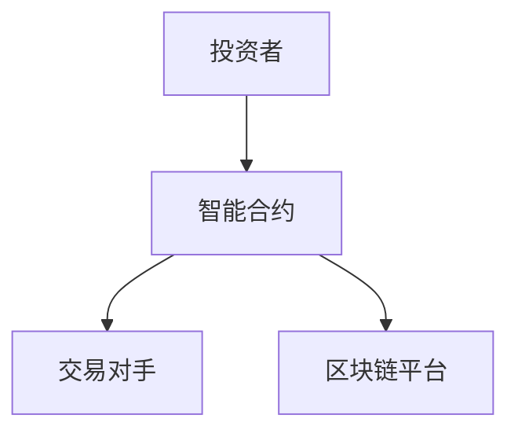
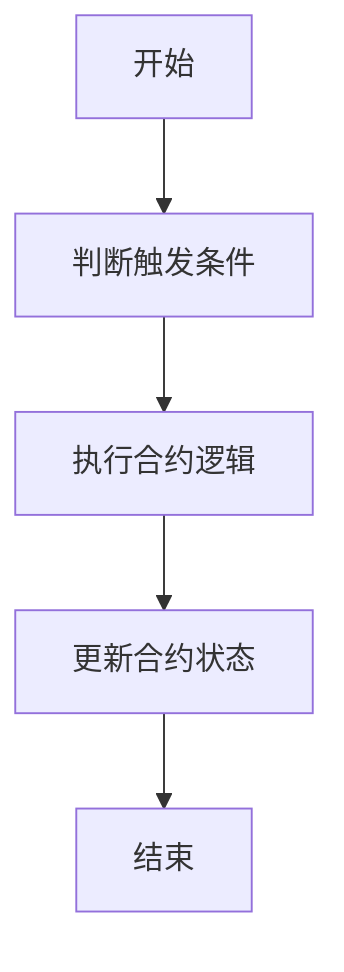
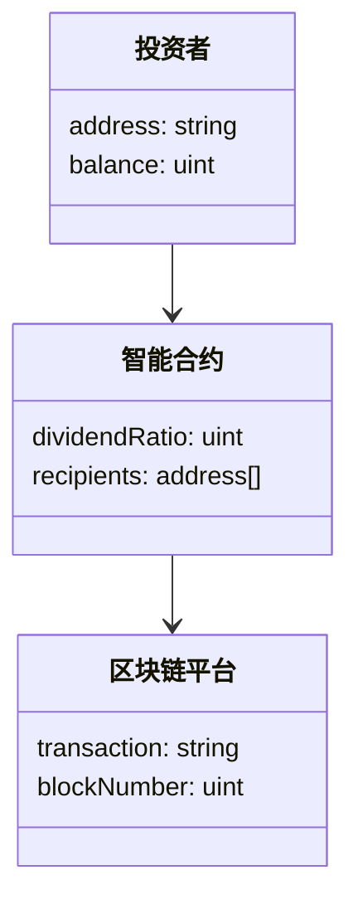
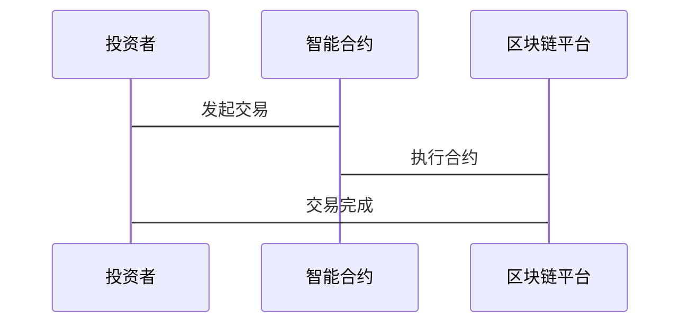

                 


# 《价值投资中的智能合约应用前景》

> 关键词：智能合约，价值投资，区块链，DeFi，智能合约算法

> 摘要：本文探讨了智能合约在价值投资中的应用前景，分析了智能合约的核心概念、算法原理、系统架构以及在投资中的实际应用。通过案例分析和数学模型，展示了智能合约如何优化投资策略，降低风险，提高效率。

---

## 第一部分：智能合约与价值投资的背景介绍

### 第1章：智能合约的基础知识

#### 1.1 智能合约的起源与定义
智能合约的概念最早由尼克·萨博（Nick Szabo）在1994年提出，是一种自动执行的电子合约，其特点是通过区块链技术实现去中心化、不可篡改和自动执行。智能合约的本质是基于区块链的自动化交易协议，能够根据预设条件自动执行或强制执行合约条款。

智能合约的特点：
1. **自动执行**：无需人工干预，自动按照设定的规则执行。
2. **去中心化**：基于区块链技术，不依赖中心机构。
3. **不可篡改**：数据存储在区块链上，具有高度的安全性和可靠性。
4. **透明性**：所有交易记录公开透明，可追溯。

智能合约与区块链的关系：
- 区块链是智能合约的底层技术，智能合约依赖区块链的分布式账本和共识机制。
- 智能合约通过区块链技术实现去中心化和自动化。

#### 1.2 价值投资的基本原理
价值投资是一种投资策略，主要通过分析公司的基本面（如财务状况、行业地位、盈利能力等）来评估其内在价值，并在市场价格低于内在价值时进行投资。其核心理念是购买低于内在价值的资产，长期持有，等待价格回归。

价值投资的关键步骤：
1. **基本面分析**：分析公司的财务报表、行业地位、竞争优势等。
2. **估值模型**：使用DCF模型、PE、PB等指标评估公司价值。
3. **安全边际**：在价格显著低于内在价值时买入，降低投资风险。

传统价值投资的局限性：
1. **信息不对称**：依赖于分析师的判断，存在主观性。
2. **效率低下**：手动分析耗时且容易出错。
3. **风险管理**：缺乏自动化机制，难以实时监控风险。

---

### 第2章：智能合约在金融领域的应用前景

#### 2.1 智能合约在金融领域的核心优势
智能合约在金融领域的应用具有以下优势：
1. **提高效率**：自动化交易和结算，减少人工干预。
2. **降低成本**：去中心化交易降低中间成本。
3. **增强安全性**：区块链技术确保数据不可篡改，降低欺诈风险。
4. **透明性**：所有交易记录公开透明，便于监管和审计。

#### 2.2 价值投资中的智能合约应用场景
智能合约在价值投资中的应用场景广泛，主要包括：
1. **自动投资决策**：基于预设的估值模型和触发条件，自动执行买卖指令。
2. **风险管理**：实时监控市场变化和公司基本面，自动调整投资组合。
3. **自动化结算**：智能合约自动执行交割，减少结算时间。

---

## 第二部分：智能合约的核心概念与原理

### 第3章：智能合约的核心概念与原理

#### 3.1 智能合约的工作原理
智能合约通过区块链技术实现自动化执行，其工作流程如下：
1. **触发条件**：当满足特定条件时（如价格达到某个阈值）。
2. **执行逻辑**：根据预设的逻辑自动执行操作（如买入或卖出资产）。
3. **状态更新**：更新区块链上的合约状态，确保数据不可篡改。

智能合约的执行流程：


#### 3.2 传统合约与智能合约的对比分析
| 对比维度 | 传统合约 | 智能合约 |
|----------|----------|----------|
| 执行方式 | 手动执行 | 自动执行 |
| 信任依赖 | 需要中介 | 基于区块链信任 |
| 成本 | 较高 | 较低 |
| 效率 | 较低 | 较高 |

#### 3.3 智能合约的实体关系图


---

## 第三部分：智能合约的算法原理与实现

### 第4章：智能合约的算法原理与实现

#### 4.1 智能合约的触发条件与执行流程
智能合约的触发条件可以是价格波动、时间触发或特定事件。以下是典型的触发条件与执行流程：


#### 4.2 智能合约的算法实现
以下是基于Solidity语言的智能合约示例，用于自动分红：

```solidity
// SPDX-License-Identifier: MIT
pragma solidity ^0.8.0;

contract AutoDividend {
    uint public dividendRatio = 100; // 分红比例

    function distributeDividends(address[] memory recipients) public {
        for (uint i = 0; i < recipients.length; i++) {
            address recipient = recipients[i];
            uint amount = msg.value * dividendRatio / 100;
            recipient.transfer(amount);
        }
    }
}
```

#### 4.3 智能合约的数学模型与公式
投资回报率（ROI）的计算公式：
$$ ROI = \frac{\text{投资收益} - \text{初始投资}}{\text{初始投资}} \times 100\% $$

风险评估模型：
$$ \text{风险} = \frac{\text{波动率} \times \text{杠杆率}}{1 - \text{流动性比率}} $$

---

## 第四部分：智能合约系统分析与架构设计

### 第5章：智能合约系统分析与架构设计

#### 5.1 系统功能设计
- **领域模型**：投资者、智能合约、区块链平台。


- **系统架构**：分为前端（投资者界面）、后端（智能合约）、区块链平台。


- **系统接口设计**：REST API用于交互。

- **系统交互设计**：投资者通过前端调用智能合约，智能合约通过区块链平台执行交易。


---

## 第五部分：智能合约项目实战与最佳实践

### 第6章：智能合约项目实战

#### 6.1 环境安装
- 安装Solidity编译器和以太坊钱包（如MetaMask）。
- 部署智能合约到以太坊测试网（如Rinkeby）。

#### 6.2 系统核心实现
以下是自动分红智能合约的实现：
```solidity
// SPDX-License-Identifier: MIT
pragma solidity ^0.8.0;

contract AutoDividend {
    uint public dividendRatio = 100;

    function distributeDividends(address[] memory recipients) public payable {
        require(msg.value > 0, "金额不能为空");
        for (uint i = 0; i < recipients.length; i++) {
            address recipient = recipients[i];
            uint amount = msg.value * dividendRatio / 100;
            recipient.transfer(amount);
        }
    }
}
```

#### 6.3 代码解读与分析
- `dividendRatio`：分红比例，初始设置为100%。
- `distributeDividends`：接受多个地址，根据比例分配金额。
- `msg.value`：接收的总金额，按比例分配给每个地址。

#### 6.4 实际案例分析
假设投资者向合约地址发送100 ETH，`dividendRatio`设置为100%。合约将100 ETH平均分配给2个地址，每个地址获得50 ETH。

#### 6.5 项目小结
通过智能合约实现自动分红，可以减少人为干预，提高效率和透明度。但在实际应用中，需要注意合约的安全性，避免漏洞被攻击。

---

## 第六部分：智能合约的价值投资应用与展望

### 第7章：智能合约的价值投资应用与展望

#### 7.1 智能合约在价值投资中的最佳实践
- **小结**：智能合约可以优化投资流程，降低风险，提高效率。
- **注意事项**：选择可靠的智能合约平台，确保代码安全。
- **拓展阅读**：深入学习Solidity编程和区块链技术，提升智能合约设计能力。

#### 7.2 未来展望
随着区块链技术的发展，智能合约将在价值投资中发挥更大的作用。未来可能的发展方向包括：
1. **智能合约的自动化投资策略**：通过机器学习优化合约逻辑。
2. **智能合约的跨链互操作性**：实现不同区块链平台之间的互通。
3. **智能合约的安全性提升**：通过形式化验证确保合约安全。

---

## 作者信息

作者：AI天才研究院（AI Genius Institute） & 禅与计算机程序设计艺术（Zen And The Art of Computer Programming）

---

这篇文章系统地介绍了智能合约在价值投资中的应用前景，涵盖了从基础知识到实际应用的各个方面。通过详细的分析和案例解读，展示了智能合约如何优化投资策略，降低风险，提高效率。希望这篇文章能为读者提供有价值的见解，并激发进一步的研究和实践。

