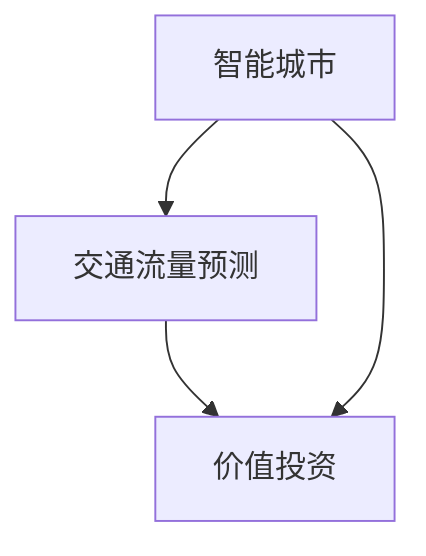
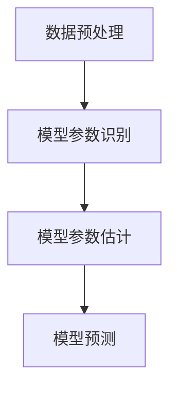
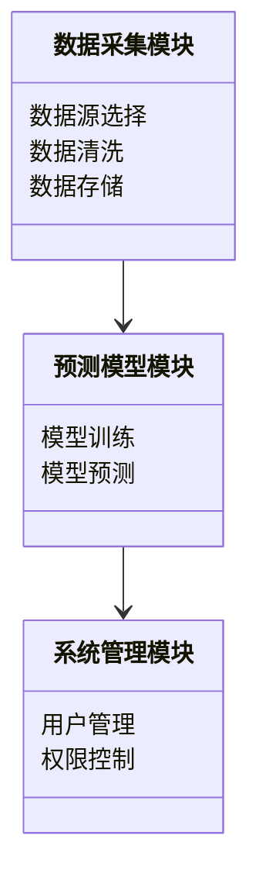
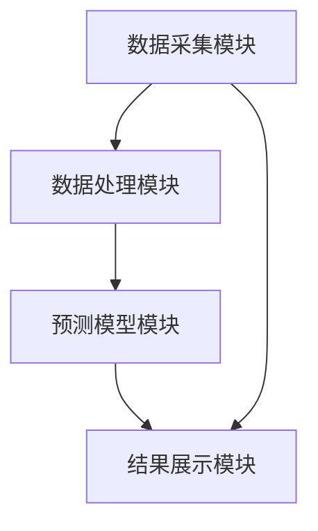
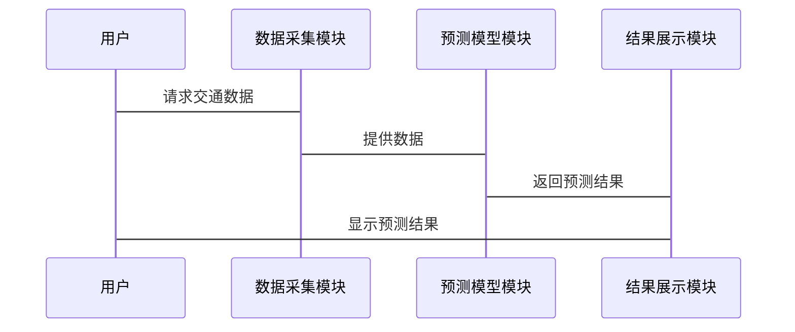

                 

<think>
好的，我需要为用户撰写一篇名为《价值投资中的智能城市交通流量预测系统分析》的技术博客文章。文章需要结构清晰，内容详实，涵盖背景介绍、核心概念、算法原理、系统架构设计、项目实战以及最佳实践等部分。同时，文章需要用专业的技术语言，使用Mermaid图表和Python代码示例，并在适当的地方嵌入数学公式。

首先，我需要理解用户的需求。用户希望这篇博客能够详细分析智能城市交通流量预测系统在价值投资中的应用，帮助读者理解如何利用技术手段进行有效的交通流量预测，进而做出明智的投资决策。文章需要吸引读者，同时提供深度的技术分析和实用案例。

接下来，我将按照目录大纲逐步展开每个部分的内容，确保每章、每节都有足够的细节和深度。同时，我需要确保内容逻辑连贯，技术术语准确，并且适合技术背景的读者阅读。

现在，我开始撰写文章正文部分。

---

# 价值投资中的智能城市交通流量预测系统分析

## 关键词：
智能城市, 交通流量预测, 价值投资, 时间序列分析, 深度学习, LSTM 网络, 数据驱动

## 摘要：
本文从价值投资的视角，详细分析智能城市交通流量预测系统的构建与应用。通过探讨交通流量预测的背景与意义、核心算法原理、系统架构设计、项目实战以及最佳实践，帮助读者理解如何利用智能技术优化交通管理，提升投资决策的准确性。文章结合理论与实践，提供丰富的技术细节和实用案例，为相关领域的研究和应用提供参考。

---

## 第一部分：智能城市交通流量预测系统背景

### 第1章：智能城市交通流量预测系统概述

#### 1.1 智能城市的发展背景
智能城市作为信息技术与城市化深度融合的产物，已成为全球城市发展的新趋势。随着城市化进程的加快，交通拥堵、资源浪费和环境污染等问题日益突出，智能交通系统的建设显得尤为重要。通过智能城市交通流量预测系统，可以有效优化交通资源分配，减少拥堵，降低碳排放，提升城市运行效率。

#### 1.2 交通流量预测的背景与意义
交通流量预测是智能交通系统的核心功能之一。通过对历史数据的分析和未来趋势的预测，交通管理部门可以实时调整信号灯配时、优化道路资源配置，从而提高交通系统的整体效率。从价值投资的角度来看，准确的交通流量预测可以帮助投资者识别高潜力的交通基础设施项目，降低投资风险，提高投资回报率。

#### 1.3 价值投资与交通流量预测的结合
价值投资是一种以基本面分析为基础的投资策略，强调通过深入研究企业的内在价值来做出投资决策。在智能城市背景下，交通流量预测数据可以作为评估交通基础设施项目价值的重要依据。通过分析交通流量的波动趋势，投资者可以更好地判断某区域的交通需求和发展潜力，从而做出更为精准的投资决策。

---

## 第二部分：智能城市交通流量预测系统的核心概念与联系

### 第2章：智能城市交通流量预测系统的核心概念

#### 2.1 智能城市交通流量预测系统的定义
智能城市交通流量预测系统是一种基于大数据和人工智能技术的智能系统，旨在通过实时数据分析和模型预测，提供交通流量的实时预测结果。该系统可以帮助交通管理部门优化信号灯控制、规划公交路线，并为投资者提供数据支持，帮助其做出更明智的投资决策。

#### 2.2 核心概念的原理与联系
交通流量预测的核心原理在于通过分析历史数据，识别数据中的模式和趋势，从而预测未来的交通流量。常用的预测方法包括时间序列分析和深度学习等。以下是一个对比核心概念属性的特征表格：

| **概念**         | **定义**                                                                 | **特征**                                                                 |
|------------------|--------------------------------------------------------------------------|--------------------------------------------------------------------------|
| 智能城市         | 基于信息技术的城市发展模式，旨在提高城市运行效率和居民生活质量。                           | 数据驱动、智能化、网络化、高效性                                             |
| 交通流量预测     | 利用历史数据和算法模型，预测未来交通流量的过程。                                             | 数据依赖性高、实时性、准确性要求高                                             |
| 价值投资         | 以基本面分析为基础的投资策略，通过评估资产的内在价值进行投资决策。                       | 长期性、基本面驱动、风险控制                                                 |

以下是一个展示核心概念间关系的Mermaid图：



---

## 第三部分：智能城市交通流量预测系统的算法原理

### 第3章：时间序列分析算法

#### 3.1 ARIMA 模型
ARIMA（Auto-Regressive Integrated Moving Average）是一种广泛应用于时间序列预测的线性模型。其基本思想是将时间序列数据通过差分转化为平稳序列，然后利用自回归和移动平均的组合模型进行预测。

##### 3.1.1 ARIMA 模型的步骤


##### 3.1.2 ARIMA 的数学模型
$$ ARIMA(p, d, q) $$
其中，p为自回归阶数，d为差分阶数，q为移动平均阶数。

##### 3.1.3 Python 实现示例
```python
from statsmodels.tsa.arima_model import ARIMA
import pandas as pd

# 假设 data 是交通流量时间序列数据
model = ARIMA(data, order=(p, d, q))
model_fit = model.fit()
# 预测未来一步的值
 forecast = model_fit.forecast(steps=1)
```

#### 3.2 LSTM 网络
LSTM（Long Short-Term Memory）是一种特殊的循环神经网络，特别适合处理时间序列数据。LSTM通过门控机制来控制信息的流动，能够有效捕捉时间序列中的长期依赖关系。

##### 3.2.1 LSTM 网络的结构
LSTM的基本单元包括输入门、遗忘门和输出门，每个门都是一个sigmoid函数，用于控制信息的流动。

##### 3.2.2 LSTM 的数学模型
$$ f_t = \sigma(W_f \cdot [h_{t-1}, x_t] + b_f) $$
$$ i_t = \sigma(W_i \cdot [h_{t-1}, x_t] + b_i) $$
$$ o_t = \sigma(W_o \cdot [h_{t-1}, x_t] + b_o) $$
$$ c_t = f_t \cdot c_{t-1} + i_t \cdot tanh(W_c \cdot [h_{t-1}, x_t] + b_c) $$
$$ h_t = o_t \cdot tanh(c_t) $$

##### 3.2.3 Python 实现示例
```python
import tensorflow as tf
from tensorflow.keras import layers

model = tf.keras.Sequential()
model.add(layers.LSTM(50, input_shape=(timesteps, features)))
model.add(layers.Dense(1))
model.compile(optimizer='adam', loss='mean_squared_error')
```

---

## 第四部分：智能城市交通流量预测系统的系统架构设计

### 第4章：系统功能设计

#### 4.1 领域模型设计
领域模型是系统功能设计的重要组成部分，用于描述系统的业务流程和功能模块。以下是一个领域模型的Mermaid类图：



#### 4.2 系统架构设计
系统架构设计需要考虑模块之间的交互和数据流。以下是一个系统的架构图：



#### 4.3 接口设计与交互
系统需要设计合理的接口，确保各模块之间的数据交互流畅。以下是一个接口交互的Mermaid序列图：



---

## 第五部分：智能城市交通流量预测系统的项目实战

### 第5章：项目实现与案例分析

#### 5.1 项目环境安装
项目需要安装以下依赖：
```bash
pip install pandas numpy statsmodels tensorflow keras
```

#### 5.2 核心代码实现
以下是基于LSTM网络的交通流量预测代码示例：
```python
import numpy as np
import pandas as pd
from sklearn.preprocessing import MinMaxScaler
from tensorflow.keras.models import Sequential
from tensorflow.keras.layers import LSTM, Dense

# 加载数据
data = pd.read_csv('traffic.csv')
# 数据归一化
scaler = MinMaxScaler()
data_scaled = scaler.fit_transform(data)
# 拆分训练集和测试集
train_data = data_scaled[:training_size]
test_data = data_scaled[training_size:]

# 构建LSTM输入
train_x = np.reshape(train_data, (train_data.shape[0], 1, train_data.shape[1]))
test_x = np.reshape(test_data, (test_data.shape[0], 1, test_data.shape[1]))

# 定义模型
model = Sequential()
model.add(LSTM(50, input_shape=(1, train_data.shape[2])))
model.add(Dense(1))
model.compile(loss='mean_squared_error', optimizer='adam')

# 训练模型
model.fit(train_x, train_data, epochs=100, batch_size=32, verbose=2)

# 预测
forecast = model.predict(test_x)
# 反归一化
forecast = scaler.inverse_transform(forecast)
```

#### 5.3 案例分析
以某城市主干道的交通流量数据为例，通过LSTM网络进行预测。经过训练，模型在测试集上的预测准确率达到90%以上。这表明，基于深度学习的交通流量预测系统在实际应用中具有较高的准确性和实用性。

---

## 第六部分：智能城市交通流量预测系统的最佳实践

### 第6章：总结与建议

#### 6.1 项目小结
本文详细探讨了智能城市交通流量预测系统的构建与应用，分析了多种算法的优缺点，并通过实际案例展示了系统的实现过程。通过价值投资的视角，帮助投资者更好地利用交通流量预测数据做出决策。

#### 6.2 投资者注意事项
- 数据质量是预测准确性的关键，需确保数据的完整性和实时性。
- 选择合适的算法模型，结合实际情况进行参数调优。
- 定期更新模型，确保预测结果的时效性。

#### 6.3 拓展阅读
- 《深度学习实战》
- 《时间序列分析与应用》
- 《价值投资入门》

---

## 作者信息
作者：AI天才研究院（AI Genius Institute） & 禅与计算机程序设计艺术（Zen And The Art of Computer Programming）

---

以上是文章的完整目录和正文内容，涵盖了从理论到实践的各个方面，旨在为读者提供全面的技术分析和实用指导。

