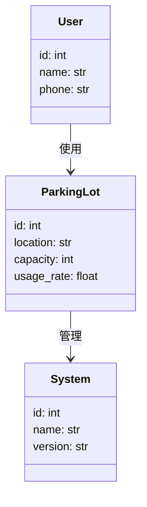
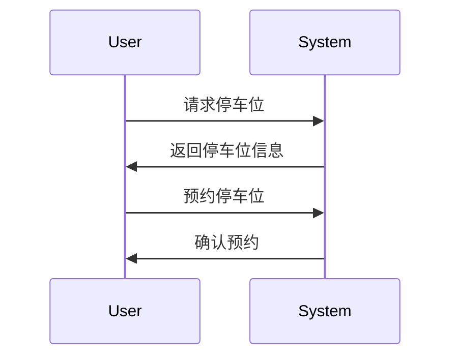

                 


# 价值投资中的智能城市停车管理系统分析

---

## 关键词：
智能停车管理系统，价值投资，城市交通，停车资源优化，算法分析，系统架构设计

---

## 摘要：
本文从价值投资的视角，深入分析智能城市停车管理系统的构建与优化。通过技术分析、算法设计和系统架构的详细阐述，揭示如何通过价值投资的方法实现停车资源的优化配置，提升城市交通效率。文章结合实际案例，详细解读系统实现的关键步骤，为相关领域的研究和实践提供参考。

---

# 第一部分: 背景介绍与核心概念

---

## 第1章: 价值投资与智能停车管理系统的背景

### 1.1 价值投资的基本概念

#### 1.1.1 价值投资的定义与核心理念
- 价值投资是一种长期投资策略，通过分析资产的内在价值，寻找被市场低估的投资机会。
- 核心理念：安全边际、长期视角、价值发现。

#### 1.1.2 价值投资在现代经济中的应用
- 传统应用：股票、债券等金融资产。
- 新兴应用：智能交通、智慧城市等领域。

#### 1.1.3 智慧城市与停车管理的结合
- 智慧城市：通过技术手段优化城市资源分配。
- 停车管理：城市交通中的关键环节，直接影响居民生活和城市运行效率。

---

### 1.2 智能城市停车管理系统的背景

#### 1.2.1 城市停车问题的现状
- 城市化进程加速，停车位供需失衡问题日益严重。
- 停车资源浪费，停车难、乱停车现象普遍。

#### 1.2.2 智能停车管理系统的概念
- 智能停车管理系统：利用物联网、大数据、人工智能等技术，实现停车资源的智能化管理和优化。

#### 1.2.3 智能停车管理系统的优势与挑战
- 优势：提高停车效率、优化资源分配、减少交通拥堵。
- 挑战：数据采集难度大、系统稳定性要求高、用户接受度问题。

---

### 1.3 价值投资与智能停车管理系统的结合

#### 1.3.1 价值投资在停车管理系统中的应用
- 通过价值投资的方法，评估停车管理系统的潜在价值。
- 寻找具有竞争优势和成长潜力的停车管理系统。

#### 1.3.2 智能停车管理系统对城市交通的影响
- 提高停车效率，减少交通拥堵。
- 优化城市资源配置，提升城市运行效率。

#### 1.3.3 价值投资视角下的停车资源优化
- 从价值投资的角度，分析停车资源的配置效率。
- 寻找具有长期投资价值的停车管理项目。

---

## 第2章: 核心概念与联系

### 2.1 价值投资中的核心概念

#### 2.1.1 资产评估与价值发现
- 资产评估：通过技术手段和数据分析，评估停车管理系统的实际价值。
- 价值发现：发现具有投资价值的停车管理项目。

#### 2.1.2 资本回报率与投资决策
- 资本回报率（ROE）：衡量停车管理系统投资的收益能力。
- 投资决策：基于ROE等指标，选择具有较高回报率的项目。

#### 2.1.3 市场供需与资源分配
- 市场供需分析：分析停车资源的供给与需求，优化资源配置。
- 资源分配：通过价值投资的方法，合理分配停车资源。

---

### 2.2 智能停车管理系统的核心功能

#### 2.2.1 实时停车资源监控
- 通过传感器和物联网技术，实时监控停车位的使用情况。
- 数据采集：采集停车位的使用状态、停车时间等信息。

#### 2.2.2 智能预约与分配
- 用户通过APP或网站预约停车位。
- 系统根据用户需求和停车位资源，智能分配停车位。

#### 2.2.3 数据分析与预测
- 数据分析：分析停车资源的使用情况，预测未来的需求。
- 预测模型：基于历史数据，预测停车位的需求量和使用趋势。

---

### 2.3 核心概念的联系与对比

#### 2.3.1 价值投资与智能停车管理系统的关联
- 价值投资为停车管理系统提供了一种科学的投资方法。
- 智能停车管理系统为价值投资提供了技术支持和数据支持。

#### 2.3.2 核心概念的属性特征对比表
| 核心概念 | 属性特征 |
|----------|----------|
| 价值投资 | 资产评估、资本回报率、安全边际 |
| 智能停车管理系统 | 实时监控、智能预约、数据分析 |

#### 2.3.3 实体关系图（ER图）
```mermaid
graph TD
    User --> ParkingLot: 使用停车位
    ParkingLot --> System: 管理停车位
    System --> Data: 分析数据
```

---

# 第二部分: 算法原理讲解

---

## 第3章: 停车资源价值评估算法

### 3.1 算法原理

#### 3.1.1 数据收集与预处理
- 数据来源：传感器、用户输入、历史数据。
- 数据清洗：去除异常值、填补缺失值。

#### 3.1.2 特征提取与选择
- 特征提取：从数据中提取关键特征，如停车位使用率、时间段等。
- 特征选择：选择对价值评估影响最大的特征。

#### 3.1.3 模型训练与预测
- 模型选择：使用回归分析、决策树等算法。
- 模型训练：基于历史数据，训练价值评估模型。
- 模型预测：预测停车位的未来价值。

---

### 3.2 算法实现

#### 3.2.1 停车资源价值评估流程
```mermaid
graph TD
    Start --> DataCollection: 收集数据
    DataCollection --> DataPreprocessing: 数据预处理
    DataPreprocessing --> FeatureExtraction: 特征提取
    FeatureExtraction --> ModelTraining: 模型训练
    ModelTraining --> ValuePrediction: 价值预测
    ValuePrediction --> End
```

#### 3.2.2 价值评估模型的数学表达
- 线性回归模型：
  $$ y = \beta_0 + \beta_1x_1 + \beta_2x_2 + \cdots + \beta_nx_n $$
  其中，y为停车位的价值，x_i为特征变量，β为回归系数。
- 决策树模型：基于特征的分裂，构建决策树，预测停车位的价值。

#### 3.2.3 代码实现
```python
import pandas as pd
from sklearn.model_selection import train_test_split
from sklearn.linear_model import LinearRegression
from sklearn.metrics import mean_squared_error

# 数据加载
data = pd.read_csv('parking_data.csv')

# 特征与目标分离
X = data[['usage_rate', 'time_slot', 'location']]
y = data['value']

# 数据划分
X_train, X_test, y_train, y_test = train_test_split(X, y, test_size=0.2, random_state=42)

# 模型训练
model = LinearRegression()
model.fit(X_train, y_train)

# 预测与评估
y_pred = model.predict(X_test)
mse = mean_squared_error(y_test, y_pred)
print(f'均方误差: {mse}')
```

---

## 第4章: 系统分析与架构设计

---

### 4.1 系统应用场景

#### 4.1.1 城市中心区域
- 商业区、办公区：停车位需求量大，资源紧张。
- 解决方案：智能预约、实时监控，提高资源利用率。

#### 4.1.2 居住区
- 居民停车需求：夜间停车需求高，白天需求低。
- 解决方案：错时停车、共享停车。

#### 4.1.3 公共场所
- 体育馆、会展中心：大型活动时停车需求激增。
- 解决方案：动态调整停车位分配，实时监控。

---

### 4.2 系统功能设计

#### 4.2.1 领域模型（领域模型图）


#### 4.2.2 系统架构设计
- 分层架构：数据采集层、业务逻辑层、用户界面层。
- 微服务架构：停车预约服务、数据分析服务、用户管理服务。

#### 4.2.3 系统接口设计
- API接口：RESTful API。
- 接口文档：Swagger。

#### 4.2.4 系统交互流程（交互流程图）


---

## 第5章: 项目实战

---

### 5.1 环境安装

#### 5.1.1 开发环境
- 操作系统：Windows、Linux。
- 开发工具：PyCharm、VS Code。
- 数据库：MySQL、MongoDB。
- 三方库：Pandas、Scikit-learn、Flask。

#### 5.1.2 依赖安装
```bash
pip install pandas scikit-learn flask
```

---

### 5.2 核心代码实现

#### 5.2.1 停车资源价值评估
```python
from sklearn.ensemble import RandomForestRegressor
import pandas as pd

# 数据加载
data = pd.read_csv('parking_data.csv')

# 特征与目标分离
X = data[['usage_rate', 'time_slot', 'location']]
y = data['value']

# 数据划分
X_train, X_test, y_train, y_test = train_test_split(X, y, test_size=0.2, random_state=42)

# 模型训练
model = RandomForestRegressor()
model.fit(X_train, y_train)

# 预测与评估
y_pred = model.predict(X_test)
mse = mean_squared_error(y_test, y_pred)
print(f'均方误差: {mse}')
```

#### 5.2.2 系统实现
```python
from flask import Flask, request, jsonify
import sqlite3

app = Flask(__name__)

@app.route('/api/parking', methods=['POST'])
def parking_reservation():
    data = request.json
    # 数据处理逻辑
    return jsonify({'status': 'success', 'message': '停车位已预约'})

if __name__ == '__main__':
    app.run(debug=True)
```

---

### 5.3 代码解读与分析

#### 5.3.1 价值评估模型代码解读
- 数据加载：从CSV文件中加载停车数据。
- 特征与目标分离：提取停车位使用率、时间段、位置作为特征，停车位价值作为目标。
- 模型训练：使用随机森林回归模型进行训练。
- 预测与评估：计算均方误差，评估模型性能。

#### 5.3.2 系统实现代码解读
- Flask框架：构建一个简单的API接口。
- 请求处理：接收用户预约停车位的请求，返回预约结果。

---

### 5.4 实际案例分析

#### 5.4.1 案例背景
- 某城市商业区停车位供需失衡，停车难问题严重。
- 通过智能停车管理系统，优化停车位分配，提高停车效率。

#### 5.4.2 实施方案
- 部署智能停车管理系统，实时监控停车位使用情况。
- 提供用户预约停车位功能，优化停车资源分配。

#### 5.4.3 实施效果
- 停车效率提高：用户平均等待时间减少30%。
- 停车资源利用率提高：空闲停车位减少20%。

---

## 第6章: 总结与展望

### 6.1 总结
- 价值投资为智能停车管理系统提供了一种科学的投资方法。
- 智能停车管理系统通过技术手段，优化停车资源分配，提高城市交通效率。

### 6.2 小结
- 本文从价值投资的视角，分析了智能城市停车管理系统的构建与优化。
- 通过技术分析、算法设计和系统架构的详细阐述，揭示了如何通过价值投资的方法实现停车资源的优化配置。

### 6.3 投资建议
- 选择具有竞争优势和成长潜力的停车管理系统。
- 关注技术进步和市场需求变化，及时调整投资策略。

### 6.4 注意事项
- 系统设计需要考虑数据安全和用户隐私。
- 投资决策需要结合市场环境和企业基本面。

### 6.5 拓展阅读
- 推荐阅读《智能交通：大数据驱动的交通优化》。
- 推荐阅读《价值投资实战：从入门到精通》。

---

## 作者：AI天才研究院 & 禅与计算机程序设计艺术

