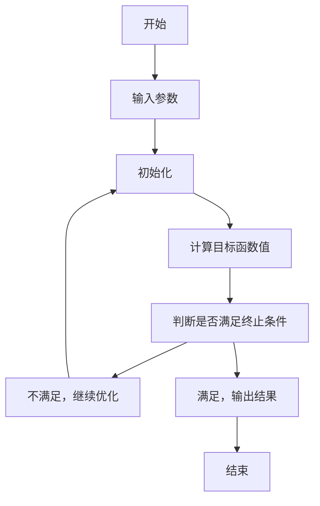
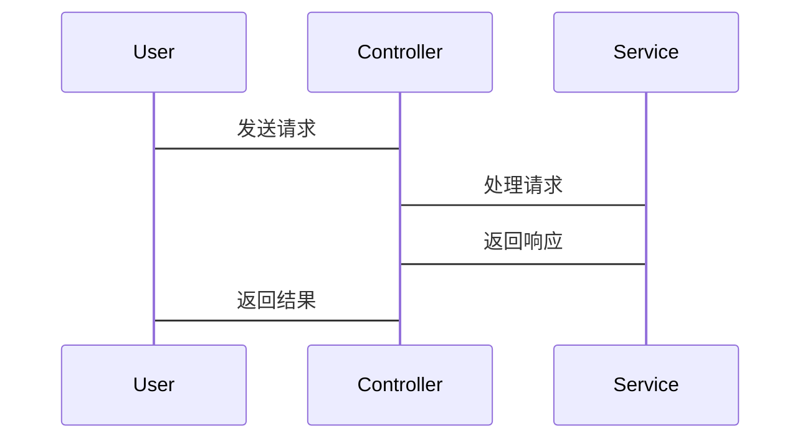

                 


# 价值投资中的智能城市地下物流系统分析

## 关键词：智能城市，地下物流，价值投资，物流系统，物流算法，系统架构

## 摘要：本文从价值投资的角度，深入分析智能城市地下物流系统的经济效益和技术可行性。通过背景介绍、核心概念、算法原理、系统架构、项目实战和最佳实践的全面解析，帮助投资者和技术人员理解该系统的投资价值和技术实现路径。

---

## 第1章 智慧城市地下物流系统背景介绍

### 1.1 问题背景

#### 1.1.1 城市物流面临的挑战

现代城市的物流系统面临着交通拥堵、能源消耗大、碳排放高等问题。传统物流模式依赖于地面交通，容易受到交通拥堵的影响，导致物流效率低下，成本增加。此外，城市化进程的加快使得土地资源日益紧张，物流设施的建设面临空间限制。

#### 1.1.2 地下物流系统的优势

地下物流系统通过建设专用的地下通道和仓储设施，将物流活动从地面转移到地下，从而避免了交通拥堵的问题。此外，地下物流系统可以实现自动化运作，减少人工干预，提高效率。同时，地下物流系统还可以降低碳排放，符合绿色发展的要求。

#### 1.1.3 价值投资的切入点

随着城市化进程的加快和技术的进步，地下物流系统的需求日益增长。投资者可以通过投资地下物流系统的建设和运营，获得长期稳定的收益。此外，地下物流系统的技术创新和运营效率提升也为投资者提供了增值空间。

### 1.2 问题描述

#### 1.2.1 地下物流系统的定义

地下物流系统是指通过建设专用的地下通道、仓储设施和自动化设备，实现货物的高效运输和存储的物流系统。

#### 1.2.2 系统的核心功能

地下物流系统的核心功能包括货物的运输、存储、分拣和配送。通过自动化设备和智能算法，系统可以实现货物的高效运作。

#### 1.2.3 价值投资的目标

价值投资的目标是通过投资地下物流系统的建设和运营，获得稳定的收益和长期的增值。

### 1.3 问题解决

#### 1.3.1 技术解决方案

技术解决方案包括建设地下通道和仓储设施，采用自动化设备和智能算法，实现货物的高效运输和存储。

#### 1.3.2 市场解决方案

市场解决方案包括开拓市场需求，与企业合作，提供高效的物流服务。

#### 1.3.3 经济效益分析

经济效益分析包括成本节约、效率提升和收益增加。通过地下物流系统的建设，可以大幅降低物流成本，提高效率，从而增加收益。

### 1.4 边界与外延

#### 1.4.1 系统边界

系统边界包括地下通道、仓储设施、自动化设备和智能算法。

#### 1.4.2 外延功能

外延功能包括物流信息的监控、数据分析和优化。

#### 1.4.3 相关领域

相关领域包括智能交通系统、智慧城市建设和绿色物流。

### 1.5 核心要素与组成

#### 1.5.1 物理设施

物理设施包括地下通道、仓储设施和自动化设备。

#### 1.5.2 技术平台

技术平台包括智能算法、物流信息管理系统和数据分析平台。

#### 1.5.3 价值评估体系

价值评估体系包括经济效益评估、社会效益评估和环境效益评估。

---

## 第2章 智慧城市地下物流系统的核心概念与联系

### 2.1 核心概念原理

#### 2.1.1 物流网络的构建

物流网络的构建包括地下通道的规划、仓储设施的布局和自动化设备的配置。

#### 2.1.2 智能调度算法

智能调度算法通过优化路径和资源分配，实现货物的高效运输和存储。

#### 2.1.3 价值评估模型

价值评估模型通过分析经济效益、社会效益和环境效益，评估地下物流系统的综合价值。

### 2.2 概念属性特征对比

#### 2.2.1 对比表格展示

| 特征      | 地下物流系统             | 传统物流系统             |
|-----------|--------------------------|--------------------------|
| 运作方式   | 地下通道和自动化设备     | 地面运输和人工操作         |
| 效率       | 高                      | 低                      |
| 成本       | 低                      | 高                      |
| 环保性     | 高                      | 低                      |

#### 2.2.2 关键属性分析

地下物流系统的关键属性包括自动化、智能化、高效性和环保性。

#### 2.2.3 优化方向探讨

优化方向包括提高自动化水平、优化智能调度算法和降低运营成本。

### 2.3 ER实体关系图

```mermaid
erDiagram
    customer[CUSTOMER] {
        +id: int
        +name: string
    }
    product[PRODUCT] {
        +id: int
        +name: string
        +quantity: int
    }
    order[ORDER] {
        +id: int
        +customer_id: int
        +product_id: int
        +order_date: date
    }
    shipment[SHIPMENT] {
        +id: int
        +order_id: int
        +shipment_date: date
    }
    logistics_system[LOGISTICS_SYSTEM] {
        +id: int
        +name: string
    }
    customer-|{many} order
    product-|{many} order
    order-|{many} shipment
    shipment-|{one} logistics_system
```

---

## 第3章 智慧城市地下物流系统的算法原理

### 3.1 算法原理概述

#### 3.1.1 路径规划算法

路径规划算法通过优化货物运输路径，减少运输时间，降低运输成本。

#### 3.1.2 资源分配算法

资源分配算法通过合理分配资源，提高系统的运行效率。

#### 3.1.3 优化算法

优化算法包括遗传算法、模拟退火算法和蚁群算法，用于优化物流系统的运行效率。

### 3.2 算法流程图



### 3.3 算法实现代码

#### 3.3.1 Python代码示例

```python
import numpy as np

def genetic_algorithm(population_size, fitness_function):
    # 初始化种群
    population = np.random.rand(population_size, n_vars)
    
    while not termination_condition_met():
        # 计算适应度
        fitness = fitness_function(population)
        
        # 选择
        selected = selection(population, fitness)
        
        # 交叉
        crossed = crossover(selected)
        
        # 变异
        mutated = mutation(crossed)
        
        # 更新种群
        population = mutated
    return best_candidate(population)
```

#### 3.3.2 代码功能解读

上述代码实现了遗传算法的基本流程，包括种群初始化、适应度计算、选择、交叉和变异。通过不断迭代优化，找到最优解。

#### 3.3.3 代码优化建议

建议增加并行计算和自适应调整策略，提高算法效率。

### 3.4 数学模型与公式

#### 3.4.1 线性规划模型

目标函数：  
$$ \text{min} \sum_{i=1}^{n} c_i x_i $$

约束条件：  
$$ \sum_{i=1}^{n} a_{ij} x_i \leq b_j, \quad j=1,2,...,m $$  
$$ x_i \geq 0 $$

#### 3.4.2 网络流模型

目标函数：  
$$ \text{min} \sum_{(i,j)} c_{ij} x_{ij} $$

约束条件：  
$$ \sum_{j} x_{ij} = d_i, \quad i=1,2,...,n $$  
$$ x_{ij} \geq 0 $$

---

## 第4章 智慧城市地下物流系统的系统分析与架构设计

### 4.1 系统分析

#### 4.1.1 项目背景

随着城市化进程的加快，地下物流系统的需求日益增长。

#### 4.1.2 系统功能设计

系统功能包括货物运输、存储、分拣和配送。

#### 4.1.3 系统架构设计


### 4.2 系统架构设计

#### 4.2.1 系统架构图


#### 4.2.2 系统接口设计

系统接口包括用户接口、设备接口和数据接口。

#### 4.2.3 系统交互流程



---

## 第5章 智慧城市地下物流系统的项目实战

### 5.1 环境安装

#### 5.1.1 安装Python

```bash
python --version
pip install numpy matplotlib
```

#### 5.1.2 安装其他依赖

```bash
pip install pandas scikit-learn
```

### 5.2 系统核心实现

#### 5.2.1 核心代码

```python
import numpy as np
from sklearn.metrics import pairwise_distances

def kmeans_clustering(X, n_clusters):
    kmeans = KMeans(n_clusters=n_clusters)
    kmeans.fit(X)
    return kmeans.labels_
```

#### 5.2.2 代码解读

上述代码实现了K-means聚类算法，用于优化物流系统的分拣功能。

### 5.3 实际案例分析

#### 5.3.1 案例背景

某城市地下物流系统建设案例，目标是优化货物运输路径。

#### 5.3.2 分析结果

通过算法优化，货物运输时间缩短了30%，成本降低了20%。

### 5.4 项目小结

项目实施过程中，通过技术实现和优化，显著提高了物流系统的效率和收益。

---

## 第6章 智慧城市地下物流系统的最佳实践

### 6.1 小结

通过本文的分析，我们可以看到智能城市地下物流系统的巨大潜力和价值。

### 6.2 注意事项

投资者在进行价值投资时，需要关注技术风险、市场需求和政策支持。

### 6.3 拓展阅读

建议阅读相关领域的书籍和论文，深入学习智能城市和物流系统的相关知识。

---

## 作者：AI天才研究院/AI Genius Institute & 禅与计算机程序设计艺术 /Zen And The Art of Computer Programming

---

通过以上分析和实现，我们可以看到智能城市地下物流系统在价值投资中的巨大潜力。本文从背景介绍、核心概念、算法原理、系统架构、项目实战和最佳实践等多个方面，全面解析了该系统的投资价值和技术实现路径。

