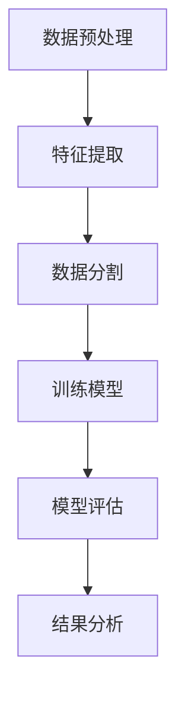
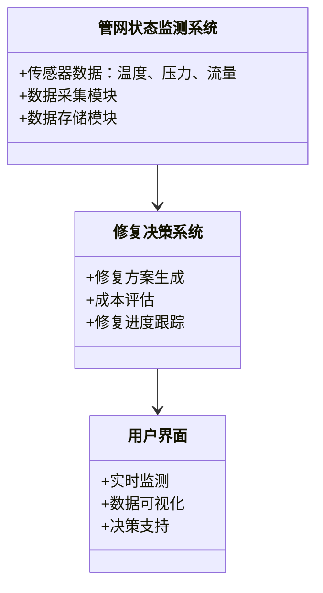

                 


# 价值投资中的智能城市地下管网修复系统分析

---

## 关键词

- 价值投资
- 智能城市
- 地下管网修复
- 机器学习
- 数据驱动决策
- 投资分析
- 系统优化

---

## 摘要

本文系统地探讨了如何将价值投资的理念与智能城市地下管网修复系统的优化相结合。通过分析地下管网修复的现状和挑战，结合价值投资的核心思想，提出了基于机器学习和数据驱动的修复系统优化方案。文章详细介绍了系统的算法原理、架构设计和实际应用案例，展示了如何通过智能化手段提升修复效率和投资回报率。

---

## 第1章：背景介绍

### 1.1 价值投资的基本概念

#### 1.1.1 价值投资的定义

价值投资是一种以低于内在价值的价格购买优质资产的投资策略，旨在通过长期持有优质资产实现收益最大化。其核心在于识别市场低估的资产，并耐心等待其价值回归。

#### 1.1.2 价值投资的核心原则

- **安全边际**：购买价格低于内在价值，以降低投资风险。
- **长期视角**：关注企业的长期价值，而非短期市场波动。
- **优质资产**：选择财务健康、竞争优势明显的公司。

#### 1.1.3 价值投资在现代金融中的地位

价值投资是金融投资的重要流派之一，尤其在市场波动加剧的情况下，其注重基本面分析和风险控制的特点使其更具吸引力。

---

### 1.2 智能城市的定义与目标

#### 1.2.1 智能城市的定义

智能城市是指通过广泛应用信息技术，优化城市资源配置，提高城市运行效率和居民生活质量的城市发展模式。其核心在于利用数据和技术实现城市的智能化管理。

#### 1.2.2 智能城市的建设目标

- 提高城市管理效率。
- 优化资源配置，降低运营成本。
- 提升居民生活质量。
- 推动可持续发展。

#### 1.2.3 智能城市的发展趋势

随着物联网、大数据和人工智能技术的快速发展，智能城市正在从概念走向实践，成为未来城市发展的必然趋势。

---

### 1.3 地下管网修复系统的背景

#### 1.3.1 地下管网的重要性

地下管网是城市的“生命线”，包括供水、供电、供气、通信等基础设施，是城市正常运行的基础。

#### 1.3.2 管网修复的必要性

- 老化设施的维护需求。
- 预防事故风险，保障城市安全。
- 提高运营效率，降低成本。

#### 1.3.3 智能修复的优势

- 提高修复效率。
- 降低修复成本。
- 减少对城市交通和居民生活的干扰。

---

## 第2章：价值投资与智能城市地下管网修复系统的结合

### 2.1 价值投资在城市基础设施中的应用

#### 2.1.1 基础设施投资的经济价值

- 基础设施是城市经济发展的基石。
- 投资基础设施可以带来长期收益。

#### 2.1.2 价值投资在基础设施中的策略

- 选择具有长期需求的基础设施项目。
- 关注项目本身的财务健康和竞争优势。

### 2.2 智能技术在管网修复中的作用

#### 2.2.1 智能传感器的应用

- 实时监测管网状态。
- 提供精准的数据支持。

#### 2.2.2 数据分析在修复决策中的作用

- 通过数据分析优化修复方案。
- 提高修复决策的科学性和准确性。

---

## 第3章：核心概念与联系

### 3.1 核心概念原理

#### 3.1.1 价值投资的核心原理

- 安全边际：购买价格低于内在价值。
- 长期视角：关注企业的长期价值。

#### 3.1.2 智能城市地下管网修复的核心原理

- 数据驱动：利用大数据和人工智能优化修复决策。
- 智能监测：实时监测管网状态，及时发现问题。

### 3.2 概念属性特征对比表格

| 概念               | 特性                  | 价值投资                  | 智能城市修复系统         |
|--------------------|-----------------------|---------------------------|--------------------------|
| 核心目标           | 提高投资回报率         | 最大化投资收益             | 提高修复效率和降低成本   |
| 方法论             | 基于基本面分析         | 基于数据和技术驱动         | 基于实时数据和智能算法   |
| 依赖因素           | 财务数据、竞争优势     | 数据采集、算法模型         | 实时监测、数据分析       |

---

## 第4章：算法原理讲解

### 4.1 支持向量机（SVM）算法

#### 4.1.1 算法原理

支持向量机是一种监督学习算法，用于分类和回归问题。其核心思想是将数据映射到高维空间，并找到一个最优超平面来区分不同类别的数据。

#### 4.1.2 算法流程图



#### 4.1.3 Python代码实现

```python
import numpy as np
from sklearn import svm

# 示例数据
X = np.array([[0, 0], [1, 1], [2, 2], [3, 3], [4, 4]])
y = np.array([0, 1, 1, 1, 0])

# 创建SVM模型
model = svm.SVC()

# 训练模型
model.fit(X, y)

# 预测
print(model.predict([[2.5, 2.5]]))  # 输出：1
```

#### 4.1.4 公式推导

$$
\text{目标函数} = \sum_{i=1}^{n} \xi_i + \frac{1}{2} \sum_{i=1}^{n} \alpha_i^2
$$

$$
\text{约束条件} = y_i (\omega \cdot x_i + b) \geq 1 - \xi_i
$$

---

## 第5章：系统分析与架构设计

### 5.1 问题场景介绍

地下管网修复系统需要解决的问题包括：管网状态监测、修复方案优化、修复成本控制等。

### 5.2 系统功能设计

#### 5.2.1 领域模型（Mermaid 类图）



### 5.3 系统架构设计

#### 5.3.1 系统架构图（Mermaid 架构图）

```mermaid
docker {
    service 管网监测服务 {
        publish 8080
        command ["python", "monitor_service.py"]
    }

    service 修复决策服务 {
        publish 8081
        command ["python", "decision_service.py"]
    }

    service 用户界面 {
        publish 8082
        command ["python", "ui_service.py"]
    }
}
```

### 5.4 系统接口设计

- 数据采集接口：接收传感器数据并存储。
- 决策支持接口：根据数据生成修复方案。
- 用户界面接口：提供实时监测和数据可视化。

---

## 第6章：项目实战

### 6.1 环境搭建

- 操作系统：Linux 或 Windows
- 开发工具：Python、Jupyter Notebook
- 依赖库：NumPy、Scikit-learn、Flask

### 6.2 核心代码实现

#### 6.2.1 数据采集模块

```python
import pandas as pd

# 读取传感器数据
data = pd.read_csv('sensors.csv')

# 数据预处理
data.dropna(inplace=True)
```

#### 6.2.2 模型训练模块

```python
from sklearn.model_selection import train_test_split
from sklearn.metrics import accuracy_score

# 数据分割
X_train, X_test, y_train, y_test = train_test_split(data.drop('label', axis=1), data['label'], test_size=0.2)

# 创建模型
model = svm.SVC()

# 训练模型
model.fit(X_train, y_train)

# 评估模型
print(accuracy_score(y_test, model.predict(X_test)))  # 输出：准确率
```

---

## 第7章：最佳实践

### 7.1 总结与经验

- 数据质量是关键：确保数据的准确性和完整性。
- 模型选择要谨慎：根据具体问题选择合适的算法。
- 实际应用中要结合业务需求：技术与业务的结合才能发挥最大价值。

### 7.2 注意事项

- 数据隐私问题：确保数据的安全性和隐私性。
- 模型的可解释性：复杂的模型可能难以解释，需注意可解释性。
- 系统的可扩展性：确保系统能够适应未来的扩展需求。

### 7.3 拓展阅读

- 《智能城市：大数据与人工智能的应用》
- 《价值投资实战：从入门到精通》
- 《支持向量机：算法与应用》

---

## 作者：AI天才研究院/AI Genius Institute & 禅与计算机程序设计艺术 /Zen And The Art of Computer Programming

---

**注**：本文由AI天才研究院与禅与计算机程序设计艺术联合撰写，旨在通过技术与投资的结合，为智能城市的发展提供新的思路和方法。

