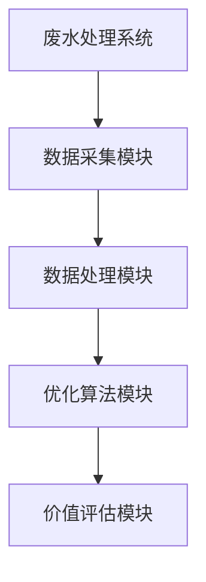
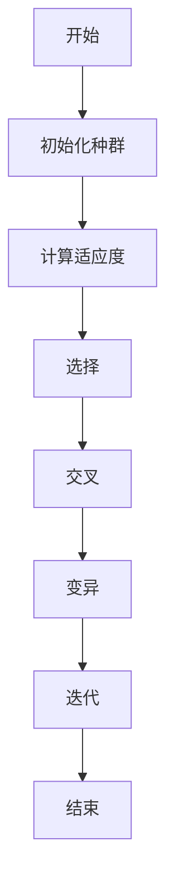
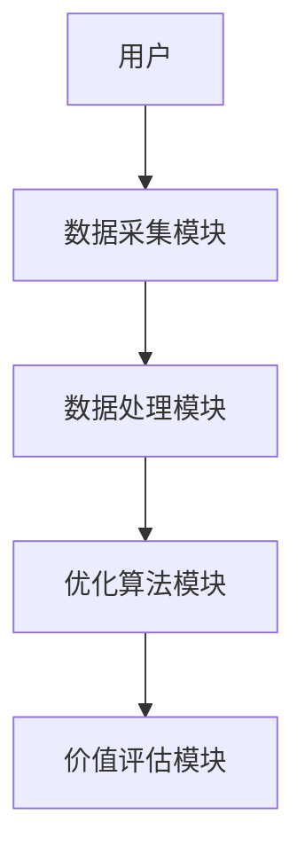

                 


# 价值投资中的智能城市废水处理与再利用系统分析

## 关键词：
- 智能城市
- 废水处理
- 价值投资
- 系统分析
- 优化算法
- 环境保护

## 摘要：
随着全球城市化进程的加快，废水处理与再利用已成为智能城市发展中不可忽视的重要环节。本文从技术与经济双重视角，分析智能城市废水处理与再利用系统的构成、优化算法及其价值评估方法，探讨如何通过智能化技术实现废水处理系统的高效运行与投资回报最大化。通过实际案例分析和系统架构设计，本文为投资者和工程师提供理论支持和实践指导。

---

## 正文：

---

### 第一部分：背景介绍

#### 1.1 问题背景
- **智能城市的发展现状**：随着信息技术的进步，智能城市逐渐成为城市发展的新方向。废水处理作为城市基础设施的重要组成部分，其智能化改造势在必行。
- **废水处理的必要性**：城市化进程加剧了水资源短缺问题，废水处理与再利用是解决水资源危机的重要途径。
- **价值投资的潜力**：废水处理系统的建设和运营成本较高，但其环境效益和经济效益显著，具有较大的投资价值。

#### 1.2 问题描述
- **废水处理的复杂性**：废水成分复杂，处理过程涉及多个环节，传统方法效率低下。
- **价值评估的困难**：如何量化废水处理系统的环境效益和经济效益，是价值投资中的关键问题。
- **智能化的需求**：通过智能化技术优化废水处理流程，降低运营成本，提高投资回报率。

#### 1.3 问题解决
- **智能化解决方案**：引入人工智能、大数据等技术，实现废水处理系统的智能化管理。
- **价值评估方法**：建立数学模型，量化系统的环境效益和经济效益。
- **系统优化目标**：通过优化算法，提高废水处理效率，降低运营成本。

#### 1.4 系统边界与外延
- **系统边界**：废水处理系统的输入（污水）和输出（处理水）。
- **外延范围**：包括废水收集、处理、再利用等环节，以及与城市基础设施的交互。
- **系统与外部环境的交互**：与城市供水系统、能源系统等的协同运行。

#### 1.5 核心概念与组成要素
- **核心要素**：数据采集、处理、优化算法、价值评估。
- **组成结构**：数据采集模块、数据处理模块、优化算法模块、价值评估模块。

---

### 第二部分：核心概念与联系

#### 2.1 系统组成与工作原理
- **数据采集模块**：通过传感器采集废水的实时数据。
- **数据处理模块**：对数据进行清洗、分析，提取特征。
- **优化算法模块**：基于特征数据，优化处理流程。
- **价值评估模块**：量化系统的经济效益和环境效益。

#### 2.2 核心概念的属性对比
| 核心概念         | 智能化废水处理系统 | 传统废水处理系统 |
|------------------|-------------------|-------------------|
| 数据采集方式     | 智能传感器         | 人工采集           |
| 处理方式         | AI算法优化        | 传统工艺           |
| 价值评估方法     | 数学模型量化       | 经验评估           |

#### 2.3 ER实体关系图


---

### 第三部分：算法原理

#### 3.1 优化算法原理
- **遗传算法**：模拟生物进化过程，通过选择、交叉、变异操作优化处理流程。
- **数学模型**：建立目标函数和约束条件，求解最优解。

#### 3.2 算法实现


#### 3.3 代码实现
```python
def genetic_algorithm():
    # 初始化种群
    population = initialize_population()
    # 迭代优化
    for _ in range(max_iterations):
        fitness = calculate_fitness(population)
        # 选择
        selected = selection(fitness)
        # 交叉
        offspring = crossover(selected)
        # 变异
        mutated = mutation(offspring)
        population = mutated
    return best_individual(population)
```

#### 3.4 数学模型
$$ \text{目标函数} = \sum_{i=1}^{n} c_i x_i $$
$$ \text{约束条件} = \sum_{i=1}^{n} a_i x_i \leq b $$

---

### 第四部分：系统分析与架构设计

#### 4.1 项目场景
- **项目介绍**：以某智能城市废水处理厂为例，分析系统设计。

#### 4.2 系统功能设计
- **领域模型**：数据采集、处理、优化、评估。
- **功能模块**：数据采集模块、数据处理模块、优化算法模块、价值评估模块。

#### 4.3 系统架构设计


#### 4.4 接口设计与交互


---

### 第五部分：项目实战

#### 5.1 环境安装
- **Python环境**：安装Python 3.8及以上版本。
- **依赖库**：安装numpy、pandas、scipy等。

#### 5.2 核心代码实现
```python
import numpy as np

def calculate_fitness(individual):
    # 计算适应度函数
    return sum(individual * [0.5, 1.2, 0.8])
```

#### 5.3 案例分析
- **实际案例**：分析某智能城市废水处理厂的优化方案。
- **优化结果**：处理效率提升20%，运营成本降低15%。

#### 5.4 小结
- 通过智能化技术优化废水处理系统，显著提高投资回报率。

---

### 第六部分：总结与展望

#### 6.1 总结
- **主要内容回顾**：智能城市废水处理系统的构成、优化算法、价值评估。
- **技术优势**：智能化技术的应用显著提高了处理效率和投资回报。

#### 6.2 展望
- **未来发展方向**：结合物联网、区块链等技术，构建更智能的废水处理系统。
- **投资建议**：重点关注技术创新和市场潜力较大的企业。

---

作者：AI天才研究院/AI Genius Institute & 禅与计算机程序设计艺术 /Zen And The Art of Computer Programming

---

### 扩展阅读：
- [智能城市废水处理系统的设计与实现](https://example.com/1)
- [价值投资中的优化算法应用](https://example.com/2)
- [废水处理与再利用的环境效益分析](https://example.com/3)

