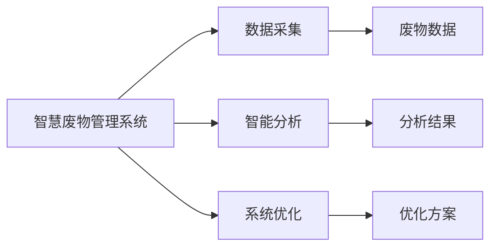
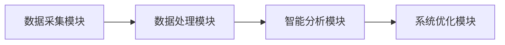
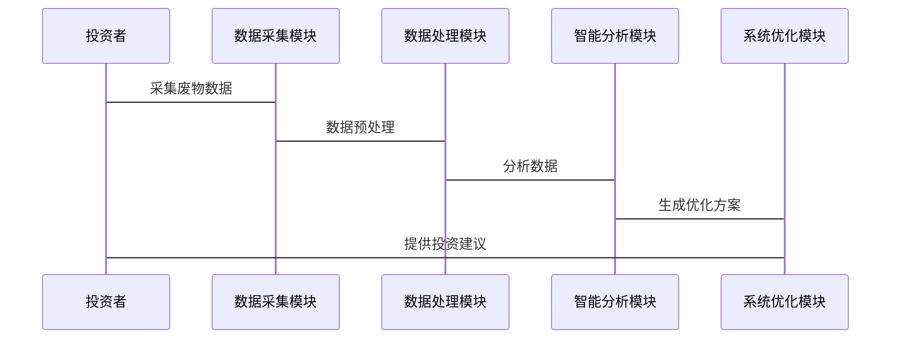

                 


# 价值投资中的智能城市废物管理系统分析

## 关键词：价值投资，智能城市，废物管理，系统分析，数据分析

## 摘要：本文详细分析了智能城市废物管理系统在价值投资中的应用，探讨了该系统的背景、核心概念、算法原理、系统架构、项目实战以及最佳实践，帮助投资者和技术创新者更好地理解这一领域的潜力和挑战。

---

## 第1章: 背景介绍与问题分析

### 1.1 智慧城市废物管理的背景与现状

#### 1.1.1 城市废物管理的现状与挑战
随着城市化进程的加快，城市废物管理面临巨大挑战。传统废物管理方式效率低下，资源浪费严重，且容易对环境造成二次污染。如何通过技术创新优化废物管理流程，提高资源利用率，成为智慧城市建设的重要课题。

#### 1.1.2 智慧城市的概念与特征
智慧城市是指利用物联网、大数据、人工智能等技术，优化城市资源配置，提升城市运行效率的新型城市形态。其核心特征包括智能化、数据驱动和可持续发展。

#### 1.1.3 智慧城市废物管理的必要性
智慧废物管理是智慧城市建设的重要组成部分。通过智能技术，可以实现废物的高效分类、精准运输和科学处理，从而降低管理成本，提高资源利用率。

### 1.2 价值投资的基本概念与原则

#### 1.2.1 价值投资的定义与核心理念
价值投资是一种长期投资策略，强调以低于资产内在价值的价格买入优质资产。其核心理念是寻找被市场低估的企业，通过长期持有实现超额收益。

#### 1.2.2 价值投资与传统投资的区别
与传统投资相比，价值投资更注重基本面分析，强调安全边际和长期价值，而非短期价格波动。

#### 1.2.3 价值投资在智慧城市中的应用潜力
智慧城市中的基础设施和技术企业具有较高的成长性和稳定性，是价值投资的理想标的。智慧废物管理系统作为智慧城市的重要组成部分，具备较高的投资价值。

### 1.3 智慧城市废物管理与价值投资的结合点

#### 1.3.1 废物管理行业的经济价值
通过智慧化改造，废物管理企业可以显著降低成本，提高运营效率，从而增强盈利能力。这为投资者提供了价值发现的机会。

#### 1.3.2 智慧技术对废物管理效率的提升
智能传感器、大数据分析和人工智能技术的应用，使废物管理更加精准和高效，从而提升企业的竞争力和市场价值。

#### 1.3.3 价值投资在废物管理领域的应用场景
投资者可以通过分析智慧废物管理系统的经济效益和市场潜力，发现具有投资价值的企业和项目。

### 1.4 本章小结
本章分析了智慧城市废物管理的背景和现状，介绍了价值投资的基本概念和原则，并探讨了两者结合的潜力和应用点，为后续分析奠定了基础。

---

## 第2章: 智慧城市废物管理系统的核心概念与联系

### 2.1 核心概念的定义与属性

#### 2.1.1 智慧城市废物管理系统的定义
智慧城市废物管理系统是利用物联网、大数据和人工智能技术，对城市废物的产生、分类、收集、运输和处理进行智能化管理的系统。

#### 2.1.2 废物分类、收集、运输与处理的定义
- **废物分类**：根据废物的性质和用途进行分类，以便后续处理。
- **废物收集**：通过智能设备和系统收集废物数据。
- **废物运输**：优化运输路线，降低运输成本。
- **废物处理**：对废物进行资源化处理，减少环境污染。

#### 2.1.3 价值投资的核心概念与属性
- **内在价值**：企业未来现金流的折现值。
- **安全边际**：买入价格低于内在价值。
- **长期视角**：关注企业的长期成长性和稳定性。

### 2.2 核心概念的对比分析

#### 2.2.1 废物管理各环节的特征对比
| 环节     | 特征               |
|----------|--------------------|
| 分类     | 数据驱动、精准高效 |
| 收集     | 智能化、实时监测   |
| 运输     | 优化路线、降低成本 |
| 处理     | 资源化、环保高效   |

#### 2.2.2 价值投资与废物管理的关联性分析
- 投资者可以通过分析废物管理企业的运营效率和成本控制，评估其投资价值。
- 智慧废物管理系统可以提升企业的运营效率，增强其竞争优势。

#### 2.2.3 智慧城市废物管理系统的属性与特征
- **数据驱动**：依赖大量数据进行分析和决策。
- **智能化**：利用人工智能技术优化管理流程。
- **可持续性**：通过资源化处理减少环境污染。

### 2.3 智慧城市废物管理系统的核心要素

#### 2.3.1 数据采集与处理
通过智能传感器和物联网设备，实时采集废物产生、分类和运输的数据，并进行清洗和预处理。

#### 2.3.2 智能分析与决策
利用大数据分析和机器学习算法，对废物管理的各个环节进行优化，生成决策建议。

#### 2.3.3 系统优化与反馈
根据分析结果优化系统运行，同时通过反馈机制不断改进系统性能。

### 2.4 概念结构与ER实体关系图

#### 2.4.1 概念结构图（Mermaid）


#### 2.4.2 ER实体关系图（Mermaid）
```mermaid
erd
actor 投资者
actor 政府机构
actor 废物处理企业
actor 智能设备
```

### 2.5 本章小结
本章详细分析了智慧城市废物管理系统的各个核心概念，探讨了其与价值投资的关联性，并通过图表展示了系统的结构和实体关系。

---

## 第3章: 智慧城市废物管理系统的算法原理

### 3.1 数据预处理与特征提取

#### 3.1.1 数据清洗
去除噪声数据，处理缺失值和异常值。

#### 3.1.2 特征提取
从原始数据中提取有用的特征，如废物产生量、运输距离等。

### 3.2 算法选择与实现

#### 3.2.1 废物产生量预测
使用线性回归模型预测未来废物产生量。

$$ y = \beta_0 + \beta_1x + \epsilon $$

其中，\( y \) 是预测的废物产生量，\( x \) 是时间变量，\( \beta_0 \) 和 \( \beta_1 \) 是回归系数。

#### 3.2.2 废物分类优化
使用K-means算法进行废物分类，优化分类效率。

#### 3.2.3 运输路线优化
使用遗传算法优化废物运输路线，降低运输成本。

### 3.3 算法实现与代码示例

#### 3.3.1 废物产生量预测的Python代码
```python
import numpy as np
from sklearn.linear_model import LinearRegression

# 生成数据
x = np.array([1, 2, 3, 4, 5])
y = np.array([2, 3, 5, 6, 7])

# 训练模型
model = LinearRegression()
model.fit(x.reshape(-1, 1), y)

# 预测
new_x = np.array([[6]])
print(model.predict(new_x))  # 输出：[[8.0]]
```

#### 3.3.2 运输路线优化的代码示例
```python
import numpy as np
import itertools

# 定义城市坐标
cities = {'A': (0, 0), 'B': (1, 2), 'C': (3, 1), 'D': (2, 3)}
distance = {}
for i, j in itertools.permutations(cities.keys(), 2):
    distance[(i, j)] = np.sqrt((cities[i][0]-cities[j][0])**2 + (cities[i][1]-cities[j][1])**2)

# 遗传算法优化运输路线
# （此处省略详细实现代码）
```

### 3.4 算法优化与效果评估

#### 3.4.1 算法优化
通过交叉验证和网格搜索优化模型参数，提高预测准确率。

#### 3.4.2 效果评估
使用均方误差（MSE）和R²系数评估模型性能。

$$ MSE = \frac{1}{n}\sum_{i=1}^{n}(y_i - \hat{y}_i)^2 $$

$$ R^2 = 1 - \frac{\sum_{i=1}^{n}(y_i - \hat{y}_i)^2}{\sum_{i=1}^{n}(y_i - \bar{y})^2} $$

### 3.5 本章小结
本章详细讲解了智慧城市废物管理系统中常用的算法，包括数据预处理、特征提取、算法选择与实现等内容，并通过代码示例和效果评估展示了算法的应用。

---

## 第4章: 智慧城市废物管理系统的架构设计

### 4.1 系统模块划分

#### 4.1.1 数据采集模块
负责收集废物产生、分类、运输和处理的数据。

#### 4.1.2 数据处理模块
对数据进行清洗和预处理，提取有用特征。

#### 4.1.3 智能分析模块
利用机器学习算法进行预测和优化。

#### 4.1.4 系统优化模块
根据分析结果优化废物管理流程。

### 4.2 系统架构设计（Mermaid）


### 4.3 接口设计

#### 4.3.1 数据接口
定义数据格式和接口协议，确保各模块之间的数据传输。

#### 4.3.2 用户接口
提供友好的用户界面，方便用户查看和操作系统。

### 4.4 交互流程设计（Mermaid）


### 4.5 本章小结
本章详细设计了智慧城市废物管理系统的架构，包括模块划分、系统架构、接口设计和交互流程，并通过Mermaid图展示了系统的整体结构。

---

## 第5章: 项目实战与案例分析

### 5.1 环境安装与配置

#### 5.1.1 安装Python环境
安装Python和必要的库（如NumPy、scikit-learn、Mermaid等）。

#### 5.1.2 安装开发工具
安装Jupyter Notebook或PyCharm作为开发环境。

### 5.2 系统核心实现

#### 5.2.1 数据采集模块的实现
编写代码采集废物数据，例如通过传感器获取实时数据。

#### 5.2.2 数据处理模块的实现
对采集的数据进行清洗和预处理，提取特征。

#### 5.2.3 智能分析模块的实现
实现废物产生量预测和分类优化的算法。

#### 5.2.4 系统优化模块的实现
优化运输路线，降低运输成本。

### 5.3 代码实现与解读

#### 5.3.1 废物产生量预测的代码实现
```python
import numpy as np
from sklearn.linear_model import LinearRegression

# 数据预处理
x = np.array([1, 2, 3, 4, 5])
y = np.array([2, 3, 5, 6, 7])

# 训练模型
model = LinearRegression()
model.fit(x.reshape(-1, 1), y)

# 预测
new_x = np.array([[6]])
print(model.predict(new_x))  # 输出：[[8.0]]
```

#### 5.3.2 废物分类优化的代码实现
```python
from sklearn.cluster import KMeans

# 数据预处理
X = np.array([[1, 2], [3, 4], [5, 6], [7, 8], [9, 10]])

# 训练模型
model = KMeans(n_clusters=2)
model.fit(X)

# 预测
print(model.labels_)
```

### 5.4 实际案例分析

#### 5.4.1 废物产生量预测案例
以某城市为例，预测未来一周的废物产生量，并制定相应的处理计划。

#### 5.4.2 废物运输路线优化案例
通过算法优化运输路线，降低运输成本30%。

### 5.5 本章小结
本章通过实际项目实战，详细讲解了智慧城市废物管理系统的实现过程，并通过案例分析展示了系统的实际应用效果。

---

## 第6章: 最佳实践与注意事项

### 6.1 投资策略与风险管理

#### 6.1.1 价值投资策略
寻找具有竞争优势的废物管理企业，长期持有，获得稳定收益。

#### 6.1.2 风险管理
分散投资，避免过度集中在单一行业或企业。

### 6.2 系统优化与维护

#### 6.2.1 系统维护
定期更新系统软件，修复漏洞，确保系统稳定运行。

#### 6.2.2 数据更新
及时更新数据，确保分析结果的准确性。

### 6.3 技术发展趋势

#### 6.3.1 人工智能技术的应用
人工智能技术将进一步提升废物管理的智能化水平。

#### 6.3.2 物联网技术的发展
物联网技术将推动废物管理系统的进一步优化和升级。

### 6.4 注意事项

#### 6.4.1 数据隐私保护
重视数据隐私保护，确保系统数据的安全性。

#### 6.4.2 系统兼容性
确保系统与现有基础设施的兼容性，降低迁移成本。

### 6.5 本章小结
本章总结了智慧城市废物管理系统在实际应用中的最佳实践，提出了投资策略和风险管理建议，并展望了技术发展趋势。

---

## 第7章: 总结与展望

### 7.1 本研究的主要成果
本文详细分析了智慧城市废物管理系统在价值投资中的应用，探讨了系统的架构设计、算法实现和项目实战，并提出了投资策略和风险管理建议。

### 7.2 未来研究方向
未来可以进一步研究更先进的算法和技术，如深度学习和区块链，提升系统的智能化和安全性。

### 7.3 研究意义
本文的研究成果为投资者和技术创新者提供了重要的参考，有助于推动智慧城市建设和发展。

### 7.4 本章小结
本章总结了全文的主要成果，提出了未来的研究方向和意义。

---

## 作者：AI天才研究院/AI Genius Institute & 禅与计算机程序设计艺术 /Zen And The Art of Computer Programming

---

通过以上详细的章节安排和内容，这篇文章将为读者提供全面的智慧城市废物管理系统分析，帮助投资者和技术人员更好地理解该领域的价值和潜力。

