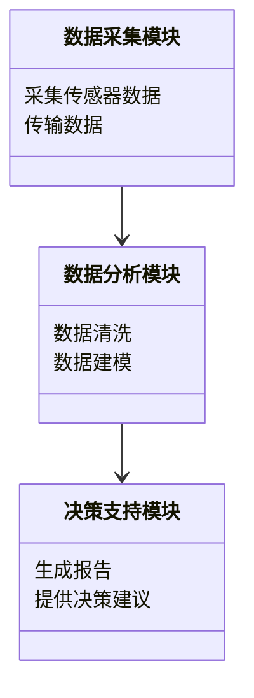

                 


---

# 价值投资中的智能城市水资源管理系统分析

> 关键词：智能城市水资源管理系统，价值投资，数据分析，优化算法，系统架构

> 摘要：本文探讨了智能城市水资源管理系统在价值投资中的应用，分析了系统的构成、算法原理、系统架构，并通过实际案例展示了如何通过智能化手段优化水资源管理，提升投资回报。

---

# 第1章: 智慧城市水资源管理系统的背景与价值

## 1.1 智慧城市水资源管理系统的背景

### 1.1.1 城市水资源管理面临的挑战

城市化进程的加快导致水资源短缺问题日益严重。传统水资源管理方式存在数据采集不准确、资源浪费、污染严重等问题。这些问题不仅影响城市可持续发展，也对投资决策提出了更高要求。

### 1.1.2 智慧城市概念的提出与演进

智慧城市概念的提出为解决城市水资源问题提供了新思路。通过物联网、大数据和人工智能等技术，实现水资源管理的智能化、精准化。

### 1.1.3 智慧城市水资源管理系统的定义与目标

智能城市水资源管理系统通过实时数据采集、分析和智能决策，优化水资源分配，减少浪费，提高利用效率。

## 1.2 价值投资与水资源管理的结合

### 1.2.1 价值投资的基本原理

价值投资强调通过深入分析企业基本面，寻找被市场低估的投资机会，实现长期稳健收益。

### 1.2.2 水资源管理中的投资机会

水资源管理行业的基础设施建设、技术创新和运营效率提升等领域存在大量投资机会。

### 1.2.3 智慧城市水资源管理系统对投资决策的影响

通过智能化系统，投资者可以更准确地评估项目收益和风险，优化投资组合，提高投资回报。

## 1.3 本章小结

本章介绍了智慧城市水资源管理系统的背景和价值投资的基本原理，强调了两者的结合对优化水资源管理和提升投资回报的重要性。

---

# 第2章: 智慧城市水资源管理系统的核心概念

## 2.1 智慧城市水资源管理系统的构成要素

### 2.1.1 数据采集与传输系统

通过传感器和物联网技术实时采集水资源数据，如流量、水质、水位等。

### 2.1.2 数据分析与处理系统

利用大数据和机器学习技术对数据进行分析，识别趋势和异常，为决策提供支持。

### 2.1.3 智能决策支持系统

基于分析结果，提供最优决策建议，如资源分配、应急处理等。

## 2.2 价值投资中的关键指标分析

### 2.2.1 水资源利用效率的衡量

通过单位水资源创造的经济价值来衡量利用效率。

### 2.2.2 投资回报率的计算方法

投资回报率 = （净收益 / 投资成本）× 100%

### 2.2.3 风险评估与控制

通过历史数据分析和情景模拟，评估投资风险并制定应对策略。

## 2.3 核心概念之间的关系分析

### 2.3.1 数据流与价值流的关系

数据流是价值流的基础，通过数据处理和分析，将数据转化为价值。

### 2.3.2 技术与经济的相互作用

技术创新推动经济效率提升，经济收益反过来支持技术创新。

### 2.3.3 系统整体优化的实现路径

通过系统各部分的协同优化，实现整体效率和价值的最大化。

---

# 第3章: 核心概念的原理与联系

## 3.1 智慧城市水资源管理系统的工作原理

### 3.1.1 数据采集与处理流程

1. 数据采集：传感器实时采集数据。
2. 数据传输：通过物联网将数据传输到数据中心。
3. 数据清洗：去除噪声和异常值。
4. 数据分析：利用机器学习模型进行预测和分类。

### 3.1.2 数据分析与预测机制

使用时间序列分析模型预测水资源需求和供应情况。

### 3.1.3 智能决策支持的实现方法

基于分析结果，优化资源配置，制定应急方案。

## 3.2 价值投资中的数学模型构建

### 3.2.1 水资源价值的量化方法

水资源价值 = 水资源利用效率 × 经济价值

### 3.2.2 投资回报的预测模型

$$ ROI = \frac{净收益}{投资成本} \times 100\% $$

### 3.2.3 风险评估的数学公式

$$ 风险 = 预期损失 - 风险溢价 $$

## 3.3 核心概念的ER实体关系图

```mermaid
er
  actor(投资者) -[投资]-> entity(水资源项目)
  entity(水资源数据) -[影响]-> entity(水资源价值)
  actor(水务公司) -[管理]-> entity(水资源系统)
  actor(政府机构) -[监管]-> entity(水资源政策)
```

---

# 第4章: 算法原理与实现

## 4.1 数据分析算法

### 4.1.1 线性回归模型

$$ y = \beta_0 + \beta_1 x + \epsilon $$

### 4.1.2 时间序列预测

使用ARIMA模型预测水资源需求。

## 4.2 优化算法

### 4.2.1 线性规划

目标函数：$$ \text{最大化} \sum c_j x_j $$

约束条件：
$$ \sum a_{ij} x_j \leq b_i \quad \forall i $$
$$ x_j \geq 0 \quad \forall j $$

### 4.2.2 动态规划

通过分阶段决策，优化水资源分配。

## 4.3 算法实现示例

```python
import numpy as np
from sklearn.linear_model import LinearRegression

# 示例数据
X = np.array([1, 2, 3, 4, 5]).reshape(-1, 1)
y = np.array([2, 4, 5, 4, 6])

# 模型训练
model = LinearRegression()
model.fit(X, y)

# 预测
print(model.predict([[6]]))
```

---

# 第5章: 系统分析与架构设计

## 5.1 系统功能设计

### 5.1.1 领域模型类图



### 5.1.2 系统架构图

```mermaid
archi
    前端 -[API调用]-> 后端
    后端 -[数据库交互]-> 数据库
    后端 -[消息队列]-> 数据分析模块
```

## 5.2 接口与交互设计

### 5.2.1 系统交互流程图

```mermaid
sequenceDiagram
    actor 用户 -> 水资源管理系统: 查询水资源数据
    水资源管理系统 -> 数据库: 获取数据
    数据库 -> 水资源管理系统: 返回数据
    水资源管理系统 -> 用户: 显示数据
```

---

# 第6章: 项目实战

## 6.1 环境安装

安装Python、TensorFlow、Flask等工具。

## 6.2 核心功能实现

### 6.2.1 数据采集模块

```python
import serial

# 读取传感器数据
ser = serial.Serial('COM3', 9600)
data = ser.readline().decode().strip()
print(data)
```

### 6.2.2 数据分析模块

```python
from sklearn.cluster import KMeans

# 数据聚类
X = np.random.rand(100, 2)
model = KMeans(n_clusters=3)
model.fit(X)
print(model.labels_)
```

## 6.3 案例分析

### 6.3.1 某城市供水系统优化

通过智能系统优化供水分配，降低浪费，提高效率。

## 6.4 项目小结

通过实战项目，验证了智能城市水资源管理系统的有效性和投资价值。

---

# 第7章: 最佳实践与展望

## 7.1 小结

智能城市水资源管理系统通过技术手段优化水资源管理，提升投资回报。

## 7.2 注意事项

1. 数据隐私保护
2. 系统维护与更新
3. 风险控制

## 7.3 拓展阅读

1. 《智慧城市：大数据与云计算的应用》
2. 《价值投资：寻找优质企业》

---

# 作者：AI天才研究院 & 禅与计算机程序设计艺术

--- 

这篇文章详细介绍了智能城市水资源管理系统在价值投资中的应用，通过理论分析、算法实现和项目实战，展示了如何利用技术手段优化水资源管理，实现长期稳健的投资回报。

