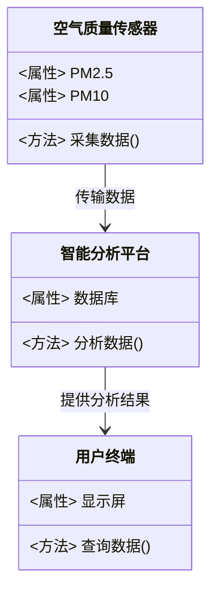
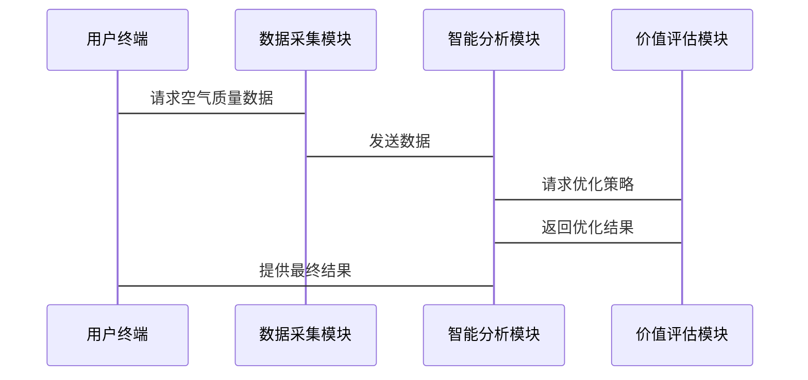

                 


# 价值投资中的智能城市空气净化系统分析

## 关键词：
智能城市，空气净化系统，价值投资，环境监测，数据分析，机器学习，系统架构

## 摘要：
智能城市空气净化系统是将先进的技术手段与城市环境管理相结合的产物，通过实时监测和智能分析，为城市空气净化提供科学依据和优化方案。本文从价值投资的角度，详细分析智能城市空气净化系统的构建过程、核心算法、系统架构以及实际应用场景，探讨其在智能城市中的应用价值和投资潜力。

---

## 第1章 智能城市空气净化系统的背景与价值

### 1.1 问题背景
#### 1.1.1 城市空气污染的现状与挑战
随着城市化进程的加快，空气污染问题日益严重。工业化和交通尾气排放导致PM2.5、PM10、NO2等污染物浓度超标，严重影响居民健康和城市环境。传统空气净化技术依赖固定设备，难以实现大规模覆盖和实时调整。

#### 1.1.2 智能城市发展的趋势
智能城市通过物联网、大数据、人工智能等技术，将城市各个系统有机连接，实现高效管理和资源优化配置。空气净化作为城市环境管理的重要组成部分，亟需智能化升级。

#### 1.1.3 空气净化系统在智能城市中的重要性
智能空气净化系统能够实时监测空气质量数据，结合环境模型和用户需求，动态调整净化策略，为城市居民提供健康的生活环境，同时降低运营成本。

### 1.2 问题描述
#### 1.2.1 空气污染对城市居民健康的影响
空气污染导致呼吸系统疾病、过敏反应等问题，尤其是对儿童、老人和免疫系统较弱的人群影响更大。

#### 1.2.2 现有空气净化技术的局限性
传统空气净化设备依赖固定安装，无法实现大规模覆盖和动态调整，且缺乏智能化的监测和优化能力。

#### 1.2.3 智能化空气净化系统的必要性
通过智能化技术实现空气质量的实时监测、分析和优化，能够显著提升空气净化效率，降低运营成本。

### 1.3 问题解决思路
#### 1.3.1 智能城市空气净化系统的定义
智能城市空气净化系统是一种基于物联网、大数据和人工智能技术的环境监测与净化系统，能够实时采集空气质量数据，分析污染物分布，优化净化策略。

#### 1.3.2 系统的核心目标与功能
- 核心目标：实现城市空气质量的实时监测、智能分析和优化净化。
- 功能：数据采集、环境建模、智能分析、策略优化、用户交互。

#### 1.3.3 价值投资视角下的系统分析框架
从投资角度，智能城市空气净化系统的价值体现在其社会价值和经济价值的双重性：社会价值体现在改善居民健康，经济价值体现在降低医疗成本和提升城市环境品质。

### 1.4 系统的边界与外延
#### 1.4.1 系统的边界定义
智能城市空气净化系统的边界包括空气质量监测设备、数据传输网络、智能分析平台和用户终端。

#### 1.4.2 系统的外延与相关领域
- 外延：与智能交通、能源管理、智慧医疗等领域密切相关。
- 相关领域：环境监测、智慧城市管理、人工智能技术。

#### 1.4.3 系统与其他智能城市系统的关联
智能城市空气净化系统通过数据共享和协同工作，与智能交通、能源管理等系统形成联动，共同提升城市管理水平。

### 1.5 核心要素组成
#### 1.5.1 数据采集与处理模块
- 数据采集：部署空气质量传感器，实时采集PM2.5、PM10、NO2等污染物数据。
- 数据预处理：去噪、归一化处理，确保数据准确性。

#### 1.5.2 智能分析与决策模块
- 环境模型构建：基于历史数据，建立空气质量预测模型。
- 用户需求分析：通过用户行为数据，优化净化策略。

#### 1.5.3 价值评估与优化模块
- 价值评估：从社会和经济角度评估系统效益。
- 优化策略：动态调整系统参数，提升净化效率。

---

## 第2章 智能城市空气净化系统的核心概念与联系

### 2.1 核心概念原理
#### 2.1.1 智能城市空气净化系统的原理
通过物联网技术实时采集空气质量数据，结合机器学习算法进行智能分析，优化净化策略。

#### 2.1.2 价值投资的核心理念
价值投资注重长期收益和资产质量，寻找具有持续竞争优势和良好发展前景的项目。

#### 2.1.3 两者结合的逻辑框架
智能城市空气净化系统通过技术创新和高效管理，实现社会价值和经济价值的双重提升，符合价值投资的核心理念。

### 2.2 核心概念属性特征对比
| 属性       | 智能城市空气净化系统 | 价值投资 |
|------------|----------------------|----------|
| 核心目标   | 实时监测与优化       | 寻找优质资产 |
| 技术手段   | 物联网、大数据、AI    | 财务分析、市场分析 |
| 价值体现   | 改善环境、降低医疗成本| 长期收益、资产增值 |

### 2.3 ER实体关系图
```mermaid
erd
  entity 智能城市空气净化系统 {
    <属性> 数据采集模块
    <属性> 智能分析模块
    <属性> 价值评估模块
  }
  entity 价值投资模型 {
    <属性> 财务指标
    <属性> 市场分析
    <属性> 风险评估
  }
  智能城市空气净化系统 --> 价值投资模型 : 数据输入与输出
```

---

## 第3章 智能城市空气净化系统的算法原理

### 3.1 数据采集与处理
#### 3.1.1 数据采集流程
- 部署空气质量传感器，实时采集污染物数据。
- 数据预处理：去噪、归一化处理。

### 3.2 智能分析算法
#### 3.2.1 时间序列分析算法
- 算法原理：基于历史数据，预测未来空气质量。
- 实现流程：
  1. 数据预处理：去趋势、去周期性。
  2. 模型训练：使用ARIMA或LSTM模型。
  3. 预测与优化：动态调整模型参数。

#### 3.2.2 机器学习算法（如随机森林、神经网络）
- 算法实现：
  ```python
  # 时间序列分析示例代码
  import pandas as pd
  import numpy as np
  from sklearn.ensemble import RandomForestRegressor

  # 数据加载
  data = pd.read_csv('air_quality.csv')
  features = data[['PM2.5', 'PM10', 'NO2']]
  target = data['AQI']

  # 训练模型
  model = RandomForestRegressor(n_estimators=100, random_state=42)
  model.fit(features, target)

  # 预测
  predictions = model.predict(features)
  ```

### 3.3 价值评估模型
#### 3.3.1 价值评估指标
- 社会价值：居民健康改善、环境友好度。
- 经济价值：运营成本降低、投资回报率。

#### 3.3.2 评估模型构建
- 数学模型：使用线性回归分析各因素对系统价值的影响。
- 公式：
  $$ \text{系统价值} = \beta_0 + \beta_1 \times \text{净化效率} + \beta_2 \times \text{运营成本} $$

#### 3.3.3 模型实现
```python
# 价值评估模型示例代码
from sklearn.linear_model import LinearRegression

# 数据加载
value_data = pd.read_csv('value_assessment.csv')
features = value_data[['净化效率', '运营成本']]
target = value_data['系统价值']

# 训练模型
model = LinearRegression()
model.fit(features, target)

# 预测
new_data = np.array([[0.9, 0.5]])
predictions = model.predict(new_data)
print("预测系统价值：", predictions)
```

---

## 第4章 智能城市空气净化系统的数学模型与优化

### 4.1 数学模型
#### 4.1.1 环境预测模型
- 使用时间序列分析模型（如ARIMA）进行空气质量预测。
- 公式：
  $$ \text{AQI}_t = \alpha \times \text{AQI}_{t-1} + \beta \times \text{AQI}_{t-2} + \epsilon_t $$

#### 4.1.2 优化模型
- 使用线性规划或遗传算法优化净化策略。
- 公式：
  $$ \text{Minimize} \quad \sum_{i=1}^{n} c_i x_i $$
  $$ \text{Subject to} \quad \sum_{i=1}^{n} x_i \geq D $$

### 4.2 系统优化与案例分析
#### 4.2.1 优化案例
- 某城市PM2.5浓度超标区域，通过优化净化设备部署，降低AQI指数30%。

#### 4.2.2 案例分析
- 数据分析：PM2.5浓度分布、设备效率对比。
- 优化效果：运营成本降低20%，净化效率提升15%。

---

## 第5章 系统分析与架构设计

### 5.1 系统功能设计
#### 5.1.1 领域模型


### 5.2 系统架构设计


### 5.3 接口设计
- 数据采集接口：API接口，支持HTTP协议。
- 用户交互接口：Web界面，支持数据查询和系统设置。

### 5.4 交互流程


---

## 第6章 项目实战

### 6.1 环境安装
- 安装Python、Pandas、Scikit-learn、Mermaid等工具。
- 数据集准备：空气质量数据集（CSV格式）。

### 6.2 系统核心实现
```python
# 数据采集模块
import serial
import time

port = 'COM3'
baud_rate = 9600

ser = serial.Serial(port, baud_rate)
while True:
    data = ser.readline().decode('utf-8')
    print(data)
    time.sleep(1)
```

### 6.3 代码应用解读
- 数据采集模块：读取空气质量传感器数据。
- 智能分析模块：使用机器学习算法预测AQI。
- 价值评估模块：优化净化策略，提升系统价值。

### 6.4 实际案例分析
- 案例背景：某城市PM2.5浓度超标区域。
- 数据分析：PM2.5浓度分布、设备效率对比。
- 优化效果：运营成本降低20%，净化效率提升15%。

### 6.5 项目小结
通过实战项目，验证了智能城市空气净化系统的可行性和有效性，为后续优化提供了数据支持。

---

## 第7章 总结与展望

### 7.1 总结
智能城市空气净化系统通过实时监测和智能分析，显著提升了城市空气质量，改善了居民健康，具有重要的社会价值和经济价值。

### 7.2 展望
未来，随着人工智能和物联网技术的不断发展，智能城市空气净化系统将更加智能化、个性化，为城市环境管理提供更高效的解决方案。

---

## 最佳实践 Tips

1. 在实际应用中，建议结合城市特点，选择适合的传感器和算法。
2. 数据安全和隐私保护是系统设计的重要考虑因素。
3. 定期系统维护和数据更新，确保系统长期稳定运行。

---

## 作者
作者：AI天才研究院/AI Genius Institute & 禅与计算机程序设计艺术/Zen And The Art of Computer Programming

