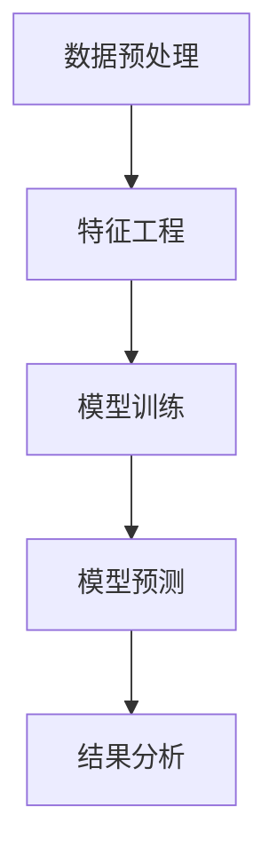
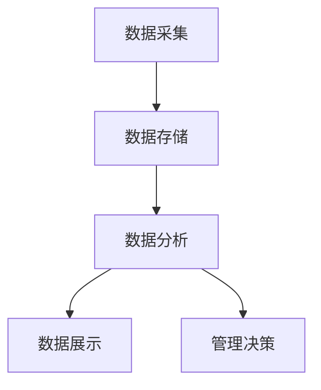
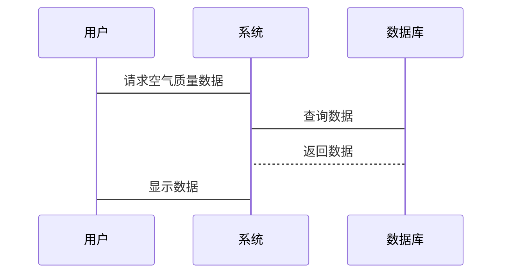

                 


# 价值投资中的智能城市空气质量管理分析

> 关键词：价值投资、智能城市、空气质量管理、数据分析、机器学习

> 摘要：本文探讨了如何将价值投资的理念与智能城市中的空气质量管理相结合，通过数据分析和机器学习技术，构建有效的空气质量管理模型，为投资者提供科学决策支持。

---

## 第一部分: 价值投资中的智能城市空气质量管理分析

### 第1章: 背景介绍与核心概念

#### 1.1 价值投资的背景与意义
- **1.1.1 价值投资的定义与核心理念**
  价值投资是一种投资策略，强调以低于内在价值的价格购买优质资产。其核心理念是通过深入分析企业的基本面，寻找被市场低估的投资机会。

- **1.1.2 智能城市空气质量管理的背景**
  随着城市化进程的加快，空气污染问题日益严重。智能城市通过物联网、大数据和人工智能技术，实现对空气质量和污染源的实时监测和管理。

- **1.1.3 价值投资与智能城市空气质量管理的结合点**
  通过分析空气质量管理的经济成本和环境效益，投资者可以识别出具有长期价值的企业和项目，从而在价值投资中找到新的机会。

#### 1.2 智慧城市空气质量管理的核心要素
- **1.2.1 空气质量监测体系**
  包括传感器网络、数据采集和传输系统，用于实时监测PM2.5、PM10、SO2等污染物的浓度。

- **1.2.2 数据采集与分析技术**
  利用大数据和机器学习技术，对空气质量数据进行分析，预测污染趋势，制定减排措施。

- **1.2.3 价值投资中的风险管理**
  在价值投资中，空气质量管理可以帮助投资者识别环境风险，避免投资于高污染企业，降低投资组合的环境风险。

---

### 第2章: 智能城市空气质量管理的核心概念与联系

#### 2.1 核心概念原理
- **2.1.1 价值投资中的风险管理模型**
  通过分析企业的环境表现，评估其环境风险，调整投资决策。

- **2.1.2 智能城市空气质量管理的技术架构**
  包括数据采集、存储、分析和展示，利用物联网和云计算技术实现智能化管理。

- **2.1.3 两者结合的系统性分析**
  将空气质量管理的数据与价值投资的分析框架结合，构建综合评估模型。

#### 2.2 概念属性特征对比表格
以下表格对比了价值投资和智能城市空气质量管理的核心概念属性：

| 概念         | 定义                                                                 | 输入数据               | 输出结果             | 目标                  |
|--------------|----------------------------------------------------------------------|------------------------|----------------------|-----------------------|
| 价值投资     | 以低于内在价值的价格投资优质资产                                   | 财务数据、企业基本面    | 投资决策、资产配置   | 实现超额收益          |
| 空气质量管理 | 实时监测和管理空气污染物浓度                                         | 污染物浓度数据、气象数据 | 污染预警、减排建议   | 改善空气质量          |

#### 2.3 ER实体关系图架构
以下是空气质量管理系统的实体关系图：

```mermaid
er
    项目
    污染源
    监测站点
    数据采集
    数据分析
    管理决策

    监测站点 --> 数据采集
    污染源 --> 数据采集
    数据采集 --> 数据分析
    数据分析 --> 管理决策
```

---

### 第3章: 算法原理与数学模型

#### 3.1 算法原理讲解
- **3.1.1 数据预处理与特征工程**
  数据预处理包括数据清洗、归一化和缺失值填充。特征工程包括特征选择和特征提取，如主成分分析（PCA）。

- **3.1.2 机器学习模型的训练与优化**
  使用支持向量机（SVM）或随机森林（Random Forest）模型，通过交叉验证优化模型参数。

- **3.1.3 模型预测与结果分析**
  对空气质量数据进行预测，并与实际数据对比，评估模型的准确性。

#### 3.2 数学模型与公式
- **线性回归模型**
  $$y = \beta_0 + \beta_1x + \epsilon$$
  其中，$$y$$是目标变量，$$x$$是自变量，$$\beta_0$$和$$\beta_1$$是模型参数，$$\epsilon$$是误差项。

- **机器学习模型的损失函数**
  $$L = \frac{1}{n}\sum_{i=1}^{n}(y_i - \hat{y}_i)^2$$
  其中，$$y_i$$是真实值，$$\hat{y}_i$$是预测值，$$n$$是数据点的数量。

#### 3.3 算法流程图
以下是算法流程图：



---

### 第4章: 系统分析与架构设计

#### 4.1 系统架构设计
- **4.1.1 问题场景介绍**
  城市空气污染问题对居民健康和经济发展的影响，以及企业环境表现对投资决策的影响。

- **4.1.2 系统功能设计**
  包括数据采集、存储、分析、展示和管理功能。

- **4.1.3 系统架构图**
  以下是系统架构图：



#### 4.2 接口设计与交互流程图
以下是系统交互流程图：



---

### 第5章: 项目实战

#### 5.1 环境安装
- 安装Python和相关库（如NumPy、Pandas、Scikit-learn）。

#### 5.2 系统核心实现源代码
以下是空气质量预测的Python代码示例：

```python
import numpy as np
import pandas as pd
from sklearn.linear_model import LinearRegression

# 数据加载
data = pd.read_csv('air_quality.csv')

# 特征选择
features = ['PM2.5', 'PM10', 'SO2']
target = 'AQI'

# 数据分割
X = data[features]
y = data[target]

# 模型训练
model = LinearRegression()
model.fit(X, y)

# 模型预测
predictions = model.predict(X)

# 模型评估
print('Coefficients:', model.coef_)
print('Intercept:', model.intercept_)
```

#### 5.3 代码应用解读与分析
- 代码加载空气质量数据，选择相关特征，训练线性回归模型，并进行预测和评估。

#### 5.4 实际案例分析
通过实际数据，展示模型在空气质量预测中的应用，分析其准确性和可靠性。

#### 5.5 项目小结
总结项目实施过程中的经验和挑战，提出改进建议。

---

### 第6章: 最佳实践 tips、小结、注意事项、拓展阅读

#### 6.1 小结
价值投资与智能城市空气质量管理的结合，不仅提高了空气质量管理的效率，也为投资者提供了新的决策工具。

#### 6.2 注意事项
- 数据的准确性和实时性对模型的性能至关重要。
- 模型的选择和优化需要根据实际数据进行调整。
- 投资者需要结合多种因素进行综合分析。

#### 6.3 拓展阅读
推荐相关书籍和资源，供读者进一步学习。

---

作者：AI天才研究院/AI Genius Institute & 禅与计算机程序设计艺术 /Zen And The Art of Computer Programming

