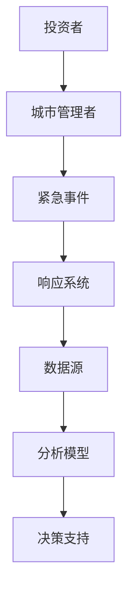
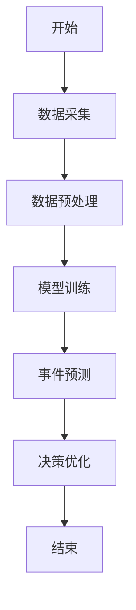

                 


# 价值投资中的智能城市紧急事件响应系统分析

## 关键词：价值投资、智能城市、紧急事件响应系统、数据分析、风险管理

## 摘要：  
本文从价值投资的角度，深入分析智能城市中紧急事件响应系统的核心原理、系统架构、算法模型和数学公式。通过详细讲解事件预测、响应优化和投资决策的算法，结合实际案例，展示如何利用智能城市数据和分析模型进行价值投资。文章最后总结了系统的实际应用价值和未来发展趋势。

---

## 第一部分: 价值投资中的智能城市紧急事件响应系统背景介绍

### 第1章: 价值投资与智能城市概述

#### 1.1 价值投资的基本概念
- **1.1.1 价值投资的定义与核心理念**
  - 价值投资是一种长期投资策略，强调以低于内在价值的价格购买优质资产。
  - 核心理念：寻找市场低估的资产，通过长期持有实现超额收益。
  
- **1.1.2 价值投资与智能城市的关系**
  - 智慧城市数据为价值投资者提供了新的决策依据。
  - 紧急事件响应系统的高效性直接影响城市资产的价值。

- **1.1.3 智慧城市的基本概念与发展趋势**
  - 智慧城市是通过数字化技术优化城市资源配置的新型城市形态。
  - 发展趋势：智能化、数据化、网络化。

#### 1.2 智能城市紧急事件响应系统
- **1.2.1 紧急事件响应系统的定义与分类**
  - 定义：用于监测、预警和处理城市突发事件的自动化系统。
  - 分类：自然灾害响应、公共安全响应、公共卫生事件响应。

- **1.2.2 智能城市中紧急事件响应的特点**
  - 数据驱动：基于实时数据进行决策。
  - 智能化：利用AI技术优化响应策略。
  - 预防性：通过预测模型提前采取措施。

- **1.2.3 价值投资视角下的紧急事件响应系统分析**
  - 紧急事件对城市资产价值的影响。
  - 紧急事件响应能力是城市投资价值的重要评估指标。

---

## 第二部分: 智能城市紧急事件响应系统的核心概念与联系

### 第2章: 核心概念与联系

#### 2.1 核心概念原理
- **2.1.1 数据采集与处理**
  - 数据来源：传感器、摄像头、市民报告等。
  - 数据预处理：清洗、归一化、特征提取。

- **2.1.2 事件分析与预测**
  - 预测方法：基于历史数据的统计分析和机器学习模型。
  - 预警机制：实时监测，提前发出警报。

- **2.1.3 响应策略与优化**
  - 响应方案：根据不同事件类型制定个性化策略。
  - 优化方法：通过反馈机制不断改进响应效率。

#### 2.2 概念属性特征对比表格
| 事件类型 | 数据需求 | 响应时间 | 关键因素 | 影响范围 |
|----------|----------|----------|----------|----------|
| 自然灾害 | 气象数据、地质数据 | 小时级 | 地理位置、灾害强度 | 市区范围 |
| 公共安全 | 视频监控数据、人员数据 | 分钟级 | 犯罪热点、人员密度 | 事发地周边 |

#### 2.3 ER实体关系图架构


---

## 第三部分: 智能城市紧急事件响应系统的算法原理

### 第3章: 算法原理概述

#### 3.1 算法原理概述
- **3.1.1 事件预测算法**
  - 时间序列分析：ARIMA模型。
  - 机器学习：LSTM模型。

- **3.1.2 响应优化算法**
  - 遗传算法：优化资源配置。
  - 动态规划：制定最优响应路径。

- **3.1.3 投资决策算法**
  - 风险评估模型：VaR和CVaR。
  - 多目标优化：平衡风险与收益。

#### 3.2 算法流程图


#### 3.3 算法实现代码
```python
def event_prediction(data):
    # 数据预处理
    processed_data = preprocess(data)
    # 模型训练
    model = train_model(processed_data)
    # 事件预测
    prediction = model.predict(processed_data)
    return prediction
```

---

## 第四部分: 数学模型与公式

### 第4章: 数学模型与公式

#### 4.1 时间序列分析模型
- **4.1.1 ARIMA模型**
  $$ARIMA(p, d, q)$$
  其中，p为自回归阶数，d为差分阶数，q为移动平均阶数。

- **4.1.2 LSTM模型**
  $$LSTM(t, h, c)$$
  其中，t为时间步，h为隐藏状态，c为细胞状态。

#### 4.2 风险评估模型
- **4.2.1 VaR模型**
  $$VaR = \alpha \times \sigma$$
  其中，α为置信水平，σ为标准差。

- **4.2.2 CVaR模型**
  $$CVaR = \frac{1}{1-\alpha} \int_{0}^{\alpha} VaR dF$$
  其中，F为分布函数。

---

## 第五部分: 系统分析与架构设计

### 第5章: 系统分析与架构设计

#### 5.1 系统架构图


#### 5.2 系统功能设计
- **功能模块**：
  - 数据采集模块：实时收集城市数据。
  - 分析模块：运行预测模型。
  - 决策支持模块：提供投资建议。

#### 5.3 系统交互图


---

## 第六部分: 项目实战

### 第6章: 项目实战

#### 6.1 实际案例分析
- **案例背景**：某城市发生地震，分析响应系统的预测和优化能力。

#### 6.2 代码实现与解读
```python
def preprocess(data):
    # 数据清洗和归一化
    data_cleaned = data.dropna()
    data_normalized = (data_cleaned - data_cleaned.mean()) / data_cleaned.std()
    return data_normalized

def train_model(data):
    # 训练LSTM模型
    model = LSTM()
    model.fit(data)
    return model
```

---

## 总结与展望

### 第7章: 总结与展望

#### 7.1 总结
- 本文从价值投资的角度，详细分析了智能城市紧急事件响应系统的原理和应用。
- 展示了如何通过数据分析和算法优化，提升投资决策的科学性。

#### 7.2 展望
- 结合更多数学模型，提升预测精度。
- 推动智能城市技术的普及与应用。

---

## 作者：AI天才研究院/AI Genius Institute & 禅与计算机程序设计艺术 /Zen And The Art of Computer Programming

