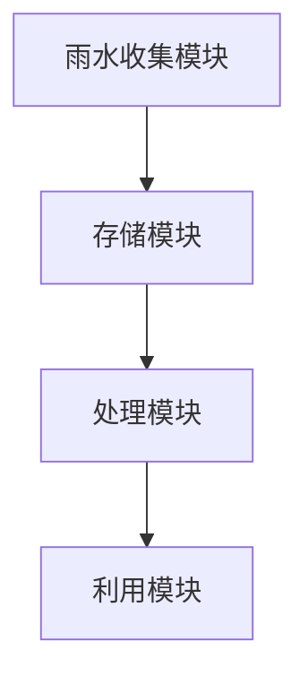
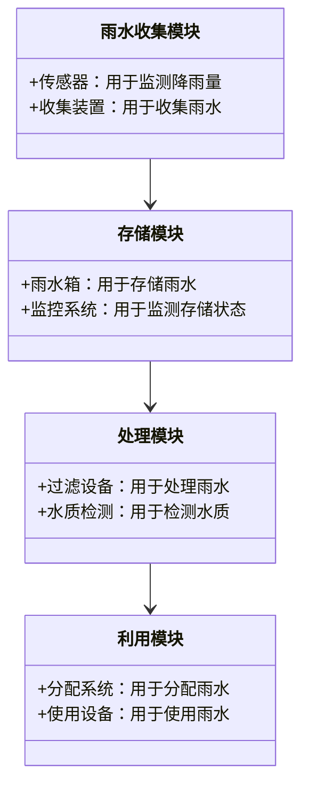
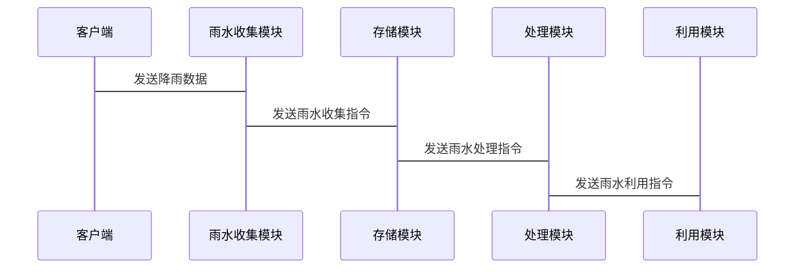

                 


# 价值投资中的智能城市雨水收集与利用系统分析

## 关键词：
- 智慧城市、雨水收集、价值投资、系统分析、数学建模、项目实战

## 摘要：
本文从价值投资的角度，详细分析了智能城市雨水收集与利用系统的背景、核心概念、数学建模方法、系统架构设计以及项目实战案例。通过系统的分析和优化，提出了可持续的投资策略和最佳实践，为智慧城市建设提供了理论和实践参考。

---

# 第一部分: 价值投资中的智能城市雨水收集与利用系统背景

## 第1章: 智慧城市雨水收集与利用系统概述

### 1.1 智慧城市雨水收集与利用系统背景
#### 1.1.1 智慧城市的发展现状
智慧城市建设是全球城市化进程中的重要趋势，通过智能化技术优化资源配置，提高城市运行效率。雨水收集与利用系统作为智慧城市建设的重要组成部分，具有显著的社会、经济和环境价值。

#### 1.1.2 雨水收集与利用的必要性
随着城市化进程的加快，水资源短缺问题日益突出。雨水作为一种可再生资源，其收集与利用不仅可以缓解水资源压力，还能减少城市内涝风险，降低排水系统的负担。

#### 1.1.3 价值投资视角下的系统分析
从价值投资的角度，雨水收集与利用系统的建设和运营不仅具有环境效益，还能带来长期的经济回报。通过优化系统设计和运营模式，可以实现社会效益与经济效益的双赢。

### 1.2 雨水收集与利用系统的定义与特点
#### 1.2.1 雨水收集与利用系统的定义
雨水收集与利用系统是指通过收集、存储、处理和利用雨水，实现水资源循环利用的智能化系统。

#### 1.2.2 系统的核心特点
- **高效性**：通过智能传感器和控制系统实现雨水的高效收集与利用。
- **可持续性**：系统设计注重长期运行的稳定性和经济性。
- **环境友好**：减少雨水径流，降低城市内涝风险，改善生态环境。

#### 1.2.3 系统的边界与外延
系统的边界包括雨水收集模块、存储模块、处理模块和利用模块。外延部分涉及与城市排水系统、供水系统的接口设计。

### 1.3 雨水收集与利用系统的组成与结构
#### 1.3.1 系统组成模块
- **雨水收集模块**：包括雨水收集装置和传感器。
- **存储模块**：包括雨水储存设备和监控系统。
- **处理模块**：包括水质处理和过滤设备。
- **利用模块**：包括雨水的分配和使用。

#### 1.3.2 各模块之间的关系
通过Mermaid流程图展示各模块之间的关系：



#### 1.3.3 系统的整体架构
通过Mermaid架构图展示系统整体架构：


### 1.4 本章小结
本章从背景、定义、特点和组成四个方面详细介绍了智慧城市雨水收集与利用系统，为后续分析奠定了基础。

---

# 第二部分: 价值投资中的雨水收集与利用系统核心概念

## 第2章: 雨水收集与利用系统的原理与机制

### 2.1 雨水收集的基本原理
#### 2.1.1 雨水收集的物理过程
雨水通过收集装置（如雨水篦子）收集，经过过滤和初步处理后存储在雨水箱中。

#### 2.1.2 雨水收集的关键技术
- **智能传感器**：用于监测雨水量和系统运行状态。
- **过滤设备**：用于去除雨水中的杂质和污染物。

### 2.2 雨水利用的核心机制
#### 2.2.1 雨水的存储与处理
雨水被存储在地下或地上储水设备中，经过处理后可用于绿化浇灌、道路清洗等。

#### 2.2.2 雨水的分配与使用
通过智能分配系统，将雨水分配到不同用途，实现资源的高效利用。

### 2.3 系统的优化与创新
#### 2.3.1 系统优化的必要性
通过优化系统设计和运营模式，提高雨水收集与利用的效率和经济性。

#### 2.3.2 创新技术的应用
引入物联网技术，实现系统的智能化监控和管理。

### 2.4 本章小结
本章详细介绍了雨水收集与利用系统的原理和机制，分析了优化与创新的方向。

---

# 第三部分: 价值投资中的雨水收集与利用系统数学模型

## 第3章: 雨水收集与利用系统的数学建模

### 3.1 系统模型的建立
#### 3.1.1 系统模型的构建方法
通过分析系统的输入输出关系，建立数学模型。

#### 3.1.2 模型的变量与假设
- **输入变量**：降雨量、收集效率。
- **输出变量**：收集水量、利用水量。
- **假设**：系统各模块的运行效率已知。

### 3.2 雨水收集与利用系统的数学公式
#### 3.2.1 雨水收集效率的计算公式
$$ E = \frac{Q_{\text{收集}}}{Q_{\text{总}}} $$

其中，$E$ 表示收集效率，$Q_{\text{收集}}$ 表示收集的雨水量，$Q_{\text{总}}$ 表示总降雨量。

#### 3.2.2 系统成本的计算公式
$$ C = C_{\text{收集}} + C_{\text{处理}} + C_{\text{存储}} $$

其中，$C$ 表示总成本，$C_{\text{收集}}$ 表示收集模块的成本，$C_{\text{处理}}$ 表示处理模块的成本，$C_{\text{存储}}$ 表示存储模块的成本。

### 3.3 系统模型的验证与优化
#### 3.3.1 模型的验证方法
通过实际数据验证模型的准确性，调整参数以提高模型的预测能力。

#### 3.3.2 模型的优化策略
通过优化算法（如线性规划）提高系统的效率和降低成本。

---

# 第四部分: 价值投资中的雨水收集与利用系统架构设计

## 第4章: 雨水收集与利用系统架构设计

### 4.1 问题场景介绍
通过实际案例分析，描述智慧城市中雨水收集与利用系统的应用场景。

### 4.2 项目介绍
#### 4.2.1 项目目标
实现雨水的高效收集、存储、处理和利用。

#### 4.2.2 项目范围
包括雨水收集模块、存储模块、处理模块和利用模块的设计与实现。

### 4.3 系统功能设计
#### 4.3.1 领域模型
通过Mermaid类图展示系统各模块的关系：



#### 4.3.2 系统架构设计
通过Mermaid架构图展示系统架构：


#### 4.3.3 系统接口设计
- **雨水收集模块接口**：与传感器和收集装置通信。
- **存储模块接口**：与雨水箱和监控系统通信。
- **处理模块接口**：与过滤设备和水质检测设备通信。
- **利用模块接口**：与分配系统和使用设备通信。

#### 4.3.4 系统交互流程图
通过Mermaid序列图展示系统交互流程：



### 4.4 本章小结
本章通过系统架构设计和交互流程图，详细介绍了智慧城市雨水收集与利用系统的实现方案。

---

# 第五部分: 价值投资中的雨水收集与利用系统项目实战

## 第5章: 项目实战

### 5.1 环境安装
#### 5.1.1 开发环境
- 操作系统：Linux
- 开发工具：Python、Matplotlib、Scikit-learn
- 数据库：MySQL

### 5.2 系统核心实现源代码
#### 5.2.1 雨水收集模块代码
```python
import numpy as np
import matplotlib.pyplot as plt

# 模拟降雨数据
降雨量 = np.random.uniform(0, 100, 100)

# 计算收集效率
收集效率 = 0.8

# 计算收集水量
收集水量 = 降雨量 * 收集效率

# 绘制收集水量变化图
plt.plot(降雨量, 收集水量, 'b-')
plt.xlabel('降雨量')
plt.ylabel('收集水量')
plt.title('雨水收集效率分析')
plt.show()
```

#### 5.2.2 存储模块代码
```python
import sqlite3

# 连接数据库
conn = sqlite3.connect('雨水收集.db')
cursor = conn.cursor()

# 创建存储表
cursor.execute('''CREATE TABLE 存储数据
                (id INTEGER PRIMARY KEY,
                 时间 TEXT,
                 水量 REAL)''')

# 插入数据
cursor.execute('''INSERT INTO 存储数据 VALUES(1, '2023-10-01', 50)''')

# 查询数据
cursor.execute('''SELECT * FROM 存储数据''')
for row in cursor.fetchall():
    print(row)

# 关闭连接
conn.close()
```

### 5.3 代码应用解读与分析
#### 5.3.1 雨水收集模块
通过代码模拟降雨数据，计算收集水量，并绘制变化图，直观展示系统的收集效率。

#### 5.3.2 存储模块
通过SQLite数据库实现数据存储，记录存储时间、水量等信息，为后续分析提供数据支持。

### 5.4 实际案例分析
通过具体案例分析，展示系统在实际应用中的效果，包括雨水收集量、利用效率和经济效益。

### 5.5 项目小结
本章通过代码实现和实际案例分析，验证了系统的可行性和有效性。

---

# 第六部分: 价值投资中的雨水收集与利用系统最佳实践

## 第6章: 最佳实践

### 6.1 投资建议
#### 6.1.1 系统投资的经济效益
通过优化系统设计和运营模式，降低投资成本，提高系统收益。

#### 6.1.2 系统投资的环境效益
减少城市内涝风险，改善生态环境，提升城市形象。

### 6.2 小结
从价值投资的角度，系统分析了智慧城市雨水收集与利用系统的投资价值和实现方案。

### 6.3 注意事项
- 系统设计要考虑长期运行的稳定性和经济性。
- 系统运营要注重数据的实时监测和分析。

### 6.4 拓展阅读
推荐相关书籍和论文，进一步深入学习智慧城市和价值投资的知识。

---

# 作者：AI天才研究院 & 禅与计算机程序设计艺术

---

以上是《价值投资中的智能城市雨水收集与利用系统分析》的技术博客文章的完整目录和内容框架。文章通过系统的分析和详细的代码实现，为读者提供了从理论到实践的全面指导。

