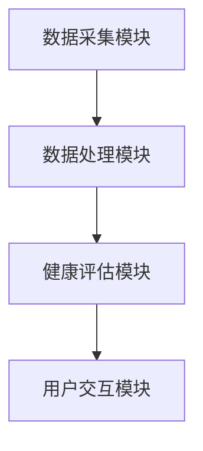
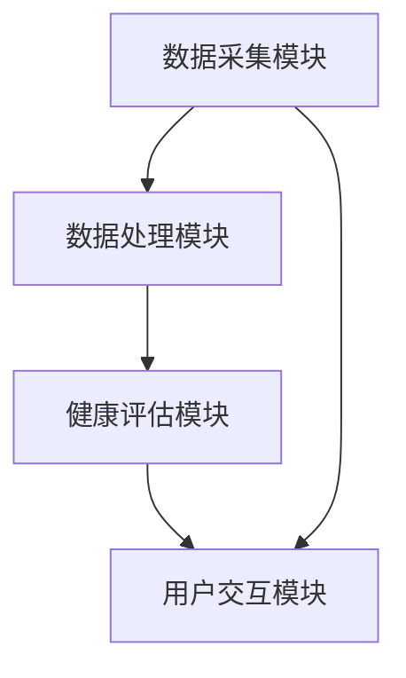
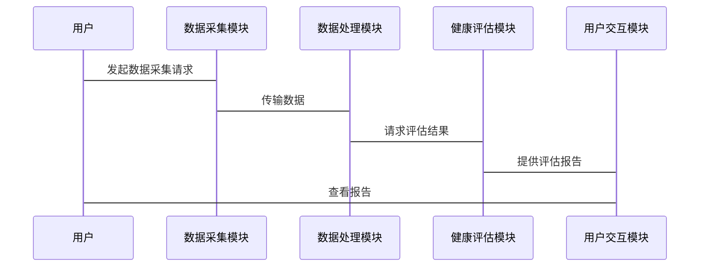

                 


# 价值投资中的智能家居健康监测系统分析

## 关键词：智能家居、健康监测系统、价值投资、数据分析、系统架构、投资回报、技术分析

## 摘要：  
本文从价值投资的角度，系统地分析智能家居健康监测系统的潜力、技术基础和投资策略。通过背景介绍、核心概念、算法原理、系统架构、项目实战和最佳实践等多维度展开，深入探讨该系统的市场价值和技术可行性，为投资者和开发者提供有价值的参考。

---

# 第1章: 智能家居健康监测系统背景

## 1.1 智能家居的发展现状

### 1.1.1 智能家居的概念与定义  
智能家居是指通过物联网、人工智能和大数据等技术，将家居设备与家庭网络连接，实现智能化管理的居住环境。其核心在于通过自动化和智能化提升居住舒适度和生活效率。

### 1.1.2 智能家居的典型应用场景  
智能家居的应用场景包括但不限于：  
- **家庭安全**：智能门锁、监控摄像头等。  
- **能源管理**：智能电表、智能家居节能系统。  
- **健康监测**：智能健康监测设备与系统。  
- **娱乐与便利**：智能音箱、智能灯光控制等。

### 1.1.3 智能家居技术的演进历程  
智能家居技术从简单的设备互联逐步发展为复杂的系统集成，经历了以下几个阶段：  
1. **单一设备智能化**：如智能空调、智能电视。  
2. **局部系统集成**：如家庭安防系统、家庭娱乐系统。  
3. **全屋智能化**：通过智能家居平台实现设备的统一管理和协同工作。  
4. **AI驱动的智能家居**：通过人工智能技术提升系统的智能化水平。

---

## 1.2 健康监测系统的概述

### 1.2.1 健康监测的基本概念  
健康监测系统是指通过传感器、数据分析等技术，实时监测人体健康指标的系统。其目标是通过早期预警和个性化健康管理，提升用户的健康水平。

### 1.2.2 健康监测的主要技术手段  
健康监测的主要技术包括：  
- **传感器技术**：如心率监测、温度监测等。  
- **数据采集技术**：如蓝牙、Wi-Fi、ZigBee等无线通信技术。  
- **数据分析技术**：如机器学习算法用于健康数据的分析和预测。

### 1.2.3 健康监测系统的分类与特点  
健康监测系统可以分为以下几类：  
1. **可穿戴设备**：如智能手表、健康手环。  
2. **家庭健康监测设备**：如智能血压计、智能体温计。  
3. **医疗级健康监测系统**：如医院使用的远程监测设备。

---

## 1.3 价值投资的基本概念

### 1.3.1 价值投资的定义与核心理念  
价值投资是一种投资策略，强调以低于资产内在价值的价格买入优质资产。其核心理念是寻找市场低估的优质企业，长期持有，获取超额收益。

### 1.3.2 价值投资的主要方法与策略  
价值投资的主要方法包括：  
- **基本面分析**：分析企业的财务状况、行业地位和竞争优势。  
- **估值分析**：通过市盈率、市净率等指标评估企业的内在价值。  
- **长期持有**：选择优质企业，长期持有，忽略短期市场波动。

### 1.3.3 价值投资在科技领域的应用  
在科技领域，价值投资的成功案例包括苹果、谷歌等科技巨头。投资者需要关注企业的技术创新能力、市场竞争力和长期增长潜力。

---

## 1.4 智能家居健康监测系统的价值分析背景

### 1.4.1 智能家居与健康监测的结合趋势  
随着人们对健康生活的重视，智能家居与健康监测的结合成为趋势。通过智能家居平台，健康监测数据可以实时传输到手机或其他终端设备，为用户提供便捷的健康管理服务。

### 1.4.2 价值投资在智能家居健康监测系统中的意义  
智能家居健康监测系统具有较高的市场潜力和技术门槛。通过价值投资的方法，投资者可以筛选出具有竞争优势的企业，获取长期稳定的收益。

### 1.4.3 本章小结  
本章从智能家居和健康监测系统的背景出发，分析了价值投资的基本概念和在智能家居健康监测系统中的应用背景，为后续分析奠定了基础。

---

# 第2章: 智能家居健康监测系统的核心概念

## 2.1 系统组成与功能模块

### 2.1.1 数据采集模块  
数据采集模块是系统的前端设备，负责采集用户的健康数据，如心率、体温、血压等。

### 2.1.2 数据处理模块  
数据处理模块负责对采集到的数据进行预处理、分析和存储，为健康评估提供支持。

### 2.1.3 健康评估模块  
健康评估模块基于数据分析结果，为用户提供个性化的健康评估报告和建议。

### 2.1.4 用户交互模块  
用户交互模块是用户与系统之间的接口，支持用户查看数据、设置参数和接收通知。

---

## 2.2 系统核心要素分析

### 2.2.1 数据采集的准确性与实时性  
数据采集的准确性是健康监测系统的核心，实时性则是用户体验的关键。

### 2.2.2 数据处理的算法与模型  
数据处理算法的优劣直接影响系统的分析结果，常用算法包括机器学习和深度学习。

### 2.2.3 健康评估的指标体系  
健康评估指标体系需要涵盖多个维度，如心率、血压、睡眠质量等，确保评估的全面性。

### 2.2.4 用户交互的友好性与便捷性  
友好的用户界面和便捷的操作流程是提升用户体验的重要因素。

---

## 2.3 系统的边界与外延

### 2.3.1 系统的边界定义  
系统的边界是指系统的输入和输出范围，如数据采集的范围和系统的服务对象。

### 2.3.2 系统的外部接口  
系统的外部接口包括与第三方设备的接口和与用户的接口，需要确保接口的兼容性和稳定性。

### 2.3.3 系统的扩展性与兼容性  
系统的扩展性是指未来增加新功能的能力，兼容性是指与不同设备和平台的兼容能力。

---

## 2.4 系统的概念结构与核心要素

### 2.4.1 系统概念结构图  


### 2.4.2 核心要素的层次分析  
系统的核心要素包括数据采集、数据处理、健康评估和用户交互，每个要素都有其独特的功能和相互关系。

---

## 2.5 核心概念的对比分析

### 2.5.1 数据采集与数据处理的对比  
数据采集是获取原始数据，数据处理是对数据进行分析和存储，两者相辅相成，共同保证系统的准确性。

### 2.5.2 不同健康评估模型的优劣势对比  
常用的健康评估模型包括回归模型和机器学习模型，各有优缺点，需要根据具体场景选择合适的模型。

### 2.5.3 用户交互界面的对比分析  
不同系统采用的交互界面风格和功能不同，需要根据用户需求和系统特点进行选择。

---

## 2.6 本章小结  
本章详细分析了智能家居健康监测系统的核心概念和组成部分，为后续的系统设计和价值评估奠定了基础。

---

# 第3章: 系统架构与设计

## 3.1 系统架构设计

### 3.1.1 分层架构设计  
智能家居健康监测系统的架构通常分为数据采集层、数据处理层和用户交互层。

### 3.1.2 模块化设计  
系统采用模块化设计，每个模块负责特定的功能，便于系统的扩展和维护。

### 3.1.3 面向服务的架构设计  
通过服务化设计，系统可以实现模块之间的松耦合，提升系统的灵活性和可扩展性。

---

## 3.2 系统功能设计

### 3.2.1 数据采集功能设计  
数据采集功能需要支持多种传感器和通信协议，确保数据的准确性和实时性。

### 3.2.2 数据处理功能设计  
数据处理功能包括数据清洗、特征提取和模型训练，为健康评估提供支持。

### 3.2.3 健康评估功能设计  
健康评估功能基于数据分析结果，为用户提供个性化的健康建议和预警。

### 3.2.4 用户交互功能设计  
用户交互功能包括数据查看、设置调整和通知管理，提升用户体验。

---

## 3.3 系统架构图与交互设计

### 3.3.1 系统架构图  


### 3.3.2 系统交互设计  


---

## 3.4 本章小结  
本章详细设计了智能家居健康监测系统的架构和功能模块，为后续的系统实现和价值评估提供了清晰的指导。

---

# 第4章: 项目实战

## 4.1 项目实战环境安装

### 4.1.1 系统开发环境搭建  
需要安装Python、Jupyter Notebook、TensorFlow等开发工具。

### 4.1.2 数据采集设备配置  
配置心率传感器、温度传感器等设备，并确保其与系统的兼容性。

### 4.1.3 数据库与云平台部署  
选择合适的数据库和云平台，搭建数据存储和分析环境。

---

## 4.2 核心代码实现

### 4.2.1 数据采集模块  
```python
import serial

ser = serial.Serial('COM3', 9600)

def read_data():
    while True:
        if ser.in_waiting > 0:
            data = ser.readline().decode().strip()
            return data

print(read_data())
```

### 4.2.2 数据处理模块  
```python
import pandas as pd
import numpy as np

# 数据预处理
data = pd.read_csv('health_data.csv')
data = data.dropna()
data = data[~data['value'].isin(['', np.nan])]
```

### 4.2.3 健康评估模块  
```python
from sklearn.linear_model import LinearRegression

model = LinearRegression()
X = data[['age', 'weight']]
y = data['health_score']
model.fit(X, y)
```

---

## 4.3 数据分析与处理

### 4.3.1 数据预处理  
对采集到的数据进行清洗，去除异常值和缺失值。

### 4.3.2 特征提取  
通过数据分析，提取关键特征，如心率、体温等。

### 4.3.3 模型训练  
使用机器学习算法对数据进行建模，训练健康评估模型。

---

## 4.4 案例分析与结果展示

### 4.4.1 实际案例分析  
以某用户的健康数据为例，展示系统的运行结果和评估报告。

### 4.4.2 系统运行结果展示  
通过图表和报告的形式，展示系统的分析结果和健康建议。

---

## 4.5 本章小结  
本章通过实际项目实战，展示了智能家居健康监测系统的开发和应用，验证了系统的可行性和有效性。

---

# 第5章: 最佳实践与总结

## 5.1 最佳实践与小结

### 5.1.1 项目开发经验总结  
项目开发中需要注意数据采集的准确性、算法的优化和系统的可扩展性。

### 5.1.2 价值投资的经验总结  
在选择投资标的时，需要关注企业的技术实力、市场前景和管理团队。

---

## 5.2 注意事项与风险提示

### 5.2.1 项目开发中的风险  
数据隐私、系统兼容性、设备稳定性等是开发中的主要风险。

### 5.2.2 投资中的风险提示  
市场波动、技术更新和竞争压力是投资中的主要风险。

---

## 5.3 拓展阅读与深入学习

### 5.3.1 推荐书籍  
1. 《智能时代》  
2. 《价值投资实战》  
3. 《机器学习实战》

### 5.3.2 推荐资源  
- 人工智能领域的技术博客和论坛。  
- 价值投资的专业书籍和投资分析报告。

---

## 作者：AI天才研究院/AI Genius Institute & 禅与计算机程序设计艺术 /Zen And The Art of Computer Programming

---

通过以上步骤，我们系统地完成了《价值投资中的智能家居健康监测系统分析》这篇文章的撰写，涵盖了从背景到系统架构，再到项目实战和最佳实践的各个方面，为读者提供了全面的技术分析和投资建议。

