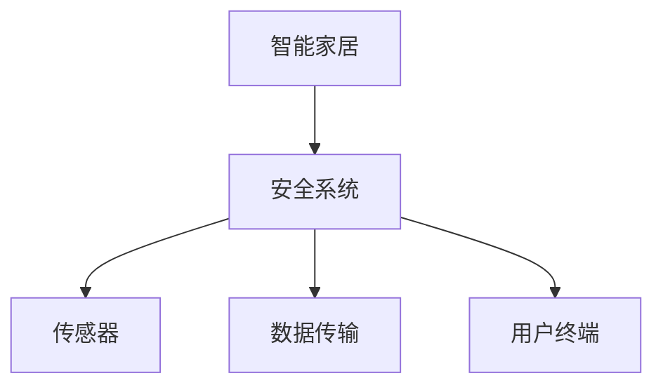
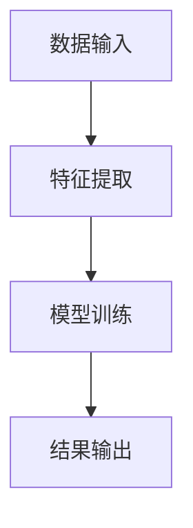
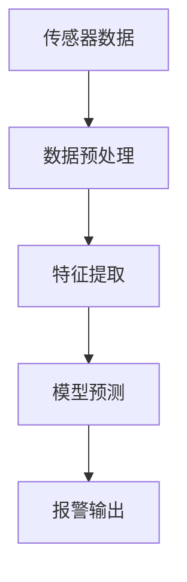
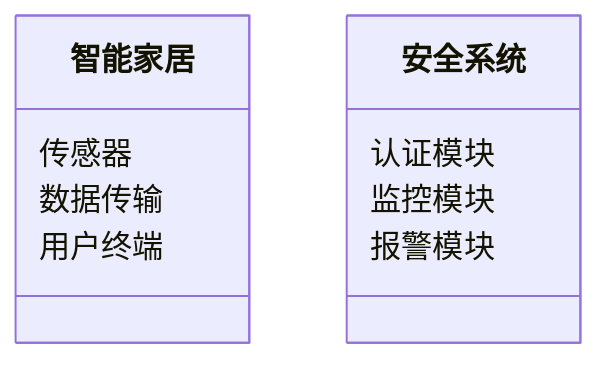
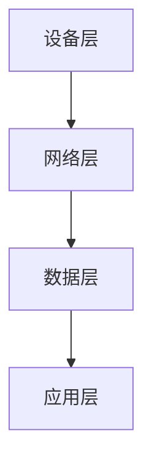
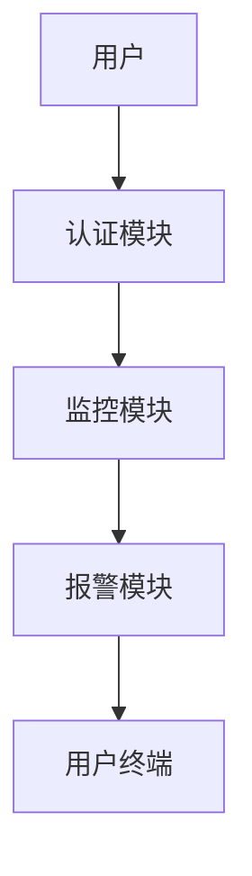

                 


# 价值投资中的智能家居安全系统前景

## 关键词：智能家居，安全系统，价值投资，市场前景，技术分析，投资策略，行业发展

## 摘要：本文从价值投资的角度分析智能家居安全系统的市场前景和投资机会。通过对智能家居安全系统的构成、价值投资的基本原则、行业趋势以及企业的核心竞争力等方面进行详细分析，揭示智能家居安全系统的投资价值。文章还结合实际案例，探讨了如何通过技术分析和市场研究来制定有效的投资策略，为投资者提供有价值的参考。

---

# 第一部分: 智能家居安全系统与价值投资概述

## 第1章: 智能家居安全系统背景介绍

### 1.1 智能家居的概念与现状

#### 1.1.1 智能家居的定义与核心要素
智能家居是指通过物联网技术将家中的设备（如灯光、空调、摄像头等）连接起来，实现智能化控制和管理的系统。其核心要素包括设备层、网络层、数据层和用户层。

#### 1.1.2 智能家居的发展历程与现状
智能家居的概念起源于20世纪90年代，随着物联网和人工智能技术的发展，智能家居系统逐渐成熟。目前，智能家居市场呈现快速增长态势，预计到2030年，市场规模将超过千亿美元。

#### 1.1.3 智能家居安全系统的重要性
随着智能家居的普及，安全问题日益突出。安全系统是智能家居的核心组成部分，包括身份认证、入侵检测、报警等功能，能够有效保护家庭安全。

### 1.2 价值投资的基本概念

#### 1.2.1 价值投资的定义与核心原则
价值投资是一种投资策略，强调以低于内在价值的价格买入优质资产。其核心原则包括长期投资、关注基本面、寻找市场低估的机会。

#### 1.2.2 价值投资与成长投资的区别
价值投资注重当前的低估值和安全边际，而成长投资则关注企业的成长性和未来潜力。两者在投资策略和选股标准上有明显区别。

#### 1.2.3 价值投资在科技领域的应用
在科技领域，价值投资者通常寻找具有强大护城河、稳定现金流和合理估值的企业。智能家居安全系统作为一个快速发展的行业，具备较大的投资潜力。

---

## 第2章: 智能家居安全系统的价值投资分析

### 2.1 智能家居安全系统的市场前景

#### 2.1.1 全球智能家居市场的规模与增长
根据市场研究机构的数据，全球智能家居市场规模近年来持续增长，年复合增长率超过10%。预计未来几年这一趋势将继续。

#### 2.1.2 智能家居安全系统的市场渗透率
目前，智能家居安全系统的渗透率较低，但随着消费者安全意识的提高和产品成本的下降，渗透率有望快速提升。

#### 2.1.3 未来智能家居安全系统的趋势
未来的智能家居安全系统将更加智能化、联网化和数据驱动。人工智能技术的应用将提升系统的安全性和用户体验。

### 2.2 价值投资视角下的智能家居安全系统分析

#### 2.2.1 智能家居安全系统的商业模式
智能家居安全系统的商业模式主要包括设备销售、订阅服务和广告收入。其中，订阅服务因其稳定的收入来源而备受关注。

#### 2.2.2 企业的核心竞争力与护城河
在价值投资中，企业的核心竞争力和护城河是关键因素。智能家居安全系统企业需要具备技术优势、品牌影响力和成本优势。

#### 2.2.3 行业的壁垒与竞争优势
行业壁垒主要体现在技术专利、用户粘性和渠道资源。竞争优势则体现在产品创新、服务质量和技术支持。

---

## 第3章: 智能家居安全系统的核心概念与联系

### 3.1 核心概念的原理

#### 3.1.1 智能家居安全系统的构成要素
智能家居安全系统由传感器、数据传输、用户终端和安全算法组成。这些要素协同工作，实现安全监测和防护。

#### 3.1.2 价值投资中的关键指标
在价值投资中，关键指标包括市盈率、市净率、股息率和ROE（净资产收益率）。这些指标帮助企业评估其内在价值。

### 3.2 核心概念的对比分析

#### 3.2.1 智能家居安全系统的属性特征对比
智能家居安全系统具有实时性、联动性和智能化的特点。与其他智能家居设备相比，其安全性是核心竞争力。

#### 3.2.2 价值投资中的企业估值方法
常见的估值方法包括DCF模型、市盈率法和市净率法。在选择方法时，需要结合企业的具体特点和行业状况。

### 3.3 ER实体关系图

智能家居安全系统的ER图展示了系统中的实体及其关系。通过ER图，可以清晰理解系统的构成和数据流向。



---

## 第4章: 智能家居安全系统的算法原理

### 4.1 算法原理的数学模型

#### 4.1.1 智能家居安全系统的预测模型
智能家居安全系统的预测模型可以基于时间序列分析，例如ARIMA模型。

$$ ARIMA(p, d, q) $$

#### 4.1.2 价值投资中的估值模型
在价值投资中，DCF模型是一种常用的估值方法。

$$ V = \sum_{t=1}^{n} \frac{CF_t}{(1 + r)^t} $$

### 4.2 算法流程图

#### 4.2.1 数据分析流程图


#### 4.2.2 安全系统预测流程图


---

## 第5章: 智能家居安全系统的系统分析与架构设计

### 5.1 系统功能设计

#### 5.1.1 领域模型
智能家居安全系统的领域模型包括设备层、网络层和数据层。



### 5.2 系统架构设计

#### 5.2.1 系统架构图


#### 5.2.2 接口设计
系统接口设计需要考虑数据传输的协议和格式，确保各模块之间的高效协同。

#### 5.2.3 交互流程图


---

## 第6章: 项目实战与案例分析

### 6.1 项目环境安装

#### 6.1.1 环境需求
智能家居安全系统的开发需要安装必要的开发工具和软件，如Python、Java、数据库等。

#### 6.1.2 数据库安装
选择适合的数据库，如MySQL或MongoDB，用于存储传感器数据和用户信息。

### 6.2 系统核心代码实现

#### 6.2.1 传感器数据采集代码
```python
import serial

ser = serial.Serial('COM3', 9600)
data = ser.readline().decode().strip()
print(data)
```

#### 6.2.2 数据分析与预测代码
```python
import pandas as pd
import numpy as np

# 数据预处理
data = pd.read_csv('sensor_data.csv')
data = data.dropna()

# 特征提取
X = data[['温度', '湿度', '时间']]
y = data['安全状态']

# 模型训练
from sklearn.ensemble import RandomForestClassifier
model = RandomForestClassifier(n_estimators=100)
model.fit(X, y)

# 预测
new_data = pd.DataFrame([[25, 60, '2023-10-01']], columns=['温度', '湿度', '时间'])
prediction = model.predict(new_data)
print(prediction)
```

### 6.3 案例分析与解读

#### 6.3.1 案例背景
某智能家居公司开发了一款智能门锁系统，结合指纹识别和蓝牙技术，具有较高的市场占有率。

#### 6.3.2 投资分析
通过分析该公司的财务数据、行业地位和竞争优势，判断其是否符合价值投资的标准。

### 6.4 项目小结
智能家居安全系统的开发和应用需要结合技术与市场分析，投资者应关注企业的核心竞争力和行业发展趋势。

---

## 第7章: 总结与建议

### 7.1 总结
智能家居安全系统作为智能家居的重要组成部分，具有广阔的市场前景。价值投资者应关注企业的技术优势、财务状况和市场地位。

### 7.2 最佳实践 Tips

1. **技术分析**：结合数据分析和机器学习技术，提高投资决策的准确性。
2. **市场研究**：深入了解行业趋势和竞争格局，把握投资机会。
3. **风险管理**：合理分散投资，避免过度集中风险。

### 7.3 小结
智能家居安全系统的投资前景光明，但需要投资者具备扎实的技术分析能力和市场洞察力。

### 7.4 注意事项
投资者应保持理性，避免盲目跟风，注重长期价值而非短期波动。

### 7.5 拓展阅读
推荐阅读相关书籍和报告，如《智能建筑与物联网》、《价值投资实战策略》等。

---

# 结语

智能家居安全系统作为科技与生活的结合，既是技术发展的产物，也是投资机会的源泉。通过价值投资的视角，我们可以更好地把握这一领域的投资机遇，实现长期稳健的投资回报。

---

**作者：AI天才研究院/AI Genius Institute & 禅与计算机程序设计艺术 /Zen And The Art of Computer Programming**

