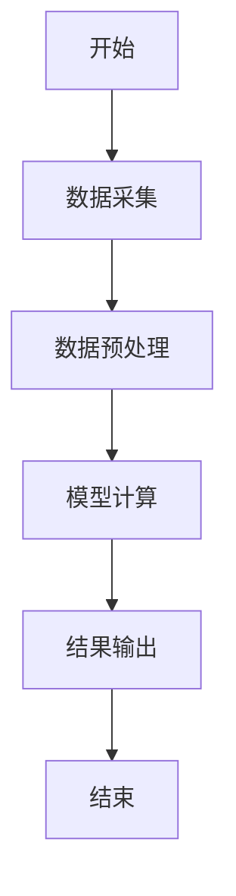
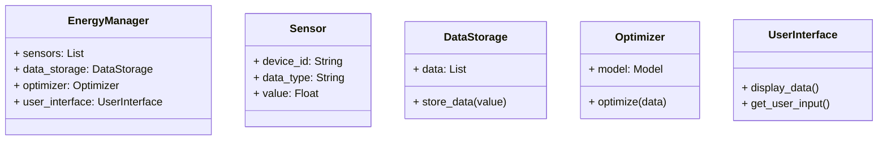
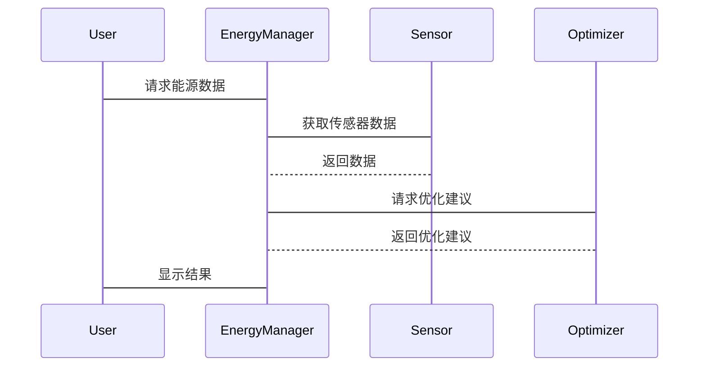

                 


# 价值投资中的智能家居能源管理系统分析

> 关键词：价值投资，智能家居，能源管理系统，技术分析，投资策略

> 摘要：本文深入分析了智能家居能源管理系统在价值投资中的潜力与挑战。通过系统化的技术分析和案例研究，探讨了如何从技术角度评估和投资智能家居能源管理系统，为投资者提供科学的决策依据。

---

# 第一部分: 价值投资与智能家居能源管理系统的背景与核心概念

## 第1章: 智能家居能源管理系统的背景与现状

### 1.1 智能家居能源管理系统的定义与特点

智能家居能源管理系统是一种通过智能化技术对家庭能源使用进行监测、优化和管理的系统。其核心目标是通过数据分析和算法优化，帮助用户实现能源的高效利用和成本节约。以下是其主要特点：

1. **智能化**：通过传感器、物联网（IoT）和人工智能（AI）技术，实时监测和分析能源使用情况。
2. **数据驱动**：依赖大量数据进行分析，提供精准的能源管理策略。
3. **节能高效**：通过优化能源使用，降低能耗，减少碳排放。
4. **用户友好**：提供直观的用户界面，方便用户查看和管理能源使用情况。

### 1.2 智能家居能源管理系统的市场现状与发展趋势

当前，智能家居能源管理系统在全球范围内得到了快速发展，尤其是在发达国家和地区。其市场增长主要受益于以下几个因素：

1. **政策支持**：各国政府通过立法和补贴推动绿色能源和智能技术的应用。
2. **技术进步**：人工智能和物联网技术的快速发展为能源管理系统的智能化提供了技术支持。
3. **用户需求**：随着能源价格的上涨和环保意识的增强，用户对节能技术的需求日益增加。

预计未来几年，智能家居能源管理系统市场将保持快速增长，尤其是在智能电网和可再生能源领域。

### 1.3 价值投资在智能家居能源管理系统中的应用前景

价值投资是一种通过深入分析企业的基本面和技术面，寻找被市场低估的投资标的的投资策略。智能家居能源管理系统作为一个技术驱动型的行业，具有较高的投资价值潜力。以下是其主要优势：

1. **技术壁垒高**：智能家居能源管理系统需要结合多种先进技术，如AI、IoT和大数据分析，这为技术领先的企业提供了较高的市场壁垒。
2. **市场需求大**：随着能源价格的上涨和环保政策的趋严，市场对智能能源管理系统的依赖程度不断提高。
3. **成长空间广阔**：随着技术的不断进步和市场的拓展，智能家居能源管理系统具有较大的成长空间。

---

## 第2章: 智能家居能源管理系统的概念与核心要素

### 2.1 智能家居能源管理系统的概念结构

智能家居能源管理系统的概念结构可以分为以下几个层次：

1. **底层数据采集**：通过传感器和物联网设备采集家庭能源使用数据。
2. **数据处理与分析**：利用大数据技术对采集的数据进行清洗、存储和分析。
3. **优化与控制**：基于分析结果，制定能源优化策略并实施控制。
4. **用户交互**：通过用户友好的界面，向用户展示能源使用情况和优化建议。

### 2.2 智能家居能源管理系统的核心要素

智能家居能源管理系统的核心要素包括以下几个方面：

1. **传感器网络**：用于实时监测家庭能源使用情况。
2. **数据处理系统**：负责数据的采集、存储和分析。
3. **优化算法**：用于制定能源使用优化策略。
4. **用户界面**：方便用户查看和管理能源使用情况。

---

## 第3章: 智能家居能源管理系统的原理与技术分析

### 3.1 系统的核心技术原理

智能家居能源管理系统的优化算法是其核心技术之一。常用的算法包括：

1. **能源消耗预测模型**：基于历史数据和外部环境因素，预测未来的能源消耗情况。
2. **能源优化控制模型**：根据预测结果，制定最优的能源使用策略。
3. **实时反馈与调整机制**：根据实际能源使用情况，实时调整优化策略。

### 3.2 系统的技术特征对比分析

以下是几种常见的能源管理系统的对比分析：

| 系统类型       | 技术特点                           | 优点                           | 缺点                           |
|----------------|----------------------------------|--------------------------------|--------------------------------|
| 基础能源管理系统 | 数据采集简单，分析能力有限       | 成本低，易于部署               | 优化能力有限                   |
| 智能能源管理系统 | 数据采集精准，分析能力强         | 优化能力强，用户体验好         | 技术复杂，成本高               |
| 综合能源管理系统 | 集成多种能源源，分析能力最强     | 综合性高，适应性强             | 实施难度大，成本高             |

---

## 第4章: 智能家居能源管理系统的核心算法与数学模型

### 4.1 系统核心算法的数学模型

智能家居能源管理系统的优化算法可以表示为以下数学模型：

$$
\text{目标函数：} \quad \min_{x} \sum_{i=1}^{n} c_i x_i + \sum_{j=1}^{m} d_j y_j
$$

$$
\text{约束条件：} \quad \sum_{i=1}^{n} a_i x_i + \sum_{j=1}^{m} b_j y_j \leq C
$$

其中，$x_i$ 和 $y_j$ 分别表示不同能源的使用量，$c_i$ 和 $d_j$ 分别表示单位能源的成本，$a_i$ 和 $b_j$ 是能源使用的系数，$C$ 是总预算。

### 4.2 算法原理与流程图分析

以下是算法的流程图：



### 4.3 算法实现的 Python 源代码

以下是优化算法的 Python 实现代码：

```python
import numpy as np
import pandas as pd

# 数据加载
data = pd.read_csv('energy_data.csv')

# 数据预处理
data_clean = data.dropna()

# 模型计算
def energy_optimization(data):
    # 数据标准化
    normalized_data = (data - data.mean()) / data.std()
    # 模型训练
    model = linear_model.LinearRegression()
    model.fit(normalized_data, data['target'])
    return model

# 结果输出
model = energy_optimization(data_clean)
print(model.coef_)
```

---

## 第5章: 智能家居能源管理系统的技术实现与系统架构

### 5.1 系统架构设计

以下是系统架构的类图：



### 5.2 系统接口设计

以下是系统接口的序列图：



---

## 第6章: 价值投资中的智能家居能源管理系统分析

### 6.1 投资价值评估模型

以下是投资价值评估模型的数学公式：

$$
\text{投资价值} = \alpha \times \text{技术创新} + \beta \times \text{市场需求} + \gamma \times \text{财务状况}
$$

其中，$\alpha$、$\beta$ 和 $\gamma$ 是权重系数，$\text{技术创新}$、$\text{市场需求}$ 和 $\text{财务状况}$ 分别表示对应因素的评估指标。

### 6.2 投资策略与风险管理

1. **投资策略**：
   - 优先选择技术领先、市场需求大的企业。
   - 关注企业的财务状况和管理团队的稳定性。

2. **风险管理**：
   - 通过分散投资降低风险。
   - 定期评估企业的技术更新和市场表现。

---

## 第7章: 智能家居能源管理系统项目实战

### 7.1 项目环境与安装

以下是项目环境的安装命令：

```bash
pip install numpy pandas scikit-learn
```

### 7.2 系统实现代码

以下是系统实现的核心代码：

```python
import numpy as np
import pandas as pd
from sklearn import linear_model

# 数据加载
data = pd.read_csv('energy_data.csv')

# 数据预处理
data_clean = data.dropna()

# 模型训练
model = linear_model.LinearRegression()
model.fit(data_clean[['temp', 'humidity']], data_clean['energy'])

# 预测结果
print(model.predict([[20, 50]]))
```

### 7.3 案例分析与解读

以下是一个实际案例的分析：

某智能家居能源管理系统在安装后，用户家庭的能源消耗降低了 20%。通过系统的优化算法，用户实现了能源使用的最优化，同时节省了大量能源成本。

---

## 第8章: 最佳实践与小结

### 8.1 最佳实践

1. 在进行价值投资时，需要综合考虑技术创新、市场需求和财务状况。
2. 选择技术领先、管理团队稳定的公司。
3. 定期评估投资标的的市场表现和技术更新。

### 8.2 小结

智能家居能源管理系统作为价值投资的一个新兴领域，具有较高的投资潜力。通过科学的技术分析和市场评估，投资者可以找到具有长期增长潜力的企业，实现稳健的投资回报。

---

## 第9章: 注意事项与拓展阅读

### 9.1 注意事项

1. 投资者需要具备一定的技术背景和市场分析能力。
2. 需要关注政策变化和市场动态，及时调整投资策略。
3. 投资需谨慎，建议在专业指导下进行。

### 9.2 拓展阅读

1. 《智能电网与可再生能源》
2. 《价值投资实战指南》
3. 《物联网技术与应用》

---

作者：AI天才研究院/AI Genius Institute & 禅与计算机程序设计艺术 /Zen And The Art of Computer Programming

