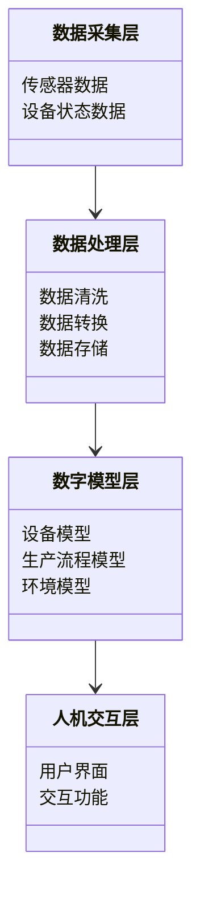
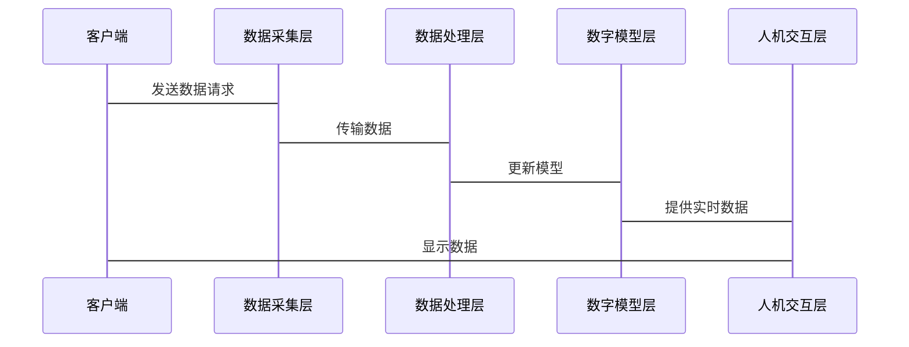

                 


# 价值投资中的智能工厂数字孪生系统分析

## 关键词：数字孪生系统、价值投资、智能工厂、机器学习、工厂管理

## 摘要：本文将探讨数字孪生系统在智能工厂中的应用，特别是其在价值投资分析中的潜在价值。通过详细分析数字孪生系统的定义、架构、算法原理，以及其在工厂管理中的应用，本文旨在揭示数字孪生技术如何帮助投资者做出更明智的决策。文章还包括实际项目案例分析和最佳实践建议，为读者提供全面的指导。

---

# 第一部分: 数字孪生系统与价值投资的结合

## 第1章: 数字孪生系统的定义与价值投资的背景

### 1.1 数字孪生系统的定义

#### 1.1.1 数字孪生系统的概念
数字孪生系统是一种通过数字化技术创建物理对象的虚拟模型，并实时同步数据的系统。它能够模拟物理对象的行为、环境和变化，从而提供实时的数据分析和决策支持。

#### 1.1.2 数字孪生系统的组成部分
- **数据采集层**: 负责从物理对象中采集实时数据，包括传感器数据、设备状态等。
- **数据处理层**: 对采集的数据进行清洗、转换和存储，确保数据的准确性和可用性。
- **数字模型层**: 基于数据构建虚拟模型，模拟物理对象的行为和变化。
- **人机交互层**: 提供用户界面，方便用户与数字模型进行交互。

#### 1.1.3 数字孪生系统的应用领域
- 制造业: 优化生产流程、设备维护等。
- 建筑业: 建筑设计、施工和运营的数字化管理。
- 医疗领域: 模拟人体生理过程和治疗方案。

### 1.2 价值投资的基本原理

#### 1.2.1 价值投资的核心理念
价值投资是一种投资策略，旨在通过分析企业的基本面（如财务状况、盈利能力、竞争优势等）来评估其内在价值，从而在低于其内在价值时买入。

#### 1.2.2 价值投资在企业评估中的应用
- 财务分析: 利润表、资产负债表、现金流量表的分析。
- 企业竞争力分析: 市场份额、技术创新能力、管理团队等。

#### 1.2.3 价值投资与智能工厂的结合
智能工厂的数字孪生系统能够提供实时的生产数据和设备状态，帮助企业优化生产流程、降低成本、提高效率，从而增强企业的竞争优势和内在价值。

### 1.3 数字孪生系统与价值投资的结合

#### 1.3.1 数字孪生系统在工厂管理中的作用
- 实时监控生产过程，优化资源配置。
- 预测设备故障，减少停机时间，降低成本。
- 模拟不同生产场景，评估其对利润的影响。

#### 1.3.2 数字孪生系统如何支持价值评估
- 提供实时的生产数据，帮助评估企业的运营效率和成本控制能力。
- 模拟不同生产策略对企业价值的影响，支持投资决策。

#### 1.3.3 数字孪生系统在价值投资中的潜在价值
- 帮助投资者更准确地评估企业的内在价值。
- 提供实时数据支持，增强投资决策的科学性和及时性。

### 1.4 本章小结
本章介绍了数字孪生系统的定义和组成部分，以及价值投资的基本原理。通过分析数字孪生系统在智能工厂中的应用，揭示了其在价值投资中的潜在价值。

---

## 第2章: 智能工厂的数字孪生系统架构

### 2.1 数字孪生系统的整体架构

#### 2.1.1 数据采集层
- **传感器数据**: 包括温度、压力、振动等设备状态数据。
- **设备状态数据**: 包括设备运行状态、故障信息等。

#### 2.1.2 数据处理层
- **数据清洗**: 去除噪声数据，确保数据的准确性。
- **数据转换**: 将原始数据转换为适合分析的格式。
- **数据存储**: 存储在数据库中，供后续分析使用。

#### 2.1.3 数字模型层
- **设备模型**: 包括设备的物理特性和运行状态的虚拟表示。
- **生产流程模型**: 包括生产流程的虚拟表示，用于模拟和优化生产过程。

#### 2.1.4 人机交互层
- **用户界面**: 提供直观的可视化界面，方便用户操作。
- **交互功能**: 包括数据查询、模型模拟、决策支持等。

### 2.2 智能工厂的数字孪生系统组成

#### 2.2.1 工厂设备的数字孪生模型
- **设备模型**: 包括设备的物理特性和运行状态的虚拟表示。
- **设备状态监控**: 实时监控设备的运行状态，预测设备故障。

#### 2.2.2 生产流程的数字孪生模型
- **生产流程模拟**: 模拟不同的生产场景，优化生产流程。
- **资源分配优化**: 优化资源分配，降低成本。

#### 2.2.3 工厂环境的数字孪生模型
- **环境模型**: 包括工厂的布局、设备摆放等的虚拟表示。
- **环境监控**: 实时监控工厂的环境参数，如温度、湿度等。

### 2.3 数字孪生系统与智能工厂的交互

#### 2.3.1 实时数据的采集与传输
- **数据采集**: 通过传感器采集实时数据。
- **数据传输**: 将数据传输到数据处理层进行处理。

#### 2.3.2 数字模型的动态更新
- **模型更新**: 根据实时数据动态更新数字模型。
- **模型维护**: 定期维护数字模型，确保其准确性和有效性。

#### 2.3.3 人机交互的实现方式
- **可视化界面**: 提供直观的可视化界面，方便用户操作。
- **交互功能**: 包括数据查询、模型模拟、决策支持等。

### 2.4 本章小结
本章详细介绍了智能工厂的数字孪生系统的整体架构和组成部分，包括数据采集层、数据处理层、数字模型层和人机交互层。

---

## 第3章: 数字孪生系统的算法原理

### 3.1 数据分析与建模

#### 3.1.1 数据预处理
- **数据清洗**: 去除噪声数据，确保数据的准确性。
- **数据转换**: 将原始数据转换为适合分析的格式。

#### 3.1.2 数据建模方法
- **回归分析**: 用于预测设备故障时间、生产成本等。
- **时间序列分析**: 用于预测未来生产情况。
- **机器学习算法**: 如支持向量机、神经网络等。

#### 3.1.3 模型评估与优化
- **模型评估**: 使用交叉验证等方法评估模型的性能。
- **模型优化**: 调整模型参数，提高预测准确性。

### 3.2 基于机器学习的预测算法

#### 3.2.1 线性回归算法
- **线性回归模型**: 用于预测连续变量。
- **数学公式**: $$ y = \beta_0 + \beta_1x + \epsilon $$

#### 3.2.2 支持向量机算法
- **支持向量机模型**: 用于分类和回归问题。
- **数学公式**: $$ y = sign(\sum_{i=1}^n \alpha_i y_i x_i \cdot x + b) $$

#### 3.2.3 神经网络算法
- **神经网络模型**: 用于复杂非线性关系的建模。
- **数学公式**: $$ y = f(Wx + b) $$，其中 $$ f $$ 是激活函数。

### 3.3 数字孪生系统的算法实现

#### 3.3.1 数据流的处理流程
1. 数据采集
2. 数据预处理
3. 数据建模
4. 模型训练
5. 模型部署

#### 3.3.2 算法的选择与实现
- **算法选择**: 根据数据类型和问题需求选择合适的算法。
- **算法实现**: 使用Python、TensorFlow等工具实现算法。

#### 3.3.3 模型的训练与部署
- **模型训练**: 使用训练数据训练模型。
- **模型部署**: 将模型部署到生产环境，实时处理数据。

### 3.4 本章小结
本章介绍了数字孪生系统中常用的算法原理，包括线性回归、支持向量机和神经网络，并详细讲解了它们的数学公式和实现方法。

---

## 第4章: 数字孪生系统的数学模型与公式

### 4.1 数据分析的数学模型

#### 4.1.1 回归分析模型
- **简单线性回归模型**: $$ y = \beta_0 + \beta_1x + \epsilon $$
- **多元线性回归模型**: $$ y = \beta_0 + \beta_1x_1 + \beta_2x_2 + \dots + \beta_nx_n + \epsilon $$

#### 4.1.2 时间序列分析模型
- **ARIMA模型**: $$ ARIMA(p, d, q) $$
- **指数平滑模型**: $$ S_t = \alpha y_t + (1-\alpha)S_{t-1} $$

#### 4.1.3 聚类分析模型
- **K-means算法**: 将数据划分为K个簇。
- **层次聚类算法**: 基于层次结构进行聚类。

### 4.2 数字孪生系统的数学公式

#### 4.2.1 线性回归公式
$$ y = \beta_0 + \beta_1x + \epsilon $$

#### 4.2.2 时间序列模型公式
$$ ARIMA(p, d, q) $$

#### 4.2.3 神经网络模型公式
$$ y = f(Wx + b) $$

### 4.3 本章小结
本章详细介绍了数字孪生系统中常用的数学模型和公式，包括回归分析、时间序列分析和神经网络模型。

---

## 第5章: 数字孪生系统的系统架构设计

### 5.1 问题场景介绍
- **背景**: 智能工厂的复杂生产环境需要实时监控和优化。
- **问题**: 如何通过数字孪生系统实现对工厂的实时监控和优化。

### 5.2 项目介绍
- **项目目标**: 实现智能工厂的数字孪生系统，支持实时监控和优化生产流程。
- **项目范围**: 包括数据采集、数据处理、模型构建、人机交互等模块。

### 5.3 系统功能设计

#### 5.3.1 领域模型（Mermaid类图）


### 5.4 系统架构设计（Mermaid架构图）


### 5.5 系统接口设计
- **数据接口**: 数据采集层与数据处理层之间的接口。
- **模型接口**: 数字模型层与人机交互层之间的接口。

### 5.6 系统交互设计（Mermaid序列图）


### 5.7 本章小结
本章详细介绍了数字孪生系统的系统架构设计，包括领域模型、系统架构图、接口设计和系统交互设计。

---

## 第6章: 数字孪生系统的项目实战

### 6.1 环境安装
- **工具安装**: 安装Python、TensorFlow、Mermaid等工具。
- **数据采集层**: 配置传感器和设备数据采集工具。
- **数据处理层**: 安装数据库和数据处理工具。
- **数字模型层**: 安装机器学习框架和建模工具。
- **人机交互层**: 配置可视化工具和用户界面。

### 6.2 系统核心实现源代码
#### 6.2.1 数据采集代码
```python
import serial

ser = serial.Serial('COM1', 9600)
data = ser.readline().decode().strip()
print(data)
```

#### 6.2.2 数据处理代码
```python
import pandas as pd

# 数据清洗
data = pd.read_csv('data.csv')
data.dropna(inplace=True)
data.to_csv('clean_data.csv', index=False)
```

#### 6.2.3 模型构建代码
```python
from sklearn.linear_model import LinearRegression

model = LinearRegression()
model.fit(X_train, y_train)
y_pred = model.predict(X_test)
```

#### 6.2.4 人机交互代码
```python
import matplotlib.pyplot as plt

plt.plot(data.index, data['value'])
plt.show()
```

### 6.3 代码应用解读与分析
- **数据采集代码**: 使用串口读取设备数据。
- **数据处理代码**: 使用Pandas进行数据清洗和存储。
- **模型构建代码**: 使用Scikit-learn进行线性回归建模。
- **人机交互代码**: 使用Matplotlib进行数据可视化。

### 6.4 实际案例分析
- **案例背景**: 某智能工厂的生产效率分析。
- **数据采集**: 采集设备运行状态和生产数据。
- **模型构建**: 使用线性回归模型预测生产成本。
- **结果分析**: 基于模型结果优化生产流程。

### 6.5 本章小结
本章通过实际案例展示了数字孪生系统的实现过程，包括环境配置、代码实现、案例分析等。

---

## 第7章: 数字孪生系统的最佳实践与注意事项

### 7.1 最佳实践
- **数据质量管理**: 确保数据的准确性和完整性。
- **模型优化**: 定期优化模型，提高预测准确性。
- **系统维护**: 定期维护系统，确保其稳定运行。
- **数据隐私**: 注意数据隐私保护，避免数据泄露。

### 7.2 小结
本章总结了数字孪生系统在实际应用中的最佳实践和注意事项，帮助读者更好地应用数字孪生技术。

### 7.3 注意事项
- **数据隐私**: 注意数据的隐私保护，遵守相关法律法规。
- **系统安全性**: 确保系统的安全性，防止数据被篡改或攻击。
- **模型解释性**: 确保模型的可解释性，方便理解和优化。

### 7.4 拓展阅读
- **推荐书籍**: 《机器学习实战》、《数据挖掘导论》
- **推荐论文**: 关于数字孪生系统在制造业中的应用研究。

### 7.5 本章小结
本章总结了数字孪生系统的最佳实践和注意事项，并提供了进一步阅读的建议。

---

## 作者：AI天才研究院/AI Genius Institute & 禅与计算机程序设计艺术 /Zen And The Art of Computer Programming

