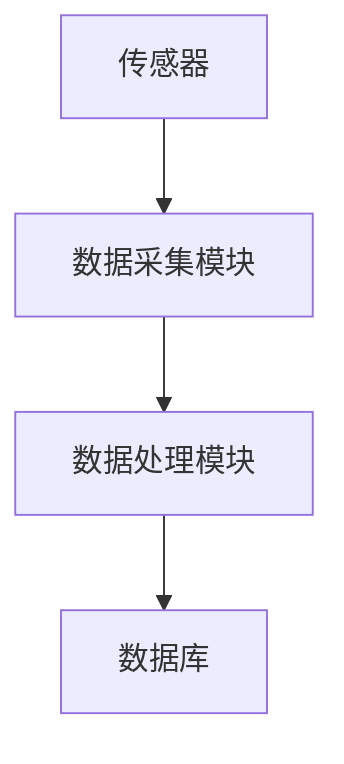
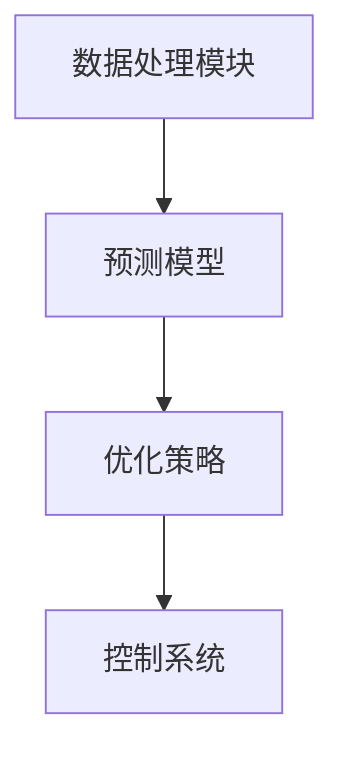

                 


# 《价值投资中的智能工厂能源管理系统分析》

---

## 关键词：
智能工厂，能源管理系统，价值投资，能源优化，工业4.0

---

## 摘要：
本文从价值投资的视角，深入分析智能工厂能源管理系统的构建与优化。通过系统化的背景介绍、核心概念解析、算法原理阐述、系统架构设计以及项目实战分析，揭示智能工厂能源管理系统在制造业中的应用价值和投资潜力。文章结合理论与实践，为投资者和技术人员提供深度的技术与商业洞见。

---

## 第一章: 智能工厂能源管理系统的背景与价值投资概述

### 1.1 智能工厂能源管理系统的背景
#### 1.1.1 工业4.0与智能工厂的兴起
- 工业4.0的核心理念
- 智能工厂的定义与特征
- 能源管理在智能工厂中的重要性

#### 1.1.2 能源管理系统的演变
- 传统能源管理系统的局限性
- 智能化能源管理系统的出现
- 数字化与智能化的结合

#### 1.1.3 价值投资视角下的能源管理系统
- 价值投资的基本概念
- 能源管理系统对企业的价值
- 投资者关注的焦点

### 1.2 智能工厂能源管理系统的核心问题
#### 1.2.1 能源消耗的实时监控与优化
- 数据采集与处理的关键性
- 实时监控的实现方法
- 能耗预测与优化策略

#### 1.2.2 系统的智能化与可扩展性
- AI在能源管理中的应用
- 系统的可扩展性设计
- 与企业其他系统的集成

#### 1.2.3 价值投资中的关键指标
- 投资回报率（ROI）的计算
- 系统的经济效益分析
- 投资风险与收益平衡

### 1.3 本章小结
- 智能工厂能源管理系统的背景与重要性
- 价值投资视角下的关键问题
- 后续章节的分析框架

---

## 第二章: 智能工厂能源管理系统的核心概念与技术

### 2.1 智能工厂能源管理系统的概念体系
#### 2.1.1 系统的核心概念
- 数据采集与处理
- 能源消耗预测
- 实时监控与反馈

#### 2.1.2 系统的关键属性
- 实时性
- 准确性
- 可扩展性

#### 2.1.3 系统的边界与外延
- 数据源的范围
- 系统的功能范围
- 与其他系统的接口关系

### 2.2 系统的核心技术与算法
#### 2.2.1 数据采集与处理技术
- IoT传感器的应用
- 数据清洗与预处理
- 数据存储与管理

#### 2.2.2 能源消耗预测算法
- 时间序列分析
- 机器学习模型（如LSTM）
- 算法实现与优化

#### 2.2.3 系统优化与控制策略
- 基于预测的优化控制
- 多目标优化算法
- 实时反馈与调整

### 2.3 系统的数学模型与公式
#### 2.3.1 能源消耗预测模型
- 线性回归模型：
  $$ y = \beta_0 + \beta_1x + \epsilon $$
- 时间序列模型：
  $$ ARIMA(p, d, q) $$

#### 2.3.2 优化控制模型
- 基于能耗预测的优化公式：
  $$ \min \sum_{i=1}^{n} (E_i - E_{opt})^2 $$

### 2.4 本章小结
- 核心概念的系统化定义
- 关键技术与算法的详细分析
- 数学模型的建立与应用

---

## 第三章: 智能工厂能源管理系统的算法原理与实现

### 3.1 数据采集与处理算法
#### 3.1.1 数据采集流程
- 传感器数据采集
- 数据传输与存储
- 数据清洗与预处理

#### 3.1.2 数据处理的算法实现
- 使用Python的Pandas库进行数据清洗
- 示例代码：
  ```python
  import pandas as pd
  # 数据加载
  df = pd.read_csv('energy_data.csv')
  # 数据清洗
  df.dropna(inplace=True)
  df['timestamp'] = pd.to_datetime(df['timestamp'])
  ```

### 3.2 能源消耗预测算法
#### 3.2.1 基于LSTM的预测模型
- LSTM网络结构
- 示例代码：
  ```python
  from keras.layers import LSTM, Dense
  model = Sequential()
  model.add(LSTM(64, input_shape=(timesteps, features)))
  model.add(Dense(1))
  model.compile(loss='mean_squared_error', optimizer='adam')
  ```

#### 3.2.2 算法优化策略
- 超参数优化
- 模型评估与验证
- 示例代码：
  ```python
  from sklearn.model_selection import GridSearchCV
  param_grid = {'n_neighbors': [3, 5, 7]}
  grid = GridSearchCV(knn, param_grid, cv=5)
  grid.fit(X_train, y_train)
  ```

### 3.3 系统优化与控制算法
#### 3.3.1 基于预测的优化策略
- 实时调整与优化
- 示例代码：
  ```python
  def optimize_energy_consumption(predicted_usage):
      current_usage = get_current_usage()
      if predicted_usage > current_usage:
          increase_efficiency()
      else:
          maintain_usage()
  ```

#### 3.3.2 多目标优化算法
- 基于粒子群优化（PSO）
- 示例代码：
  ```python
  import numpy as np
  def objective_function(x):
      return x[0]**2 + x[1]**2
  ```

### 3.4 本章小结
- 数据采集与处理算法的实现
- 基于机器学习的能源预测算法
- 优化控制算法的设计与实现

---

## 第四章: 智能工厂能源管理系统的系统架构与设计

### 4.1 系统架构设计
#### 4.1.1 系统整体架构
- 分层架构设计
- 示例架构图：
  ```mermaid
  graph TD
      A[用户界面] --> B[数据采集模块]
      B --> C[数据处理模块]
      C --> D[预测与优化模块]
      D --> E[控制系统]
  ```

#### 4.1.2 模块划分与功能说明
- 数据采集模块
- 数据处理模块
- 预测与优化模块
- 控制系统模块

### 4.2 系统功能设计
#### 4.2.1 数据采集与处理
- 实时数据采集
- 数据存储与管理
- 数据可视化

#### 4.2.2 能源消耗预测与优化
- 预测模型的实现
- 优化策略的制定
- 系统反馈与调整

#### 4.2.3 系统控制与反馈
- 控制策略的执行
- 系统反馈机制
- 性能监控与评估

### 4.3 系统接口设计
#### 4.3.1 系统内部接口
- 数据接口
- 控制接口
- 通信接口

#### 4.3.2 系统外部接口
- 与工厂管理系统的接口
- 与能源供应商的接口
- 用户界面接口

### 4.4 系统交互流程图
#### 4.4.1 数据采集与处理流程


#### 4.4.2 预测与优化流程


### 4.5 本章小结
- 系统架构的分层设计
- 各模块的功能与交互
- 系统接口与通信机制

---

## 第五章: 项目实战与价值分析

### 5.1 项目背景与目标
#### 5.1.1 项目背景
- 某智能工厂的能源管理需求
- 项目目标
- 项目范围

### 5.2 项目环境与工具安装
#### 5.2.1 环境配置
- 操作系统与版本
- 软件工具安装
- 开发环境配置

#### 5.2.2 工具安装
- Python与相关库（如Pandas、TensorFlow）
- 数据库安装与配置
- 传感器与IoT设备连接

### 5.3 系统核心功能实现
#### 5.3.1 数据采集模块实现
- 代码示例：
  ```python
  import serial
  ser = serial.Serial('COM3', 9600)
  data = ser.readline().decode()
  ```

#### 5.3.2 能源预测模型实现
- 代码示例：
  ```python
  from sklearn.linear_model import LinearRegression
  model = LinearRegression()
  model.fit(X_train, y_train)
  ```

#### 5.3.3 优化控制策略实现
- 代码示例：
  ```python
  def optimize_usage(predicted_usage):
      current_usage = get_current_usage()
      if predicted_usage < current_usage:
          decrease_usage()
      else:
          increase_usage()
  ```

### 5.4 项目案例分析
#### 5.4.1 实际案例分析
- 数据分析与处理
- 预测模型的验证
- 优化策略的效果评估

#### 5.4.2 投资回报分析
- 经济效益评估
- 投资回收期计算
- 风险与收益平衡分析

### 5.5 本章小结
- 项目实战的详细过程
- 系统功能的实现细节
- 投资回报与价值分析

---

## 第六章: 系统优化与价值投资建议

### 6.1 系统优化建议
#### 6.1.1 系统功能优化
- 数据处理的优化
- 预测算法的优化
- 控制策略的优化

#### 6.1.2 系统性能优化
- 计算效率提升
- 数据存储优化
- 系统稳定性提升

### 6.2 价值投资建议
#### 6.2.1 企业投资建议
- 技术可行性评估
- 经济效益分析
- 投资风险评估

#### 6.2.2 投资者策略建议
- 选择优质企业
- 关注技术壁垒
- 长期投资价值

### 6.3 本章小结
- 系统优化的方向与建议
- 投资者的价值分析与建议
- 后续研究方向

---

## 第七章: 总结与展望

### 7.1 本章总结
- 智能工厂能源管理系统的背景与重要性
- 核心概念与技术的详细分析
- 项目实战与价值投资的分析

### 7.2 未来展望
- 技术发展的趋势
- 市场需求的变化
- 投资机会的展望

### 7.3 本章小结
- 本文的主要内容与结论
- 对未来研究与实践的展望

---

## 作者：AI天才研究院 & 禅与计算机程序设计艺术

