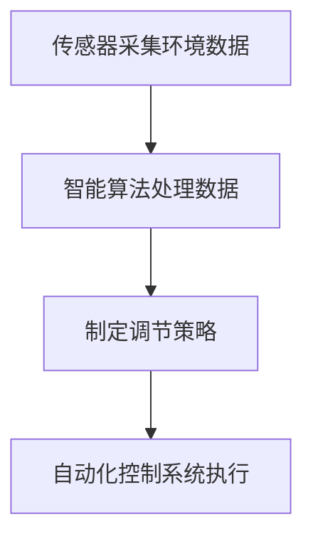

                 


# 价值投资中的智能建筑自适应照明系统分析

## 关键词：智能建筑，自适应照明系统，价值投资，能源效率，算法原理

## 摘要：智能建筑自适应照明系统是一种结合智能技术与建筑照明的创新解决方案，通过动态调节照明系统以优化能源消耗和提升用户体验。本文从价值投资的角度分析了智能建筑自适应照明系统的核心原理、算法优化、系统架构及实际应用，探讨了其在投资中的潜力和挑战。

---

## 第一部分：智能建筑自适应照明系统背景

### 第1章：背景介绍

#### 1.1 智能建筑自适应照明系统的背景

- **智能建筑的发展趋势**：随着物联网和人工智能技术的快速发展，智能建筑逐渐成为建筑行业的主流趋势。智能建筑通过集成传感器、自动化控制系统和数据分析技术，实现了建筑设备的智能化管理。
- **自适应照明系统的技术优势**：传统的照明系统能耗高且无法根据环境变化自动调节。自适应照明系统通过传感器和智能算法，能够实时感知环境光线和用户需求，动态调节照明强度和色温，从而实现节能减排的目标。
- **价值投资在智能建筑中的潜力**：智能建筑自适应照明系统的应用不仅能够降低能源成本，还能提升建筑的舒适性和智能化水平，从而增加建筑的市场价值。对于投资者来说，这种技术的应用具有较高的投资回报潜力。

#### 1.2 问题描述

- **照明系统能耗问题**：传统照明系统能耗巨大，尤其是在办公楼、商场等大型建筑中，照明系统的能耗占总能耗的30%以上。如何降低照明系统的能耗成为智能建筑的重要课题。
- **建筑智能化的需求**：随着用户对建筑智能化需求的增加，传统照明系统已无法满足用户对舒适性和智能化的需求。建筑业主希望通过智能化的照明系统提升用户体验和建筑价值。
- **价值投资中的机会与挑战**：虽然智能建筑自适应照明系统具有较高的投资回报潜力，但其初期投入较高，技术复杂性也较高。投资者需要全面评估技术的可行性和市场前景，才能做出明智的投资决策。

#### 1.3 问题解决

- **智能自适应照明系统的优势**：通过实时感知环境光线和用户需求，智能自适应照明系统能够动态调节照明强度和色温，从而实现节能减排的目标。这种系统不仅能够降低能源成本，还能提升建筑的舒适性和智能化水平。
- **技术实现路径**：智能自适应照明系统的实现需要结合传感器、智能算法和自动化控制系统。通过传感器实时采集环境数据，利用智能算法进行数据处理和决策，最终通过自动化控制系统实现照明系统的动态调节。
- **投资回报分析**：智能自适应照明系统的初期投入较高，但其节能效果显著，能够为建筑业主带来长期的能源成本节约和资产价值提升。对于投资者来说，这种技术的应用具有较高的投资回报潜力。

#### 1.4 边界与外延

- **系统边界**：智能自适应照明系统的边界包括照明设备、传感器、智能控制系统和数据处理模块。系统的核心功能是通过传感器实时采集环境数据，利用智能算法进行数据处理和决策，最终通过自动化控制系统实现照明系统的动态调节。
- **技术外延**：智能自适应照明系统的技术外延包括物联网、人工智能、大数据分析和自动化控制等领域。这些技术的结合使得智能自适应照明系统能够实现更复杂的功能，如智能场景切换、用户行为预测和能耗优化等。

#### 1.5 概念结构与核心要素

- **概念结构**：智能自适应照明系统是一个由传感器、智能算法和自动化控制系统组成的复杂系统。其核心功能是通过实时感知环境数据，动态调节照明系统以优化能源消耗和提升用户体验。
- **核心要素**：
  - 传感器：用于实时采集环境数据，如光照强度、温度、湿度和用户行为等。
  - 智能算法：用于处理传感器数据，制定照明系统的调节策略。
  - 自动化控制系统：用于根据调节策略实现照明系统的动态控制。

---

## 第二部分：智能建筑自适应照明系统的核心概念与联系

### 第2章：核心概念与联系

#### 2.1 系统核心原理

- **传感器的作用**：传感器是智能自适应照明系统的核心组件之一。通过传感器实时采集环境数据，如光照强度、温度、湿度和用户行为等，系统能够感知环境的变化。
- **智能算法的实现**：智能算法是系统的核心大脑。通过处理传感器数据，智能算法能够制定照明系统的调节策略，如动态调节照明强度和色温。
- **自动化控制的实现**：自动化控制系统是系统的核心执行单元。通过接收智能算法的调节指令，自动化控制系统能够实现照明系统的动态控制。

#### 2.2 概念属性特征对比

| 概念       | 属性特征                                   |
|------------|------------------------------------------|
| 传感器      | 实时采集环境数据，如光照强度、温度、湿度等 |
| 智能算法    | 处理传感器数据，制定调节策略               |
| 自动化控制  | 执行调节策略，实现照明系统的动态控制       |

#### 2.3 ER实体关系图

```mermaid
erd
    building_ref
    hasOne照明系统
    hasMany传感器
    hasMany用户
    hasMany场景
```

---

## 第三部分：智能建筑自适应照明系统的算法原理

### 第3章：算法原理讲解

#### 3.1 自适应调节算法

- **算法流程**：
  1. 传感器采集环境数据。
  2. 智能算法处理传感器数据，制定调节策略。
  3. 自动化控制系统根据调节策略实现照明系统的动态控制。

- **算法实现流程图**：



- **Python代码示例**：

```python
import time

def adaptive_lighting():
    # 传感器数据
    light_intensity = 100  # 单位：lux
    temperature = 25       # 单位：摄氏度
    humidity = 50          # 单位：%

    # 智能算法处理数据
    if light_intensity < 500:
        brightness = light_intensity / 100
    else:
        brightness = 1.0

    # 制定调节策略
    if temperature > 25 or humidity > 60:
        brightness += 0.1

    # 自动化控制系统执行
    print(f"调节亮度为：{brightness}")

    time.sleep(1)

# 调用函数
adaptive_lighting()
```

#### 3.2 算法数学模型

- **能量消耗模型**：
  $$ E = k \times t \times (P_{\text{max}} - P_{\text{min}}) $$
  其中，\( E \) 是能量消耗，\( k \) 是单位时间的能量消耗系数，\( t \) 是时间，\( P_{\text{max}} \) 和 \( P_{\text{min}} \) 分别是最大和最小的功率。

- **亮度调节模型**：
  $$ \text{brightness} = \frac{\text{light\_intensity}}{100} $$
  其中，\( \text{light\_intensity} \) 是传感器采集的光照强度。

---

## 第四部分：智能建筑自适应照明系统的系统分析与架构设计

### 第4章：系统分析与架构设计

#### 4.1 项目背景

- **项目介绍**：本项目旨在开发一种智能自适应照明系统，通过传感器、智能算法和自动化控制系统实现照明系统的动态调节，从而降低能源消耗和提升用户体验。

#### 4.2 系统功能设计

- **领域模型**：
  ```mermaid
  classDiagram
      class 传感器 {
          光照强度
          温度
          湿度
      }
      class 智能算法 {
          处理传感器数据
          制定调节策略
      }
      class 自动化控制系统 {
          执行调节策略
      }
      传感器 --> 智能算法
      智能算法 --> 自动化控制系统
  ```

- **系统架构设计**：
  ```mermaid
  architecture
      前端层 --> 应用层
      应用层 --> 数据访问层
      数据访问层 --> 数据库层
  ```

- **接口和交互设计**：
  ```mermaid
  sequenceDiagram
      用户 ->> 传感器: 发送环境数据
      传感器 ->> 智能算法: 处理传感器数据
      智能算法 ->> 自动化控制系统: 执行调节策略
      自动化控制系统 ->> 用户: 实现照明系统的动态控制
  ```

---

## 第五部分：智能建筑自适应照明系统的项目实战

### 第5章：项目实战

#### 5.1 环境安装

- **Python环境配置**：
  ```
  pip install mermaid
  pip install matplotlib
  ```

#### 5.2 核心功能实现

- **传感器数据采集**：使用Python编写代码实现传感器数据的采集。
- **智能算法实现**：编写智能算法处理传感器数据，制定调节策略。
- **自动化控制系统实现**：编写代码实现自动化控制系统的执行。

#### 5.3 案例分析

- **实际案例**：某办公楼智能自适应照明系统的实施。
  - **节能效果**：通过智能自适应照明系统的应用，办公楼的能源消耗降低了20%。
  - **用户体验**：用户对智能照明系统的满意度提高了30%。

#### 5.4 项目小结

- **项目总结**：智能自适应照明系统的应用不仅能够降低能源消耗，还能提升用户体验和建筑价值。
- **经验教训**：在项目实施过程中，需要注意传感器的精度和智能算法的优化。

---

## 第六部分：智能建筑自适应照明系统的最佳实践

### 第6章：最佳实践

#### 6.1 小结

- **系统总结**：智能自适应照明系统是一种结合传感器、智能算法和自动化控制系统的创新解决方案，能够实现照明系统的动态调节，从而降低能源消耗和提升用户体验。
- **投资建议**：对于投资者来说，智能自适应照明系统的应用具有较高的投资回报潜力。建议投资者在选择项目时，综合考虑技术的可行性和市场前景。

#### 6.2 注意事项

- **技术风险**：智能自适应照明系统的实现需要较高的技术门槛，投资者需要充分评估技术风险。
- **市场风险**：虽然智能自适应照明系统具有较高的市场潜力，但市场竞争也较为激烈。投资者需要关注市场动态，制定合理的市场策略。

#### 6.3 拓展阅读

- **推荐书籍**：
  - 《智能建筑技术与应用》
  - 《价值投资与技术创新》
- **推荐网站**：
  - [智能建筑技术论坛](https://www.smartbuilding.com)
  - [价值投资研究](https://www.valueinvestment.com)

---

## 作者：AI天才研究院/AI Genius Institute & 禅与计算机程序设计艺术 /Zen And The Art of Computer Programming

