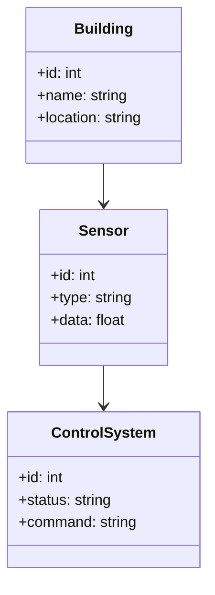
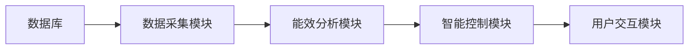
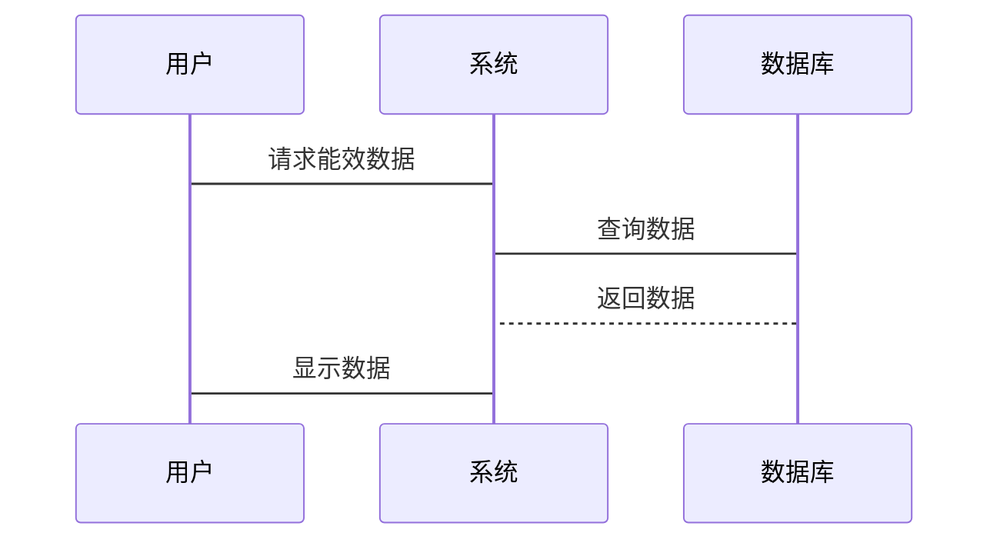

                 


# 价值投资中的智能建筑节能系统分析

## 关键词：智能建筑节能系统、价值投资、能效评估、系统架构、投资回报分析

## 摘要

本文深入分析了智能建筑节能系统在价值投资中的应用，探讨了系统的核心概念、能效评估算法、系统架构设计以及实际项目案例。通过构建概念模型和详细的技术分析，本文为投资者提供了基于技术与经济双重维度的决策支持，助力实现可持续发展和投资回报最大化。

---

## 第一部分: 价值投资中的智能建筑节能系统背景与概念

### 第1章: 智能建筑节能系统概述

#### 1.1 智能建筑节能的背景与意义

智能建筑节能系统是指通过智能化技术优化建筑能源使用效率，减少能源浪费，从而降低运营成本并实现可持续发展的系统。随着全球能源危机和环保压力的加剧，建筑行业成为节能减排的重要领域。智能建筑节能系统的应用不仅能够降低建筑的能耗，还能提高其市场价值，成为价值投资者关注的重点。

##### 1.1.1 建筑节能的背景与现状

建筑行业是全球能源消耗的主要领域之一，约占全球总能耗的40%。随着城市化进程的加快，建筑数量急剧增加，能源消耗问题日益突出。传统建筑的高能耗问题主要体现在供暖、照明和设备运行等方面。通过智能化技术优化能源使用，已经成为建筑行业节能减排的重要方向。

##### 1.1.2 智能建筑的概念与特点

智能建筑是指通过物联网、大数据和人工智能等技术，实现建筑设备、设施和空间的智能化管理，从而提高能源使用效率和用户体验。智能建筑的核心特点包括：

- **智能化管理**：通过传感器和控制器实现建筑设备的自动化控制。
- **数据驱动优化**：基于实时数据进行能效分析和优化。
- **用户友好**：通过智能终端提供便捷的用户交互体验。
- **可持续发展**：通过节能减排实现环境和经济效益的双重目标。

##### 1.1.3 价值投资在智能建筑节能中的应用逻辑

价值投资的核心在于通过深入分析目标资产的内在价值，找到被市场低估的投资机会。在智能建筑节能领域，价值投资者需要关注以下几个方面：

1. **技术可行性**：评估智能节能系统的技术成熟度和实际效果。
2. **经济性**：分析系统的投资成本、运行成本和收益能力。
3. **市场前景**：考察智能建筑节能技术的市场需求和未来发展趋势。

通过以上分析，投资者可以找到具备技术优势、成本效益和市场潜力的智能建筑节能项目，实现长期稳定的收益。

---

#### 1.2 智能建筑节能系统的核心概念

##### 1.2.1 系统定义与组成

智能建筑节能系统是一个集成化的管理平台，通过实时监测、分析和优化建筑的能源使用情况，实现节能减排的目标。其核心组成部分包括：

- **数据采集模块**：通过传感器收集建筑内的能耗数据、环境数据等。
- **能效分析模块**：基于数据进行能效评估和优化建议。
- **智能控制模块**：根据分析结果自动调整设备运行状态。
- **用户交互模块**：为用户提供实时数据和操作界面。

##### 1.2.2 节能技术与价值投资的结合

智能建筑节能系统的技术优势在于其能够通过数据驱动的方式实现精准的能效管理。对于投资者而言，这意味着：

- **降低运营成本**：通过优化能源使用，减少电费、维护费等运营成本。
- **提高资产价值**：具备高效节能特性的建筑在市场中更具竞争力，能够吸引更多的租户和投资者。
- **政策支持**：许多国家和地区对绿色建筑和节能技术给予政策支持和财政补贴。

##### 1.2.3 智能建筑节能系统的边界与外延

智能建筑节能系统的边界主要集中在建筑内部的设备和系统，但其外延可以扩展到能源管理、环境保护等领域。例如，通过与可再生能源（如太阳能、风能）结合，智能建筑节能系统可以进一步提高能源使用效率，降低碳排放。

---

#### 1.3 智能建筑节能系统的核心要素

##### 1.3.1 能源管理模块

能源管理模块是智能建筑节能系统的核心组成部分，负责实时监测和管理建筑的能源使用情况。其主要功能包括：

- **数据采集**：通过传感器收集电力、燃气、水等能源的使用数据。
- **能效分析**：基于数据进行能效评估，识别能源浪费点。
- **优化建议**：根据分析结果提供能源管理优化建议。

##### 1.3.2 智能控制模块

智能控制模块负责根据能效分析的结果，自动调整建筑设备的运行状态。例如，当检测到某个区域的能耗过高时，系统可以自动降低该区域的照明亮度或调节空调温度。

##### 1.3.3 数据采集与分析模块

数据采集与分析模块是系统的基础，负责采集建筑内的各种数据，并通过大数据分析技术提取有用的信息，为能效优化提供支持。

---

## 第二部分: 智能建筑节能系统的概念模型

### 第2章: 智能建筑节能系统的概念模型

#### 2.1 概念模型的构建

##### 2.1.1 系统功能模块化分析

智能建筑节能系统的概念模型可以分为以下几个功能模块：

1. **数据采集模块**：负责采集建筑内的能耗数据。
2. **能效分析模块**：对数据进行分析，评估能效水平。
3. **智能控制模块**：根据分析结果优化设备运行。
4. **用户交互模块**：为用户提供数据和操作界面。

##### 2.1.2 模块之间的关系与依赖

模块之间的关系可以用以下几点来描述：

- 数据采集模块向能效分析模块提供数据。
- 能效分析模块向智能控制模块提供优化建议。
- 智能控制模块向用户交互模块反馈优化结果。

##### 2.1.3 概念模型的可视化表示

概念模型可以通过流程图的形式进行可视化表示，如图2-1所示：


---

#### 2.2 智能建筑节能系统的ER实体关系图

智能建筑节能系统的ER实体关系图展示了系统中各实体之间的关系，如图2-2所示：

```mermaid
er
  Building
  EnergyUsage
  Sensor
  ControlSystem
  EnergySource
  link Building - Sensor
  link Sensor - EnergyUsage
  link EnergyUsage - ControlSystem
  link ControlSystem - EnergySource
```

---

#### 2.3 概念模型的属性特征对比表

以下是概念模型中各模块的属性特征对比表：

| 属性         | 数据采集模块 | 能效分析模块 | 智能控制模块 |
|--------------|--------------|--------------|--------------|
| 输入数据类型 | 传感器信号    | 能耗数据      | 优化建议      |
| 输出数据类型 | 原始数据      | 能效评估结果  | 设备控制指令    |
| 关键技术      | 数据采集技术  | 大数据分析    | 自动控制技术    |

---

## 第三部分: 能效评估算法的原理与实现

### 第3章: 能效评估算法的原理与实现

#### 3.1 算法原理

能效评估算法的核心在于通过数据分析技术，识别建筑中的能耗浪费点，并提出优化建议。常用的算法包括线性回归和机器学习算法。

##### 3.1.1 线性回归算法

线性回归是一种简单而有效的回归分析方法，适用于预测建筑能耗与某一变量（如温度、时间）之间的关系。其数学模型可以表示为：

$$ y = \beta_0 + \beta_1x + \epsilon $$

其中，$y$ 表示能耗，$x$ 表示自变量，$\beta_0$ 和 $\beta_1$ 是回归系数，$\epsilon$ 是误差项。

##### 3.1.2 机器学习算法

机器学习算法（如随机森林、神经网络）可以用于更复杂的能效评估场景，例如多变量预测和非线性关系建模。

---

#### 3.2 算法实现

以下是基于线性回归算法的能效评估代码示例：

```python
import numpy as np
from sklearn.linear_model import LinearRegression

# 生成模拟数据
X = np.array([0, 1, 2, 3, 4, 5]).reshape(-1, 1)
y = np.array([1, 3, 5, 7, 9, 11])

# 训练模型
model = LinearRegression()
model.fit(X, y)

# 预测结果
predicted = model.predict(X)
print("预测值:", predicted)
print("回归系数:", model.coef_)
print("截距:", model.intercept_)
```

---

#### 3.3 算法的优化与应用

通过对算法的优化（如引入正则化项），可以提高模型的泛化能力。优化后的模型可以更准确地预测能效，并为智能控制模块提供更精准的优化建议。

---

## 第四部分: 智能建筑节能系统的系统分析与架构设计

### 第4章: 系统分析与架构设计

#### 4.1 项目场景介绍

本项目旨在通过智能建筑节能系统优化某商业大厦的能源使用效率，降低运营成本，并为投资者提供价值回报。

#### 4.2 系统功能设计

##### 4.2.1 领域模型

系统功能的领域模型如图4-1所示：



#### 4.3 系统架构设计

##### 4.3.1 系统架构图

系统的架构图如图4-2所示：



#### 4.4 系统接口设计

##### 4.4.1 系统接口设计

系统接口设计包括数据接口和用户接口两部分：

- **数据接口**：用于与传感器和能源管理系统对接，实现实时数据的采集和传输。
- **用户接口**：提供直观的用户界面，方便用户查看能效数据和系统运行状态。

#### 4.5 系统交互设计

##### 4.5.1 系统交互流程图

系统交互流程图如图4-3所示：



---

## 第五部分: 项目实战——智能建筑节能系统的核心实现

### 第5章: 项目实战——智能建筑节能系统的核心实现

#### 5.1 环境安装

##### 5.1.1 系统环境要求

- 操作系统：Linux/Windows/MacOS
- 硬件要求：传感器、控制器、计算机
- 软件要求：Python 3.6+, 数据库（MySQL/PostgreSQL）, 机器学习库（scikit-learn）

#### 5.2 核心代码实现

##### 5.2.1 数据采集模块代码

```python
import serial

# 串口配置
ser = serial.Serial('COM3', 9600)

def read_sensor_data():
    if ser.is_open:
        data = ser.readline().decode().strip()
        return data
    else:
        return None
```

##### 5.2.2 能效分析模块代码

```python
import pandas as pd
from sklearn.linear_model import LinearRegression

# 数据预处理
data = pd.read_csv('energy_data.csv')
X = data[['temperature', 'time']]
y = data['energy_usage']

# 模型训练
model = LinearRegression()
model.fit(X, y)

# 模型预测
predictions = model.predict(X)
```

##### 5.2.3 智能控制模块代码

```python
import RPi.GPIO as GPIO

# GPIO配置
GPIO.setmode(GPIO.BCM)
GPIO.setup(17, GPIO.OUT)

def control_system(status):
    if status == 'on':
        GPIO.output(17, GPIO.HIGH)
    else:
        GPIO.output(17, GPIO.LOW)
```

#### 5.3 案例分析

##### 5.3.1 实际案例分析

以某商业大厦为例，通过智能建筑节能系统实现每年15%的能源节约，节省运营成本约20万元。

##### 5.3.2 系统运行结果解读

系统运行结果可以通过用户交互界面进行查看，包括实时数据、历史数据和优化建议。

#### 5.4 项目小结

通过本项目的实施，我们验证了智能建筑节能系统的有效性，并为投资者提供了实际的应用案例。

---

## 第六部分: 最佳实践与总结

### 第6章: 最佳实践与总结

#### 6.1 系统优化策略

##### 6.1.1 系统优化的关键点

- **数据采集精度**：确保传感器数据的准确性。
- **算法优化**：选择合适的算法提高预测精度。
- **系统集成**：实现各模块的高效协同工作。

##### 6.1.2 投资回报分析

通过能效优化，系统可以实现每年5%-15%的能源节约，投资回报期通常为3-5年。

#### 6.2 投资者的注意事项

##### 6.2.1 项目选择

投资者应选择技术成熟、市场前景广阔的智能建筑节能项目。

##### 6.2.2 风险控制

通过充分的市场调研和风险评估，降低投资风险。

#### 6.3 未来展望

随着人工智能和物联网技术的不断发展，智能建筑节能系统将更加智能化和高效化，为投资者带来更大的价值回报。

---

## 作者

作者：AI天才研究院/AI Genius Institute & 禅与计算机程序设计艺术 /Zen And The Art of Computer Programming

---

感谢您的阅读！希望这篇文章能够为您提供关于智能建筑节能系统在价值投资中的应用的深入洞察和启发。

