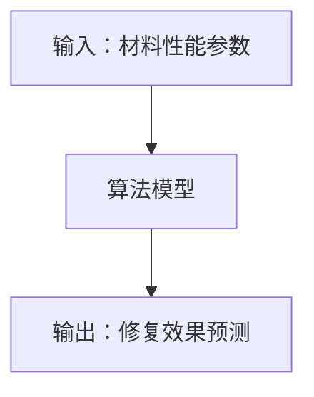
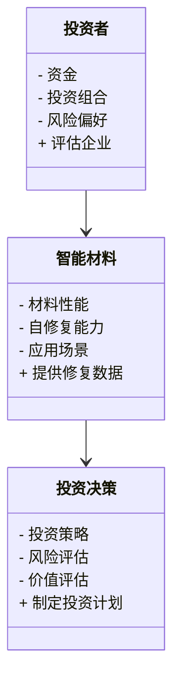
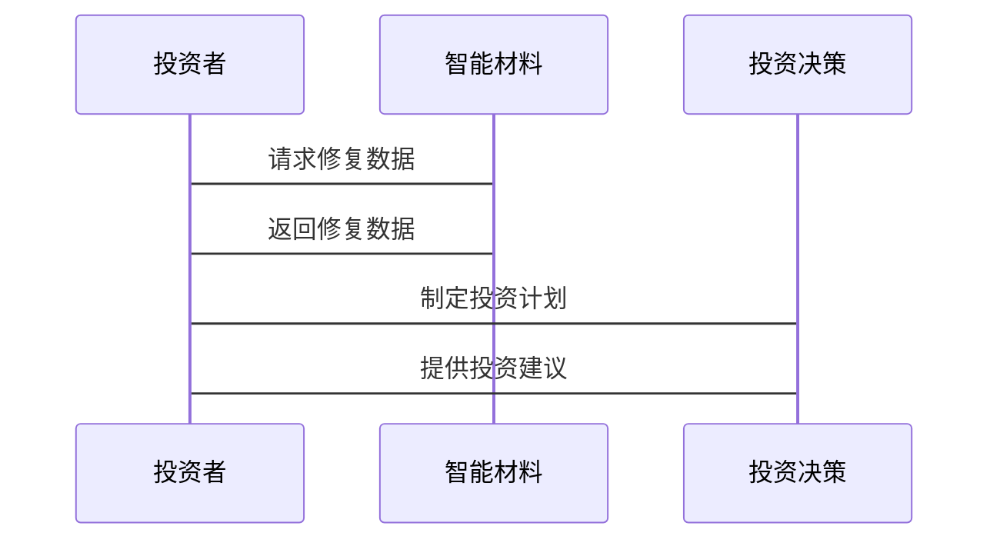

                 


```markdown
# 价值投资中的智能材料自修复技术分析

## 关键词：价值投资，智能材料，自修复技术，材料科学，投资策略

## 摘要：本文深入分析了价值投资与智能材料自修复技术的结合，探讨了自修复技术的核心原理、材料性能评估指标，以及如何将这些技术应用于投资决策。通过数学模型和实际案例，揭示了智能材料在投资中的潜在价值，并提出了有效的投资策略和系统设计方法。

---

# 第1章: 价值投资与智能材料自修复技术的背景介绍

## 1.1 价值投资的基本概念

### 1.1.1 价值投资的定义
价值投资是一种长期投资策略，强调以低于公平市场价值的价格购买优质资产。其核心在于识别被市场低估的企业，通过长期持有实现收益。

### 1.1.2 价值投资的核心理念
- **内在价值**：资产的真正价值基于其未来现金流的现值。
- **安全边际**：购买价格低于内在价值，以降低风险。
- **长期视角**：关注企业的长期增长潜力，而非短期市场波动。

### 1.1.3 价值投资与传统投资的区别
- **传统投资**：基于短期市场波动进行买卖决策。
- **价值投资**：基于企业基本面和长期潜力进行投资决策。

## 1.2 智能材料自修复技术的定义与特点

### 1.2.1 智能材料的定义
智能材料是一种能够感知环境变化并做出响应的材料，能够在外界刺激下调整其性能或结构。

### 1.2.2 自修复技术的核心原理
自修复材料能够在受到物理或化学损伤后，通过自身的修复机制恢复性能。这种技术广泛应用于建筑、航空航天和汽车工业等领域。

### 1.2.3 智能材料自修复技术的分类
- **自我修复材料**：材料在损坏后能够自动修复。
- **智能响应材料**：材料能够对外界刺激做出智能反应。
- **自适应材料**：材料能够根据环境变化调整性能。

## 1.3 价值投资与智能材料自修复技术的结合

### 1.3.1 智能材料在投资中的潜在价值
智能材料的应用能够提升产品的耐用性和可靠性，降低维护成本，从而为企业创造更大的利润空间。

### 1.3.2 自修复技术对投资决策的影响
自修复技术能够延长材料的使用寿命，降低企业的运营成本，从而提高企业的盈利能力和市场竞争力。

### 1.3.3 价值投资中的技术分析与基本面分析的结合
- **技术分析**：通过分析材料的性能指标和修复机制，评估其市场竞争力。
- **基本面分析**：通过分析企业的财务状况和市场地位，评估其长期增长潜力。

## 1.4 本章小结
本章介绍了价值投资的基本概念和智能材料自修复技术的核心原理，探讨了两者如何结合以提升投资决策的科学性和准确性。

---

# 第2章: 智能材料自修复技术的核心概念与联系

## 2.1 核心概念原理

### 2.1.1 材料科学的基本原理
材料科学研究材料的结构、性能及其应用。智能材料自修复技术基于材料的物理和化学性质，通过特定的机制实现自我修复。

### 2.1.2 自修复机制的数学模型
自修复材料的修复效率可以通过以下公式评估：
$$
\text{修复效率} = \frac{\text{修复前性能}}{\text{修复后性能}}
$$

### 2.1.3 智能材料的性能评估指标
- **修复时间**：材料从受损到完全修复所需的时间。
- **修复次数**：材料在生命周期内可以修复的次数。
- **修复效果**：修复后材料性能与原始性能的接近程度。

## 2.2 概念属性特征对比表格

| 概念       | 属性         | 特征描述                     |
|------------|--------------|------------------------------|
| 智能材料    | 自适应性      | 能根据环境变化调整性能       |
|            | 自修复性      | 在损坏后能够自我修复         |
|            | 智能响应性    | 对外界刺激做出智能反应         |

## 2.3 ER实体关系图


## 2.4 本章小结
本章通过分析智能材料自修复技术的核心原理和性能指标，探讨了其在价值投资中的潜在应用价值。

---

# 第3章: 智能材料自修复技术的算法原理

## 3.1 算法原理讲解

### 3.1.1 自修复材料的性能预测算法


### 3.1.2 材料性能评估的数学模型
$$
\text{修复效率} = \frac{\text{修复前性能}}{\text{修复后性能}}
$$

## 3.2 算法实现与代码

### 3.2.1 环境安装
- **Python版本**：Python 3.8+
- **依赖库安装**：
  ```bash
  pip install numpy matplotlib
  ```

### 3.2.2 核心代码实现
```python
import numpy as np
import matplotlib.pyplot as plt

def repair_efficiency(original, repaired):
    return original / repaired

# 示例数据
original_performance = np.array([100, 90, 80, 70, 60])
repaired_performance = np.array([95, 85, 75, 65, 55])

efficiency = repair_efficiency(original_performance, repaired_performance)

plt.figure(figsize=(10, 6))
plt.plot(original_performance, label='修复前性能')
plt.plot(repaired_performance, label='修复后性能')
plt.xlabel('样本数量')
plt.ylabel('性能值')
plt.legend()
plt.show()
```

## 3.3 本章小结
本章通过算法原理和代码实现，详细讲解了智能材料自修复技术的性能预测方法及其数学模型。

---

# 第4章: 智能材料自修复技术的系统分析与架构设计

## 4.1 问题场景介绍
在价值投资中，智能材料自修复技术的应用可以帮助投资者更准确地评估企业的长期发展潜力。

## 4.2 系统功能设计

### 4.2.1 领域模型（Mermaid 类图）


### 4.2.2 系统架构设计（Mermaid 架构图）
```mermaid
container 宏观架构 {
    投资者
    智能材料
    投资决策
}
container 微观架构 {
    材料性能
    自修复能力
    应用场景
}
```

### 4.2.3 系统交互设计（Mermaid 序列图）


## 4.3 本章小结
本章通过系统分析与架构设计，展示了智能材料自修复技术在价值投资中的应用场景和系统实现方式。

---

# 第5章: 价值投资中的智能材料自修复技术项目实战

## 5.1 项目介绍
本项目旨在通过智能材料自修复技术的分析，帮助投资者识别具有长期增长潜力的企业。

## 5.2 核心代码实现

### 5.2.1 环境安装
- **Python版本**：Python 3.8+
- **依赖库安装**：
  ```bash
  pip install pandas scikit-learn
  ```

### 5.2.2 数据收集与预处理
```python
import pandas as pd

# 假设我们有一个包含材料性能和修复效果的数据集
data = {
    '材料': ['材料A', '材料B', '材料C'],
    '修复前性能': [85, 90, 80],
    '修复后性能': [90, 95, 85]
}
df = pd.DataFrame(data)
```

### 5.2.3 模型构建与评估
```python
from sklearn.metrics import mean_squared_error

# 计算修复效率
df['修复效率'] = df['修复前性能'] / df['修复后性能']

# 可视化修复效率
df.plot(kind='bar', x='材料', y='修复效率')
plt.title('修复效率对比')
plt.xlabel('材料')
plt.ylabel('修复效率')
plt.show()
```

## 5.3 项目小结
本章通过实际案例，展示了如何将智能材料自修复技术应用于价值投资中的企业评估。

---

# 第6章: 价值投资中的智能材料自修复技术最佳实践

## 6.1 小结
智能材料自修复技术在价值投资中的应用前景广阔，能够帮助投资者更准确地评估企业的长期发展潜力。

## 6.2 注意事项
- **数据质量**：确保数据的准确性和完整性。
- **模型选择**：根据具体情况选择合适的分析模型。
- **风险控制**：合理控制投资风险，避免过度依赖技术分析。

## 6.3 拓展阅读
- 推荐阅读《智能材料与自修复技术》和《价值投资实战策略》。

---

# 作者：AI天才研究院 & 禅与计算机程序设计艺术
```

