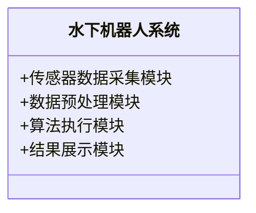
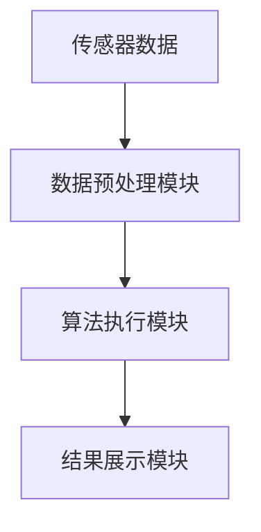
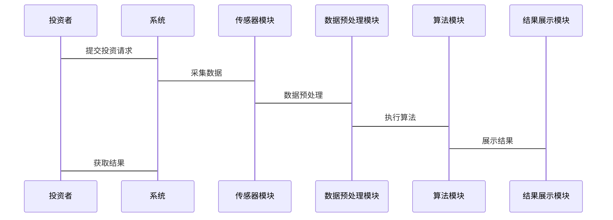

                 


# 价值投资中的智能水下机器人系统分析

> 关键词：价值投资，智能水下机器人，系统分析，算法原理，系统架构

> 摘要：本文从价值投资与智能水下机器人系统的结合出发，深入分析了智能水下机器人系统的核心原理、算法实现、系统架构以及项目实战。通过详细的技术分析和实际案例，探讨了智能水下机器人系统在价值投资中的潜在应用和未来发展方向。

---

## 第一部分: 价值投资与智能水下机器人系统概述

### 第1章: 价值投资与智能水下机器人系统概述

#### 1.1 价值投资的基本概念
##### 1.1.1 价值投资的定义与核心理念
价值投资是一种基于对公司基本面分析的投资策略，核心在于寻找市场价格低于其内在价值的标的资产。其核心理念包括：
1. **安全边际**：买入价格低于内在价值，以降低风险。
2. **长期视角**：关注企业的长期盈利能力，而非短期价格波动。
3. **逆向思维**：在市场恐慌时寻找低估机会，在市场狂热时保持冷静。

##### 1.1.2 价值投资与传统投资的区别
| 投资策略 | 价值投资 | 传统投资 |
|----------|-----------|-----------|
| 标的筛选 | 基于内在价值 | 基于市场趋势或技术分析 |
| 时间框架 | 长期持有 | 短期交易 |
| 风险控制 | 强调安全边际 | 依赖市场波动 |
| 信息需求 | 需要深度基本面分析 | 依赖技术指标或市场情绪 |

##### 1.1.3 智能技术在价值投资中的应用潜力
智能技术（如人工智能、大数据分析）可以辅助投资者进行更精准的估值分析、风险评估和市场预测，从而提高价值投资的效率和准确性。

#### 1.2 水下机器人系统的定义与特点
##### 1.2.1 水下机器人系统的定义
水下机器人系统是一种能够在水下环境中自主或遥控执行任务的智能设备，通常包括传感器、执行器、通信模块和控制系统的集成。

##### 1.2.2 水下机器人系统的分类与应用场景
| 类型 | 应用场景 | 特点 |
|------|----------|------|
| 观察类 | 海洋勘探 | 配备高清摄像头和声呐 |
| 作业类 | 管道检测、海底救援 | 配备机械臂和切割工具 |
| 科学研究 | 海洋生态监测 | 配备多种环境传感器 |

##### 1.2.3 智能水下机器人系统的核心技术
智能水下机器人系统的核心技术包括：
1. **多传感器融合**：整合声呐、摄像头、GPS等传感器数据。
2. **自主决策**：基于传感器数据进行路径规划和任务执行。
3. **通信技术**：在水下环境中实现稳定的通信链路。

#### 1.3 价值投资与智能水下机器人系统的结合
##### 1.3.1 价值投资中数据的重要性
价值投资依赖于对企业基本面的深入分析，而数据是基本面分析的核心。智能水下机器人系统可以通过实时数据采集和处理，为投资者提供更精确的决策依据。

##### 1.3.2 水下机器人系统在数据采集与分析中的作用
水下机器人系统可以用于采集海洋资源、环境数据等信息，这些数据可以辅助投资者评估相关企业的潜在价值。

##### 1.3.3 智能水下机器人系统在价值投资中的潜在应用
通过智能水下机器人系统，投资者可以更高效地获取和分析数据，从而提高价值评估的准确性。

#### 1.4 本章小结
本章介绍了价值投资的基本概念和智能水下机器人系统的定义与特点，并探讨了两者的结合方式。通过这种结合，智能水下机器人系统可以为价值投资提供更高效的数据支持和技术手段。

---

## 第二部分: 智能水下机器人系统的核心原理

### 第2章: 智能水下机器人系统的数据采集与处理

#### 2.1 数据采集模块
##### 2.1.1 水下环境数据的采集方法
水下机器人系统通常使用多种传感器进行数据采集，包括：
1. **声呐**：用于水下地形测绘和目标检测。
2. **摄像头**：用于视觉识别和物体检测。
3. **惯性测量单元（IMU）**：用于姿态估计和导航。

##### 2.1.2 多传感器融合技术
通过将多种传感器的数据进行融合，可以提高系统的感知精度和鲁棒性。常用的方法包括：
1. **加权融合**：根据传感器的精度和可靠性进行加权平均。
2. **卡尔曼滤波**：通过状态估计消除传感器噪声。

##### 2.1.3 数据采集的挑战与解决方案
水下环境复杂多变，数据采集面临以下挑战：
- **通信延迟**：水下通信链路不稳定，可能导致数据传输延迟。
- **传感器噪声**：水下环境干扰大，传感器数据易受噪声影响。
- **能源限制**：水下机器人通常依赖电池供电，需优化能量消耗。

#### 2.2 数据预处理与特征提取
##### 2.2.1 数据清洗与标准化
数据清洗是去除噪声和异常值的过程，标准化则是将数据转换到统一的尺度，以便后续分析。

##### 2.2.2 特征提取方法
常用的特征提取方法包括：
1. **主成分分析（PCA）**：通过降维提取主要特征。
2. **傅里叶变换**：用于时序数据的频率分析。

##### 2.2.3 数据特征对价值投资的影响
通过提取关键特征，投资者可以更精准地评估企业的内在价值。

#### 2.3 数据存储与管理
##### 2.3.1 数据库设计
常用的关系型数据库设计包括：
- **表结构**：包括传感器数据表、任务日志表等。
- **索引优化**：通过索引优化查询性能。

##### 2.3.2 数据存储优化
- **分布式存储**：通过分布式文件系统提高存储效率。
- **压缩技术**：对数据进行压缩存储，减少存储空间占用。

##### 2.3.3 数据安全与隐私保护
通过加密技术和访问控制，确保数据的安全性和隐私性。

#### 2.4 本章小结
本章详细介绍了智能水下机器人系统中的数据采集与处理过程，包括传感器融合、数据预处理和存储管理等关键环节。

---

## 第3章: 智能水下机器人系统的算法原理

### 3.1 时间序列分析算法
#### 3.1.1 时间序列分析的基本概念
时间序列分析是一种基于历史数据预测未来趋势的方法，常用模型包括ARIMA、LSTM等。

#### 3.1.2 常用的时间序列模型
##### LSTM模型
LSTM（长短期记忆网络）是一种特殊的RNN，通过门控机制有效捕捉长距离依赖关系。

```python
class LSTMCell(tf.keras.layers.Layer):
    def __init__(self, units, input_dim):
        super(LSTMCell, self).__init__()
        self.units = units
        self.input_dim = input_dim
        self.W_f = self.add_weight(shape=(input_dim, units), initializer='random_normal')
        self.W_i = self.add_weight(shape=(input_dim, units), initializer='random_normal')
        self.W_o = self.add_weight(shape=(input_dim, units), initializer='random_normal')
        self.b = self.add_weight(shape=(units,), initializer='zeros')

    def call(self, inputs, states):
        h, c = states
        f = tf.sigmoid(tf.matmul(inputs, self.W_f) + self.b)
        i = tf.sigmoid(tf.matmul(inputs, self.W_i) + self.b)
        o = tf.sigmoid(tf.matmul(inputs, self.W_o) + self.b)
        c_new = f * h + i * (tf.nn.relu(tf.matmul(inputs, self.W_f) + self.b))
        h_new = o * tf.nn.relu(c_new)
        return h_new, [h_new, c_new]
```

#### 3.1.3 时间序列分析在价值投资中的应用
时间序列分析可以用于预测股票价格、评估市场趋势等。

### 3.2 强化学习算法
#### 3.2.1 强化学习的基本原理
强化学习是一种通过试错机制学习策略的方法，核心是通过奖励机制优化动作选择。

#### 3.2.2 Q-Learning算法在投资决策中的应用
Q-Learning算法通过构建Q表，记录状态-动作对的期望奖励，从而优化投资决策。

#### 3.2.3 强化学习的优势与局限性
- **优势**：可以处理非线性问题，适应复杂环境。
- **局限性**：需要大量训练数据，计算资源消耗大。

### 3.3 聚类分析与分类算法
#### 3.3.1 聚类分析的基本原理
聚类分析是将数据分成若干簇的过程，常用算法包括K-means、DBSCAN等。

#### 3.3.2 分类算法（如决策树、随机森林）的应用
决策树和随机森林常用于分类问题，可以用于识别市场趋势、评估企业信用风险等。

#### 3.3.3 聚类与分类在价值投资中的场景
- **聚类**：用于识别市场中相似的企业群体。
- **分类**：用于预测企业的财务状况。

### 3.4 算法选择与优化
#### 3.4.1 算法选择的依据
根据数据类型、任务需求和计算资源选择合适的算法。

#### 3.4.2 算法调优方法
包括参数调节、特征选择和模型优化等。

#### 3.4.3 算法性能评估指标
常用的指标包括准确率、召回率和F1值。

### 3.5 本章小结
本章介绍了智能水下机器人系统中常用的算法原理，包括时间序列分析、强化学习、聚类分析和分类算法，并探讨了它们在价值投资中的应用。

---

## 第4章: 智能水下机器人系统的系统架构设计

### 4.1 系统功能模块划分
#### 4.1.1 数据采集模块
负责采集水下环境数据，包括传感器数据和视频数据。

#### 4.1.2 数据处理模块
对采集到的数据进行预处理、特征提取和存储管理。

#### 4.1.3 算法执行模块
基于预处理后的数据，执行时间序列分析、聚类分析等算法。

#### 4.1.4 结果展示模块
将算法结果以可视化形式展示，便于投资者理解和决策。

### 4.2 系统架构设计
#### 4.2.1 领域模型设计


#### 4.2.2 系统架构设计


#### 4.2.3 系统接口设计
- **数据接口**：传感器数据的输入和输出接口。
- **算法接口**：算法模块的调用接口。
- **展示接口**：结果展示的用户界面接口。

#### 4.2.4 系统交互设计


### 4.3 本章小结
本章详细介绍了智能水下机器人系统的系统架构设计，包括功能模块划分、系统架构图和系统接口设计。

---

## 第五部分: 项目实战

### 第5章: 项目实战

#### 5.1 环境安装与配置
##### 5.1.1 系统环境要求
- 操作系统：Linux或Windows
- Python版本：3.6以上
- 依赖库：TensorFlow、NumPy、Pandas、Mermaid等。

##### 5.1.2 安装步骤
```bash
pip install tensorflow numpy pandas matplotlib seaborn scikit-learn mermaid
```

#### 5.2 系统核心实现
##### 5.2.1 数据采集模块实现
```python
import numpy as np
import pandas as pd
from sklearn.preprocessing import StandardScaler

# 数据采集
def collect_data(sensor_data):
    data = pd.DataFrame(sensor_data)
    return data

# 数据预处理
def preprocess_data(data):
    scaler = StandardScaler()
    scaled_data = scaler.fit_transform(data)
    return scaled_data
```

##### 5.2.2 算法实现
```python
from tensorflow.keras.models import Sequential
from tensorflow.keras.layers import LSTM, Dense

# LSTM模型
def build_lstm_model(input_shape):
    model = Sequential()
    model.add(LSTM(64, input_shape=input_shape))
    model.add(Dense(1))
    model.compile(loss='mean_squared_error', optimizer='adam')
    return model

# 训练模型
model = build_lstm_model((None, 1))
model.fit(X_train, y_train, epochs=100, batch_size=32)
```

##### 5.2.3 结果展示
```python
import matplotlib.pyplot as plt

# 可视化预测结果
plt.plot(y_test, label='True')
plt.plot(y_pred, label='Predicted')
plt.legend()
plt.show()
```

#### 5.3 实际案例分析
##### 5.3.1 案例背景
假设我们希望评估某海洋企业的内在价值，利用智能水下机器人系统采集相关数据。

##### 5.3.2 数据分析与建模
通过LSTM模型预测该企业的股票价格走势，评估其内在价值。

##### 5.3.3 结果解读
根据模型预测结果，投资者可以做出买入或卖出的决策。

#### 5.4 本章小结
本章通过实际案例展示了智能水下机器人系统的实现过程，包括环境配置、数据采集、算法实现和结果展示。

---

## 第六部分: 总结与展望

### 第6章: 总结与展望

#### 6.1 本章总结
智能水下机器人系统在价值投资中的应用潜力巨大，通过实时数据采集、精准算法分析和高效系统架构设计，可以为投资者提供更高效的决策支持。

#### 6.2 未来展望
未来的研究方向包括：
1. **算法优化**：探索更高效的算法，如深度强化学习。
2. **系统集成**：实现更高效的系统集成和数据共享。
3. **应用拓展**：探索智能水下机器人系统在更多领域的应用。

#### 6.3 最佳实践 tips
- 数据是价值投资的核心，需确保数据的准确性和完整性。
- 算法选择需结合具体场景，避免盲目追求复杂性。
- 系统设计需注重模块化和可扩展性。

#### 6.4 本章小结
本文总结了智能水下机器人系统在价值投资中的应用，并展望了未来的研究方向。

---

## 作者信息

作者：AI天才研究院/AI Genius Institute & 禅与计算机程序设计艺术 /Zen And The Art of Computer Programming

