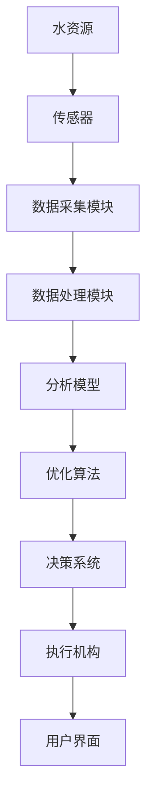
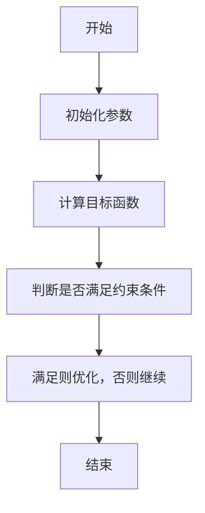
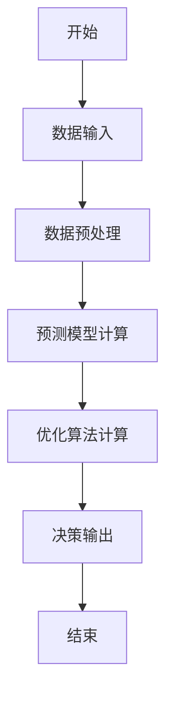
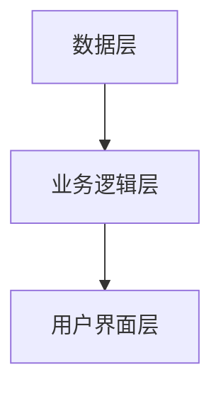
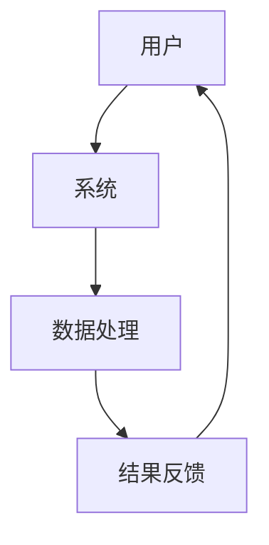

                 


# 价值投资中的智能水资源管理技术趋势

> 关键词：智能水资源管理、价值投资、技术趋势、优化算法、机器学习、系统架构、投资回报

> 摘要：本文探讨了智能水资源管理在价值投资中的技术趋势，分析了传统水资源管理的不足，介绍了智能技术的应用潜力，并通过数学模型和系统架构的设计，展示了如何利用智能技术优化水资源管理，实现可持续投资回报。文章还结合实际案例，详细讲解了项目实战和最佳实践，为读者提供了全面的技术视角。

---

## 第1章 背景介绍

### 1.1 智能水资源管理的背景与价值

#### 1.1.1 水资源短缺与管理问题的背景

水资源是人类生存和发展的基础，但全球范围内水资源短缺问题日益严重。传统水资源管理方式存在数据采集不全、管理效率低下、决策滞后等问题，导致水资源利用效率低下，甚至引发环境问题。智能技术的引入为解决这些问题提供了新的可能性。

#### 1.1.2 价值投资与水资源管理的结合

价值投资是一种长期投资策略，强调通过深入分析投资标的的内在价值，寻找被市场低估的投资机会。在水资源管理领域，价值投资可以用于优化水资源配置、降低管理成本、提高投资回报率。智能技术的应用可以帮助投资者更准确地评估水资源的价值，发现潜在的投资机会。

#### 1.1.3 智能技术在水资源管理中的应用潜力

智能技术，包括机器学习、物联网、大数据分析等，可以实时采集和分析水资源数据，优化水资源配置，预测水资源需求，评估环境风险。这些技术的应用可以提高水资源管理的效率和准确性，降低投资风险，从而实现可持续的价值投资。

### 1.2 问题背景与问题描述

#### 1.2.1 水资源管理中的传统问题

传统水资源管理依赖人工数据采集和经验决策，存在以下问题：
- 数据采集不全面，缺乏实时性；
- 决策滞后，难以应对突发事件；
- 管理成本高，效率低下；
- 环境风险评估不足，可能导致资源浪费或环境破坏。

#### 1.2.2 价值投资与水资源管理的结合问题

在价值投资中，水资源管理的挑战包括：
- 如何准确评估水资源的内在价值；
- 如何利用技术手段发现被低估的水资源投资机会；
- 如何降低投资风险，提高投资回报率。

#### 1.2.3 智能技术在水资源管理中的应用问题

智能技术在水资源管理中的应用面临以下挑战：
- 数据隐私和安全问题；
- 模型的泛化能力不足；
- 系统的实时性和响应速度要求高等。

### 1.3 问题解决与技术趋势

#### 1.3.1 智能技术如何解决水资源管理问题

智能技术可以通过以下方式解决水资源管理问题：
- 实时数据采集和分析，提高管理效率；
- 优化算法，实现水资源的智能配置；
- 预测模型，提前预判风险，降低投资风险。

#### 1.3.2 价值投资在水资源管理中的应用趋势

未来，价值投资在水资源管理中的应用趋势包括：
- 利用大数据分析技术，深入挖掘水资源价值；
- 通过人工智能优化水资源配置，提高投资回报率；
- 利用区块链技术，确保水资源交易的透明和安全。

#### 1.3.3 智能水资源管理技术的核心要素

智能水资源管理技术的核心要素包括：
- 数据采集与传输技术；
- 数据分析与建模技术；
- 优化算法与决策支持系统；
- 系统集成与接口设计。

---

## 第2章 核心概念与原理

### 2.1 智能水资源管理的定义与特点

智能水资源管理是指利用智能技术，对水资源的采集、分析、配置和管理进行优化的过程。其特点包括：
- 数据驱动：依赖实时数据采集和分析；
- 智能决策：基于算法优化资源配置；
- 高效性：通过自动化技术提高管理效率。

### 2.2 核心概念对比表

以下是传统水资源管理和智能水资源管理的对比：

| 概念 | 传统水资源管理 | 智能水资源管理 |
|------|----------------|----------------|
| 数据来源 | 线下数据采集 | 多源数据融合 |
| 分析方法 | 统计分析 | 机器学习、AI预测 |
| 决策方式 | 人工决策 | 智能优化决策 |

### 2.3 系统架构与实体关系图

以下是智能水资源管理系统的实体关系图：



---

## 第3章 算法原理

### 3.1 优化模型与数学公式

优化模型是智能水资源管理的核心，常用线性规划和非线性规划模型。以下是一个简单的线性规划模型：

$$
\text{目标函数：} \quad \min \sum_{i} c_i x_i
$$

$$
\text{约束条件：} \quad \sum_{i} a_i x_i \geq b
$$

其中，\( c_i \) 是资源的单位成本，\( x_i \) 是资源的分配量，\( a_i \) 是资源的使用系数，\( b \) 是资源需求量。

### 3.2 优化算法

以下是优化算法的流程图：



### 3.3 预测模型

预测模型用于预测水资源需求和环境风险。常用的时间序列预测模型包括ARIMA和LSTM。以下是ARIMA模型的公式：

$$
y_t = \alpha y_{t-1} + \beta \epsilon_{t-1} + \gamma \epsilon_{t-2}
$$

其中，\( y_t \) 是预测值，\( \alpha \) 是自回归系数，\( \beta \) 和 \( \gamma \) 是移动平均系数，\( \epsilon \) 是误差项。

### 3.4 决策模型

决策模型基于预测和优化结果，制定最优决策。以下是决策模型的流程图：



---

## 第4章 系统分析与架构设计

### 4.1 应用场景与系统功能

智能水资源管理系统的主要应用场景包括：
- 水资源监测与预警；
- 水资源优化配置；
- 水资源风险评估。

系统功能模块包括：
- 数据采集模块；
- 数据分析模块；
- 优化决策模块。

### 4.2 系统架构设计

以下是系统的分层架构图：



### 4.3 接口设计

系统接口包括：
- 数据接口：与传感器和数据库通信；
- API接口：与其他系统集成；
- 用户接口：与用户交互。

### 4.4 交互流程图

以下是用户与系统的交互流程图：



---

## 第5章 项目实战

### 5.1 环境搭建

需要安装以下工具和库：
- Python 3.8+
- NumPy、Pandas、Scikit-learn
- TensorFlow或Keras
- Flask或Django（用于Web开发）

### 5.2 核心代码实现

以下是优化算法的Python代码示例：

```python
import numpy as np
from scipy.optimize import linprog

# 定义目标函数系数
c = [-5, -4]

# 定义约束条件系数
A = [[2, 1]]
b = [10]
x_bounds = [(0, None), (0, None)]

# 求解线性规划问题
result = linprog(c, A, b, bounds=x_bounds, method='highs')

# 输出结果
print("最优解：", result.x)
print("最优值：", -result.fun)
```

### 5.3 实际案例分析

以某城市水资源优化配置为例，通过上述算法可以实现水资源的最优分配，降低浪费，提高投资回报率。

### 5.4 项目小结

通过实际项目实战，可以验证智能技术在水资源管理中的应用效果，优化资源配置，提高投资收益。

---

## 第6章 最佳实践

### 6.1 小结

智能技术在水资源管理中的应用前景广阔，通过优化算法和预测模型，可以实现资源的高效配置和投资回报的最大化。

### 6.2 注意事项

- 数据隐私和安全问题需要重视；
- 模型的泛化能力和适应性需要加强；
- 系统的实时性和响应速度需要优化。

### 6.3 拓展阅读

推荐阅读以下书籍和文章：
- 《智能优化算法及其应用》
- 《机器学习在水资源管理中的应用》
- 《价值投资与智能技术结合的创新模式》

---

## 第7章 附录

### 7.1 代码与工具链接

以下是优化算法的完整代码示例：

```python
import numpy as np
from scipy.optimize import linprog

# 定义目标函数系数
c = [-5, -4]

# 定义约束条件系数
A = [[2, 1]]
b = [10]
x_bounds = [(0, None), (0, None)]

# 求解线性规划问题
result = linprog(c, A, b, bounds=x_bounds, method='highs')

# 输出结果
print("最优解：", result.x)
print("最优值：", -result.fun)
```

### 7.2 工具与资源

以下是推荐使用的工具和资源链接：
- 数据分析工具：Python、R语言
- 优化算法库：Scipy、CVXOPT
- 机器学习框架：TensorFlow、Keras

---

## 作者

作者：AI天才研究院/AI Genius Institute & 禅与计算机程序设计艺术 /Zen And The Art of Computer Programming

---

以上是《价值投资中的智能水资源管理技术趋势》的完整目录大纲和内容结构。通过逐步分析和详细讲解，文章为读者提供了全面的技术视角，帮助读者理解智能技术在水资源管理中的应用潜力和价值投资的结合趋势。

