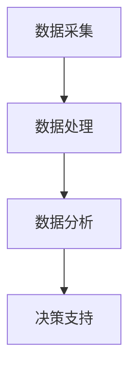
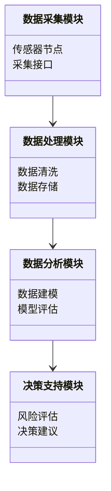
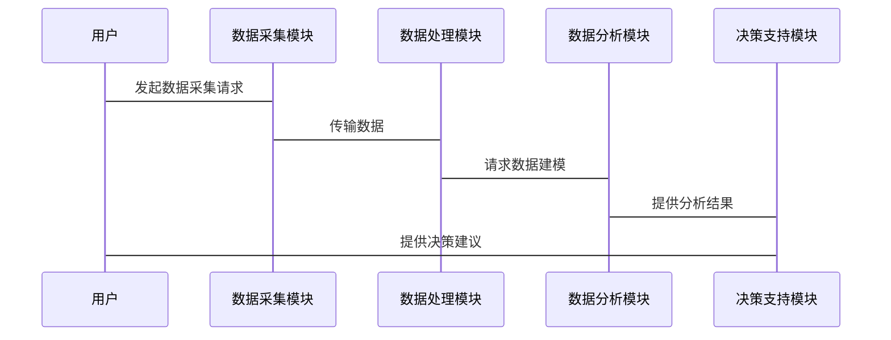

                 


# 价值投资中的智能海洋养殖系统分析

**关键词**：价值投资、智能海洋养殖、数据分析、机器学习、系统架构、算法实现

**摘要**：本文详细探讨了智能海洋养殖系统在价值投资中的应用，从数据采集与处理、算法建模到系统架构设计，再到实际项目案例，全面分析了如何利用智能技术优化海洋养殖的投资决策。通过理论与实践的结合，本文为读者提供了从基础概念到高级算法实现的详细指导，帮助投资者在智能海洋养殖领域做出科学、精准的投资决策。

---

## 第1章: 智能海洋养殖系统与价值投资概述

### 1.1 智能海洋养殖系统的定义与背景

#### 1.1.1 海洋养殖的定义与现状

海洋养殖是通过人工干预，在海洋或类似环境中养殖水产品的一种方式。其主要包括鱼类、贝类、藻类等的养殖。随着全球人口的增加和对蛋白质需求的上升，海洋养殖的重要性日益凸显。然而，传统海洋养殖面临资源浪费、环境污染、病害风险高等问题。

#### 1.1.2 智能化养殖的概念与发展趋势

智能化养殖是指通过物联网、大数据、人工智能等技术，实现海洋养殖的智能化管理。这种模式能够实时监测水质、饵料投喂、生物生长状态等关键指标，从而提高养殖效率、降低成本、减少环境影响。近年来，随着技术的进步，智能化养殖在全球范围内得到了快速发展。

#### 1.1.3 价值投资在海洋养殖中的应用前景

价值投资是一种以基本面分析为基础的投资策略，通过深入研究企业的财务状况、行业地位、竞争优势等，寻找被市场低估的投资标的。在海洋养殖领域，价值投资可以帮助投资者发现具有长期增长潜力的企业，尤其是在智能化养殖趋势下，那些能够有效整合先进技术的企业更具投资价值。

### 1.2 价值投资的核心概念

#### 1.2.1 价值投资的基本原理

价值投资的核心在于寻找市场价格低于其内在价值的资产。这种方法强调长期投资、分散投资和深入研究。在海洋养殖领域，价值投资需要结合行业特点，分析企业的成本控制能力、市场占有率、技术创新能力等因素。

#### 1.2.2 价值投资在农业领域的独特性

农业领域具有季节性、周期性等特点，这使得价值投资在该领域的应用更具挑战性。投资者需要考虑天气、政策、市场需求等多重因素。智能化养殖的引入为价值投资提供了新的工具和数据支持，使得分析更加精准和动态。

#### 1.2.3 智能化养殖对价值投资的影响

智能化养殖通过数据采集、分析和决策支持，为价值投资者提供了更全面的分析工具。例如，通过实时监测水质数据，投资者可以更准确地评估企业的运营效率和成本控制能力，从而做出更明智的投资决策。

### 1.3 智能海洋养殖系统的组成部分

#### 1.3.1 数据采集与分析模块

数据采集模块通过传感器、摄像头等设备，实时采集海洋环境的温度、盐度、pH值、溶解氧等参数。这些数据为后续分析提供了基础。

#### 1.3.2 智能决策支持系统

基于采集的数据，智能决策支持系统利用机器学习算法，分析养殖生物的生长状态、疾病风险、饵料需求等，为养殖户提供优化建议。

#### 1.3.3 风险评估与预警机制

通过分析历史数据和实时信息，系统可以识别潜在风险，如疾病暴发、环境突变等，并提前发出预警，帮助养殖户采取措施降低损失。

### 1.4 本章小结

本章从智能海洋养殖系统的定义、价值投资的核心概念以及系统的组成部分三个方面进行了详细阐述，为后续的分析奠定了基础。

---

## 第2章: 智能海洋养殖系统的数据分析与建模

### 2.1 数据采集技术与工具

#### 2.1.1 物联网技术在海洋养殖中的应用

物联网技术通过传感器和通信设备，实现养殖环境的实时监测。例如，使用无线传感器网络（WSN）采集水质数据，并通过LoRa、NB-IoT等通信技术将数据传送到云端。

#### 2.1.2 数据采集设备的选型与部署

在选择数据采集设备时，需要考虑设备的测量精度、功耗、通信方式等因素。例如，选择低功耗的传感器以适应海洋环境的复杂性。

#### 2.1.3 数据采集的常见问题与解决方案

数据采集过程中可能会遇到信号干扰、设备故障等问题。解决方案包括增加冗余设备、定期校准传感器等。

### 2.2 数据清洗与预处理

#### 2.2.1 数据清洗的基本步骤

数据清洗包括去除噪声数据、填补缺失值、异常值处理等。例如，使用均值填补法填补缺失的温度数据。

#### 2.2.2 数据标准化与归一化处理

标准化和归一化是数据预处理的重要步骤。标准化通过调整数据的均值和方差，使不同量纲的数据具有可比性。归一化则是将数据映射到0-1区间。

#### 2.2.3 异常数据的识别与处理

异常数据可能是由于传感器故障或环境突变引起的。可以通过统计方法（如3σ原则）或机器学习方法（如Isolation Forest）识别异常数据。

### 2.3 数据存储与管理

#### 2.3.1 数据库设计与优化

数据库设计需要考虑数据的高效查询和存储。例如，使用关系型数据库存储养殖记录，使用NoSQL数据库存储非结构化数据。

#### 2.3.2 数据仓库的构建与应用

数据仓库用于存储和分析海量数据。通过数据仓库，可以进行多维度分析，如时间趋势分析、空间分布分析等。

#### 2.3.3 数据安全与隐私保护

数据安全是数据管理的重要环节。需要采取加密技术、访问控制等措施，确保数据的安全性和隐私性。

### 2.4 本章小结

本章详细介绍了智能海洋养殖系统中数据采集、清洗、存储和管理的过程，为后续的建模分析奠定了基础。

---

## 第3章: 价值投资中的数据分析与建模

### 3.1 价值投资分析框架

#### 3.1.1 财务指标分析

财务指标是价值投资的重要依据。例如，通过分析企业的盈利能力（如ROE、净利润率）和偿债能力（如资产负债率）来评估企业的财务健康状况。

#### 3.1.2 市场趋势分析

市场趋势分析帮助投资者了解行业的发展方向和竞争格局。例如，分析全球海洋养殖市场的增长趋势，识别潜在的投资机会。

#### 3.1.3 风险评估指标

风险评估指标用于衡量企业的经营风险和财务风险。例如，通过分析企业的波动性、杠杆率等指标，评估企业的风险承受能力。

### 3.2 数据驱动的分析模型

#### 3.2.1 回归分析模型

回归分析是一种常用的数据分析方法，用于研究变量之间的关系。例如，通过线性回归模型分析养殖成本与产量的关系。

#### 3.2.2 时间序列分析模型

时间序列分析用于研究数据随时间的变化趋势。例如，使用ARIMA模型预测未来几个月的海洋养殖产量。

#### 3.2.3 机器学习算法在价值投资中的应用

机器学习算法如随机森林、支持向量机等，可以用于分类和回归问题。例如，通过训练分类模型识别具有投资潜力的企业。

### 3.3 智能海洋养殖系统的数据建模

#### 3.3.1 数据建模的基本步骤

数据建模包括数据准备、模型选择、模型训练、模型评估等步骤。例如，使用训练好的模型进行预测，并通过交叉验证评估模型的性能。

#### 3.3.2 常用算法的选择与实现

在智能海洋养殖系统中，常用的算法包括线性回归、支持向量机、随机森林等。需要根据具体问题选择合适的算法，并进行参数调优。

#### 3.3.3 模型评估与优化

模型评估包括准确率、召回率、F1分数等指标。优化方法包括网格搜索、交叉验证等，以提高模型的性能。

### 3.4 本章小结

本章从价值投资的分析框架出发，详细介绍了数据分析与建模的过程，为后续的算法实现奠定了基础。

---

## 第4章: 智能海洋养殖系统的算法实现

### 4.1 算法原理概述

#### 4.1.1 数据分析的基本原理

数据分析的核心是通过数据揭示潜在的规律和模式。例如，通过分析历史数据，发现养殖周期中的规律性变化。

#### 4.1.2 机器学习算法的核心思想

机器学习算法通过学习数据的特征，构建预测模型。例如，支持向量机通过找到数据的最优分割面，实现分类或回归任务。

#### 4.1.3 深度学习算法的简要介绍

深度学习算法通过多层神经网络，自动提取数据的特征。例如，使用卷积神经网络（CNN）进行图像识别任务。

### 4.2 常用算法的实现与优化

#### 4.2.1 线性回归模型的实现

线性回归是一种简单的回归算法，适用于线性关系的数据。其数学模型为：

$$ y = \beta_0 + \beta_1x + \epsilon $$

其中，$\beta_0$和$\beta_1$是回归系数，$\epsilon$是误差项。

#### 4.2.2 时间序列分析模型的实现

时间序列分析模型如ARIMA（自回归积分滑动平均模型），其数学模型为：

$$ ARIMA(p, d, q) $$

其中，p为自回归阶数，d为差分阶数，q为滑动平均阶数。

#### 4.2.3 机器学习算法的实现

以随机森林为例，其数学模型如下：

$$ y = \sum_{i=1}^{n} \theta_{i} \cdot x_{i} $$

其中，$\theta_{i}$是决策树的权重，$x_{i}$是输入特征。

### 4.3 本章小结

本章详细介绍了智能海洋养殖系统中常用的算法及其实现方法，为实际应用提供了技术支持。

---

## 第5章: 智能海洋养殖系统的系统架构设计

### 5.1 系统功能设计

#### 5.1.1 系统功能模块划分

智能海洋养殖系统主要包括数据采集、数据处理、数据分析、决策支持等功能模块。

#### 5.1.2 系统功能流程图

以下是系统功能流程图的Mermaid图：



#### 5.1.3 系统功能实现细节

数据采集模块通过传感器采集环境数据，数据处理模块对数据进行清洗和预处理，数据分析模块利用机器学习算法进行建模和预测，决策支持模块根据分析结果提供优化建议。

### 5.2 系统架构设计

#### 5.2.1 系统架构设计图

以下是系统架构设计图的Mermaid图：



#### 5.2.2 系统接口设计

系统接口设计需要考虑模块之间的数据传递和调用关系。例如，数据采集模块通过API接口将数据传递给数据处理模块。

#### 5.2.3 系统交互设计

以下是系统交互设计的Mermaid图：



### 5.3 本章小结

本章从系统架构设计的角度，详细介绍了智能海洋养殖系统的功能模块、架构设计和交互流程，为系统的实际应用提供了指导。

---

## 第6章: 智能海洋养殖系统的项目实战

### 6.1 项目背景与目标

#### 6.1.1 项目背景

本项目旨在通过智能技术优化海洋养殖的管理，提高养殖效率，降低成本。

#### 6.1.2 项目目标

实现海洋养殖环境的实时监测、数据分析与预测，提供科学的决策支持。

### 6.2 项目环境配置

#### 6.2.1 硬件环境

需要部署传感器、数据采集设备、通信设备等硬件设施。

#### 6.2.2 软件环境

需要安装数据采集软件、数据库管理系统、数据分析工具（如Python、R、TensorFlow等）。

#### 6.2.3 网络环境

需要构建稳定的网络环境，确保数据的实时传输和系统的正常运行。

### 6.3 系统核心实现

#### 6.3.1 数据采集模块的实现

以下是数据采集模块的Python代码示例：

```python
import serial
import time

# 配置串口
ser = serial.Serial('COM3', 9600)
time.sleep(2)

while True:
    # 读取数据
    data = ser.readline().decode().strip()
    print("采集到的数据：", data)
    time.sleep(1)
```

#### 6.3.2 数据分析模块的实现

以下是数据分析模块的Python代码示例：

```python
import pandas as pd
from sklearn.linear_model import LinearRegression

# 加载数据
data = pd.read_csv('data.csv')

# 训练模型
model = LinearRegression()
model.fit(data[['温度', '盐度']], data['产量'])

# 预测结果
print("预测产量：", model.predict([[25, 30]]))
```

#### 6.3.3 决策支持模块的实现

以下是决策支持模块的Python代码示例：

```python
import numpy as np
from sklearn.ensemble import RandomForestClassifier

# 加载数据
data = pd.read_csv('data.csv')

# 数据预处理
X = data[['温度', '盐度', '溶解氧']]
y = data['健康状态']

# 训练模型
model = RandomForestClassifier()
model.fit(X, y)

# 预测结果
print("预测健康状态：", model.predict([[25, 30, 7]]))
```

### 6.4 实际案例分析

#### 6.4.1 案例背景

以某海洋养殖场为例，分析其养殖数据，评估其潜在的投资价值。

#### 6.4.2 数据分析与建模

通过数据分析，发现该养殖场的产量与温度和盐度密切相关。建立线性回归模型，预测未来产量。

#### 6.4.3 结果展示与解读

模型预测显示，未来几个月的产量将呈现增长趋势，具有较高的投资价值。

### 6.5 本章小结

本章通过实际案例，详细展示了智能海洋养殖系统的项目实战过程，包括环境配置、核心模块实现和案例分析。

---

## 第7章: 总结与展望

### 7.1 本章总结

本文从智能海洋养殖系统的定义、数据分析与建模、算法实现、系统架构设计到项目实战，全面探讨了其在价值投资中的应用。通过理论与实践的结合，为投资者提供了科学的决策支持工具。

### 7.2 未来展望

随着人工智能和大数据技术的不断发展，智能海洋养殖系统将更加智能化和精准化。未来的研究方向包括引入深度学习算法、优化系统架构、拓展应用场景等。

### 7.3 最佳实践 Tips

- 在进行价值投资时，需结合企业的基本面和智能化养殖能力进行综合评估。
- 数据采集和预处理是数据分析的基础，需确保数据的准确性和完整性。
- 模型的选择和优化需根据具体问题进行调整，避免盲目使用复杂算法。

### 7.4 小结

智能海洋养殖系统的应用为价值投资提供了新的机遇和挑战。通过技术创新和数据驱动，投资者可以更精准地识别优质标的，实现长期稳定的收益。

---

## 作者

**作者：AI天才研究院/AI Genius Institute & 禅与计算机程序设计艺术 /Zen And The Art of Computer Programming**

---

以上是《价值投资中的智能海洋养殖系统分析》的完整目录和部分内容，涵盖了从理论到实践的各个方面，为读者提供了全面的指导。

