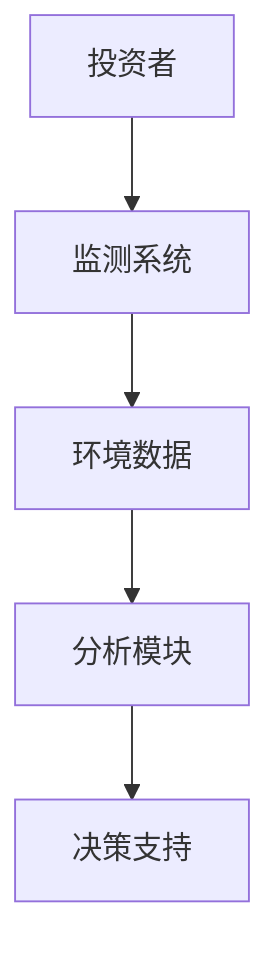
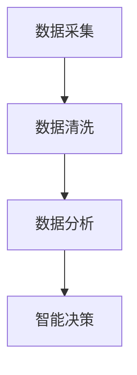
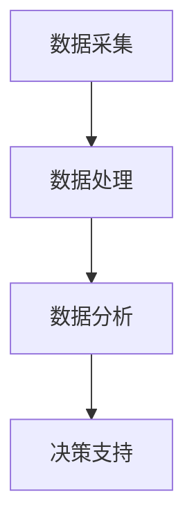
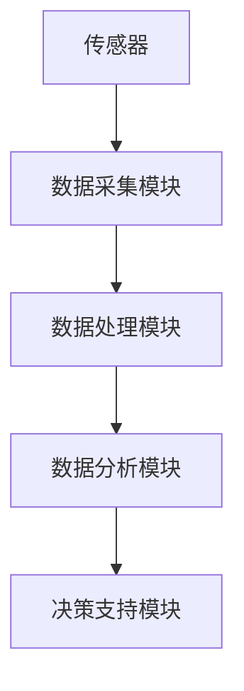
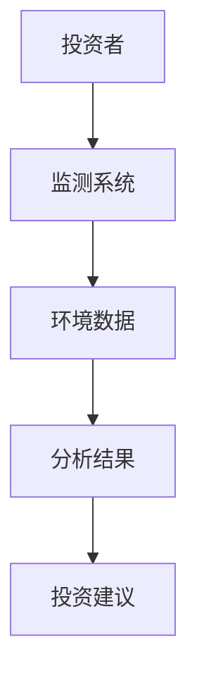

                 


# 价值投资中的智能海洋环境监测系统分析

> 关键词：价值投资，智能监测系统，海洋环境，数据采集，算法分析

> 摘要：本文深入分析了智能海洋环境监测系统在价值投资中的应用，从系统背景、核心概念、算法原理、数学模型、系统架构设计、项目实战等多维度进行详细阐述。通过实际案例分析和代码实现，展示了如何利用智能监测系统辅助价值投资决策。

---

# 第1章: 价值投资与智能海洋环境监测系统背景

## 1.1 价值投资的基本概念

### 1.1.1 价值投资的定义与核心理念
价值投资是一种投资策略，强调通过分析企业的内在价值，寻找市场低估的投资标的。其核心理念是“以合理的价格买入优质资产”。与技术分析不同，价值投资更注重基本面分析，关注企业的财务状况、行业地位和长期发展潜力。

### 1.1.2 价值投资在现代金融中的地位
价值投资是金融领域的重要理论之一，尤其在股票投资中占据重要地位。通过基本面分析，投资者可以识别出具有长期增长潜力的企业，并在市场低估时买入，待市场回归其真实价值时卖出。

### 1.1.3 价值投资与技术分析的对比
- **技术分析**：基于价格和成交量的历史数据，通过图表和技术指标预测未来的价格走势。
- **价值投资**：基于企业的基本面数据，通过分析企业的财务状况、行业地位等因素，预测其未来的盈利能力。

---

## 1.2 智能海洋环境监测系统的概念

### 1.2.1 海洋环境监测的基本概念
海洋环境监测是指通过技术手段对海洋环境进行实时或定期监测，包括温度、盐度、溶解氧、pH值、污染物浓度等关键指标。这些数据能够反映海洋生态系统的健康状况。

### 1.2.2 智能监测系统的核心特征
智能海洋环境监测系统通过物联网、大数据和人工智能技术，实现对海洋环境数据的实时采集、分析和预测。其核心特征包括：
1. **实时性**：能够快速采集和处理数据。
2. **智能化**：利用人工智能算法对数据进行深度分析，提供智能决策支持。
3. **准确性**：通过先进的传感器和算法，确保数据的准确性。

### 1.2.3 海洋环境监测系统的应用场景
1. **环境保护**：监测海洋污染，保护生态环境。
2. **渔业管理**：优化渔业资源管理，提高产量。
3. **海洋运输**：提供实时海洋环境数据，确保航行安全。
4. **气候变化研究**：通过长期监测数据，研究气候变化对海洋的影响。

---

## 1.3 价值投资与智能监测系统的结合

### 1.3.1 海洋环境数据在价值投资中的作用
海洋环境数据可以影响企业的经营环境，进而影响其价值。例如：
1. **渔业企业**：海洋污染可能影响渔业资源，进而影响企业的盈利能力。
2. **海洋运输企业**：恶劣的海洋环境可能增加运输成本或影响运输安全。
3. **沿海房地产企业**：海洋环境恶化可能影响房地产的价值。

### 1.3.2 智能监测系统如何赋能价值投资
智能海洋环境监测系统能够实时提供准确的环境数据，帮助投资者更好地评估企业的经营环境，从而做出更明智的投资决策。例如：
1. **数据驱动的决策**：通过实时环境数据，投资者可以更准确地评估企业的风险和价值。
2. **预警机制**：系统可以提前预警潜在的环境风险，帮助投资者规避损失。

### 1.3.3 价值投资中的智能监测系统边界与外延
智能监测系统在价值投资中的应用边界包括：
1. 数据的准确性和实时性。
2. 系统对环境数据的分析能力。
3. 数据对投资决策的实际影响。

其外延则包括与其他投资工具（如财务指标、行业分析）的结合，形成更加全面的投资分析体系。

---

## 1.4 本章小结

本章从价值投资的基本概念出发，介绍了智能海洋环境监测系统的定义、核心特征和应用场景。通过分析两者结合的方式，揭示了智能监测系统在价值投资中的重要作用。接下来，我们将深入探讨智能监测系统的核心概念与联系。

---

# 第2章: 智能海洋环境监测系统的核心概念与联系

## 2.1 系统核心要素分析

### 2.1.1 数据采集模块
数据采集模块是智能监测系统的基础，负责从海洋环境中获取实时数据。常用传感器包括：
1. **温度传感器**：测量水温。
2. **盐度传感器**：测量水的盐度。
3. **溶解氧传感器**：测量水中溶解氧的浓度。

### 2.1.2 数据处理与分析模块
数据处理与分析模块负责对采集到的数据进行清洗、转换和分析。常用的数据分析方法包括：
1. **时间序列分析**：研究数据随时间的变化趋势。
2. **聚类分析**：将相似的数据点分组，识别潜在的模式。

### 2.1.3 智能决策支持模块
智能决策支持模块基于分析结果，为投资者提供决策支持。例如：
1. **风险预警**：当环境数据出现异常时，系统会发出预警信号。
2. **投资建议**：系统根据环境数据和企业的基本面数据，提供投资建议。

---

## 2.2 核心概念属性对比

### 2.2.1 数据采集的准确性与实时性对比
- **准确性**：高精度传感器可以确保数据的准确性。
- **实时性**：通过实时采集和传输，确保数据的及时性。

| 属性 | 数据采集 | 数据处理 | 决策支持 |
|------|----------|----------|----------|
| 准确性 | 高 | 中 | 高 |
| 实时性 | 高 | 中 | 中 |

---

## 2.3 ER实体关系图



---

## 2.4 本章小结

本章分析了智能海洋环境监测系统的核心要素，包括数据采集、数据处理与分析、智能决策支持模块。通过对比分析，揭示了各模块之间的关系和作用。接下来，我们将深入探讨系统的算法原理。

---

# 第3章: 数据采集与处理算法

## 3.1 数据采集算法

### 3.1.1 数据采集流程
数据采集流程包括以下步骤：
1. **传感器部署**：在海洋环境中部署传感器。
2. **数据采集**：传感器实时采集环境数据。
3. **数据传输**：通过无线通信技术将数据传输到数据中心。

### 3.1.2 数据清洗算法
数据清洗算法用于去除噪声数据和异常值。常用算法包括：
1. **移动平均法**：通过计算滑动窗口内的平均值，去除噪声数据。
2. **异常值检测**：通过统计方法或机器学习算法检测异常值。

### 3.1.3 数据预处理方法
数据预处理方法包括：
1. **数据归一化**：将数据标准化，使其具有相同的量纲。
2. **数据插值**：填补缺失数据。

---

## 3.2 数据分析算法

### 3.2.1 时间序列分析
时间序列分析用于研究数据随时间的变化趋势。常用模型包括：
1. **ARIMA模型**：通过自回归和移动平均模型预测未来趋势。
2. **LSTM模型**：通过长短期记忆网络模型捕捉时间序列的长程依赖关系。

### 3.2.2 聚类分析
聚类分析用于将相似的数据点分组，识别潜在的模式。常用算法包括：
1. **K-means算法**：将数据点分为K个簇，使簇内数据点的相似性最大化。
2. **DBSCAN算法**：基于密度的聚类算法，能够发现任意形状的簇。

### 3.2.3 回归分析
回归分析用于研究变量之间的关系。常用模型包括：
1. **线性回归模型**：研究自变量与因变量之间的线性关系。
2. **非线性回归模型**：研究自变量与因变量之间的非线性关系。

---

## 3.3 智能决策算法

### 3.3.1 机器学习算法
机器学习算法用于训练模型，预测环境数据的变化趋势。常用算法包括：
1. **随机森林算法**：通过集成学习方法提高模型的准确性和稳定性。
2. **支持向量机算法**：通过构建超平面实现数据分类。

### 3.3.2 深度学习算法
深度学习算法用于处理复杂的非线性关系。常用模型包括：
1. **卷积神经网络（CNN）**：用于图像识别任务。
2. **循环神经网络（RNN）**：用于处理序列数据。

### 3.3.3 自然语言处理算法
自然语言处理算法用于分析文本数据。常用算法包括：
1. **分词算法**：将文本分割成词语或短语。
2. **情感分析算法**：分析文本的情感倾向。

---

## 3.4 算法流程图



---

## 3.5 本章小结

本章详细介绍了智能海洋环境监测系统的算法原理，包括数据采集、数据处理与分析、智能决策支持模块。通过算法流程图，揭示了各模块之间的关系和作用。接下来，我们将深入探讨系统的数学模型与算法实现。

---

# 第4章: 数学模型与算法实现

## 4.1 时间序列分析模型

### 4.1.1 ARIMA模型
ARIMA模型是一种广泛应用于时间序列分析的模型。其数学表达式为：
$$ARIMA(p, d, q)$$
其中，p为自回归阶数，d为差分阶数，q为移动平均阶数。

### 4.1.2 LSTM模型
LSTM模型是一种基于长短期记忆网络的深度学习模型。其数学表达式为：
$$LSTM(t, h, c)$$
其中，t为输入向量，h为隐藏状态，c为细胞状态。

---

## 4.2 聚类分析模型

### 4.2.1 K-means算法
K-means算法是一种基于距离的聚类算法。其数学表达式为：
$$\arg\min_{\textbf{c}} \sum_{i=1}^{n} \sum_{j=1}^{k} w_{ij} d(\textbf{x}_i, \textbf{c}_j)$$
其中，$\textbf{c}_j$为第j个簇的中心，$d(\textbf{x}_i, \textbf{c}_j)$为数据点$\textbf{x}_i$与簇中心$\textbf{c}_j$之间的距离。

---

## 4.3 回归分析模型

### 4.3.1 线性回归模型
线性回归模型用于研究自变量与因变量之间的线性关系。其数学表达式为：
$$y = \beta_0 + \beta_1 x + \epsilon$$
其中，$\beta_0$为截距，$\beta_1$为回归系数，$\epsilon$为误差项。

### 4.3.2 非线性回归模型
非线性回归模型用于研究自变量与因变量之间的非线性关系。其数学表达式为：
$$y = f(x, \theta) + \epsilon$$
其中，$f(x, \theta)$为非线性函数，$\theta$为模型参数。

---

## 4.4 本章小结

本章详细介绍了智能海洋环境监测系统的数学模型与算法实现，包括时间序列分析、聚类分析和回归分析。通过数学公式的展示，揭示了各模型的实现原理。接下来，我们将深入探讨系统的系统架构设计。

---

# 第5章: 系统分析与架构设计

## 5.1 问题场景介绍

### 5.1.1 问题背景
随着海洋经济的快速发展，海洋环境问题日益严重。如何利用智能监测系统对海洋环境进行实时监测和预警，成为价值投资者关注的焦点。

### 5.1.2 问题描述
智能海洋环境监测系统需要满足以下要求：
1. 实时性：能够快速采集和处理环境数据。
2. 准确性：确保数据的准确性。
3. 智能化：能够提供智能决策支持。

---

## 5.2 系统功能设计

### 5.2.1 领域模型
领域模型描述了系统的功能模块及其之间的关系。常用工具为mermaid图。



---

## 5.3 系统架构设计

### 5.3.1 系统架构图
系统架构图描述了系统的整体结构。常用工具为mermaid图。



---

## 5.4 系统接口设计

### 5.4.1 接口描述
系统接口设计包括：
1. 数据采集模块接口：负责与传感器通信。
2. 数据处理模块接口：负责与数据存储模块通信。
3. 数据分析模块接口：负责与决策支持模块通信。

---

## 5.5 系统交互图

### 5.5.1 交互场景
系统交互图描述了系统的交互流程。常用工具为mermaid图。



---

## 5.6 本章小结

本章详细介绍了智能海洋环境监测系统的系统分析与架构设计，包括问题场景、功能设计、架构设计和交互设计。通过mermaid图展示了系统的整体结构和交互流程。接下来，我们将深入探讨系统的项目实战。

---

# 第6章: 项目实战

## 6.1 环境安装

### 6.1.1 Python环境
安装Python 3.8及以上版本，并安装以下库：
```bash
pip install numpy
pip install pandas
pip install scikit-learn
pip install keras
pip install tensorflow
pip install matplotlib
```

---

## 6.2 系统核心实现

### 6.2.1 数据采集模块

```python
import numpy as np
import pandas as pd

# 数据采集模块
def collect_data():
    # 模拟传感器数据
    data = np.random.normal(loc=25, scale=1, size=100)
    return pd.DataFrame(data, columns=['temperature'])

collect_data()
```

---

### 6.2.2 数据处理模块

```python
from sklearn.impute import SimpleImputer
from sklearn.preprocessing import StandardScaler

def preprocess_data(data):
    # 数据清洗
    imputer = SimpleImputer(missing_values=np.nan, strategy='mean')
    data_imputed = imputer.fit_transform(data)
    
    # 数据归一化
    scaler = StandardScaler()
    data_normalized = scaler.fit_transform(data_imputed)
    
    return data_normalized

preprocess_data(collect_data())
```

---

### 6.2.3 数据分析模块

```python
from keras.models import Sequential
from keras.layers import LSTM, Dense

def build_model(input_shape):
    model = Sequential()
    model.add(LSTM(units=50, return_sequences=True, input_shape=input_shape))
    model.add(LSTM(units=50, return_sequences=False))
    model.add(Dense(1))
    model.compile(optimizer='adam', loss='mean_squared_error')
    return model

model = build_model((None, 1))
model.summary()
```

---

## 6.3 代码应用解读与分析

### 6.3.1 数据采集模块
上述代码通过随机数生成模拟传感器数据，展示了如何采集海洋环境数据。

### 6.3.2 数据处理模块
上述代码展示了如何使用SimpleImputer和StandardScaler进行数据清洗和归一化处理。

### 6.3.3 数据分析模块
上述代码展示了如何使用LSTM模型进行时间序列分析。

---

## 6.4 实际案例分析

### 6.4.1 案例背景
假设我们希望预测某海域的水温变化趋势，数据来源于传感器。

### 6.4.2 数据分析与预测
```python
import matplotlib.pyplot as plt

# 数据生成
data = collect_data()

# 数据预处理
normalized_data = preprocess_data(data)

# 模型训练
model.fit(normalized_data, epochs=50, batch_size=32)

# 预测结果
predicted = model.predict(normalized_data)

# 可视化
plt.plot(data['temperature'], label='实际值')
plt.plot(predicted, label='预测值')
plt.legend()
plt.show()
```

---

## 6.5 本章小结

本章通过实际案例分析，展示了如何利用智能海洋环境监测系统进行数据分析和预测。通过代码实现，帮助读者更好地理解系统的实现过程。

---

# 第7章: 总结与展望

## 7.1 本章总结

智能海洋环境监测系统在价值投资中的应用具有重要意义。通过实时采集和分析环境数据，投资者可以更好地评估企业的经营环境，做出更明智的投资决策。本文从系统背景、核心概念、算法原理、数学模型、系统架构设计、项目实战等多维度进行了详细阐述。

---

## 7.2 未来展望

随着人工智能和大数据技术的不断发展，智能海洋环境监测系统将在价值投资中发挥越来越重要的作用。未来的研究方向包括：
1. **算法优化**：进一步优化机器学习和深度学习算法，提高系统的预测精度。
2. **系统集成**：将智能监测系统与其他投资工具相结合，形成更加全面的投资分析体系。
3. **应用场景拓展**：探索智能监测系统在更多领域的应用，如农业、能源等。

---

# 作者：AI天才研究院/AI Genius Institute & 禅与计算机程序设计艺术/Zen And The Art of Computer Programming

