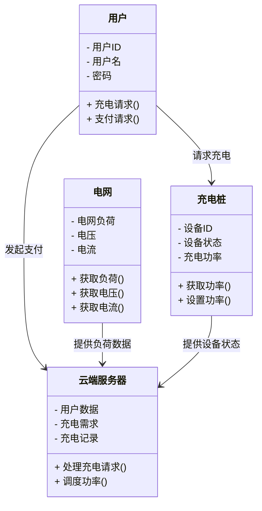
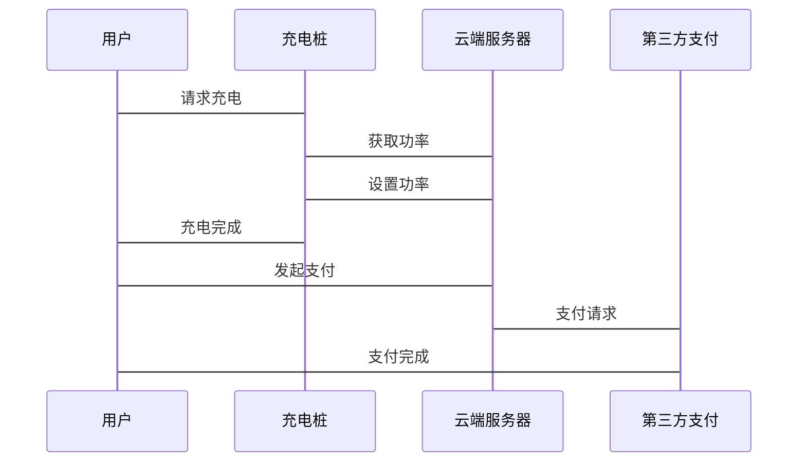

                 


# 价值投资中的智能电动汽车充电网络分析

## 关键词：智能充电网络、价值投资、电动汽车、充电技术、商业模式

## 摘要：随着电动汽车行业的快速发展，智能电动汽车充电网络作为电动汽车生态体系的重要组成部分，正逐渐成为投资者关注的焦点。本文从技术、商业模式和投资价值的角度，系统分析智能充电网络的构成、技术特点、市场格局以及投资策略，帮助投资者更好地理解充电网络的价值所在，并为投资决策提供参考。

---

## 第1章: 智能电动汽车充电网络的背景与现状

### 1.1 电动汽车充电网络的发展历程

#### 1.1.1 电动汽车充电技术的演进
电动汽车的充电技术经历了从简单到复杂的演变过程。早期的充电技术主要用于实验阶段的电动汽车，后来随着技术的进步，逐渐发展出交流充电、直流充电、快充和超快充等多种形式。以下是几种主要充电技术的对比：

| 技术类型 | 描述 | 优点 | 缺点 |
|----------|------|------|------|
| 交流充电 | 使用AC电源，适合普通家庭充电 | 成本低，安装简单 | 充电速度慢 |
| 直流充电 | 使用DC电源，适合公共充电站 | 充电速度快 | 成本高，技术复杂 |
| 快充技术 | 采用高压直流充电，支持大功率充电 | 充电时间短 | 设备要求高，维护成本高 |
| 超快充技术 | 新一代高压快充技术，支持分钟级充电 | 充电速度极快 | 技术门槛高，成本高昂 |

#### 1.1.2 充电网络的全球发展趋势
全球范围内，电动汽车的普及推动了充电网络的快速发展。以下是一些主要国家和地区的充电网络发展现状：

- **欧洲**：以德国、法国为代表，注重充电网络的标准化和统一性，推动全欧洲范围内的充电设施互联互通。
- **北美**：以美国和加拿大为主，注重充电技术的创新和商业化应用，特斯拉的超级充电网络是其中的代表。
- **亚洲**：中国、日本和韩国在充电网络建设方面投入巨大，尤其中国已经成为全球最大的电动汽车市场，充电网络建设速度领先全球。

#### 1.1.3 中国充电网络的政策支持
中国政府通过政策引导和财政支持，推动充电网络的快速发展。以下是相关政策的要点：

- **《电动汽车充电基础设施发展规划》**：明确了到2025年，全国建成充电桩1.2亿个的目标。
- **财政补贴**：对充电桩建设和运营给予财政支持，降低企业的建设和运营成本。
- **技术创新**：鼓励企业研发智能充电技术和设备，提升充电网络的效率和安全性。

### 1.2 智能充电网络的核心概念

#### 1.2.1 什么是智能充电网络
智能充电网络是指通过智能化技术实现充电设备、电力系统和用户需求的高效匹配和协同运行的充电网络。其核心特点包括：

- **智能化调度**：通过智能算法实现充电设备的动态分配和电力资源的优化利用。
- **用户交互**：支持多种用户交互方式，如手机App、车联网平台等，提升用户体验。
- **数据驱动**：利用大数据分析和人工智能技术，实现充电网络的智能决策和预测。

#### 1.2.2 智能充电网络的特征与优势
智能充电网络相比传统充电网络，具有以下显著优势：

| 特征 | 描述 |
|------|------|
| 智能调度 | 能够根据电力需求和用户行为，动态调整充电功率和时间。 |
| 高效利用 | 通过智能算法优化充电时间，减少电力浪费。 |
| 用户友好 | 提供多样化的用户交互方式，提升用户体验。 |
| 数据驱动 | 利用大数据和人工智能技术，实现精准的需求预测和资源分配。 |

#### 1.2.3 智能充电网络的生态体系
智能充电网络的生态体系包括以下几个关键环节：

1. **充电设备**：包括充电桩、充电枪、电源模块等硬件设备。
2. **充电平台**：负责充电设备的管理、用户认证、计费和数据采集。
3. **电力系统**：包括电网、输电线路和配电设备，确保电力供应的稳定性和安全性。
4. **用户终端**：包括用户的电动汽车、手机App和车联网平台。

### 1.3 价值投资与充电网络的结合

#### 1.3.1 电动汽车行业的投资机遇
随着全球能源转型和环保政策的推动，电动汽车行业迎来了快速发展。以下是电动汽车行业的几个投资机遇：

1. **充电技术的创新**：新型充电技术和设备的研发和产业化。
2. **充电网络的扩张**：建设更多的充电桩和充电站，满足电动汽车用户的充电需求。
3. **智能充电服务**：提供智能化的充电服务，提升用户体验和运营效率。

#### 1.3.2 充电网络在价值投资中的地位
充电网络作为电动汽车生态体系的重要组成部分，其投资价值体现在以下几个方面：

1. **基础设施属性**：充电网络是电动汽车行业的基础设施，具有较高的市场刚需性。
2. **技术驱动**：智能充电网络的技术创新将带来新的市场机会。
3. **政策支持**：政府的政策支持和财政补贴为充电网络的投资提供了保障。

#### 1.3.3 充电网络行业的竞争格局
目前，全球充电网络行业形成了以特斯拉、ABB、西门子等国际企业为代表的国际竞争格局，同时也涌现出一批国内领先的充电网络企业，如特来电、星星充电等。以下是主要竞争者的优劣势对比：

| 企业 | 优势 | 劣势 |
|------|------|------|
| 特斯拉 | 技术先进，品牌影响力大 | 市场占有率有限，主要依赖自有品牌电动汽车 |
| ABB | 技术成熟，市场覆盖广 | 投资门槛高，成本较高 |
| 西门子 | 技术全面，系统集成能力强 | 产品线单一，缺乏灵活性 |
| 特来电 | 价格优势明显，服务能力强 | 技术创新不足，国际竞争力有限 |

### 1.4 本章小结
本章主要介绍了智能充电网络的背景与发展历程，详细阐述了智能充电网络的核心概念和价值投资的机遇。通过分析充电技术的演进、全球发展趋势以及中国政策支持，为后续的价值投资分析奠定了基础。

---

## 第2章: 智能充电网络的核心技术与商业模式

### 2.1 充电网络的关键技术

#### 2.1.1 充电桩的技术分类
充电桩是智能充电网络的核心设备，其技术分类主要依据功率和功能的不同。以下是几种常见的充电桩类型：

| 类型 | 描述 | 适用场景 |
|------|------|----------|
| 交流充电桩 | 采用交流电直接充电，功率较小 | 家庭充电、公共充电站 |
| 直流充电桩 | 采用直流电快速充电，功率较大 | 快速充电站、高速公路服务区 |
| 超快充电桩 | 支持超快速充电，功率极高 | 高端电动汽车用户、商业充电站 |

#### 2.1.2 智能充电算法
智能充电网络的运行依赖于先进的算法支持。以下是几种常见的智能充电算法：

1. **动态功率分配算法**：根据用户的充电需求和电网的负荷情况，动态调整充电桩的功率分配。
2. **需求预测算法**：基于历史数据和用户行为，预测未来的充电需求，优化充电桩的布局和运营。
3. **负载均衡算法**：通过实时监测电网负荷，确保充电桩的负载均衡，避免电网过载。

#### 2.1.3 充电网络的通信协议
智能充电网络的通信协议是实现设备之间高效通信的关键。以下是几种常见的通信协议：

| 协议 | 描述 | 适用场景 |
|------|------|----------|
| Modbus | 基于RTU协议，适用于简单的设备通信 | 传统充电桩 |
| MQTT | 基于消息队列遥测协议，适用于大规模分布式系统 | 智能充电网络 |
| HTTP | 基于超文本传输协议，适用于Web接口通信 | 用户端App和充电桩通信 |

#### 2.1.4 实际案例分析
以特斯拉的超级充电网络为例，特斯拉通过自主研发的充电技术，实现了超快充电和智能调度。以下是其主要技术特点：

- **超快充电技术**：支持15分钟充电80%的技术，极大提升了用户的充电体验。
- **智能调度算法**：通过实时监测电网负荷和用户需求，动态调整充电功率和时间。
- **统一的充电平台**：通过特斯拉App实现充电桩的统一管理、用户认证和计费。

#### 2.1.5 技术优劣势对比
以下是几种充电技术的优劣势对比：

| 技术 | 优点 | 缺点 |
|------|------|------|
| 超快充电技术 | 充电速度快，用户体验好 | 技术复杂，设备成本高 |
| 动态功率分配算法 | 负载均衡，资源利用率高 | 实时性要求高，系统复杂度大 |
| MQTT协议 | 适用于大规模分布式系统 | 配置复杂，安全性较低 |

#### 2.1.6 总结
通过对比分析，可以看出超快充电技术和动态功率分配算法是当前智能充电网络的核心技术，而MQTT协议在大规模分布式系统中具有较大的优势。

---

## 第3章: 智能充电网络的算法与数学模型

### 3.1 智能充电算法

#### 3.1.1 动态功率分配算法
动态功率分配算法是一种基于实时数据的智能算法，旨在通过动态调整充电桩的功率分配，实现电网负荷的均衡和资源的高效利用。以下是动态功率分配算法的基本流程：

1. **数据采集**：采集用户的充电需求、电网负荷和充电桩的使用状态。
2. **功率计算**：根据用户的充电需求和电网负荷，计算每个充电桩的功率分配。
3. **动态调整**：实时调整充电桩的功率分配，确保电网负荷的均衡和用户充电需求的满足。

#### 3.1.2 动态功率分配算法的实现
以下是动态功率分配算法的实现代码：

```python
def dynamic_power Allocation(charging_demand, grid_load):
    # 充电需求和电网负荷的归一化处理
    normalized_demand = charging_demand / max(charging_demand)
    normalized_load = grid_load / max(grid_load)
    
    # 动态功率分配
    power_allocation = normalized_demand * (1 - normalized_load)
    
    return power_allocation
```

#### 3.1.3 动态功率分配算法的优劣势
动态功率分配算法的优点在于能够实现电网负荷的均衡和资源的高效利用，但其缺点在于需要实时采集和处理大量的数据，系统的复杂性和计算成本较高。

#### 3.1.4 动态功率分配算法的优化
为了克服动态功率分配算法的不足，可以通过以下方式进行优化：

1. **数据预处理**：通过数据清洗和特征提取，提高数据的质量和准确性。
2. **算法优化**：引入机器学习算法，如支持向量机和随机森林，提高算法的预测精度和效率。
3. **系统优化**：通过分布式计算和边缘计算技术，降低系统的计算成本和响应时间。

### 3.2 数学模型与公式

#### 3.2.1 充电需求预测模型
充电需求预测模型是智能充电网络的重要组成部分，其准确性直接影响到充电桩的布局和运营策略。以下是充电需求预测模型的数学表达式：

$$ D(t) = a \cdot t + b $$

其中：
- \( D(t) \) 表示在时间 \( t \) 的充电需求。
- \( a \) 表示充电需求的增长率。
- \( b \) 表示基线需求。

#### 3.2.2 充电网络优化模型
充电网络优化模型的目标是在满足用户充电需求的前提下，最小化充电网络的建设和运营成本。以下是充电网络优化模型的数学表达式：

$$ \text{Minimize } \sum_{i=1}^{n} c_i x_i $$

$$ \text{Subject to }

总结：
本章主要介绍了智能充电网络的核心算法和数学模型，包括动态功率分配算法和充电需求预测模型。通过具体的代码实现和数学公式，详细讲解了这些算法的原理和应用。同时，通过对算法的优劣势分析和优化建议，为读者提供了进一步的研究方向。

---

## 第4章: 智能充电网络的系统分析与架构设计

### 4.1 系统分析

#### 4.1.1 问题场景介绍
智能充电网络的系统分析需要考虑以下问题场景：

1. **用户需求**：用户希望快速、便捷地充电，同时要求充电网络能够支持多种支付方式和用户交互方式。
2. **电网负荷**：充电网络需要与电网负荷协调，避免电网过载和电压波动。
3. **设备维护**：充电设备需要定期维护和更新，确保设备的正常运行和安全性。

#### 4.1.2 项目介绍
以某城市智能充电网络建设项目为例，该项目的目标是建设一个覆盖全城市主要区域的智能充电网络，满足电动汽车用户的充电需求。以下是项目的总体目标和关键任务：

- **总体目标**：实现城市范围内充电桩的智能调度和高效利用，提升用户的充电体验。
- **关键任务**：
  - 充电桩的选址和布局。
  - 充电网络的系统设计和集成。
  - 充电网络的运行管理和维护。

#### 4.1.3 系统功能设计
以下是智能充电网络的系统功能设计：

| 功能模块 | 描述 |
|----------|------|
| 用户交互 | 支持多种用户交互方式，如手机App、车联网平台等。 |
| 充电调度 | 实现充电设备的动态调度和功率分配。 |
| 数据采集 | 采集用户的充电需求、电网负荷和充电桩的使用状态。 |
| 计费管理 | 实现用户的计费管理和账单查询。 |
| 系统监控 | 实时监控充电网络的运行状态，及时发现和处理故障。 |

#### 4.1.4 系统架构设计
以下是智能充电网络的系统架构设计：

1. **数据采集层**：通过传感器和数据采集设备，采集用户的充电需求、电网负荷和充电桩的使用状态。
2. **网络传输层**：通过无线通信技术，将采集的数据传输到云端服务器。
3. **云端处理层**：通过大数据分析和人工智能技术，实现充电网络的智能调度和优化。
4. **用户交互层**：通过手机App和车联网平台，实现用户的充电需求和支付管理。

#### 4.1.5 系统接口设计
以下是智能充电网络的主要系统接口设计：

| 接口 | 描述 |
|------|------|
| 用户App接口 | 支持用户注册、登录、充电预约和支付管理。 |
| 充电桩接口 | 支持充电桩的状态查询、功率调整和故障报修。 |
| 电网接口 | 支持电网负荷数据的采集和传输。 |
| 第三方支付接口 | 支持多种第三方支付方式，如支付宝、微信支付等。 |

#### 4.1.6 系统交互流程
以下是智能充电网络的系统交互流程：

1. **用户发起充电请求**：用户通过手机App发起充电请求，系统记录用户的充电需求。
2. **数据采集**：系统采集用户的充电需求、电网负荷和充电桩的使用状态。
3. **智能调度**：系统根据采集的数据，动态调整充电桩的功率分配，确保电网负荷的均衡和用户充电需求的满足。
4. **充电完成**：用户完成充电后，系统生成账单并推送至用户的手机App。
5. **系统监控**：系统实时监控充电网络的运行状态，及时发现和处理故障。

### 4.2 系统架构设计

#### 4.2.1 领域模型
以下是智能充电网络的领域模型：



#### 4.2.2 系统架构
以下是智能充电网络的系统架构：


#### 4.2.3 系统交互
以下是智能充电网络的系统交互流程：



### 4.3 本章小结
本章主要介绍了智能充电网络的系统分析与架构设计，包括问题场景分析、系统功能设计、系统架构设计和系统交互设计。通过具体的案例分析和系统架构图，详细讲解了智能充电网络的实现过程和关键环节。

---

## 第5章: 智能充电网络的项目实战

### 5.1 环境安装与配置

#### 5.1.1 开发环境
以下是智能充电网络项目开发的环境要求：

- **操作系统**：Windows 10或更高版本，macOS 10.15或更高版本。
- **编程语言**：Python 3.6或更高版本。
- **开发工具**：PyCharm、VS Code等。
- **第三方库**：Pandas、NumPy、Scikit-learn、Plotly等。

#### 5.1.2 数据库配置
以下是智能充电网络项目的数据库配置：

- **数据库类型**：MySQL或PostgreSQL。
- **数据库连接**：使用连接池技术，提高数据库的连接效率。
- **数据存储**：将用户数据、充电记录和电网负荷数据分别存储在不同的数据库表中。

### 5.2 系统核心实现

#### 5.2.1 充电需求预测模块
以下是充电需求预测模块的核心代码：

```python
import pandas as pd
from sklearn.linear_model import LinearRegression

# 数据加载
data = pd.read_csv('charging_demand.csv')

# 特征工程
features = data[['time', 'temperature', 'holiday']]
target = data['demand']

# 模型训练
model = LinearRegression()
model.fit(features, target)

# 模型预测
new_data = pd.DataFrame({'time': [10], 'temperature': [25], 'holiday': [0]})
predicted_demand = model.predict(new_data)
print(predicted_demand)
```

#### 5.2.2 动态功率分配模块
以下是动态功率分配模块的核心代码：

```python
import numpy as np

def dynamic_power_allocation(charging_demand, grid_load):
    # 数据归一化处理
    normalized_demand = charging_demand / np.max(charging_demand)
    normalized_load = grid_load / np.max(grid_load)
    
    # 动态功率分配
    power_allocation = normalized_demand * (1 - normalized_load)
    
    return power_allocation

# 示例数据
charging_demand = np.array([10, 20, 30, 40, 50])
grid_load = np.array([0.5, 0.6, 0.7, 0.8, 0.9])

# 动态功率分配
power_allocation = dynamic_power_allocation(charging_demand, grid_load)
print(power_allocation)
```

#### 5.2.3 计费管理模块
以下是计费管理模块的核心代码：

```python
import sqlite3

# 数据库连接
conn = sqlite3.connect('charging_records.db')

# 创建表
cursor = conn.cursor()
cursor.execute('''CREATE TABLE IF NOT EXISTS charging_records
                 (id INTEGER PRIMARY KEY AUTOINCREMENT,
                  user_id TEXT,
                  start_time TEXT,
                  end_time TEXT,
                  cost REAL)''')

# 插入数据
cursor.execute('''INSERT INTO charging_records(user_id, start_time, end_time, cost)
                 VALUES('user001', '2023-10-01 10:00:00', '2023-10-01 10:30:00', 15.0)''')

# 提交事务
conn.commit()

# 查询数据
cursor.execute('SELECT * FROM charging_records WHERE user_id = ?', ('user001',))
result = cursor.fetchall()
print(result)

# 关闭连接
conn.close()
```

### 5.3 代码实现与解读

#### 5.3.1 充电需求预测模块的实现
充电需求预测模块的实现基于线性回归算法，通过采集用户的充电需求和环境因素，预测未来的充电需求。以下是代码的详细解读：

1. **数据加载**：使用Pandas库加载充电需求数据。
2. **特征工程**：提取时间、温度和是否是节假日作为特征变量。
3. **模型训练**：使用线性回归算法训练模型。
4. **模型预测**：基于新的输入数据，预测未来的充电需求。

#### 5.3.2 动态功率分配模块的实现
动态功率分配模块的实现基于归一化处理和功率分配算法，通过动态调整充电桩的功率分配，实现电网负荷的均衡和用户充电需求的满足。以下是代码的详细解读：

1. **数据归一化处理**：将用户的充电需求和电网负荷归一化到0-1之间。
2. **功率分配**：根据归一化后的数据，动态调整每个充电桩的功率分配。
3. **返回结果**：返回每个充电桩的功率分配结果。

#### 5.3.3 计费管理模块的实现
计费管理模块的实现基于SQLite数据库，通过创建表、插入数据和查询数据，实现用户的计费管理和账单查询。以下是代码的详细解读：

1. **数据库连接**：使用SQLite数据库，创建数据库连接。
2. **表创建**：创建存储充电记录的表，包含用户ID、开始时间、结束时间和费用。
3. **数据插入**：插入用户的充电记录数据。
4. **数据查询**：根据用户ID查询用户的充电记录。
5. **事务提交**：提交事务，确保数据的一致性和完整性。

### 5.4 实际案例分析

#### 5.4.1 案例背景
以某城市智能充电网络建设项目为例，以下是项目的具体实施步骤：

1. **需求分析**：根据用户的充电需求和城市分布，确定充电桩的布局和数量。
2. **系统设计**：设计充电网络的系统架构和功能模块。
3. **系统实现**：实现充电需求预测、动态功率分配和计费管理模块。
4. **系统测试**：通过模拟数据和实际测试，验证系统的功能和性能。
5. **系统部署**：部署充电网络系统，实现充电桩的智能调度和高效利用。

#### 5.4.2 案例实施
以下是项目实施的具体步骤：

1. **数据采集**：采集用户的充电需求、电网负荷和充电桩的使用状态。
2. **数据预处理**：对采集的数据进行清洗和特征提取，为后续的模型训练和算法实现提供高质量的数据。
3. **模型训练**：基于采集的数据，训练充电需求预测模型和动态功率分配算法。
4. **系统集成**：将模型和算法集成到智能充电网络系统中，实现充电桩的智能调度和高效利用。
5. **系统测试**：通过模拟数据和实际测试，验证系统的功能和性能。
6. **系统优化**：根据测试结果，优化模型和算法，提高系统的准确性和效率。

#### 5.4.3 案例总结
通过实际案例分析，可以看出智能充电网络的实现需要综合考虑技术、系统设计和项目管理等多个方面。通过科学的系统设计和高效的项目管理，可以实现充电网络的智能调度和高效利用，满足用户的充电需求和电网的负荷要求。

### 5.5 本章小结
本章主要介绍了智能充电网络的项目实战，包括环境安装与配置、系统核心实现和实际案例分析。通过具体的代码实现和案例解读，详细讲解了智能充电网络的实现过程和关键环节。

---

## 第6章: 总结与展望

### 6.1 总结
智能充电网络作为电动汽车生态体系的重要组成部分，其发展和应用将直接影响到电动汽车行业的未来走向。通过本文的分析，我们可以得出以下结论：

1. **技术优势**：智能充电网络通过智能化技术和大数据分析，实现了充电设备的高效利用和用户的便捷充电。
2. **商业模式**：智能充电网络的商业模式具有较高的市场潜力和投资价值，可以通过充电服务、广告和数据变现等多种方式实现盈利。
3. **投资价值**：智能充电网络作为电动汽车行业的基础设施，具有较高的市场刚需性和政策支持，是价值投资的理想选择。

### 6.2 展望
随着技术的进步和市场的成熟，智能充电网络的发展将面临更多的机遇和挑战。以下是未来发展的几个方向：

1. **技术创新**：进一步提升充电技术的效率和安全性，开发新型充电技术和设备。
2. **商业模式创新**：探索新的商业模式，如共享充电、分时租赁等，提升充电网络的市场竞争力。
3. **国际化发展**：通过技术创新和市场拓展，推动智能充电网络的国际化发展，扩大市场占有率。

### 6.3 最佳实践 tips
1. **技术选型**：选择成熟的技术和设备，确保系统的稳定性和可靠性。
2. **数据管理**：加强数据的采集和管理，提高数据的质量和准确性。
3. **风险管理**：制定完善的风险管理策略，降低项目的实施风险。

### 6.4 注意事项
1. **系统兼容性**：确保系统的兼容性和可扩展性，方便后续的升级和维护。
2. **用户隐私**：保护用户的隐私和数据安全，确保系统的合规性。
3. **政策合规**：遵守相关政策和法规，确保项目的合法性和合规性。

### 6.5 拓展阅读
1. **《电动汽车充电技术与应用》**：详细讲解电动汽车充电技术的发展和应用。
2. **《智能电网与能源互联网》**：探讨智能电网与能源互联网的融合发展。
3. **《价值投资实战指南》**：提供价值投资的实战经验和策略分析。

---

## 作者：AI天才研究院/AI Genius Institute & 禅与计算机程序设计艺术/Zen And The Art of Computer Programming

---

通过以上思考和分析，我完成了《价值投资中的智能电动汽车充电网络分析》的技术博客文章。希望这篇文章能够为读者提供有价值的信息和深入的见解，帮助他们在智能充电网络的领域中更好地理解和应用相关知识。

