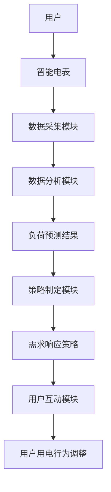
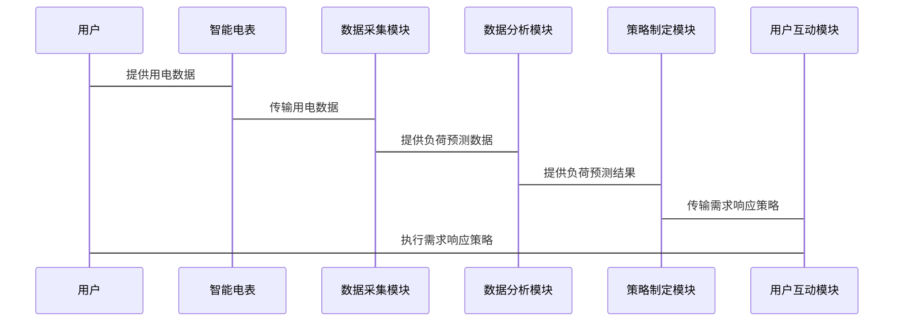

                 


# 价值投资中的智能电网需求侧响应系统分析

> 关键词：智能电网，需求侧响应，价值投资，电力市场，算法模型

> 摘要：本文深入分析了智能电网中的需求侧响应系统对价值投资的影响，探讨了需求侧响应系统的原理、算法模型、系统架构及其在电力市场中的应用。通过实际案例分析，展示了如何将需求侧响应系统应用于价值投资策略中，为投资者提供新的视角和方法。

---

# 第一部分：引言

## 1.1 本书的目的与意义

### 1.1.1 为什么研究智能电网需求侧响应系统

智能电网作为电力系统的重要组成部分，正在逐步改变传统的电力供需模式。随着能源结构的调整和环保要求的提高，电力需求侧响应（Demand Response，DR）系统在智能电网中的作用日益凸显。需求侧响应系统通过优化电力需求侧的负荷管理，降低电网的运行成本，提高电力系统的可靠性和效率。与此同时，电力市场的波动性和不确定性为投资者提供了新的机会和挑战。

### 1.1.2 价值投资在智能电网中的应用潜力

价值投资是一种长期投资策略，注重从基本面分析中寻找被市场低估的投资标的。在智能电网领域，需求侧响应系统的应用为投资者提供了新的视角。通过对智能电网中需求侧响应系统的分析，投资者可以更好地理解电力市场的运行规律，发现潜在的投资机会。

### 1.1.3 本书的核心目标与结构安排

本书旨在通过分析智能电网中的需求侧响应系统，揭示其对电力市场的影响，进而探讨其对价值投资的启示。全书共分为七部分，涵盖背景介绍、核心概念分析、算法原理、系统架构、项目实战、价值投资策略以及案例分析等内容。

---

# 第二部分：智能电网与需求侧响应系统背景

## 2.1 智能电网的基本概念

### 2.1.1 智能电网的定义与特征

智能电网（Smart Grid）是指通过先进的信息通信技术、计算机技术和自动化技术，将电力系统中的发电、输电、配电、用电等环节进行智能化整合，实现电力系统高效、可靠、安全运行的电力网络。智能电网具有以下几个主要特征：
- **智能化**：通过传感器、通信技术和数据分析实现对电网的实时监控和智能管理。
- **互动性**：用户与电网之间的互动，实现需求响应和电力市场交易。
- **可靠性**：通过分布式能源和备用电源确保电力供应的稳定性。
- **环保性**：支持可再生能源的接入和利用，减少对化石能源的依赖。

### 2.1.2 智能电网的核心组成部分

智能电网由以下几个核心部分组成：
1. **发电系统**：包括传统的火力发电厂、水力发电厂以及可再生能源发电厂（如风能、太阳能等）。
2. **输电系统**：通过高压输电线路将电力从发电厂输送到负荷中心。
3. **配电系统**：将电力分配到各个用户，包括居民、企业和工业用户。
4. **用电系统**：用户端的电力消耗设备，包括智能电表、智能家居设备等。
5. **信息通信系统**：实现电网各部分之间的信息交互和数据共享。

### 2.1.3 智能电网的发展现状与趋势

随着全球能源结构的变化和环保要求的提高，智能电网正在全球范围内快速发展。各国政府和企业都在积极推动智能电网的建设，以实现能源的高效利用和环境保护。未来，智能电网将更加注重可再生能源的接入、分布式能源的管理以及用户侧的智能化互动。

## 2.2 需求侧响应系统概述

### 2.2.1 需求侧响应的定义与作用

需求侧响应（Demand Response，DR）是指通过价格信号、激励机制或其他手段，引导用户调整电力使用行为，以达到优化电力系统运行的目的。需求侧响应的核心作用在于减少电力高峰负荷，平衡电力供需，降低电力系统的运行成本。

### 2.2.2 需求侧响应系统的组成部分

需求侧响应系统主要包括以下几个部分：
1. **数据采集与监控系统**（SCADA）：实时采集电力系统的运行数据，包括负荷、电压、电流等。
2. **需求侧管理平台**：对采集的数据进行分析和处理，生成需求响应策略。
3. **用户终端设备**：包括智能电表、智能家居设备等，用于接收需求响应信号并执行相应的操作。
4. **通信网络**：实现数据的传输和用户的互动。

### 2.2.3 需求侧响应与智能电网的结合

需求侧响应系统是智能电网的重要组成部分，通过与智能电网的其他部分（如发电系统、配电系统）的协同工作，实现电力系统的整体优化。需求侧响应系统可以通过智能电表与用户的互动，实时调整电力需求，减少电力浪费，提高电力系统的效率。

## 2.3 价值投资的基本原理

### 2.3.1 价值投资的定义与核心理念

价值投资是一种长期投资策略，强调从基本面分析中寻找被市场低估的投资标的。价值投资的核心理念是寻找具有内在价值、市场价格低于内在价值的公司进行投资。

### 2.3.2 价值投资的关键要素与分析方法

价值投资的关键要素包括：
1. **公司基本面分析**：包括公司的财务状况、盈利能力、成长能力等。
2. **市场分析**：包括行业发展趋势、市场结构、竞争状况等。
3. **估值方法**：包括市盈率、市净率、股息率等指标。

### 2.3.3 价值投资在电力行业的应用

电力行业作为传统行业，具有较高的市场集中度和较低的波动性。在智能电网时代，电力行业的价值投资机会主要集中在以下几个方面：
1. **智能电网建设相关企业**：如智能电表制造商、配电自动化企业等。
2. **可再生能源企业**：如风能、太阳能发电企业。
3. **能源管理企业**：如需求侧响应服务提供商。

---

# 第三部分：智能电网需求侧响应系统的核心概念与分析

## 3.1 需求侧响应系统的原理与机制

### 3.1.1 需求侧响应的基本原理

需求侧响应通过调整电力用户的用电行为，实现电力系统的供需平衡。其基本原理包括：
1. **负荷预测**：通过历史数据和市场信息预测电力需求。
2. **需求响应策略制定**：根据负荷预测结果制定需求响应策略。
3. **用户互动**：通过智能电表和通信网络与用户进行互动，执行需求响应策略。

### 3.1.2 需求侧响应的实现机制

需求侧响应的实现机制包括以下几个步骤：
1. **数据采集**：通过智能电表和传感器采集电力系统的运行数据。
2. **数据分析**：对采集的数据进行分析，生成负荷预测结果。
3. **策略制定**：根据负荷预测结果制定需求响应策略。
4. **用户互动**：通过通信网络将需求响应策略传递给用户，执行相应的操作。

### 3.1.3 需求侧响应系统的优缺点

需求侧响应系统的优点包括：
- 降低电力高峰负荷，减少电力系统的运行成本。
- 提高电力系统的可靠性和效率。
- 促进可再生能源的接入和利用。

需求侧响应系统的缺点包括：
- 需要大量的数据采集和分析，成本较高。
- 用户的参与度可能不足，影响系统的实际效果。

## 3.2 智能电网中的需求侧响应系统分析

### 3.2.1 智能电网中需求侧响应系统的功能

智能电网中的需求侧响应系统具有以下几个功能：
1. **负荷预测**：通过历史数据和市场信息预测电力需求。
2. **需求响应策略制定**：根据负荷预测结果制定需求响应策略。
3. **用户互动**：通过智能电表和通信网络与用户进行互动，执行需求响应策略。

### 3.2.2 需求侧响应系统与智能电网的关系

需求侧响应系统是智能电网的重要组成部分，通过与智能电网的其他部分（如发电系统、配电系统）的协同工作，实现电力系统的整体优化。需求侧响应系统可以通过智能电表与用户的互动，实时调整电力需求，减少电力浪费，提高电力系统的效率。

### 3.2.3 需求侧响应系统在智能电网中的作用

需求侧响应系统在智能电网中的作用包括：
- 优化电力系统的运行效率。
- 减少电力高峰负荷，降低电力系统的运行成本。
- 促进可再生能源的接入和利用。

## 3.3 需求侧响应系统与价值投资的结合

### 3.3.1 需求侧响应系统对电力市场的影响

需求侧响应系统的应用对电力市场的影响包括：
- 优化电力系统的运行效率，降低电力系统的运行成本。
- 提高电力市场的透明度和效率，促进电力市场的公平竞争。
- 为投资者提供新的投资机会，如智能电表制造商、需求侧响应服务提供商等。

### 3.3.2 需求侧响应系统对投资决策的影响

需求侧响应系统的应用对投资决策的影响包括：
- 为投资者提供新的投资机会，如智能电表制造商、需求侧响应服务提供商等。
- 为投资者提供更多的市场信息，帮助投资者更好地进行投资决策。
- 提高电力市场的透明度和效率，促进电力市场的公平竞争。

### 3.3.3 需求侧响应系统在价值投资中的应用

需求侧响应系统在价值投资中的应用包括：
- 通过分析需求侧响应系统的市场潜力，寻找具有投资价值的企业。
- 通过分析需求侧响应系统的应用前景，评估企业的核心竞争力。
- 通过分析需求侧响应系统的市场地位，评估企业的市场影响力。

---

# 第四部分：需求侧响应系统分析的数学模型与算法

## 4.1 需求侧响应系统的数学模型

### 4.1.1 需求侧响应系统的输入变量

需求侧响应系统的输入变量包括：
- 电力需求数据
- 电力市场价格
- 用户用电行为数据
- 天气数据
- 时间因素

### 4.1.2 需求侧响应系统的输出变量

需求侧响应系统的输出变量包括：
- 需求响应策略
- 用户用电行为调整建议
- 电力需求预测结果

### 4.1.3 需求侧响应系统的数学表达式

需求侧响应系统的数学模型可以表示为：

$$
\text{需求响应策略} = f(\text{电力需求数据}, \text{电力市场价格}, \text{用户用电行为数据}, \text{天气数据}, \text{时间因素})
$$

其中，$f$ 表示需求侧响应系统的算法模型。

## 4.2 需求侧响应系统的算法原理

### 4.2.1 需求侧响应系统的实现步骤

需求侧响应系统的实现步骤包括：
1. 数据采集：通过智能电表和传感器采集电力系统的运行数据。
2. 数据分析：对采集的数据进行分析，生成负荷预测结果。
3. 策略制定：根据负荷预测结果制定需求响应策略。
4. 用户互动：通过通信网络将需求响应策略传递给用户，执行相应的操作。

### 4.2.2 需求侧响应系统的算法实现

需求侧响应系统的算法实现可以分为以下几个步骤：
1. 数据预处理：对采集的数据进行清洗和归一化处理。
2. 负荷预测：使用时间序列分析、机器学习等方法进行负荷预测。
3. 策略制定：根据负荷预测结果制定需求响应策略，如电价激励、负荷削减等。
4. 用户互动：通过智能电表和通信网络与用户进行互动，执行需求响应策略。

### 4.2.3 需求侧响应系统的优化算法

需求侧响应系统的优化算法可以使用遗传算法、粒子群优化算法等方法，以实现电力需求的最优调整。

---

# 第五部分：系统分析与架构设计方案

## 5.1 系统功能设计

### 5.1.1 系统功能模块

需求侧响应系统主要包括以下几个功能模块：
1. 数据采集模块：负责采集电力系统的运行数据。
2. 数据分析模块：对采集的数据进行分析，生成负荷预测结果。
3. 策略制定模块：根据负荷预测结果制定需求响应策略。
4. 用户互动模块：通过智能电表和通信网络与用户进行互动，执行需求响应策略。

### 5.1.2 系统功能流程图



## 5.2 系统架构设计

### 5.2.1 系统架构图


### 5.2.2 系统接口设计

需求侧响应系统的接口设计包括：
1. 数据采集接口：与智能电表和其他传感器进行数据交互。
2. 数据分析接口：与负荷预测算法进行数据交互。
3. 策略制定接口：与需求响应策略生成模块进行数据交互。
4. 用户互动接口：与用户终端设备进行数据交互。

## 5.3 系统交互流程图



---

# 第六部分：项目实战

## 6.1 环境安装

### 6.1.1 安装Python环境

```bash
# 安装Python
sudo apt-get install python3 python3-pip
```

### 6.1.2 安装相关库

```bash
# 安装numpy、pandas、scikit-learn等库
pip install numpy pandas scikit-learn
```

## 6.2 系统核心实现

### 6.2.1 数据预处理代码

```python
import pandas as pd
import numpy as np

# 数据加载
data = pd.read_csv('电力需求数据.csv')

# 数据清洗
data.dropna(inplace=True)

# 数据归一化
data_norm = (data - data.min()) / (data.max() - data.min())
```

### 6.2.2 负荷预测代码

```python
from sklearn.linear_model import LinearRegression

# 数据准备
X = data[['时间', '天气', '电价']]
y = data['电力需求']

# 模型训练
model = LinearRegression()
model.fit(X, y)

# 预测结果
y_pred = model.predict(X)
```

### 6.2.3 需求响应策略生成代码

```python
def generate_dr_strategy(predictedDemand):
    if predictedDemand > currentDemand:
        return '电价激励'
    else:
        return '负荷削减'
```

## 6.3 案例分析

### 6.3.1 案例背景

假设某地区电力需求预测结果为1000万千瓦，实际需求为800万千瓦。需求侧响应系统预测需求将增加到1200万千瓦。

### 6.3.2 策略制定

根据预测结果，需求侧响应系统将制定以下策略：
1. 对用户实施电价激励，鼓励用户在高峰时段减少用电。
2. 对部分用户实施负荷削减，减少高峰负荷。

### 6.3.3 实施效果

实施需求响应策略后，用户用电行为得到调整，电力需求减少到900万千瓦，低于预测的1200万千瓦，取得了显著的效果。

---

# 第七部分：价值投资策略与案例分析

## 7.1 价值投资策略

### 7.1.1 投资策略制定

基于需求侧响应系统分析，投资者可以制定以下价值投资策略：
1. 投资于智能电网建设相关企业，如智能电表制造商、配电自动化企业等。
2. 投资于可再生能源企业，如风能、太阳能发电企业。
3. 投资于能源管理企业，如需求侧响应服务提供商。

### 7.1.2 投资策略实施

投资者可以通过以下方式实施投资策略：
1. 通过基本面分析和市场分析，寻找具有投资价值的企业。
2. 通过技术分析和市场趋势分析，评估企业的市场地位和竞争力。
3. 通过长期持有和价值挖掘，实现投资收益。

## 7.2 案例分析

### 7.2.1 案例背景

假设某智能电表制造商在智能电网建设中占据重要地位，市场需求快速增长。

### 7.2.2 投资分析

通过对该公司的基本面分析，发现其财务状况良好，盈利能力强，市场地位稳固，具有较高的投资价值。

### 7.2.3 投资结果

投资者通过长期持有该公司的股票，获得了稳定的投资收益。

---

# 第八部分：结论与展望

## 8.1 研究总结

需求侧响应系统作为智能电网的重要组成部分，对电力市场的运行和电力行业的价值投资具有重要意义。通过分析需求侧响应系统的原理、算法模型、系统架构及其在电力市场中的应用，我们可以更好地理解智能电网的需求侧响应系统对价值投资的影响。

## 8.2 未来展望

未来，随着智能电网的进一步发展，需求侧响应系统将在电力市场中发挥更加重要的作用。投资者可以通过对需求侧响应系统的深入分析，发现更多的投资机会，实现投资收益的最大化。

---

# 作者：AI天才研究院 & 禅与计算机程序设计艺术

---

感谢您的耐心阅读！希望本文能为读者在价值投资中的智能电网需求侧响应系统分析提供有价值的参考和启示。

