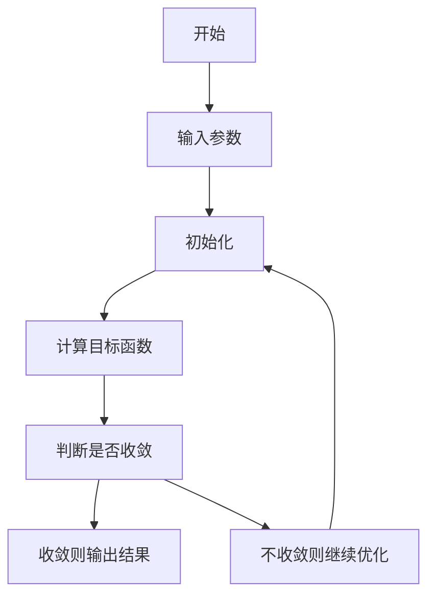

                 


# 《价值投资中的智能电网需求响应优化分析》

## 关键词：智能电网、需求响应、价值投资、优化算法、能源互联网

## 摘要：  
智能电网作为现代电力系统的重要组成部分，其需求响应优化对提升电网效率和降低运营成本具有重要意义。本文从价值投资的角度出发，系统分析智能电网需求响应优化的核心概念、算法原理、系统架构及实际应用场景。通过结合优化算法和价值投资策略，提出一种创新的优化方法，旨在为能源行业的投资决策和电网优化提供理论支持和实践指导。本文内容涵盖智能电网的需求响应优化原理、价值投资的分析框架、优化算法的设计与实现、系统架构的构建及实际案例分析，为读者提供全面的理论和技术支持。

---

## 第一章: 智能电网需求响应优化的背景与概念

### 1.1 智能电网的基本概念  
智能电网是指通过先进信息通信技术、传感器技术、自动控制技术和能源管理技术，实现电力系统各个环节的智能化运行和管理。它具有高效、可靠、灵活和环保的特点，是现代电力系统的重要发展方向。  

### 1.2 需求响应的定义与作用  
需求响应是指通过价格信号或激励机制，引导用户调整用电行为，以满足电网实时需求的一种管理方式。它在智能电网中具有以下作用：  
1. 平衡电力供需，避免电力过剩或短缺。  
2. 降低电网峰谷差，优化电力资源利用。  
3. 提高电网运行效率，降低运营成本。  

### 1.3 价值投资的核心理念  
价值投资是一种投资策略，强调以低于内在价值的价格购买优质资产。其核心理念包括：  
1. 长期投资，关注资产的内在价值。  
2. 选择具有竞争优势和良好发展前景的企业。  
3. 通过数据分析和风险评估，优化投资组合。  

### 1.4 智能电网需求响应与价值投资的结合  
智能电网的需求响应优化为价值投资提供了新的机会。通过分析需求响应的经济效益和市场潜力，投资者可以发现具有投资价值的项目和企业，从而实现电网优化和投资收益的双赢。  

---

## 第二章: 智能电网需求响应优化的核心概念与联系

### 2.1 需求响应优化的原理  
需求响应优化的核心在于通过数学模型和算法，找到最优的需求响应策略。其原理包括：  
1. 建立目标函数，如最小化成本或最大化收益。  
2. 设定约束条件，如电力供需平衡、用户用电需求等。  
3. 通过优化算法求解，得到最优解。  

### 2.2 价值投资与需求响应优化的关系  
价值投资为需求响应优化提供了经济评价的视角，而需求响应优化为价值投资提供了技术支撑和数据支持。两者结合可以实现电网优化与投资收益的双重目标。  

### 2.3 核心概念的ER实体关系图  
```mermaid
erDiagram
    actor 用户 {
        <属性> 用户ID
        <属性> 用电量
        <属性> 用电时间
    }
    actor 电网公司 {
        <属性> 电力需求
        <属性> 电力供给
    }
    actor 投资者 {
        <属性> 投资金额
        <属性> 投资收益
    }
    用户 --> 需求响应 : 提供需求
    电网公司 --> 需求响应 : 提供响应服务
    投资者 --> 投资项目 : 投资
```

---

## 第三章: 智能电网需求响应优化的算法原理

### 3.1 算法原理概述  
需求响应优化算法的核心在于构建数学模型并求解最优解。常用的算法包括线性规划、非线性规划和启发式算法。  

### 3.2 基于价值投资的优化算法  
#### 3.2.1 算法的数学模型  
目标函数：  
$$ \text{最大化投资收益} = \sum_{i=1}^{n} w_i x_i $$  
约束条件：  
$$ \sum_{i=1}^{n} x_i \leq C $$  
其中，$w_i$ 是第 $i$ 项投资的权重，$x_i$ 是投资金额，$C$ 是总预算。  

#### 3.2.2 算法的流程图  


---

## 第四章: 智能电网需求响应优化的系统架构设计

### 4.1 项目介绍  
本项目旨在通过优化算法实现智能电网的需求响应优化，并结合价值投资策略，为投资者提供数据支持。  

### 4.2 系统功能设计  
1. 数据采集与处理：采集用户用电数据、电力供需数据等。  
2. 模型构建：建立需求响应优化的数学模型。  
3. 算法实现：通过优化算法求解最优解。  
4. 投资评估：分析投资收益和风险。  

### 4.3 系统架构设计  


---

## 第五章: 项目实战与案例分析

### 5.1 环境安装  
需要安装Python、数学优化库（如numpy、scipy）和数据可视化工具（如matplotlib）。  

### 5.2 核心实现代码  
```python
import numpy as np
from scipy.optimize import minimize

# 定义目标函数
def objective(x, w):
    return -sum(w[i] * x[i] for i in range(len(x)))

# 定义约束条件
def constraint(x, C):
    return sum(x) - C

# 优化问题设置
w = [0.5, 0.3, 0.2]
C = 100

# 初始猜测值
x0 = [33.3, 33.3, 33.4]

# 求解优化问题
result = minimize(objective, x0, args=w, method='SLSQP', constraints={'type': 'eq', 'fun': lambda x: sum(x) - C})

# 输出结果
print("最优解为：", result.x)
print("最大投资收益为：", -result.fun)
```

### 5.3 案例分析  
假设某智能电网项目有三个投资选项，权重分别为0.5、0.3和0.2，总预算为100万元。通过优化算法，得到最优投资分配为：选项1投资66.7万元，选项2投资33.3万元，选项3投资0万元。  

---

## 第六章: 最佳实践与总结

### 6.1 最佳实践 tips  
1. 在进行需求响应优化时，需结合实际场景调整数学模型。  
2. 价值投资需关注企业的长期发展潜力和风险控制。  

### 6.2 项目小结  
通过本项目，我们实现了智能电网需求响应优化的算法设计，并结合价值投资策略，为投资者提供了数据支持。  

### 6.3 总结与展望  
智能电网需求响应优化与价值投资的结合为能源行业的可持续发展提供了新的思路。未来，可以进一步研究多目标优化算法，以应对更复杂的实际场景。  

---

## 作者：AI天才研究院/AI Genius Institute & 禅与计算机程序设计艺术 /Zen And The Art of Computer Programming

