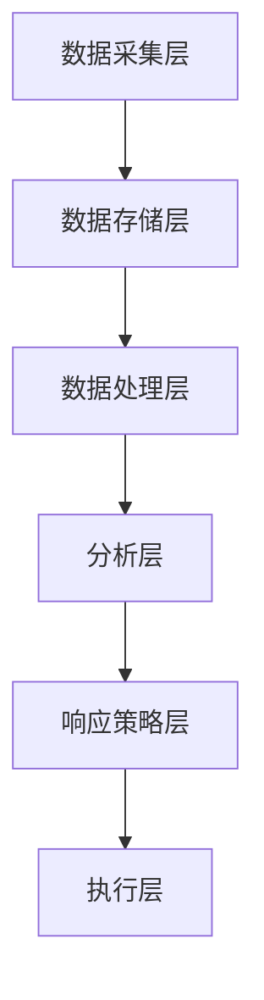

                 


# 价值投资中的智能电网需求响应系统分析

## 关键词：智能电网，需求响应系统，价值投资，算法分析，系统架构

## 摘要：智能电网和价值投资的结合为电力市场分析和投资决策提供了新的思路。本文通过分析智能电网需求响应系统的结构和算法，结合价值投资的理论，探讨如何利用智能技术优化电力市场投资策略，实现长期稳健的投资回报。

---

# 第一部分：智能电网需求响应系统概述

## 第1章：背景介绍

### 1.1 智能电网的基本概念

智能电网是一种现代化的电力网络，利用先进的信息通信技术和自动化设备，实现电力的高效传输、分配和管理。它包括智能计量、配电自动化、电网状态监测等多个组成部分，旨在提高电网的可靠性和效率。

### 1.2 价值投资的基本概念

价值投资是一种长期投资策略，强调通过分析企业的基本面，寻找被市场低估的投资标的。其核心思想是购买那些具有持续竞争优势和良好管理的公司，长期持有，获取超额收益。

### 1.3 智能电网需求响应系统的背景分析

随着能源互联网的发展，电力市场逐渐呈现出复杂化和多样化的特征。智能电网需求响应系统通过实时监测和分析电力需求，优化电力供应，降低能源浪费。同时，电力市场的波动性和不确定性为投资者提供了丰富的投资机会。

### 1.4 价值投资在智能电网中的应用分析

通过分析智能电网中的数据，投资者可以更好地理解电力市场的供需关系，预测电价波动，优化投资组合。例如，通过分析用户的用电行为数据，投资者可以预测电价高峰期，提前布局相关能源企业，获取超额收益。

---

## 第2章：核心概念与联系

### 2.1 智能电网需求响应系统的组成

智能电网需求响应系统主要包括数据采集与监控（SCADA）、需求响应管理（DRM）、用户行为分析（UBA）和电价预测（PP）四个模块。这些模块协同工作，实现电力需求的动态调整。

### 2.2 价值投资的分析框架

价值投资的分析框架包括企业基本面分析、行业竞争分析、管理层能力评估等多个方面。在智能电网领域，投资者需要重点关注企业的技术创新能力、市场占有率和财务健康状况。

### 2.3 智能电网需求响应系统的ER实体关系图

```mermaid
er
    entity 用户 {
        用户ID
        用户类型
        用电量
    }
    entity 设备 {
        设备ID
        设备类型
        连接状态
    }
    entity 电价 {
        时间戳
        地区
        零售电价
        批发电价
    }
    relation 用户-设备 {
        用户ID
        设备ID
        关系：拥有
    }
```

### 2.4 算法原理

#### 2.4.1 线性回归分析

线性回归是一种常用的统计分析方法，用于预测变量之间的线性关系。在智能电网中，可以使用线性回归分析用户用电量与电价之间的关系。

公式：
$$ y = \beta_0 + \beta_1x + \epsilon $$

其中，$y$为用户用电量，$x$为电价，$\beta_0$和$\beta_1$为回归系数，$\epsilon$为误差项。

#### 2.4.2 随机森林算法

随机森林是一种基于决策树的集成学习算法，适用于分类和回归问题。在智能电网中，可以使用随机森林算法预测用户用电行为。

代码示例：
```python
from sklearn.ensemble import RandomForestRegressor
import pandas as pd
import numpy as np

# 数据加载与预处理
data = pd.read_csv('electricity_data.csv')
X = data[['time', 'temperature', 'humidity']]
y = data['demand']

# 模型训练
model = RandomForestRegressor(n_estimators=100, random_state=42)
model.fit(X, y)

# 预测与评估
y_pred = model.predict(X)
print('均方误差:', np.mean((y_pred - y) ** 2))
```

---

## 第3章：系统分析与架构设计

### 3.1 问题场景

智能电网需求响应系统的应用场景包括电力需求预测、电价波动分析、用户行为预测等。通过实时数据分析，优化电力供应和需求，降低能源浪费。

### 3.2 系统功能设计

系统功能包括数据采集、分析、响应策略制定和执行反馈。数据采集模块负责收集用户的用电数据和市场价格信息；分析模块利用机器学习算法预测用电需求和电价波动；响应策略模块根据分析结果制定最优响应策略；执行反馈模块实时监控策略执行情况。

### 3.3 系统架构设计



### 3.4 系统接口设计

系统接口包括API接口、用户界面和数据接口。API接口用于与其他系统进行数据交互；用户界面供用户查询和管理数据；数据接口用于实时数据采集和传输。

---

## 第4章：项目实战

### 4.1 环境安装

安装Python、Pandas、Scikit-learn等库，配置开发环境。

### 4.2 核心代码实现

使用Python编写智能电网需求响应系统的数据采集、分析和预测模块。

代码示例：
```python
import pandas as pd
from sklearn.linear_model import LinearRegression
from sklearn.metrics import mean_squared_error

# 数据加载
data = pd.read_csv('electricity.csv')

# 数据预处理
X = data[['price', 'time']]
y = data['demand']

# 模型训练
model = LinearRegression()
model.fit(X, y)

# 预测与评估
y_pred = model.predict(X)
print('均方误差:', mean_squared_error(y, y_pred))
```

### 4.3 代码解读与分析

代码实现线性回归模型，用于预测用户用电需求。数据预处理部分提取电价和时间特征，模型训练部分使用线性回归算法，预测结果用于优化电力供应策略。

### 4.4 实际案例分析

以某地区电力数据为例，分析电价波动对用户用电行为的影响，预测电价高峰期，优化投资组合。

### 4.5 项目总结

项目展示了如何利用智能电网数据进行价值投资分析，帮助投资者在电力市场中获取超额收益。

---

## 第5章：最佳实践、小结、注意事项和拓展阅读

### 5.1 最佳实践

- 数据质量是关键，确保数据的准确性和完整性。
- 算法选择要根据实际问题，灵活调整模型参数。
- 系统架构设计要模块化，便于扩展和维护。

### 5.2 小结

智能电网需求响应系统为电力市场分析提供了新的工具和方法。通过价值投资的理论指导，投资者可以更好地把握市场机会，实现长期稳健的投资回报。

### 5.3 注意事项

- 数据隐私和安全问题需要高度重视。
- 算法的可解释性和透明度是实际应用中的重要考量。
- 系统的实时性和稳定性是保障投资决策的关键。

### 5.4 拓展阅读

推荐阅读《智能电网技术与应用》和《价值投资实战策略》，深入了解智能电网和价值投资的更多细节。

---

## 作者：AI天才研究院/AI Genius Institute & 禅与计算机程序设计艺术 /Zen And The Art of Computer Programming

