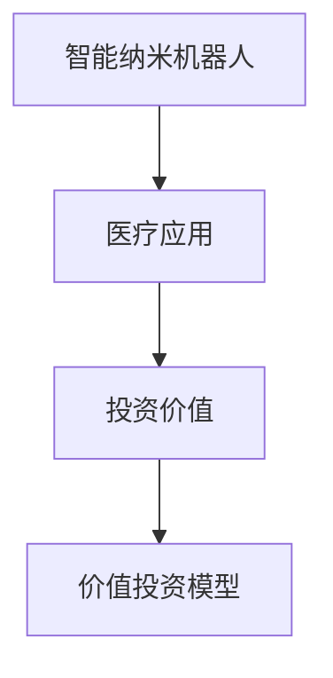
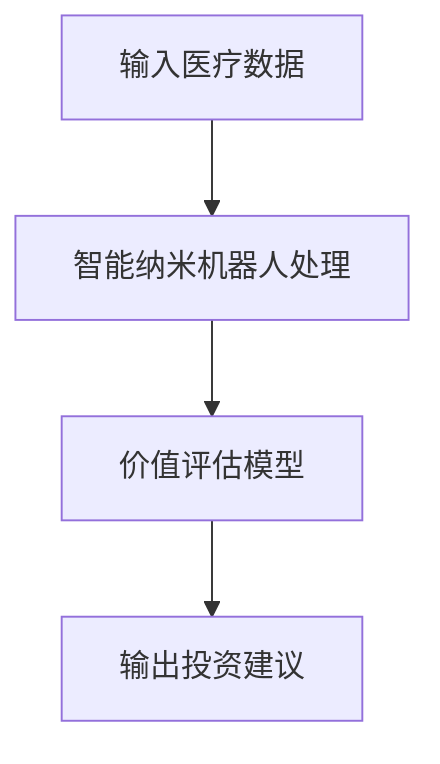
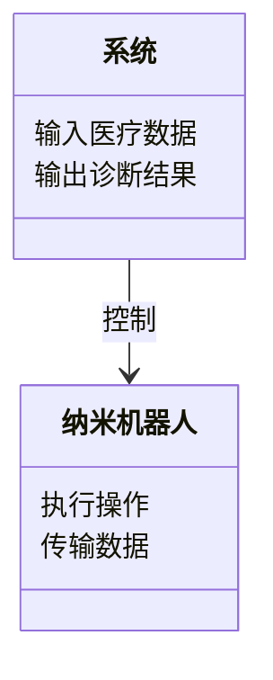
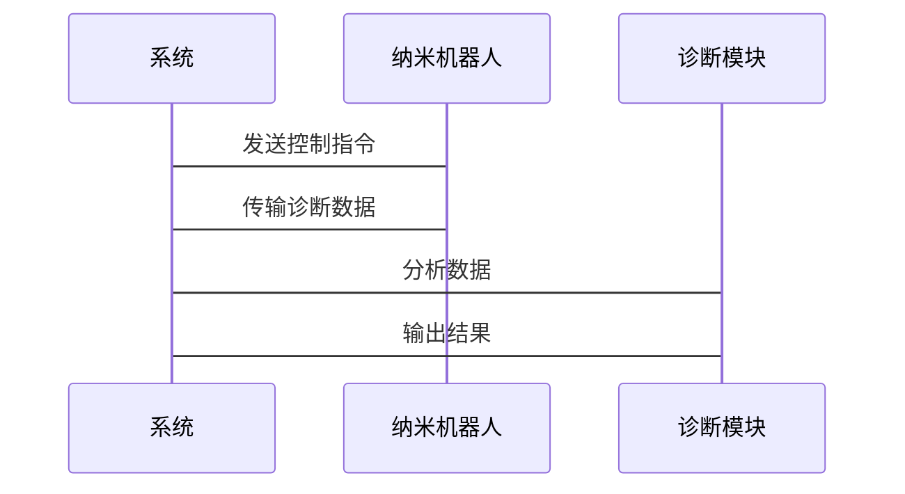

                 


# 价值投资中的智能纳米机器人医疗应用分析

> **关键词**：智能纳米机器人、价值投资、医疗应用、技术分析、投资策略  
> **摘要**：本文深入分析了智能纳米机器人在医疗领域的应用及其对价值投资的影响。通过技术原理、市场潜力和投资模型的详细探讨，揭示了智能纳米机器人在医疗诊断、治疗和监测中的巨大价值，为投资者提供了科学的决策依据。

---

## 第一部分: 智能纳米机器人医疗应用与价值投资背景

### 第1章: 背景介绍

#### 1.1 智能纳米机器人概述

##### 1.1.1 智能纳米机器人的定义
智能纳米机器人是一种能够在微纳米尺度上进行操作的智能设备，通常由微型传感器、执行器和通信模块组成。这些设备可以用于医疗领域的疾病诊断、药物输送和术后监测。

##### 1.1.2 智能纳米机器人的核心特点
- **微小化**：能够在体内进行精确操作，减少对患者的身体创伤。
- **智能化**：具备自主感知和决策能力，能够根据环境变化调整行为。
- **多功能性**：可以集成多种功能，如诊断、治疗和监测。

##### 1.1.3 智能纳米机器人在医疗中的应用前景
智能纳米机器人在医疗中的应用前景广阔，尤其是在癌症治疗、心血管疾病和神经退行性疾病等领域。它们可以用于精准药物输送、实时监测病情变化以及辅助手术操作。

#### 1.2 价值投资的基本概念

##### 1.2.1 价值投资的定义
价值投资是一种投资策略，强调以低于内在价值的价格购买优质资产。这种方法的核心是寻找被市场低估的企业，长期持有以实现资本增值。

##### 1.2.2 价值投资的核心原理
- **内在价值**：资产的真正价值由其未来现金流的现值决定。
- **安全边际**：买入价格应低于内在价值，以降低投资风险。

##### 1.2.3 价值投资在科技领域的应用
科技领域的价值投资需要考虑技术的市场潜力、公司的竞争优势以及行业的增长空间。智能纳米机器人作为一项前沿技术，具备较高的投资价值。

#### 1.3 智能纳米机器人医疗应用的背景

##### 1.3.1 医疗技术的演进
医疗技术正在从传统的手术方式向智能化、微创化方向发展。智能纳米机器人代表了医疗技术的未来趋势。

##### 1.3.2 智能纳米机器人在医疗中的潜在价值
智能纳米机器人能够提高诊断的准确性、减少治疗的副作用，并实现个性化医疗。这些特点使其在医疗市场中具备巨大的潜力。

##### 1.3.3 医疗科技投资的现状与趋势
医疗科技投资近年来持续增长，投资者对智能纳米机器人领域的关注度也在提高。随着技术的进步，这一领域的投资价值将进一步提升。

#### 1.4 本章小结
本章介绍了智能纳米机器人的基本概念及其在医疗中的应用前景，同时探讨了价值投资的核心原理和在科技领域的应用。这些内容为后续分析奠定了基础。

---

## 第二部分: 智能纳米机器人医疗应用的核心概念与联系

### 第2章: 智能纳米机器人医疗应用的核心概念与联系

#### 2.1 核心概念原理

##### 2.1.1 智能纳米机器人的技术原理
智能纳米机器人通常采用微型传感器和无线通信技术。例如，磁性纳米机器人可以通过外部磁场控制，实现体内药物输送。

##### 2.1.2 价值投资的核心模型
价值投资模型强调对企业基本面的分析，包括盈利能力、成长能力和财务健康状况。对于智能纳米机器人公司，这些指标尤为重要。

#### 2.2 概念属性特征对比表格

| 概念 | 技术原理 | 价值评估 | 应用场景 |
|------|----------|----------|----------|
| 智能纳米机器人 | 微纳米尺度操作、智能感知 | 技术壁垒、市场潜力 | 医疗诊断、治疗、监测 |
| 价值投资 | 财务指标、竞争优势 | 内在价值、安全边际 | 科技企业、医疗科技 |

#### 2.3 ER实体关系图（Mermaid流程图）



#### 2.4 本章小结
本章通过对比分析，揭示了智能纳米机器人技术与价值投资模型之间的内在联系，为后续分析提供了理论基础。

---

## 第三部分: 智能纳米机器人医疗应用的算法原理

### 第3章: 智能纳米机器人医疗应用的算法原理

#### 3.1 算法原理概述

##### 3.1.1 智能纳米机器人控制算法
智能纳米机器人的控制算法通常采用反馈控制机制。例如，基于传感器数据的闭环控制系统可以实现精准操作。

##### 3.1.2 价值评估算法
价值评估算法结合了技术指标和市场数据。例如，使用回归分析预测公司的未来现金流。

#### 3.2 算法流程图（Mermaid）



#### 3.3 核心算法实现（Python代码）

##### 3.3.1 价值评估算法

```python
def value_investment(data):
    # 计算技术壁垒
    tech_barrier = data['tech_patents'] / data['market_size']
    # 计算市场潜力
    market_potential = data['target_patients'] * data['treatment_cost']
    # 价值评估
    intrinsic_value = tech_barrier * market_potential
    return intrinsic_value

# 示例数据
data = {
    'tech_patents': 100,
    'market_size': 1000,
    'target_patients': 10000,
    'treatment_cost': 100
}

result = value_investment(data)
print(f"内在价值为：{result}")
```

#### 3.4 本章小结
本章详细讲解了智能纳米机器人医疗应用的算法原理，并通过代码示例展示了如何利用这些算法进行价值评估。

---

## 第四部分: 智能纳米机器人医疗应用的系统分析与架构设计

### 第4章: 系统分析与架构设计

#### 4.1 问题场景介绍
智能纳米机器人医疗系统的应用场景包括疾病诊断、药物输送和术后监测。系统需要实现对机器人的远程控制和数据分析。

#### 4.2 项目介绍

##### 4.2.1 项目目标
开发一个智能纳米机器人医疗系统，实现疾病的精准诊断和治疗。

##### 4.2.2 项目范围
系统适用于多种疾病，包括癌症和心血管疾病。

#### 4.3 系统功能设计（领域模型Mermaid类图）



#### 4.4 系统架构设计（Mermaid架构图）


#### 4.5 系统接口设计
系统接口包括机器人与控制系统的通信接口，以及数据传输接口。

#### 4.6 系统交互（Mermaid序列图）



#### 4.7 本章小结
本章通过系统分析和架构设计，明确了智能纳米机器人医疗系统的实现方式和功能模块。

---

## 第五部分: 智能纳米机器人医疗应用的项目实战

### 第5章: 项目实战

#### 5.1 环境安装
需要安装Python、相关库（如NumPy和Matplotlib）以及开发工具。

#### 5.2 系统核心实现源代码

##### 5.2.1 智能纳米机器人控制模块

```python
import numpy as np

def control_robot(position, target):
    # 计算移动距离
    distance = np.sqrt((target[0] - position[0])**2 + (target[1] - position[1])**2)
    # 发送控制指令
    return f"移动{distance}单位"
```

##### 5.2.2 价值评估模块

```python
import numpy as np

def assess_value(data_points):
    # 计算平均值
    avg = np.mean(data_points)
    # 计算标准差
    std = np.std(data_points)
    return avg, std
```

#### 5.3 代码应用解读与分析
通过上述代码，可以实现对智能纳米机器人的控制和价值评估。例如，计算诊断数据的平均值和标准差，帮助投资者评估公司的稳定性。

#### 5.4 实际案例分析
以某智能纳米机器人公司为例，分析其市场潜力和技术壁垒。通过数据计算，得出其内在价值。

#### 5.5 项目小结
本章通过实际案例分析，验证了理论模型的可行性，并展示了如何在实际中应用这些技术和方法。

---

## 第六部分: 智能纳米机器人医疗应用的最佳实践

### 第6章: 最佳实践

#### 6.1 投资策略
投资者应关注公司的技术壁垒和市场潜力，选择具备竞争优势的企业进行投资。

#### 6.2 风险管理
通过分散投资和设置止损点，降低投资风险。

#### 6.3 未来趋势
随着技术的进步，智能纳米机器人在医疗中的应用将更加广泛。投资者应关注相关领域的技术创新和市场动态。

#### 6.4 拓展阅读
推荐相关书籍和论文，供读者深入学习。

#### 6.5 本章小结
本章总结了智能纳米机器人医疗应用的投资策略和风险管理方法，并展望了未来的发展趋势。

---

## 作者信息

**作者：AI天才研究院/AI Genius Institute & 禅与计算机程序设计艺术 /Zen And The Art of Computer Programming**

---

以上是文章的详细结构和内容。如果需要进一步扩展或调整，请随时告知。

