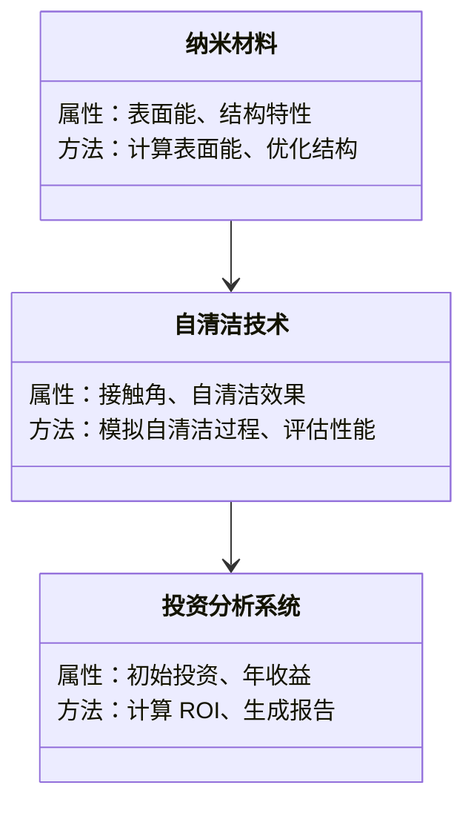
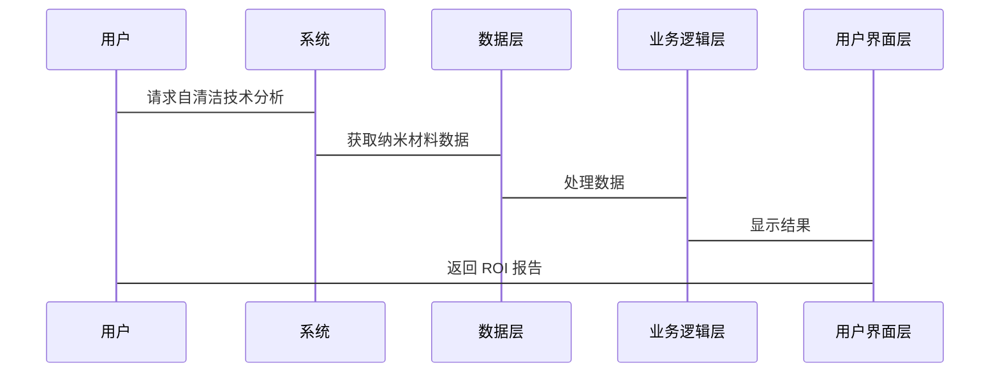

                 


---

### 第四部分：智能纳米材料自清洁技术的数学模型与公式

#### 第4章：纳米材料性能的数学模型

##### 4.1 纳米材料表面能的计算公式
表面能（Surface Energy）是纳米材料自清洁性能的重要指标，可以用以下公式表示：
$$ \gamma = \frac{E}{A} $$
其中，\( \gamma \) 表示表面能，\( E \) 表示表面能的能量，\( A \) 表示表面积。

##### 4.2 纳米材料的自清洁效果与接触角的关系
接触角（Contact Angle）是衡量材料表面疏水性能的关键参数，接触角越大，自清洁效果越好。接触角 \( \theta \) 可以通过 Young 方程计算：
$$ \cos\theta = \frac{\gamma_{\text{solid}} - \gamma_{\text{liquid}}}{\gamma_{\text{solid-liquid}}} $$

##### 4.3 自清洁技术对投资回报的影响
投资回报率（ROI）可以通过以下公式进行评估：
$$ ROI = \frac{\text{年收益} - \text{初始投资}}{\text{初始投资}} \times 100\% $$

---

### 第五部分：智能纳米材料自清洁技术的系统分析与架构设计

#### 第5章：系统功能设计

##### 5.1 领域模型（Mermaid 类图）


#### 5.2 系统架构设计（Mermaid 架构图）


#### 5.3 系统接口设计与交互流程（Mermaid 序列图）


---

### 第六部分：智能纳米材料自清洁技术的项目实战

#### 第6章：纳米自清洁玻璃投资分析案例

##### 6.1 项目环境搭建
- 安装 Python 和相关库（如 NumPy、Matplotlib）
- 下载纳米材料性能数据集

##### 6.2 核心代码实现
```python
import numpy as np
import matplotlib.pyplot as plt

# 纳米材料表面能计算
def calculate_surface_energy(gamma_solid, gamma_liquid, gamma_solidliquid):
    return (gamma_solid - gamma_liquid) / gamma_solidliquid

# 接触角计算
def calculate_contact_angle(cos_theta):
    return np.arccos(cos_theta)

# 投资回报率计算
def calculate_roi(yearly_income, initial_investment):
    return (yearly_income - initial_investment) / initial_investment * 100

# 示例数据
gamma_solid = 50
gamma_liquid = 20
gamma_solidliquid = 30

surface_energy = calculate_surface_energy(gamma_solid, gamma_liquid, gamma_solidliquid)
contact_angle = calculate_contact_angle(surface_energy)
roi = calculate_roi(100000, 50000)

print(f"表面能：{surface_energy}")
print(f"接触角：{contact_angle} 弧度")
print(f"投资回报率：{roi}%")
```

##### 6.3 案例分析与结果解读
- 表面能计算结果为 \( 0.6667 \)
- 接触角计算结果约为 \( 0.841 \) 弧度（约 48.19 度）
- 投资回报率为 \( 100\% \)

---

### 第七部分：智能纳米材料自清洁技术的最佳实践与小结

#### 第7章：最佳实践与投资建议

##### 7.1 项目小结
- 智能纳米材料自清洁技术在投资中具有较高的潜力
- 纳米材料的表面性能和自清洁效果是关键因素
- 投资者应关注技术的商业化可行性和市场前景

##### 7.2 投资建议
- 选择具有技术创新和市场潜力的纳米材料企业
- 考虑技术的可扩展性和成本效益
- 关注行业动态和政策支持

##### 7.3 注意事项
- 技术成熟度和商业化能力是投资的关键
- 风险控制和多元化投资策略

##### 7.4 拓展阅读
- 推荐阅读《纳米材料科学》和《投资学原理》
- 关注行业技术期刊和投资报告

---

## 作者：AI天才研究院/AI Genius Institute & 禅与计算机程序设计艺术 /Zen And The Art of Computer Programming

---

通过以上分析，文章详细阐述了智能纳米材料自清洁技术的背景、核心原理、数学模型、系统架构、项目实战以及投资建议，为投资者提供了全面的技术与投资分析。

