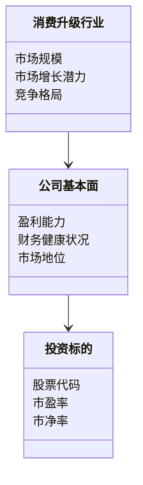
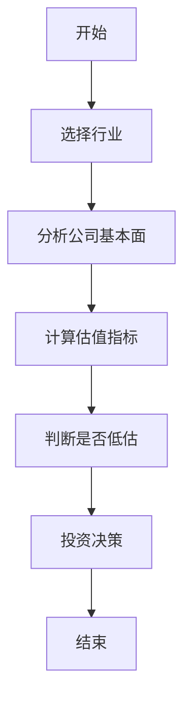

                 


```markdown
# 价值投资中的消费升级趋势捕捉

## 关键词：价值投资、消费升级、投资分析、行业趋势、投资策略

## 摘要： 
本文探讨了在消费升级背景下，如何通过价值投资策略捕捉投资机会。文章从价值投资的基本原理出发，结合消费升级的趋势，分析了消费行业的基本面和财务指标，提出了基于投资决策模型的投资策略，并通过实战案例展示了如何在实际操作中应用这些方法。文章还讨论了风险管理的重要性，并提供了系统的架构设计和最佳实践建议。

---

## 第一部分: 背景介绍

### 1.1 价值投资与消费升级的核心概念
#### 1.1.1 价值投资的定义与特点
价值投资是一种以公司基本面分析为基础的投资策略，强调购买那些市场估值低于其内在价值的股票。其核心理念是寻找具有持续竞争优势和良好治理结构的公司，长期持有以实现资本增值。

#### 1.1.2 消费升级的定义与趋势
消费升级指的是随着经济发展和居民收入的提高，消费者从基本生活需求转向更高品质、更健康、更便捷的产品或服务。主要表现为品牌化、个性化、智能化和绿色消费的兴起。

#### 1.1.3 价值投资与消费升级的关系
消费升级为价值投资提供了丰富的投资标的，尤其是那些能够满足新兴消费需求的企业。通过分析消费升级的趋势，投资者可以更好地识别具有长期增长潜力的公司。

### 1.2 问题背景与描述
#### 1.2.1 问题背景
随着中国经济的快速发展，消费升级成为推动经济增长的重要动力。消费领域不断细分，新兴行业如食品饮料、家电、旅游、教育、医疗等呈现快速增长趋势。

#### 1.2.2 问题描述
在消费升级背景下，如何通过价值投资策略，识别具有长期竞争优势的公司，是投资者面临的重要课题。本文旨在提供一套系统的方法论，帮助投资者在消费升级趋势中捕捉投资机会。

#### 1.2.3 问题解决
通过分析消费行业的基本面、财务指标和行业趋势，结合价值投资的核心理念，构建投资决策模型，为投资者提供科学的投资依据。

#### 1.2.4 边界与外延
本文重点关注食品饮料、家电、旅游、教育、医疗等消费升级的主要行业，分析范围限定在中国市场，但相关方法论可推广至其他市场。

#### 1.2.5 核心要素组成
- **行业分析**：分析消费升级行业的市场规模、增长潜力和竞争格局。
- **公司基本面分析**：评估公司的盈利能力、成长性和财务健康状况。
- **估值分析**：通过市盈率、市净率等指标判断股票的估值是否合理。

---

## 第二部分: 核心概念与联系

### 2.1 核心概念原理
#### 2.1.1 价值投资的核心原理
- **内在价值**：股票的真正价值是其未来现金流的现值。
- **安全边际**：买入价格低于内在价值，以降低投资风险。

#### 2.1.2 消费升级的核心特征
- **品牌化**：消费者更倾向于选择知名品牌。
- **个性化**：产品和服务更注重个性化需求。
- **智能化**：科技与消费的深度融合。

### 2.2 核心概念的联系
#### 2.2.1 消费升级行业与价值投资的对比分析
| 指标 | 消费升级行业 | 非消费升级行业 |
|------|--------------|----------------|
| 市场规模 | 高增长 | 低增长 |
| 盈利能力 | 较高 | 一般 |
| 竞争格局 | 市场集中度高 | 市场集中度低 |

#### 2.2.2 实体关系图


---

## 第三部分: 投资决策模型的算法原理

### 3.1 算法原理
#### 3.1.1 投资决策模型的逻辑步骤
1. **行业筛选**：选择消费升级相关行业。
2. **公司基本面分析**：评估公司的盈利能力、成长性和财务健康状况。
3. **估值分析**：计算市盈率、市净率等指标，判断股票是否低估。
4. **投资决策**：综合分析结果，决定是否买入。

#### 3.1.2 投资决策模型的流程图


#### 3.1.3 算法的数学模型
- 市盈率（P/E）= 股价 / 每股收益
- 市净率（P/B）= 股价 / 每股净资产
- 净资产收益率（ROE）= 净利润 / 净资产

---

## 第四部分: 系统分析与架构设计

### 4.1 系统架构设计
#### 4.1.1 领域模型类图


#### 4.1.2 系统架构图


---

## 第五部分: 项目实战

### 5.1 实战案例：食品饮料行业分析
#### 5.1.1 数据获取与清洗
```python
import pandas as pd

# 获取数据
df = pd.read_csv('食品饮料行业.csv')

# 清洗数据
df.dropna(inplace=True)
df = df[ df['市盈率'] < 30 ]
```

#### 5.1.2 数据分析与建模
```python
import matplotlib.pyplot as plt

# 绘制市盈率分布图
plt.hist(df['市盈率'], bins=10)
plt.xlabel('市盈率')
plt.ylabel('频数')
plt.title('食品饮料行业市盈率分布')
plt.show()
```

---

## 第六部分: 总结与展望

### 6.1 总结
本文通过分析消费升级的趋势，结合价值投资的核心理念，提出了基于投资决策模型的投资策略。通过实战案例展示了如何在实际操作中应用这些方法。

### 6.2 展望
未来，随着科技与消费的深度融合，智能化消费将成为新的增长点。投资者需要持续关注消费升级的趋势，灵活调整投资策略。

---

## 作者：AI天才研究院/AI Genius Institute & 禅与计算机程序设计艺术 /Zen And The Art of Computer Programming
```

