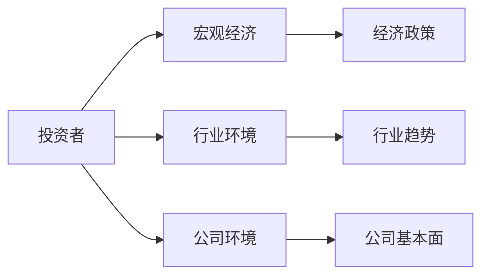
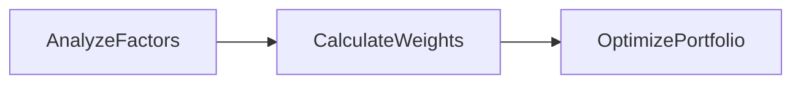

                 


# 价值投资中的环境因素考量

## 关键词：价值投资、环境因素、宏观经济、行业分析、公司治理、投资策略

## 摘要：
价值投资是一种长期有效的投资策略，而环境因素在价值投资中扮演着至关重要的角色。本文从环境因素的定义、分类、对投资决策的影响等方面进行系统分析，并结合数学模型、算法实现和实际案例，深入探讨环境因素在价值投资中的考量。通过本文的学习，读者将能够更好地理解如何将环境因素纳入投资决策过程，从而提高投资的准确性和收益。

---

## 第一部分：价值投资中的环境因素概述

### 第1章：价值投资与环境因素的背景介绍

#### 1.1 价值投资的基本概念

##### 1.1.1 价值投资的定义
价值投资是一种以低于内在价值的价格买入优质资产的投资策略。其核心理念在于寻找市场先生犯错的机会，即市场价格与内在价值的暂时偏离。这种策略强调对企业基本面的深入分析，寻找具有长期竞争优势的企业。

##### 1.1.2 价值投资的核心理念
- **安全边际**：买入价格低于内在价值，以降低投资风险。
- **长期视角**：关注企业的长期盈利能力，而非短期市场波动。
- **逆人性**：在市场恐慌时买入，在市场疯狂时卖出。

##### 1.1.3 价值投资与环境因素的关系
环境因素是指影响企业经营环境的各种外部因素，包括宏观经济、行业趋势、政策法规等。这些因素不仅影响企业的盈利能力，还会影响市场的整体走势。因此，环境因素是价值投资中不可忽视的重要考量。

#### 1.2 环境因素在投资中的重要性

##### 1.2.1 环境因素的定义
环境因素是指影响企业经营和投资决策的各种外部条件，包括宏观经济环境、行业竞争环境、政策法规环境等。

##### 1.2.2 环境因素对投资决策的影响
- **宏观经济环境**：如GDP增长率、利率、通货膨胀率等，直接影响企业的盈利能力和市场的流动性。
- **行业竞争环境**：如行业集中度、竞争格局、政策监管等，影响企业的市场地位和竞争优势。
- **政策法规环境**：如税收政策、行业准入政策、环保法规等，直接影响企业的经营成本和盈利空间。

##### 1.2.3 环境因素的分类与特征
环境因素可以分为宏观经济因素、行业因素和公司特有因素。宏观经济因素具有全局性和不可控性，而行业和公司特有因素则更具可分析性和可控性。

#### 1.3 价值投资中的环境因素考量

##### 1.3.1 环境因素在价值投资中的地位
环境因素是价值投资中不可或缺的一部分。投资者需要通过分析环境因素，识别行业的周期性风险和结构性机会，从而选择具有长期竞争优势的企业。

##### 1.3.2 环境因素对投资风险的影响
- **宏观经济风险**：如经济衰退可能导致企业的盈利下降，进而影响股票价格。
- **行业风险**：如行业政策变化可能导致企业的市场份额流失。
- **公司特有风险**：如公司治理问题可能导致企业价值贬损。

##### 1.3.3 环境因素与投资收益的关系
环境因素通过影响企业的盈利能力和市场的流动性，间接影响股票的内在价值。因此，投资者需要将环境因素纳入分析框架，以更准确地评估企业的内在价值。

---

### 第2章：环境因素的核心概念与联系

#### 2.1 环境因素的核心概念

##### 2.1.1 宏观经济因素
宏观经济因素包括GDP增长率、利率、通货膨胀率、就业率等，这些因素通过影响企业的经营环境和市场流动性，进而影响股票价格。

##### 2.1.2 行业因素
行业因素包括行业生命周期、竞争格局、政策监管等，这些因素通过影响企业的市场地位和竞争优势，进而影响企业的盈利能力。

##### 2.1.3 公司特有因素
公司特有因素包括公司治理、管理层素质、财务状况等，这些因素通过影响企业的内部管理效率和盈利能力，进而影响股票的内在价值。

#### 2.2 环境因素的属性特征对比

| 环境因素 | 波动性 | 竞争性 | 稳定性 |
|----------|--------|--------|--------|
| 宏观经济因素 | 高 | 低 | 低 |
| 行业因素 | 中 | 高 | 中 |
| 公司特有因素 | 低 | 低 | 高 |

#### 2.3 环境因素的ER实体关系图


---

### 第3章：环境因素的数学模型与算法原理

#### 3.1 环境因素分析的数学模型

##### 3.1.1 多因素模型
多因素模型是一种将多个环境因素纳入分析框架的数学模型，常用于解释股票收益的来源。常见的多因素模型包括Fama-French三因子模型和Carhart四因子模型。

##### 3.1.2 环境因素权重分配
在多因素模型中，每个环境因素的权重需要根据其对股票收益的影响程度进行分配。例如，宏观经济因素可能权重较高，而公司特有因素权重较低。

##### 3.1.3 投资组合优化
投资组合优化的目标是在给定的风险约束下，最大化投资收益。常用的优化方法包括均值-方差优化和风险中性优化。

#### 3.2 环境因素分析的算法流程

##### 3.2.1 数据收集与预处理


##### 3.2.2 因子分析与权重计算


##### 3.2.3 投资组合优化与评估


#### 3.3 算法实现的Python代码

##### 3.3.1 数据生成与预处理
```python
import numpy as np
import pandas as pd

# 示例数据
data = pd.DataFrame({
    'GDP': np.random.normal(100, 5, 100),
    'InterestRate': np.random.uniform(0, 10, 100),
    'IndustryTrend': np.random.normal(50, 10, 100),
    'CompanyFundamentals': np.random.normal(80, 15, 100)
})

# 数据标准化
from sklearn.preprocessing import StandardScaler

scaler = StandardScaler()
scaled_data = scaler.fit_transform(data)
```

##### 3.3.2 因子分析与权重计算
```python
from sklearn.decomposition import PCA

# 主成分分析
pca = PCA(n_components=2)
principal_components = pca.fit_transform(scaled_data)

# 计算因子权重
factor_weights = pca.explained_variance_ratio_
```

##### 3.3.3 投资组合优化
```python
import cvxpy as cvx

# 定义优化变量
weights = cvx.Variable(n=4)

# 定义目标函数
risk = cvx.quad_form(weights, data.cov())
objective = cvx.Minimize(risk)

# 定义约束条件
constraints = [cvx.sum(weights) == 1]

# 解决优化问题
prob = cvx.Problem(objective, constraints)
prob.solve()

# 输出结果
print("最优权重:", weights.value)
```

#### 3.4 数学公式与模型分析

##### 3.4.1 多因素模型的数学表达
$$ R_i = \alpha + \beta_1 F_1 + \beta_2 F_2 + \beta_3 F_3 + \epsilon $$

其中，$R_i$ 是股票i的收益，$F_j$ 是第j个因素的收益，$\beta_j$ 是股票i对第j个因素的敏感度，$\epsilon$ 是误差项。

##### 3.4.2 投资组合优化的数学表达
$$ \min_{w} \sum_{i=1}^n w_i^2 \sigma_i^2 $$
$$ \text{s.t. } \sum_{i=1}^n w_i = 1 $$

---

## 第4章：环境因素的系统分析与架构设计

### 4.1 系统功能设计

#### 4.1.1 系统架构图


#### 4.1.2 系统模块说明
- **数据采集模块**：负责收集宏观经济、行业和公司层面的环境数据。
- **因子分析模块**：对环境因素进行主成分分析或因子分析，提取关键因素。
- **权重计算模块**：根据因子的重要性，计算每个环境因素的权重。
- **投资组合优化模块**：基于因子权重和优化算法，生成最优投资组合。
- **结果展示模块**：将优化结果以可视化形式展示给投资者。

### 4.2 系统接口设计

#### 4.2.1 REST API接口
```http
GET /api/factor-analysis
POST /api/optimize-portfolio
```

#### 4.2.2 数据接口
```python
import requests

response = requests.get('http://localhost:8000/api/factor-analysis')
data = response.json()
```

### 4.3 系统交互设计

#### 4.3.1 序列图
```mermaid
graph LR
    User --> API Gateway: 发送因子分析请求
    API Gateway --> FactorAnalysisService: 处理因子分析
    FactorAnalysisService --> Database: 查询环境数据
    FactorAnalysisService --> User: 返回因子分析结果
```

---

## 第5章：环境因素的项目实战

### 5.1 环境安装与工具准备

#### 5.1.1 安装Python环境
```bash
python -m pip install numpy pandas scikit-learn cvxpy
```

#### 5.1.2 安装数据分析工具
```bash
pip install jupyterlab
```

### 5.2 核心代码实现

#### 5.2.1 数据处理代码
```python
import pandas as pd
import numpy as np
from sklearn.decomposition import PCA

# 示例数据
data = pd.DataFrame({
    'GDP': np.random.normal(100, 5, 100),
    'InterestRate': np.random.uniform(0, 10, 100),
    'IndustryTrend': np.random.normal(50, 10, 100),
    'CompanyFundamentals': np.random.normal(80, 15, 100)
})

# 数据标准化
from sklearn.preprocessing import StandardScaler

scaler = StandardScaler()
scaled_data = scaler.fit_transform(data)
```

#### 5.2.2 因子分析代码
```python
pca = PCA(n_components=2)
principal_components = pca.fit_transform(scaled_data)
factor_weights = pca.explained_variance_ratio_
```

#### 5.2.3 投资组合优化代码
```python
import cvxpy as cvx

# 定义优化变量
weights = cvx.Variable(n=4)

# 定义目标函数
risk = cvx.quad_form(weights, data.cov())
objective = cvx.Minimize(risk)

# 定义约束条件
constraints = [cvx.sum(weights) == 1]

# 解决优化问题
prob = cvx.Problem(objective, constraints)
prob.solve()

# 输出结果
print("最优权重:", weights.value)
```

### 5.3 实际案例分析

#### 5.3.1 案例背景
假设我们关注一个制造业公司，需要分析宏观经济、行业趋势和公司基本面的影响。

#### 5.3.2 数据分析
```python
# 假设数据已经加载并预处理
print("因子权重:", factor_weights)
print("最优投资组合:", weights.value)
```

#### 5.3.3 投资建议
根据优化结果，宏观经济因素和行业趋势因素对投资收益的影响较大，因此需要重点关注这些因素的变化。

---

## 第6章：小结与展望

### 6.1 小结
环境因素在价值投资中具有重要地位，影响企业的盈利能力、市场的流动性以及投资的风险和收益。通过系统的分析和优化，投资者可以更好地把握环境因素的影响，从而制定更科学的投资策略。

### 6.2 注意事项
- **数据质量**：环境因素的分析依赖于高质量的数据，数据偏差可能影响分析结果。
- **模型假设**：数学模型的假设需要符合实际情况，避免过度简化或复杂化。
- **动态调整**：环境因素是动态变化的，投资者需要定期调整投资组合。

### 6.3 未来展望
随着大数据和人工智能技术的发展，环境因素的分析将更加精准和高效。未来的研究可以进一步结合自然语言处理技术，分析新闻、社交媒体等非结构化数据，以捕捉环境因素的潜在影响。

---

## 作者：AI天才研究院/AI Genius Institute & 禅与计算机程序设计艺术 /Zen And The Art of Computer Programming

