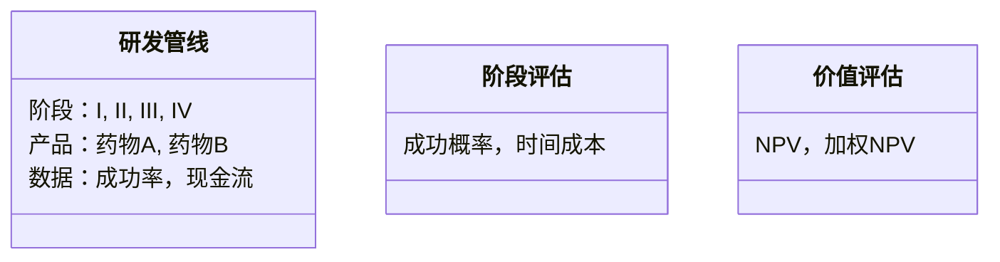

                 


# 价值投资中的生物制药研发管线分析

> 关键词：价值投资，生物制药，研发管线，净现值，研发阶段，成功率分析

> 摘要：本文深入探讨了生物制药研发管线在价值投资中的分析方法，从研发管线的定义、价值评估模型、系统分析到项目实战，详细阐述了如何通过研发管线的阶段分析和概率加权的净现值模型来评估生物制药公司的投资价值。本文结合实际案例，为投资者提供了科学的分析工具和方法。

---

## 第1章 研发管线概述

### 1.1 研发管线的定义与特点

#### 1.1.1 研发管线的定义
生物制药研发管线是指从药物发现到商业化的一系列研发阶段，包括临床前研究、临床试验、审批和上市等阶段。每个阶段都有不同的目标、成本和风险。

#### 1.1.2 研发管线的核心特点
- **阶段化**：研发管线通常分为多个阶段，每个阶段有明确的目标和任务。
- **风险递减**：随着阶段推进，研发失败的风险逐渐降低。
- **成本递增**：早期阶段成本较低，后期阶段成本显著增加。
- **时间跨度长**：从药物发现到商业化通常需要10-15年时间。

#### 1.1.3 研发管线与传统制药的区别
- **研发投入更大**：生物制药的研发成本和时间远高于传统制药。
- **技术复杂性高**：生物制药涉及基因工程、抗体药物等复杂技术。
- **监管要求严格**：生物制药需经过更严格的临床试验和审批流程。

### 1.2 价值投资中的研发管线分析背景

#### 1.2.1 价值投资的基本概念
价值投资是一种投资策略，通过分析公司的基本面，寻找被市场低估的投资机会。生物制药行业的高风险和高回报特性使得研发管线成为评估公司价值的关键因素。

#### 1.2.2 生物制药行业的特点
- **高风险**：研发失败的概率较高，尤其是临床阶段。
- **高回报**：成功产品的市场潜力巨大。
- **技术驱动**：技术创新是行业发展的核心动力。

#### 1.2.3 研发管线在价值投资中的重要性
研发管线是公司未来收入的主要来源，通过分析研发管线的成功概率和潜在价值，投资者可以更准确地评估公司的未来盈利能力。

---

## 第2章 研发管线的价值评估模型

### 2.1 研发管线价值评估的核心原理

#### 2.1.1 概率加权的净现值模型
概率加权的净现值模型通过将每个研发阶段的成功概率与该阶段的净现值相结合，评估整个研发管线的总体价值。

#### 2.1.2 研发阶段的风险调整
不同阶段的风险不同，后期阶段的成功概率较低，但潜在回报更高。因此，在评估时需要根据阶段调整贴现率。

### 2.2 研发管线价值评估的数学模型

#### 2.2.1 净现值（NPV）公式
$$ NPV = \sum_{t=0}^{n} \frac{CF_t}{(1 + r)^t} $$
其中，$CF_t$是第$t$年的现金流，$r$是贴现率，$n$是项目周期。

#### 2.2.2 概率加权的NPV模型
$$ NPV_{weighted} = \sum_{i=1}^{m} P_i \times NPV_i $$
其中，$P_i$是第$i$个阶段的成功概率，$NPV_i$是第$i$个阶段的净现值。

### 2.3 研发管线价值评估的步骤

#### 2.3.1 确定研发阶段
根据研发管线的阶段划分，确定每个阶段的成功概率和现金流。

#### 2.3.2 评估各阶段的成功概率
通过历史数据分析和专家意见，评估每个阶段的成功概率。

#### 2.3.3 估算现金流和贴现率
根据市场情况和公司战略，估算每个阶段的现金流，并选择合适的贴现率。

---

## 第3章 生物制药研发管线的系统分析

### 3.1 研发管线的系统模型

#### 3.1.1 领域模型（Mermaid 类图）


### 3.2 系统架构设计（Mermaid 架构图）


### 3.3 本章小结

---

## 第4章 研发管线分析的项目实战

### 4.1 项目环境与工具

#### 4.1.1 环境安装
- **Python**：安装Python 3.x
- **Mermaid**：安装Mermaid CLI工具
- **Jupyter Notebook**：用于数据计算和可视化

#### 4.1.2 工具使用
- **Python代码**：用于计算NPV和加权NPV
- **Mermaid**：用于绘制系统架构图和流程图

### 4.2 代码实现

#### 4.2.1 NPV计算代码
```python
def calculate_npv(cash_flows, discount_rate):
    npv = 0
    for t, cf in enumerate(cash_flows):
        npv += cf / (1 + discount_rate) ** t
    return npv

# 示例数据
cash_flows = [100, 200, 300, 400]
discount_rate = 0.1

print("NPV:", calculate_npv(cash_flows, discount_rate))
```

#### 4.2.2 加权NPV计算代码
```python
def calculate_weighted_npv(npv_values, probabilities):
    weighted_npv = 0
    for npv, prob in zip(npv_values, probabilities):
        weighted_npv += npv * prob
    return weighted_npv

# 示例数据
npv_values = [100, 200, 300, 400]
probabilities = [0.9, 0.8, 0.7, 0.6]

print("加权NPV:", calculate_weighted_npv(npv_values, probabilities))
```

### 4.3 案例分析

#### 4.3.1 案例背景
假设某生物制药公司有两条研发管线，分别处于阶段I和阶段II，成功率分别为30%和50%，现金流分别为100万、200万。

#### 4.3.2 计算过程
1. 阶段I：NPV = $100万 / (1 + 0.1)^1 = 90.91万
2. 阶段II：NPV = $200万 / (1 + 0.1)^2 = 162.03万
3. 加权NPV = 0.3 * 90.91万 + 0.5 * 162.03万 = 27.27万 + 81.02万 = 108.29万

#### 4.3.3 分析结论
加权NPV为正，说明该项目具有投资价值。

### 4.4 本章小结

---

## 作者

作者：AI天才研究院/AI Genius Institute & 禅与计算机程序设计艺术 /Zen And The Art of Computer Programming

---

通过以上步骤，我们详细分析了生物制药研发管线在价值投资中的分析方法，结合理论和实际案例，为投资者提供了科学的分析工具和方法。

