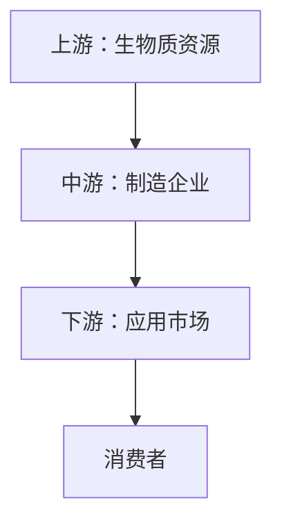

                 

# 价值投资中的生物塑料产业链分析

> 关键词：生物塑料，产业链分析，价值投资，可持续发展，环境影响

> 摘要：本文通过系统分析生物塑料产业链的构成、经济特性、环境影响及市场发展，结合价值投资的核心理念，探讨如何在生物塑料产业链中识别投资机会，评估企业价值，并制定投资策略。文章从产业链的上游、中游和下游三个环节展开，分析各环节的关键驱动因素和潜在风险，同时结合实际案例，为投资者提供科学的决策依据。

---

# 第1章: 生物塑料产业链概述

## 1.1 生物塑料的基本概念

### 1.1.1 生物塑料的定义与分类

生物塑料是指以可再生生物质为原料，通过生物或化学方法制成的塑料。根据原料来源和制备工艺的不同，生物塑料可以分为以下几类：

1. **生物基塑料**：以可再生生物质（如淀粉、纤维素、甘油等）为原料制成的塑料，例如聚乳酸（PLA）、聚羟基乙酸（PHA）等。
2. **可降解塑料**：在特定环境下能够分解为二氧化碳和水的塑料，例如聚乳酸（PLA）、聚碳酸亚丙酯（PC）等。
3. **生物基可降解塑料**：兼具生物基和可降解特性的塑料，例如聚乳酸（PLA）和聚己内酯（PCL）。

### 1.1.2 生物塑料与传统塑料的区别

| 特性 | 生物塑料 | 传统塑料 |
|------|----------|----------|
| 原料 | 可再生生物质 | 不可再生化石能源 |
| 环境影响 | 可降解，对环境友好 | 不可降解，污染环境 |
| 生产能耗 | 较低 | 较高 |
| 成本 | 初期较高，后期可能下降 | 较低 |

### 1.1.3 生物塑料的环境与经济意义

生物塑料的出现为解决传统塑料污染问题提供了新的可能性。它不仅能够减少对化石能源的依赖，还能降低碳排放，促进可持续发展。然而，生物塑料的生产成本较高，技术门槛也较高，这限制了其大规模商业化应用。

## 1.2 价值投资的基本原理

### 1.2.1 价值投资的核心理念

价值投资是一种投资策略，强调以低于内在价值的价格买入优质资产。其核心理念包括：

1. **安全边际**：买入价格应低于资产的内在价值。
2. **长期视角**：关注企业的长期盈利能力。
3. **基本面分析**：通过分析企业的财务状况、行业地位、竞争优势等，评估其投资价值。

### 1.2.2 价值投资与生物塑料产业的结合点

生物塑料产业具有较高的成长性和可持续发展潜力，符合价值投资的长期视角。同时，生物塑料行业的竞争格局尚未完全形成，存在较多的不确定性，这也为价值投资者提供了挖掘潜力股的机会。

### 1.2.3 生物塑料产业链的投资价值分析

生物塑料产业链的投资价值主要体现在以下几个方面：

1. **上游原材料供应**：掌握可再生生物质资源的企业具有成本优势。
2. **中游制造技术**：具备先进制造技术的企业能够提高生产效率并降低成本。
3. **下游应用市场**：市场需求的增长为相关企业提供了发展空间。

## 1.3 生物塑料产业链的构成与特点

### 1.3.1 生物塑料产业链的上游、中游和下游

### 1.3.2 产业链各环节的关键参与者

1. **上游**：提供生物质原材料的企业，如玉米加工企业、林业公司等。
2. **中游**：生物塑料制造企业，包括原料预处理、塑料加工等环节。
3. **下游**：生物塑料的应用领域，如包装、汽车、电子等行业的企业。

### 1.3.3 生物塑料产业链的市场现状与发展趋势

生物塑料市场目前处于快速增长阶段，但市场渗透率较低。随着环保政策的加强和消费者环保意识的提高，生物塑料的应用范围将进一步扩大。

---

# 第2章: 生物塑料产业链的核心环节分析

## 2.1 生物塑料原料的生产与供应

### 2.1.1 原料来源分析

生物塑料的主要原料包括淀粉、纤维素、甘油等。其中，淀粉来源广泛，成本较低，是目前应用最广泛的生物塑料原料。

### 2.1.2 原料生产的技术与成本

生物塑料原料的生产技术包括发酵法、化学法等。不同技术路线的成本和效率差异较大，例如：

1. **发酵法**：以糖类为原料，通过微生物发酵生产单体，再聚合生成塑料。
2. **化学法**：以生物质为原料，通过化学反应合成单体。

### 2.1.3 原料供应链的稳定性与风险

原料供应链的稳定性直接影响生物塑料的成本和生产效率。主要风险包括原材料价格波动、供应中断等。

## 2.2 生物塑料的制造与加工

### 2.2.1 制造工艺流程

生物塑料的制造过程包括原料预处理、单体合成、聚合反应等环节。以聚乳酸（PLA）为例，其制造流程如下：

1. **原料预处理**：将淀粉水解为葡萄糖。
2. **单体合成**：通过发酵法将葡萄糖转化为乳酸。
3. **聚合反应**：乳酸通过缩聚反应生成聚乳酸。

### 2.2.2 制造技术的创新与发展趋势

当前，生物塑料制造技术的创新主要集中在提高生产效率、降低成本和改善材料性能等方面。例如，通过基因工程技术优化微生物的发酵效率。

### 2.2.3 制造成本与效率的优化

制造成本是生物塑料竞争力的关键因素之一。通过技术创新和规模化生产，可以有效降低制造成本。

## 2.3 生物塑料的应用领域与市场需求

### 2.3.1 主要应用领域分析

生物塑料的主要应用领域包括包装、纺织、汽车、电子等。例如，聚乳酸（PLA）常用于制造可降解包装材料。

### 2.3.2 市场需求的驱动因素

市场需求的驱动因素包括环保政策、消费者环保意识的提高、传统塑料替代需求等。

### 2.3.3 不同应用场景的技术与经济可行性

不同应用场景对生物塑料的技术和经济要求不同。例如，高端包装市场对材料的性能要求较高，而低端市场则更关注成本。

---

# 第3章: 生物塑料产业链的经济与环境分析

## 3.1 生物塑料的生产成本与经济效益

### 3.1.1 生产成本构成与影响因素

生物塑料的生产成本包括原材料、能源、人工、设备折旧等。其中，原材料成本占比最大。

### 3.1.2 不同工艺路线的成本对比

以聚乳酸（PLA）为例，发酵法的成本低于化学法，但生产效率较低。

### 3.1.3 生物塑料的市场价格波动与预测

生物塑料的市场价格受供需关系、原材料价格、政策影响较大。预计未来几年，随着市场需求的增长，生物塑料的价格将逐步下降。

## 3.2 生物塑料的环境影响与可持续性

### 3.2.1 环境影响分析

生物塑料的环境影响主要体现在生产过程中的碳排放和材料的可降解性。与传统塑料相比，生物塑料的环境影响较小。

### 3.2.2 可持续性评估指标

可持续性评估指标包括资源消耗、能源消耗、碳排放、可降解性等。

### 3.2.3 环保政策对生物塑料产业的影响

环保政策的出台为生物塑料产业提供了政策支持，例如限制传统塑料使用、鼓励生物塑料研发和应用。

## 3.3 产业链的协同效应与竞争优势

### 3.3.1 产业链协同对成本的影响

产业链协同可以降低原材料采购成本、优化生产流程、提高市场竞争力。

### 3.3.2 产业链协同对市场竞争力的提升

通过产业链协同，企业可以更好地满足市场需求，提高产品附加值。

### 3.3.3 产业链协同的实现路径与策略

1. **战略合作**：与上下游企业建立战略合作伙伴关系。
2. **技术共享**：共享技术资源，降低研发成本。
3. **资源共享**：共享原材料、生产设备等资源。

---

# 第4章: 生物塑料产业链的市场与竞争分析

## 4.1 全球生物塑料市场的现状与趋势

### 4.1.1 全球生物塑料市场容量与增长率

预计未来几年，全球生物塑料市场规模将保持快速增长，年复合增长率超过10%。

### 4.1.2 主要国家与地区的市场发展情况

1. **欧洲**：环保政策严格，生物塑料市场需求旺盛。
2. **北美**：技术创新能力强，市场潜力大。
3. **亚洲**：市场需求增长迅速，但技术水平相对较低。

## 4.2 生物塑料市场的竞争格局

### 4.2.1 主要竞争企业分析

1. **NatureWorks LLC**：全球最大的聚乳酸（PLA）生产商。
2. ** BASF SE**：全球领先的生物塑料生产企业。
3. **TotalEnergies Corbion**：专注于生物基塑料的研发和生产。

### 4.2.2 市场竞争的核心要素

1. **技术优势**：拥有先进生产技术的企业具有竞争优势。
2. **成本优势**：能够有效降低成本的企业更具竞争力。
3. **品牌影响力**：知名品牌更容易获得市场认可。

## 4.3 投资者视角下的市场分析

### 4.3.1 市场进入壁垒

生物塑料产业的进入壁垒较高，主要体现在技术门槛高、初期投资大、市场风险高等方面。

### 4.3.2 市场机会与风险

1. **机会**：随着环保政策的加强和市场需求的增长，生物塑料产业具有较大的发展潜力。
2. **风险**：技术风险、市场风险、政策风险等。

---

# 第5章: 价值投资中的生物塑料产业链策略

## 5.1 价值投资的核心策略

### 5.1.1 企业基本面分析

1. **财务状况**：关注企业的盈利能力、资产负债率、现金流等指标。
2. **竞争优势**：分析企业的技术优势、成本优势、市场地位等。

### 5.1.2 行业环境分析

1. **行业周期**：生物塑料产业目前处于成长期，具有较高的投资价值。
2. **政策环境**：环保政策对生物塑料产业具有重要影响。

## 5.2 生物塑料产业链的价值评估模型

### 5.2.1 企业价值评估模型

使用现金流折现模型（DCF）对生物塑料企业的价值进行评估。

$$
\text{企业价值} = \sum_{t=1}^{n} \frac{\text{自由现金流}_t}{(1 + r)^t} + \frac{\text{终值}}{(1 + r)^n}
$$

### 5.2.2 产业链协同效应的评估

通过分析产业链的协同效应，评估企业的真实价值。

---

# 第6章: 实际案例分析

## 6.1 某生物塑料企业的价值分析

### 6.1.1 企业概况

以NatureWorks LLC为例，分析其财务状况、竞争优势、市场地位等。

### 6.1.2 财务状况分析

1. **收入与利润**：近年来收入稳步增长，净利润率逐步提高。
2. **现金流**：现金流健康，具备较强的偿债能力。

### 6.1.3 投资价值评估

通过DCF模型评估企业的内在价值，得出其是否被低估或高估。

## 6.2 投资策略总结

### 6.2.1 短期策略

关注市场波动，把握短期交易机会。

### 6.2.2 长期策略

投资具有技术优势和市场竞争力的企业，长期持有。

---

# 第7章: 投资风险与风险管理

## 7.1 生物塑料产业的主要风险

### 7.1.1 技术风险

技术创新不足可能导致竞争优势丧失。

### 7.1.2 市场风险

市场需求不及预期可能导致股价波动。

### 7.1.3 政策风险

环保政策的变化可能影响企业的经营环境。

## 7.2 风险管理策略

### 7.2.1 多元化投资

通过分散投资降低风险。

### 7.2.2 持股分散化

避免过度集中于单一企业或行业。

### 7.2.3 定期复评估

根据市场变化及时调整投资策略。

---

# 结语

生物塑料产业链具有较高的投资价值，但同时也面临技术和市场等多方面的挑战。投资者需要结合企业的基本面、行业环境和政策变化，制定科学的投资策略。通过深入分析和持续关注，投资者可以在生物塑料产业中找到优质的投资机会。

---

# 作者：AI天才研究院/AI Genius Institute & 禅与计算机程序设计艺术 /Zen And The Art of Computer Programming

