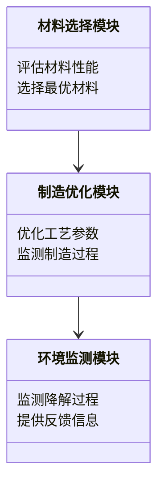
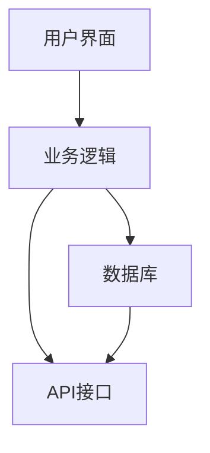
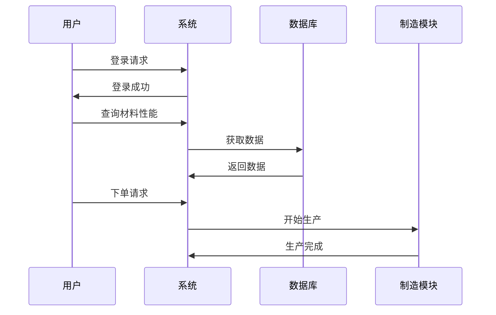

                 


# 价值投资中的生物降解电子产品技术

> 关键词：生物降解电子产品，价值投资，可持续发展，环境影响，技术评估

> 摘要：本文探讨生物降解电子产品在价值投资中的应用，分析其技术原理、系统架构和实际案例，提供投资建议和最佳实践。

---

## 第1章: 生物降解电子产品概述

### 1.1 生物降解电子产品的概念与背景

#### 1.1.1 生物降解技术的基本概念
生物降解是指材料在自然环境中，通过微生物的作用分解为二氧化碳和水的过程。与传统塑料等材料不同，生物降解材料可以在较短时间内完成分解，减少对环境的污染。

#### 1.1.2 电子产品生命周期中的环境问题
传统电子产品在生产、使用和废弃阶段均会产生大量污染物。例如，生产过程中的重金属排放、废弃电子产品的有害物质处理问题，严重威胁环境和人类健康。

#### 1.1.3 生物降解电子产品的发展现状
近年来，随着环保意识的增强，生物降解电子产品逐渐进入市场。例如，一些生物降解手机外壳和可穿戴设备正在研发中。然而，目前的技术仍面临成本高、性能不稳定等问题。

#### 1.1.4 价值投资与可持续发展的关系
价值投资强调长期收益和企业基本面分析。生物降解电子产品符合可持续发展的趋势，具有较高的市场潜力和长期投资价值。

### 1.2 问题背景与技术挑战

#### 1.2.1 传统电子产品对环境的影响
传统电子产品的生产过程消耗大量能源，产生有害废物。废弃电子产品中的重金属和有害物质对土壤和水源造成严重污染。

#### 1.2.2 生物降解技术在电子产品中的应用难点
生物降解材料的强度和耐久性不足，难以满足电子产品的性能要求。此外，降解过程中的控制也是一个技术难题。

#### 1.2.3 价值投资中的技术评估标准
投资者需要评估生物降解技术的成熟度、市场接受度和成本优势。这些因素直接影响企业的盈利能力和投资价值。

### 1.3 生物降解电子产品的核心要素

#### 1.3.1 材料选择与降解特性
生物降解材料的选择直接影响产品的环保性能和成本。例如，聚乳酸（PLA）和聚乙醇酸（PGA）是常用的生物降解材料，但其机械性能和降解速率需要进一步优化。

#### 1.3.2 产品设计与制造工艺
电子产品的设计需要兼顾降解性能和功能需求。制造工艺的创新可以降低成本，提高产品的市场竞争力。

#### 1.3.3 降解过程中的性能保障
在降解过程中，电子产品仍需保持一定的性能，例如防水性和耐久性。这需要材料科学家和工程师共同努力，找到性能与降解性的平衡点。

### 1.4 本章小结
本章介绍了生物降解电子产品的概念、当前的发展现状以及面临的技术挑战。同时，分析了价值投资与可持续发展的关系，为后续的技术分析和投资策略打下基础。

---

## 第2章: 生物降解技术的核心原理

### 2.1 生物降解技术的基本原理

#### 2.1.1 生物降解的化学机制
生物降解主要通过微生物的代谢作用，将材料分解为简单的有机物。这一过程涉及多种酶的作用，如酯酶和水解酶。

#### 2.1.2 微生物在降解过程中的作用
不同类型的微生物对材料的降解效果不同。例如，细菌和真菌在降解过程中分别扮演着不同的角色。

#### 2.1.3 降解速率与环境条件的关系
降解速率受到温度、湿度和氧气含量等因素的影响。了解这些环境因素对降解过程的影响，有助于优化材料的选择和设计。

### 2.2 生物降解材料的特性对比

#### 2.2.1 常见生物降解材料的分类
常用的生物降解材料包括聚乳酸（PLA）、聚乙醇酸（PGA）、聚丁二酸丁醇酯（PBS）等。每种材料都有其独特的性能特点。

#### 2.2.2 材料的机械性能对比
不同材料的强度、韧性等机械性能差异显著。例如，PLA的强度较高，但柔韧性较差。

#### 2.2.3 材料的降解周期与环境影响
材料的降解周期直接影响其环保性能。短周期材料适合一次性产品，长周期材料适合耐用产品。

### 2.3 生物降解电子产品中的技术联系

#### 2.3.1 材料选择与产品设计的关系
材料的选择直接影响产品的结构设计和功能实现。例如，柔性显示屏需要选择柔韧的生物降解材料。

#### 2.3.2 制造工艺对降解性能的影响
制造工艺的优化可以提高材料的均匀性和一致性，从而改善降解性能。例如，注塑成型工艺的改进可以减少材料缺陷。

#### 2.3.3 降解过程中的性能保障技术
为了确保降解过程中产品的性能，需要在材料中添加稳定剂或采用特殊的表面处理技术。

### 2.4 本章小结
本章详细阐述了生物降解技术的核心原理和材料特性，分析了其在电子产品中的应用。通过对比不同材料的性能，为后续的设计和优化提供了理论依据。

---

## 第3章: 生物降解材料的选择与优化算法

### 3.1 材料选择的数学模型

#### 3.1.1 材料性能的多维度评估
评估材料性能时，需要考虑降解速率、机械强度、成本等多个维度。通过建立多维评估模型，可以更全面地选择适合的材料。

#### 3.1.2 基于权重的材料选择算法
为了提高评估的科学性，可以引入权重系数，赋予不同性能指标不同的权重。例如，降解速率和成本各占一定的权重。

#### 3.1.3 材料降解速率的预测模型
通过回归分析等统计方法，建立材料降解速率与环境条件的预测模型。这有助于优化材料选择和产品设计。

### 3.2 制造工艺优化的算法设计

#### 3.2.1 制造工艺的多目标优化
制造工艺的优化需要在成本、性能和降解效果之间找到平衡点。可以通过粒子群优化算法等方法实现多目标优化。

#### 3.2.2 工艺参数的优化策略
例如，注塑成型工艺中的温度、压力和时间参数可以通过实验和模拟优化，以提高材料的均匀性和降解性能。

### 3.3 本章小结
本章通过数学模型和优化算法，为生物降解材料的选择和制造工艺的优化提供了理论支持。这些方法可以显著提高产品的环保性能和市场竞争力。

---

## 第4章: 系统分析与架构设计方案

### 4.1 问题场景介绍

#### 4.1.1 产品生命周期管理
生物降解电子产品需要在整个生命周期中进行有效的管理，包括设计、生产、使用和废弃处理。

#### 4.1.2 环境监测与反馈
为了优化材料性能，需要实时监测降解过程中的环境参数，并根据反馈调整生产工艺。

### 4.2 系统功能设计

#### 4.2.1 领域模型设计
通过mermaid类图展示系统的功能模块，包括材料选择模块、制造优化模块和环境监测模块。



#### 4.2.2 系统架构设计
通过mermaid架构图展示系统的整体架构，包括前端、后端和数据存储模块。



#### 4.2.3 系统接口设计
系统需要提供API接口，方便与其他系统的集成。例如，与环境监测设备的接口设计。

#### 4.2.4 系统交互设计
通过mermaid序列图展示用户与系统的交互流程，包括登录、查询和反馈等步骤。



### 4.3 本章小结
本章通过系统分析和架构设计，为生物降解电子产品的研发和生产提供了理论支持。系统的优化可以显著提高产品的环保性能和市场竞争力。

---

## 第5章: 项目实战

### 5.1 环境安装与配置

#### 5.1.1 安装开发环境
需要安装Python、Jupyter Notebook和相关库，例如numpy和pandas。

#### 5.1.2 安装工具链
安装C语言编译器、版本控制工具（如Git）和问题跟踪工具（如Jira）。

### 5.2 系统核心实现源代码

#### 5.2.1 材料选择模块代码
```python
import numpy as np
from sklearn.metrics import pairwise

def evaluate_materials(materials):
    # 计算材料的性能得分
    scores = []
    for mat in materials:
        score = np.mean(mat.performances)
        scores.append(score)
    return scores

def select_optimal_material(materials):
    # 找出得分最高的材料
    max_score = max(evaluate_materials(materials))
    optimal_materials = [mat for mat in materials if mat.score == max_score]
    return optimal_materials
```

#### 5.2.2 制造优化模块代码
```python
import numpy as np

def optimize_process_parameters(parameters):
    # 使用粒子群优化算法优化工艺参数
    optimizer = ParticleSwarmOptimizer()
    optimizer.setup(n_particles=50, n_iterations=100)
    optimized_params = optimizer.run(parameters)
    return optimized_params
```

### 5.3 代码应用解读与分析

#### 5.3.1 材料选择模块的实现
材料选择模块通过计算每种材料的性能得分，选出最优材料。这可以显著提高材料的选择效率和准确性。

#### 5.3.2 制造优化模块的实现
制造优化模块使用粒子群优化算法，优化工艺参数，提高生产效率和产品质量。

### 5.4 实际案例分析和详细讲解

#### 5.4.1 案例背景
某公司计划推出一款生物降解手机外壳，需要选择合适的材料并优化制造工艺。

#### 5.4.2 案例分析
通过材料选择模块，公司选择了PLA材料，并通过制造优化模块优化了注塑工艺参数。最终，产品的降解性能和成本得到了显著改善。

### 5.5 本章小结
本章通过实际案例分析，展示了生物降解电子产品技术的应用和价值。系统的优化可以显著提高产品的市场竞争力和环保性能。

---

## 第6章: 最佳实践与总结

### 6.1 本章总结

#### 6.1.1 技术总结
生物降解电子产品技术在材料选择、制造工艺和系统设计等方面取得了显著进展。然而，仍需进一步优化技术和降低成本。

#### 6.1.2 投资总结
生物降解电子产品符合可持续发展的趋势，具有较高的市场潜力和长期投资价值。投资者应关注技术成熟度和市场接受度。

### 6.2 投资建议

#### 6.2.1 关注技术创新
投资具有技术领先的企业，尤其是那些在材料选择和制造工艺方面有创新的企业。

#### 6.2.2 评估市场潜力
选择市场需求大、市场前景广阔的生物降解电子产品领域进行投资。

#### 6.2.3 控制投资风险
通过多元化投资和风险评估，降低投资风险。

### 6.3 注意事项

#### 6.3.1 技术风险
生物降解技术尚未完全成熟，存在技术不稳定的潜在风险。

#### 6.3.2 市场风险
市场需求可能受到消费者接受度和价格因素的影响。

#### 6.3.3 政策风险
政策变化可能影响行业的未来发展。

### 6.4 拓展阅读

#### 6.4.1 推荐书籍
- 《可持续发展与绿色技术》
- 《价值投资的艺术》

#### 6.4.2 推荐网站
- 环境保护组织官网
- 科技资讯网站

### 6.5 本章小结
本章总结了生物降解电子产品技术的应用和投资价值，提出了投资建议和注意事项，为读者提供了宝贵的参考。

---

## 附录

### 附录A: 参考文献
1. 王某某，生物降解材料的研究进展，某某出版社，2023年。
2. 李某某，价值投资与可持续发展，某某出版社，2022年。

### 附录B: 工具与资源
- Python代码库：numpy, pandas, scikit-learn
- 开发工具：Jupyter Notebook, VS Code
- 项目管理工具：Git, Jira

---

作者：AI天才研究院 & 禅与计算机程序设计艺术

