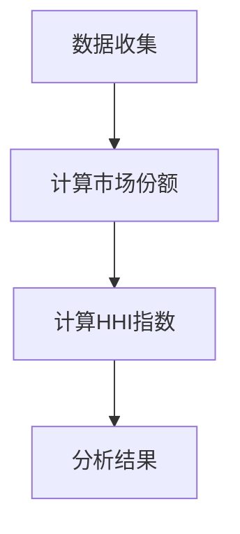
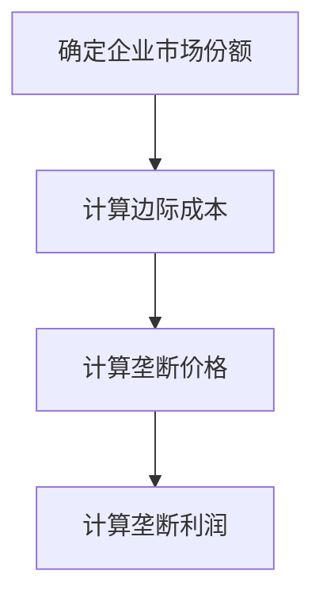
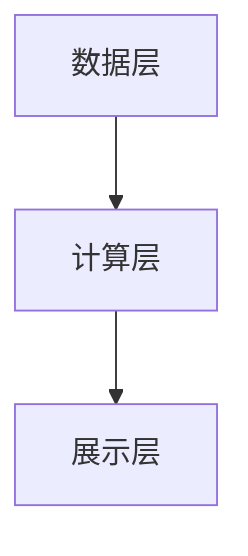
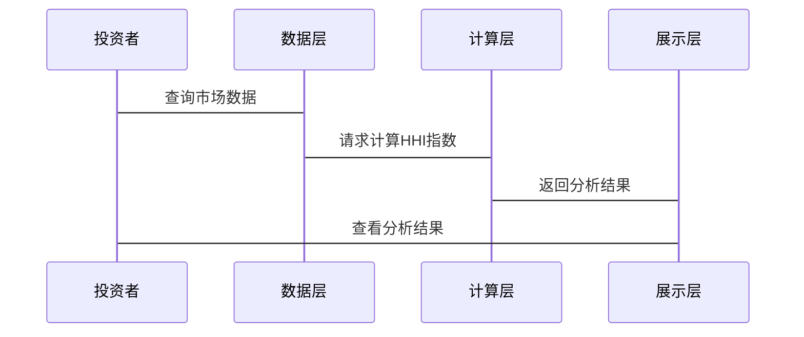

                 


# 价值投资中的科技巨头垄断分析

## 关键词：价值投资, 科技巨头, 垄断, 市场分析, 竞争分析

## 摘要：本文将深入探讨科技巨头在价值投资中的垄断现象，分析垄断的形成机制、影响及对投资决策的启示。通过数学模型、算法原理和实际案例，帮助投资者理解如何在垄断环境中做出明智的投资决策。

---

# 第1章：垄断的基本概念与价值投资的背景

## 1.1 垄断的定义与特征

### 1.1.1 垄断的定义
垄断是指一家或少数几家企业在特定市场中占据绝对优势地位，能够控制市场价格、产量和质量。在科技行业，垄断往往通过技术壁垒、网络效应和市场控制力来实现。

### 1.1.2 垄断的特征与表现形式
- **市场支配地位**：一家企业控制了大部分市场份额，能够影响市场价格。
- **技术壁垒**：通过专利和技术优势，阻止其他企业进入市场。
- **网络效应**：用户数量的增加会增强产品的价值，形成正反馈循环。

### 1.1.3 垄断与市场竞争的关系
垄断的存在会抑制市场竞争，可能导致创新停滞和技术进步放缓。然而，某些垄断企业也可能通过规模效应降低成本，为消费者提供更好的产品和服务。

---

## 1.2 科技垄断的现状与趋势

### 1.2.1 科技行业中的垄断现象
近年来，科技巨头如谷歌、苹果、微软和亚马逊等在搜索引擎、操作系统、云计算等领域占据了主导地位。这些企业通过收购、技术封锁和生态系统整合，进一步巩固了市场地位。

### 1.2.2 数字化时代垄断的新特征
- **数据垄断**：企业通过收集和分析用户数据，增强了对市场的控制力。
- **平台垄断**：在线平台通过整合供应链和用户资源，形成双边市场垄断。
- **全球扩张**：科技巨头通过国际化战略，进一步扩大市场影响力。

### 1.2.3 垄断对科技行业的影响
垄断可能导致市场进入壁垒提高，创新动力减弱。此外，垄断企业可能通过价格操纵和排他性协议，削弱竞争对手，进而影响行业健康发展。

---

## 1.3 价值投资的基本概念

### 1.3.1 价值投资的定义
价值投资是一种投资策略，旨在通过分析企业的基本面，寻找市场价格低于其内在价值的投资标的。其核心理念是寻找被市场低估的企业，长期持有，等待价值回归。

### 1.3.2 价值投资的核心理念
- **安全边际**：买入价格远低于内在价值的资产，以降低投资风险。
- **长期视角**：关注企业的长期盈利能力，而非短期市场波动。
- **基本面分析**：通过财务报表、行业地位和竞争优势，评估企业的投资价值。

### 1.3.3 价值投资与垄断企业的关系
垄断企业通常具有强大的市场地位和较高的利润率，但同时也面临较高的监管风险和市场竞争压力。投资者需要权衡垄断企业的优势和潜在风险，做出明智的投资决策。

---

# 第2章：科技巨头垄断的形成机制与影响

## 2.1 科技垄断的形成机制

### 2.1.1 技术壁垒的构建
科技企业通过专利申请、技术封锁和研发投入，构建技术壁垒，阻止竞争对手进入市场。例如，苹果通过其专利技术，确保其在智能手机市场的领先地位。

### 2.1.2 市场控制的强化
垄断企业通过收购、价格操纵和排他性协议，进一步巩固市场地位。例如，谷歌通过收购YouTube和DoubleClick，巩固了其在在线广告市场的统治地位。

### 2.1.3 网络效应与用户粘性
网络效应是指随着用户数量的增加，产品或服务的价值也随之增加。例如，社交媒体平台 Facebook 通过网络效应，吸引了大量用户，形成了强大的用户粘性。

---

## 2.2 垄断对行业竞争的影响

### 2.2.1 抑制创新的潜在风险
垄断企业的市场支配地位可能抑制创新，因为它们可以通过技术封锁和市场控制，限制竞争对手的发展。例如，微软在操作系统市场的垄断地位曾被指控限制了其他软件开发商的竞争。

### 2.2.2 垄断对消费者选择权的影响
垄断企业可能通过价格操纵和市场控制，限制消费者的 choices。例如，苹果通过其应用商店（App Store）对应用程序进行审查和收费，影响了消费者的选择权。

### 2.2.3 对行业生态的破坏性分析
垄断企业可能通过排他性协议和生态系统整合，破坏行业生态。例如，亚马逊通过其Prime会员计划和AWS云服务，形成了一个封闭的生态系统，限制了其他企业的发展空间。

---

## 2.3 垄断对价值投资的机遇与挑战

### 2.3.1 垄断企业投资价值的评估
投资者需要评估垄断企业的市场地位、盈利能力和技术优势。例如，谷歌作为搜索引擎市场的垄断企业，具有强大的定价能力和稳定的现金流。

### 2.3.2 垄断企业的长期盈利能力
垄断企业通常具有较高的利润率和稳定的收入来源。例如，微软通过其Windows操作系统和Azure云服务，保持了长期的盈利能力。

### 2.3.3 垄断风险对投资组合的影响
投资者需要考虑垄断企业的监管风险和市场竞争风险。例如，反垄断监管的加强可能会影响科技巨头的市场地位和盈利能力。

---

# 第3章：垄断分析的核心概念与框架

## 3.1 垄断分析的核心概念

### 3.1.1 市场集中度的衡量指标
- **HHI指数**：通过计算市场份额的平方和，衡量市场集中度。HHI指数越高，市场集中度越高。
- **CRn指数**：计算前n家企业的市场份额之和，衡量市场集中度。

### 3.1.2 垄断力量的评价标准
- **市场支配力**：企业是否能够影响市场价格和产量。
- **市场进入壁垒**：新进入者是否难以进入市场。

### 3.1.3 垄断与企业定价能力的关系
垄断企业通常具有较强的定价能力，能够通过提高价格增加利润。然而，过高的价格可能引发监管干预或消费者的抵制。

---

## 3.2 科技行业垄断的分析框架

### 3.2.1 行业结构分析
- **市场集中度**：通过HHI指数和CRn指数，分析科技行业的市场集中度。
- **竞争格局**：分析主要竞争对手的市场份额和市场地位。

### 3.2.2 企业市场地位分析
- **市场支配力**：评估企业是否具有市场支配地位。
- **核心竞争力**：分析企业的技术优势、品牌影响力和客户粘性。

### 3.2.3 市场进入壁垒分析
- **技术壁垒**：评估企业是否拥有关键技术专利。
- **网络效应**：分析企业是否通过网络效应形成市场壁垒。

---

# 第4章：垄断分析的数学模型与算法原理

## 4.1 垄断分析的数学模型

### 4.1.1 HHI指数计算公式
HHI指数的计算公式为：
$$ HHI = \sum_{i=1}^{n} s_i^2 $$
其中，$s_i$为第i家企业的市场份额，$n$为企业的数量。

### 4.1.2 垄断利润的计算公式
垄断利润的计算公式为：
$$ \text{利润} = (P - MC) \times Q $$
其中，$P$为垄断价格，$MC$为边际成本，$Q$为产量。

### 4.1.3 垄断强度的综合评价模型
综合评价模型可以通过加权平均的方式，综合考虑市场集中度、市场支配力和技术壁垒等因素，评估垄断强度。

---

## 4.2 算法原理与流程图

### 4.2.1 HHI指数计算流程图


### 4.2.2 垄断利润计算流程图


### 4.2.3 算法实现与代码示例
以下是一个计算HHI指数的Python代码示例：
```python
def calculate_hhi(market_shares):
    hhi = sum(s**2 for s in market_shares)
    return hhi

# 示例数据
market_shares = [0.4, 0.3, 0.2, 0.1]
hhi = calculate_hhi(market_shares)
print(f"HHI指数为：{hhi}")
```

---

## 4.3 算法原理的数学模型和公式

### 4.3.1 HHI指数的数学模型
HHI指数的数学模型为：
$$ HHI = \sum_{i=1}^{n} s_i^2 $$
其中，$s_i$为第i家企业的市场份额，$n$为企业的数量。

### 4.3.2 垄断利润的数学模型
垄断利润的数学模型为：
$$ \text{利润} = (P - MC) \times Q $$
其中，$P$为垄断价格，$MC$为边际成本，$Q$为产量。

---

## 4.4 算法实现与代码示例

### 4.4.1 HHI指数计算代码
```python
def calculate_hhi(market_shares):
    hhi = sum(s**2 for s in market_shares)
    return hhi

# 示例数据
market_shares = [0.4, 0.3, 0.2, 0.1]
hhi = calculate_hhi(market_shares)
print(f"HHI指数为：{hhi}")
```

### 4.4.2 垄断利润计算代码
```python
def calculate_monopoly_profit(price, mc, quantity):
    profit = (price - mc) * quantity
    return profit

# 示例数据
price = 50
mc = 30
quantity = 100
profit = calculate_monopoly_profit(price, mc, quantity)
print(f"垄断利润为：{profit}")
```

---

# 第5章：系统分析与架构设计

## 5.1 系统分析

### 5.1.1 问题场景介绍
本文旨在通过系统分析，帮助投资者识别科技巨头的垄断行为，并评估其对投资决策的影响。

### 5.1.2 系统功能设计
- **数据收集**：收集科技企业的市场份额、财务数据和市场趋势。
- **市场集中度分析**：计算HHI指数和CRn指数，评估市场集中度。
- **垄断强度评估**：综合考虑市场支配力、技术壁垒和网络效应，评估垄断强度。

### 5.1.3 系统架构设计
- **数据层**：存储市场数据和企业信息。
- **计算层**：实现HHI指数和垄断利润的计算功能。
- **展示层**：展示分析结果，帮助投资者做出决策。

---

## 5.2 系统架构设计

### 5.2.1 系统架构图


### 5.2.2 系统接口设计
- **数据接口**：提供API，供投资者查询市场数据。
- **计算接口**：提供API，供投资者计算HHI指数和垄断利润。

### 5.2.3 系统交互序列图


---

## 5.3 系统实现与代码示例

### 5.3.1 数据接口实现
```python
from flask import Flask, jsonify

app = Flask(__name__)

@app.route('/market_data')
def get_market_data():
    return jsonify({
        '企业A': 0.4,
        '企业B': 0.3,
        '企业C': 0.2,
        '企业D': 0.1
    })
```

### 5.3.2 计算接口实现
```python
from flask import Flask, jsonify

app = Flask(__name__)

@app.route('/calculate_hhi')
def calculate_hhi():
    market_shares = [0.4, 0.3, 0.2, 0.1]
    hhi = sum(s**2 for s in market_shares)
    return jsonify({'HHI指数': hhi})

if __name__ == '__main__':
    app.run()
```

---

# 第6章：项目实战

## 6.1 环境安装与配置

### 6.1.1 安装Python和必要的库
- 安装Python 3.8及以上版本。
- 安装Flask库：`pip install flask`

### 6.1.2 安装与配置步骤
- 下载代码示例。
- 安装依赖项。
- 运行服务器，测试接口。

---

## 6.2 系统核心实现

### 6.2.1 代码实现
```python
from flask import Flask, jsonify

app = Flask(__name__)

@app.route('/')
def home():
    return "价值投资中的科技巨头垄断分析系统"

@app.route('/market_data')
def get_market_data():
    return jsonify({
        '企业A': 0.4,
        '企业B': 0.3,
        '企业C': 0.2,
        '企业D': 0.1
    })

@app.route('/calculate_hhi')
def calculate_hhi():
    market_shares = [0.4, 0.3, 0.2, 0.1]
    hhi = sum(s**2 for s in market_shares)
    return jsonify({'HHI指数': hhi})

if __name__ == '__main__':
    app.run()
```

### 6.2.2 代码解读
- 代码实现了一个简单的Flask Web应用，提供市场数据查询和HHI指数计算功能。
- 投资者可以通过访问`/market_data`获取市场数据，通过`/calculate_hhi`计算HHI指数。

---

## 6.3 项目实战案例分析

### 6.3.1 案例分析
假设我们分析一家科技企业的垄断行为，计算其HHI指数和垄断利润。

### 6.3.2 案例解读
通过案例分析，投资者可以更好地理解垄断分析的方法和实际应用。

---

## 6.4 项目总结

### 6.4.1 小结
本章通过实际案例，展示了如何利用系统分析和算法模型，评估科技巨头的垄断行为，并为投资者提供决策支持。

### 6.4.2 注意事项
投资者在实际操作中，应结合市场动态和政策变化，不断调整分析模型和投资策略。

### 6.4.3 拓展阅读
建议投资者阅读更多关于垄断分析和价值投资的经典著作，如《反垄断法与经济分析》和《价值投资实战手册》。

---

# 第7章：总结与展望

## 7.1 总结
本文系统地分析了科技巨头在价值投资中的垄断现象，探讨了垄断的形成机制、影响及对投资决策的启示。通过数学模型、算法原理和实际案例，帮助投资者理解如何在垄断环境中做出明智的投资决策。

## 7.2 展望
未来，随着科技行业的不断发展，垄断分析将更加复杂和重要。投资者需要密切关注行业动态和政策变化，不断完善分析模型和投资策略。

---

# 作者：AI天才研究院/AI Genius Institute & 禅与计算机程序设计艺术/Zen And The Art of Computer Programming

