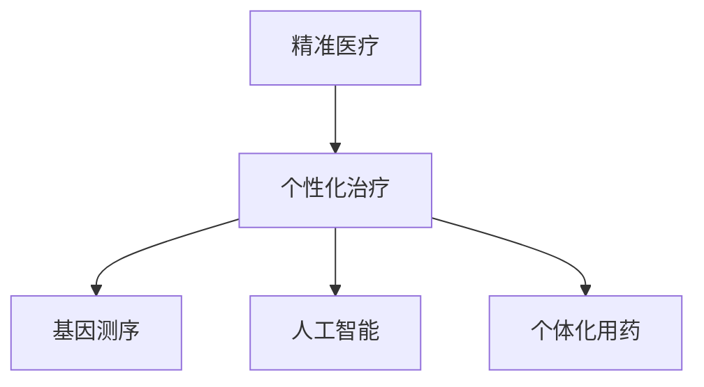
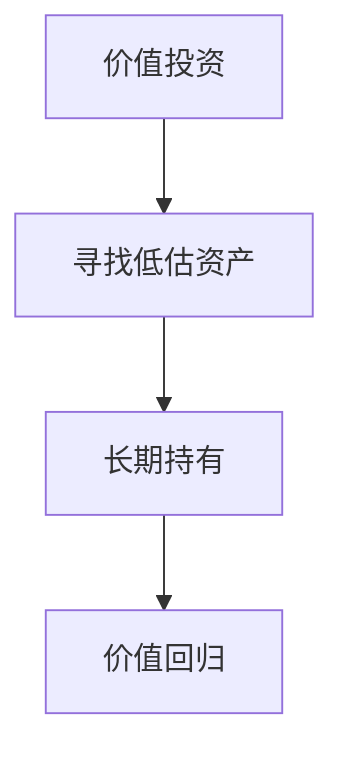
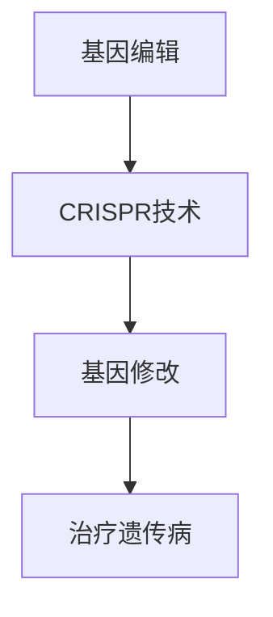
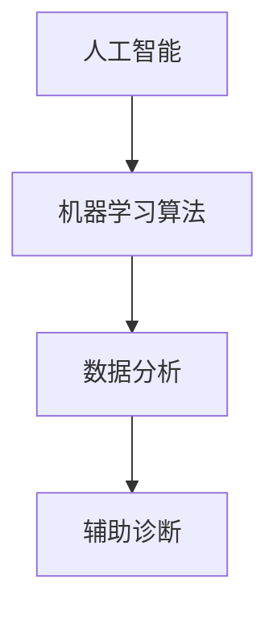
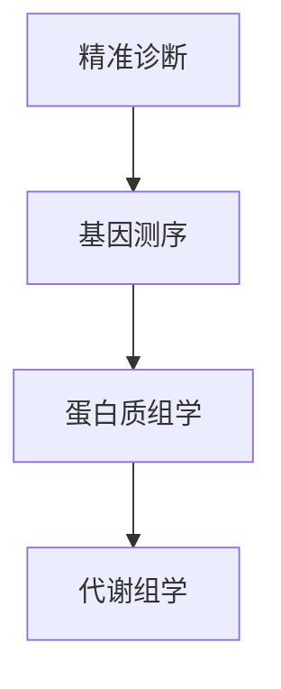
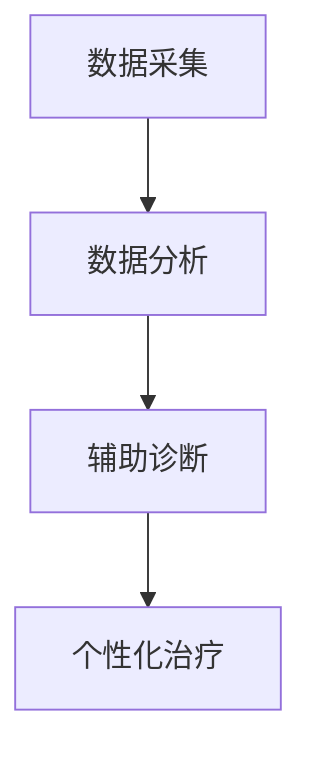

                 


# 价值投资中的精准医疗技术趋势

---

## 关键词

- 精准医疗
- 价值投资
- 技术趋势
- 市场分析
- 价值评估

---

## 摘要

本文探讨了精准医疗技术在价值投资中的应用趋势，分析了精准医疗的核心技术及其市场潜力，构建了精准医疗技术的价值评估模型，并提出了基于价值投资的精准医疗技术投资策略。文章结合实际案例，详细阐述了精准医疗技术在价值投资中的系统分析方法，为投资者提供了科学的决策依据。

---

# 第1章: 精准医疗技术的定义与发展

## 1.1 精准医疗技术的核心概念

### 1.1.1 精准医疗的定义与背景

精准医疗是指通过基因测序、人工智能等技术，结合患者的个体特征，制定个性化治疗方案的医疗方式。其核心在于“精准”，即在疾病的预防、诊断和治疗过程中，根据患者的基因信息、生活方式和环境因素，制定最适合的治疗方案。



精准医疗的兴起源于传统医疗的局限性。传统医疗往往采用“一刀切”的治疗方法，忽视了患者个体差异，导致治疗效果不佳甚至产生副作用。随着基因测序技术的发展和人工智能的广泛应用，精准医疗逐渐成为医学领域的主流趋势。

### 1.1.2 精准医疗与传统医疗的区别

| 特性 | 精准医疗 | 传统医疗 |
|------|----------|----------|
| 治疗方案 | 个性化 | 标准化 |
| 数据支持 | 基因数据、人工智能 | 病症描述 |
| 成本 | 较高 | 较低 |
| 效果 | 更精准 | 可能存在副作用 |

精准医疗的核心在于数据的深度分析和个性化治疗方案的制定。与传统医疗相比，精准医疗更加注重患者的个体差异，能够显著提高治疗效果并降低副作用。

### 1.1.3 精准医疗技术的现状与发展趋势

精准医疗技术近年来发展迅速，尤其是在基因测序、人工智能和远程医疗等领域取得了显著进展。以下是精准医疗技术的主要发展趋势：

1. **基因编辑技术**：基因编辑技术（如CRISPR）的突破为精准医疗提供了强大的工具，能够精确修改基因序列，治疗遗传性疾病。
2. **人工智能在医疗中的应用**：人工智能技术能够快速分析海量医疗数据，辅助医生制定个性化治疗方案。
3. **远程医疗与物联网**：通过物联网技术，患者可以实时监测健康数据，医生能够根据数据提供精准的远程诊断。

---

## 1.2 价值投资的基本原理

### 1.2.1 价值投资的定义与特点

价值投资是一种以低于内在价值的价格买入优质资产的投资策略。其核心在于寻找市场中被低估的投资标的，长期持有，等待其价值回归。



价值投资与成长投资的区别在于，价值投资注重资产的内在价值，而成长投资注重企业的成长潜力。价值投资者通常寻找那些基本面良好、估值合理的公司，而成长投资者则更关注企业的增长潜力。

### 1.2.2 价值投资与成长投资的区别

| 特性 | 价值投资 | 成长投资 |
|------|----------|----------|
| 投资目标 | 内在价值 | 增长潜力 |
| 投资策略 | 买入低估资产 | 买入高增长资产 |
| 风险偏好 | 较低 | 较高 |

价值投资的核心在于对企业的深入研究和估值分析。投资者需要对企业进行基本面分析，评估其内在价值，并与市场价格进行比较，寻找低估的投资机会。

### 1.2.3 价值投资的成功案例

以巴菲特为例，他通过长期持有优质资产，如可口可乐、苹果等，实现了财富的长期增长。巴菲特的价值投资理念强调企业基本面分析和长期持有，这为投资者提供了重要的参考。

---

## 1.3 精准医疗技术的市场分析

### 1.3.1 精准医疗市场的现状与预测

根据市场研究机构的预测，全球精准医疗市场规模将从2020年的1000亿美元增长到2030年的超过5000亿美元。中国精准医疗市场也将迎来快速增长，预计到2030年市场规模将达到数千亿美元。

### 1.3.2 精准医疗技术的主要应用领域

精准医疗技术目前主要应用于以下几个领域：

1. **癌症治疗**：通过基因测序和靶向治疗，提高癌症治疗的效果和降低副作用。
2. **遗传病治疗**：利用基因编辑技术治疗遗传性疾病。
3. **慢性病管理**：通过个性化用药和远程监测，优化慢性病患者的治疗效果。

---

# 第2章: 精准医疗技术的核心趋势分析

## 2.1 精准医疗技术的关键技术发展

### 2.1.1 基因编辑技术

基因编辑技术（如CRISPR）是精准医疗的核心技术之一。通过基因编辑，科学家可以精确修改基因序列，治疗遗传性疾病。



基因编辑技术的应用前景广阔，尤其是在癌症治疗和遗传病治疗领域。然而，基因编辑技术也面临着技术难度大、伦理争议等问题，需要进一步研究和规范。

### 2.1.2 人工智能在医疗中的应用

人工智能技术在精准医疗中的应用主要体现在数据分析和辅助诊断方面。通过机器学习算法，人工智能能够快速分析患者的基因数据和临床数据，辅助医生制定个性化治疗方案。



人工智能在精准医疗中的应用正在快速发展，尤其是在影像诊断和药物研发领域。然而，人工智能技术的应用也面临着数据隐私和算法黑箱等问题，需要进一步解决。

### 2.1.3 精准诊断与治疗技术

精准诊断与治疗技术是精准医疗的核心，包括基因测序、蛋白质组学和代谢组学等技术。通过这些技术，医生可以精确诊断疾病，并制定个性化的治疗方案。



精准诊断与治疗技术的应用显著提高了治疗效果，降低了治疗成本。然而，这些技术的应用也面临着成本高、技术复杂等问题，需要进一步优化和推广。

---

## 2.2 精准医疗技术的价值评估模型

### 2.2.1 价值评估模型的构建与核心要素

精准医疗技术的价值评估模型需要考虑以下几个核心要素：

1. **技术可行性**：技术的成熟度和应用前景。
2. **市场潜力**：市场规模和增长潜力。
3. **竞争环境**：市场竞争状况和企业的竞争优势。
4. **财务状况**：企业的财务健康状况和盈利能力。

### 2.2.2 市场潜力与技术可行性分析

市场潜力分析需要考虑精准医疗技术的市场规模和增长趋势。技术可行性分析需要评估技术的成熟度和应用前景。

### 2.2.3 企业财务状况与竞争能力分析

企业财务状况分析需要评估企业的盈利能力、资产负债状况和现金流情况。竞争能力分析需要评估企业在市场中的竞争优势和竞争地位。

---

## 2.3 价值投资中的精准医疗技术策略

### 2.3.1 从技术到市场的转化路径

精准医疗技术的商业化需要考虑技术的市场需求、市场定位和商业模式。投资者需要评估技术的市场潜力和商业化可行性。

### 2.3.2 投资者如何评估技术的商业化潜力

投资者需要从市场需求、技术成熟度、竞争环境和商业模式四个方面评估技术的商业化潜力。

### 2.3.3 精准医疗技术的风险与收益平衡

精准医疗技术的投资风险较高，但收益潜力巨大。投资者需要在风险和收益之间找到平衡点，制定合理的投资策略。

---

# 第3章: 价值投资与精准医疗技术的结合

## 3.1 精准医疗技术的系统分析与架构设计

### 3.1.1 系统分析的步骤与方法

系统分析的步骤包括需求分析、数据收集、模型构建和结果分析。

### 3.1.2 精准医疗技术的领域模型构建

精准医疗技术的领域模型需要考虑技术、市场和财务三个维度。

### 3.1.3 系统架构设计与优化

系统架构设计需要考虑模块化、可扩展性和安全性。

---

## 3.2 精准医疗技术的系统架构与实现

### 3.2.1 系统架构设计

精准医疗技术的系统架构包括数据采集、数据分析、辅助诊断和个性化治疗四个模块。



### 3.2.2 系统接口设计

系统接口设计需要考虑数据输入、数据输出和系统交互三个方面。

### 3.2.3 系统交互设计

系统交互设计需要考虑用户界面、用户流程和用户反馈三个方面。

---

## 3.3 项目实战: 精准医疗技术的价值评估

### 3.3.1 环境安装

需要安装Python、Pandas、NumPy等工具。

### 3.3.2 系统核心实现源代码

```python
import pandas as pd
import numpy as np

def value_assessment(revenue, profit_margin, growth_rate):
    intrinsic_value = revenue * profit_margin * (1 + growth_rate/100)
    return intrinsic_value

# 示例数据
revenue = 1000
profit_margin = 0.2
growth_rate = 10

intrinsic_value = value_assessment(revenue, profit_margin, growth_rate)
print(f"公司内在价值为：{intrinsic_value}")
```

### 3.3.3 代码应用解读与分析

代码实现了一个简单的价值评估模型，根据收入、利润率和增长率计算公司的内在价值。

### 3.3.4 实际案例分析

以某精准医疗公司为例，分析其内在价值和市场定位。

---

## 3.4 总结与展望

### 3.4.1 总结

精准医疗技术的价值评估需要考虑技术可行性、市场潜力和财务状况等因素。投资者需要制定合理的投资策略，平衡风险与收益。

### 3.4.2 展望

随着技术的进步和市场的成熟，精准医疗技术的投资潜力将越来越大。投资者需要密切关注技术发展和市场变化，抓住投资机遇。

---

作者：AI天才研究院/AI Genius Institute & 禅与计算机程序设计艺术 /Zen And The Art of Computer Programming

