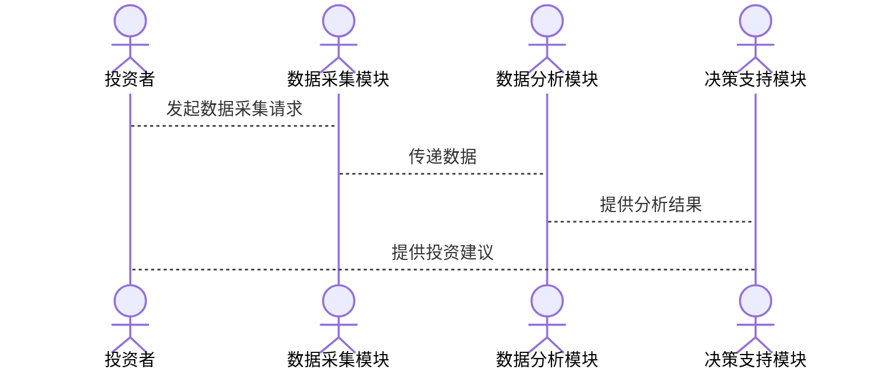

                 


# 价值投资中的绿色经济机遇

## 关键词：绿色经济、价值投资、可持续发展、投资机遇、经济转型、风险管理

## 摘要：  
随着全球对可持续发展的关注日益增加，绿色经济成为推动经济增长的重要引擎。本文深入探讨绿色经济的核心概念、价值投资的基本原理，以及两者如何在投资领域相互作用。通过分析绿色经济中的投资机会，如可再生能源和环保科技，本文揭示了价值投资在绿色经济中的策略优化与实际应用。同时，结合案例分析和系统架构设计，本文为投资者提供了绿色经济投资的实践指南，帮助他们在绿色经济的浪潮中抓住长期稳健的投资机遇。

---

# 第一部分：绿色经济与价值投资的背景与核心概念

## 第1章：绿色经济的定义与背景

### 1.1 绿色经济的定义与特征  
绿色经济是以可持续发展为核心，强调资源高效利用、环境保护和低碳发展的经济模式。其核心特征包括：  
1. **资源高效性**：通过技术创新实现资源的循环利用。  
2. **环境友好性**：减少对环境的负面影响，推动生态保护。  
3. **经济可持续性**：注重长期效益，而非短期利益。  

绿色经济与可持续发展的关系密不可分，它是实现联合国提出的17个可持续发展目标（SDGs）的重要手段。  

### 1.2 价值投资的基本原理  
价值投资是一种以基本面分析为基础的投资策略，强调以低于内在价值的价格买入优质资产。其核心原则包括：  
1. **长期视角**：关注企业的长期价值，而非短期市场波动。  
2. **基本面分析**：通过财务指标、行业地位等因素评估企业的内在价值。  
3. **安全边际**：买入价格低于内在价值，以降低投资风险。  

---

## 第2章：绿色经济与价值投资的核心概念

### 2.1 绿色产业的核心要素  
绿色产业主要包括以下领域：  
- **可再生能源**：太阳能、风能、生物质能等清洁能源。  
- **环保技术**：废物处理、环境监测、绿色交通等技术。  
- **绿色金融**：绿色债券、碳交易、绿色基金等金融工具。  

绿色产业的核心要素可以通过 **ER图** 进行展示，如下：  

```mermaid
erDiagram
    actor 投资者
    actor 企业
    actor 政府机构
    actor 环境保护组织
    class 可再生能源项目
    class 环保科技企业
    class 绿色金融产品
    class 市场监管规则
    class 环境数据
    投资者 --> 可再生能源项目 : 投资
    投资者 --> 环保科技企业 : 投资
    投资者 --> 绿色金融产品 : 购买
    政府机构 --> 可再生能源项目 : 支持政策
    政府机构 --> 环保科技企业 : 补贴
    政府机构 --> 绿色金融产品 : 监管
    环境保护组织 --> 可再生能源项目 : 监测
    环境保护组织 --> 环保科技企业 : 评估
    环境数据 --> 可再生能源项目 : 支持
    环境数据 --> 环保科技企业 : 分析
    环境数据 --> 绿色金融产品 : 披露
```

---

### 2.2 价值投资在绿色经济中的应用  
价值投资在绿色经济中的应用主要体现在以下几个方面：  
1. **绿色产业的长期价值**：绿色产业具有较高的社会价值和市场潜力，符合价值投资的长期视角。  
2. **市场潜力分析**：随着政策支持和技术进步，绿色产业的市场规模将持续扩大。  
3. **风险管理**：绿色投资需要关注政策风险、技术风险和市场波动风险。  

---

# 第二部分：绿色经济中的投资机会分析

## 第4章：绿色经济中的投资机会

### 4.1 可再生能源的投资机会  
可再生能源是绿色经济的核心领域之一。以下是对可再生能源投资机会的分析：  

#### 4.1.1 太阳能  
- **市场规模**：全球太阳能市场持续增长，预计到2030年市场规模将超过1万亿美元。  
- **投资逻辑**：太阳能技术成熟，政策支持强烈，具备长期投资价值。  

#### 4.1.2 风能  
- **市场规模**：风能在全球可再生能源市场中占比最大，技术门槛相对较高。  
- **投资逻辑**：风能项目具有较高的稳定性和收益潜力。  

#### 4.1.3 水能  
- **市场规模**：水能开发相对成熟，但新增市场潜力有限。  
- **投资逻辑**：水能项目风险较低，适合长期投资。  

---

### 4.2 环保技术的投资机会  
环保技术是绿色经济的重要组成部分，包括废物处理、环境监测等领域。  

#### 4.2.1 废物处理技术  
- **市场规模**：全球废物处理市场规模预计将以年均5%的速度增长。  
- **投资逻辑**：废物处理技术的市场需求稳定，政策支持力度大。  

#### 4.2.2 环境监测技术  
- **市场规模**：环境监测技术在环保领域具有广泛应用前景。  
- **投资逻辑**：环境监测技术的市场需求与政策监管密切相关。  

---

### 4.3 绿色金融的投资机会  
绿色金融是绿色经济的重要支撑，包括绿色债券、绿色基金、碳交易市场等领域。  

#### 4.3.1 绿色债券  
- **市场规模**：全球绿色债券市场规模持续扩大，年均增长超过20%。  
- **投资逻辑**：绿色债券具有较低的信用风险和较高的流动性。  

#### 4.3.2 绿色基金  
- **市场规模**：绿色基金在机构投资者中的受欢迎程度不断提高。  
- **投资逻辑**：绿色基金通过多元化投资分散风险。  

#### 4.3.3 碳交易市场  
- **市场规模**：碳交易市场是绿色金融的重要组成部分，市场规模预计将持续增长。  
- **投资逻辑**：碳交易市场的价格波动较大，但长期趋势向好。  

---

## 第5章：价值投资在绿色经济中的策略与实践

### 5.1 价值投资在绿色经济中的策略优化  
价值投资在绿色经济中的策略优化主要体现在以下几个方面：  
1. **长期视角**：关注绿色产业的长期发展趋势，避免短期波动的干扰。  
2. **基本面分析**：深入分析绿色企业的财务状况、行业地位和技术创新能力。  
3. **风险管理**：制定全面的风险管理策略，包括政策风险、技术风险和市场风险。  

---

### 5.2 绿色经济中的投资策略  
绿色经济中的投资策略需要结合具体行业特点和市场环境。以下是一些关键策略：  

#### 5.2.1 精选标的  
- **选择具有竞争优势的企业**：重点关注具有技术壁垒和成本优势的企业。  
- **关注政策支持**：优先选择获得政府政策支持的行业和企业。  

#### 5.2.2 投资组合优化  
- **分散投资**：通过分散投资降低风险。  
- **长期持有**：保持长期投资策略，避免频繁交易。  

---

## 第三部分：绿色经济投资的系统分析与架构设计

## 第6章：绿色经济投资的系统分析与架构设计

### 6.1 系统分析  
绿色经济投资的系统分析需要从以下几个方面入手：  
1. **数据采集**：收集绿色企业的财务数据、行业数据和环境数据。  
2. **数据分析**：通过大数据分析技术，评估绿色企业的投资价值。  
3. **决策支持**：基于分析结果，制定投资策略和风险管理方案。  

---

### 6.2 系统架构设计  
绿色经济投资的系统架构设计可以通过 **mermaid图** 展示，如下：  


---

### 6.3 系统交互设计  
绿色经济投资系统的交互流程可以通过 **mermaid序列图** 展示，如下：  



---

## 第四部分：项目实战与最佳实践

## 第7章：绿色经济投资的项目实战

### 7.1 项目环境搭建  
绿色经济投资的项目环境搭建需要以下工具和资源：  
- **数据源**：获取绿色企业的财务数据和环境数据。  
- **分析工具**：使用Python、R等工具进行数据分析。  
- **可视化工具**：使用Power BI、Tableau等工具进行数据可视化。  

---

### 7.2 核心代码实现  
以下是绿色经济投资分析的核心代码示例：  

```python
import pandas as pd
import numpy as np
import matplotlib.pyplot as plt

# 数据加载
df = pd.read_csv('green_company.csv')

# 基本统计分析
print(df.describe())

# 可视化分析
plt.hist(df['收益'], bins=10)
plt.title('收益分布')
plt.show()

# 风险评估
returns = df['收益'].pct_change()
volatility = returns.std() * np.sqrt(252)
print(f'年化波动率: {volatility * 100}%')
```

---

### 7.3 案例分析与解读  
以下是一个绿色经济投资的案例分析：  
**案例**：某可再生能源企业投资分析  
- **企业基本面**：财务状况良好，行业地位领先。  
- **技术优势**：拥有核心技术专利，竞争优势明显。  
- **政策支持**：获得政府多项补贴和支持政策。  
- **投资建议**：长期持有，重点关注企业的技术发展和政策变化。  

---

## 第五部分：总结与展望

## 第8章：总结与展望

### 8.1 总结  
绿色经济是未来经济发展的重要方向，价值投资在绿色经济中的应用具有广阔前景。通过系统的分析和实际案例的探讨，投资者可以更好地把握绿色经济的投资机遇，实现长期稳健的收益。

### 8.2 展望  
随着全球对可持续发展的关注不断增加，绿色经济的投资机会将更加丰富。未来，价值投资在绿色经济中的应用将更加成熟，投资者需要持续关注行业动态和技术进步，以抓住更多的投资机遇。

---

# 作者：AI天才研究院/AI Genius Institute & 禅与计算机程序设计艺术/Zen And The Art of Computer Programming

---

以上是《价值投资中的绿色经济机遇》的技术博客文章的完整大纲和内容。文章从绿色经济的背景、价值投资的核心概念，到绿色经济中的投资机会分析、系统设计和项目实战，全面涵盖了绿色经济投资的各个方面。通过理论与实践的结合，帮助读者深入理解绿色经济中的投资机遇，并能够在实际操作中应用价值投资的策略。

