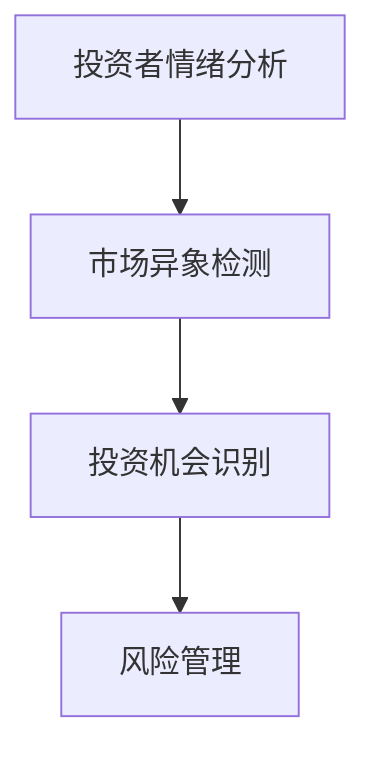

                 

# 价值投资中的行为金融学应用

> 关键词：行为金融学，价值投资，投资者情绪，市场异象，风险管理

> 摘要：本文深入探讨了行为金融学在价值投资中的应用，分析了投资者情绪、认知偏差、市场异象等行为因素对投资决策的影响，结合实际案例和数学模型，提出了基于行为金融学的优化投资策略。

---

## 第一部分：行为金融学基础

### 第1章：行为金融学的基本概念

#### 1.1 行为金融学的定义与核心理论

行为金融学（Behavioral Finance）是研究投资者心理和行为对金融市场影响的学科。传统金融学假设投资者是理性的，但现实中投资者的行为往往受到情绪、认知偏差等心理因素的影响，行为金融学试图解释这些非理性行为对市场定价和投资决策的影响。

- **核心理论**：
  - **有限理性**：投资者在决策时受到信息处理能力的限制。
  - **前景理论**：投资者在决策时更关注相对收益和损失，而非绝对收益。
  - **情绪与市场异象**：投资者情绪波动会导致市场出现短期偏离价值的情况。

---

### 第2章：投资者行为分析

#### 2.1 投资者的决策过程

投资者的决策过程受到多种心理因素的影响，包括认知偏差和情绪波动。以下是常见的认知偏差及其对投资决策的影响：

- **确认偏差**：投资者倾向于寻找支持自己观点的信息，可能导致投资决策的盲目性。
- **过度自信偏差**：投资者对自己判断的过度自信可能导致错误决策。
- **损失厌恶**：投资者对损失的厌恶程度高于对收益的追求，可能导致卖出股票过早。

#### 2.2 投资者的决策偏差

| **认知偏差类型** | **对投资决策的影响** |
|------------------|----------------------|
| 确认偏差          | 导致投资者忽视不利信息，可能导致投资失误。 |
| 过度自信偏差      | 投资者可能高估自己的判断能力，盲目跟随市场趋势。 |
| 损失厌恶          | 导致投资者在亏损时急于止损，错失长期收益机会。 |

---

## 第二部分：行为金融学与价值投资的结合

### 第3章：价值投资的基本原理

#### 3.1 价值投资的定义

价值投资是一种投资策略，旨在通过分析企业的基本面，寻找被市场低估的投资标的。其核心在于寻找“烟蒂股”，即具有内在价值远高于市场价格的股票。

- **核心原则**：
  - **安全边际**：买入价格低于内在价值。
  - **长期视角**：关注企业的长期盈利能力，而非短期市场波动。

---

### 第4章：行为金融学在价值投资中的应用

#### 4.1 市场异象与价值投资机会

市场异象是指市场价格与内在价值的偏离现象。行为金融学认为，这些异象是投资者情绪和认知偏差的结果。价值投资者可以通过识别这些异象，寻找被市场低估的投资机会。

- **典型市场异象**：
  - **反转效应**：近期表现差的股票未来可能表现较好。
  - **小公司效应**：小公司股票往往跑赢大公司股票。

---

## 第三部分：行为金融学视角下的投资策略

### 第5章：投资者情绪与投资决策

#### 5.1 投资者情绪对市场的影响

投资者情绪是影响市场价格的重要因素。情绪指数模型可以量化投资者情绪，并用于预测市场走势。

- **情绪指数模型**：
  $$ 情绪指数 = \alpha \times 涨幅 + \beta \times 成交量 $$

- **情绪周期**：
  投资者情绪通常呈现周期性波动，从乐观到悲观再到乐观，形成情绪周期。

---

### 第6章：行为金融学与风险管理

#### 6.1 风险管理的核心要素

- **风险偏好**：投资者对风险的承受能力。
- **损失厌恶**：投资者对损失的厌恶程度高于对收益的追求。

---

## 第四部分：行为金融学的数学模型与公式

### 第7章：行为金融学的数学模型

#### 7.1 情绪指数模型

- **情绪指数计算公式**：
  $$ 情绪指数 = \frac{\sum (价格变化 \times 情绪权重)}{\sum 情绪权重} $$

- **案例分析**：
  假设某股票近期价格上涨10%，成交额增加20%，情绪指数为：
  $$ 情绪指数 = \frac{10\% \times 20\%}{20\%} = 10\% $$

---

## 第五部分：行为金融学的未来发展趋势

### 第8章：行为金融学的未来研究方向

- **技术与行为金融学的结合**：利用大数据和人工智能技术，分析投资者行为和情绪。
- **跨学科研究**：结合心理学、经济学和社会学，深入研究投资者行为。

---

## 第六部分：行为金融学的项目实战

### 第9章：行为金融学的系统设计

#### 9.1 系统架构设计

- **系统架构图**：

---

## 第七部分：总结与展望

### 第10章：行为金融学的总结与展望

- **总结**：行为金融学为价值投资提供了新的视角，帮助投资者更好地理解市场波动和投资决策。
- **展望**：未来，行为金融学将与技术结合，进一步提升投资决策的科学性和精准性。

---

## 作者：AI天才研究院/AI Genius Institute & 禅与计算机程序设计艺术 /Zen And The Art of Computer Programming

