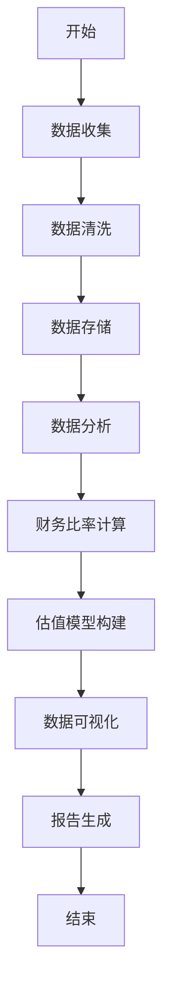
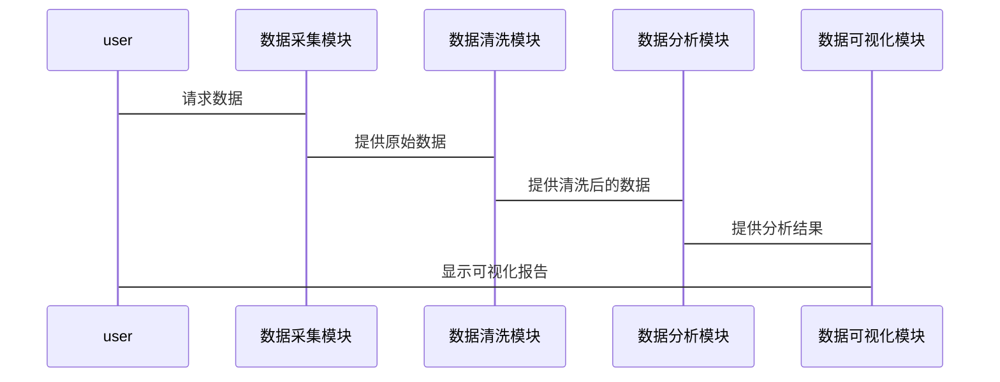

                 


# 价值投资中的财务报表分析：读懂数字背后的故事

## 关键词：价值投资、财务报表分析、财务比率、估值模型、DCF模型、投资策略

## 摘要：  
本文深入探讨了财务报表分析在价值投资中的核心作用，通过系统化的分析方法和数学模型，帮助投资者理解数字背后的财务健康状况和内在价值。文章从基础概念到高级算法，详细讲解了如何通过财务比率、估值模型和系统架构来评估企业的投资价值，并结合实际案例进行深入剖析，为投资者提供了实用的工具和方法。

---

# 第一部分: 价值投资与财务报表分析的背景

## # 第1章: 价值投资与财务报表分析概述

### 1.1 价值投资的基本概念

#### 1.1.1 价值投资的定义与核心理念
- **价值投资**：一种以低于内在价值的价格购买优秀企业的投资策略，核心在于发现市场低估的机会。
- **核心理念**：企业的内在价值是其未来现金流的现值，财务报表是评估这一价值的关键工具。
- **价值投资与财务报表分析的关系**：财务报表分析是价值投资的基础，通过分析财务报表，投资者可以发现企业的财务健康状况和竞争优势。

#### 1.1.2 财务报表分析在价值投资中的重要性
- 财务报表分析是评估企业内在价值的核心工具。
- 通过分析财务报表，投资者可以识别企业的盈利能力、偿债能力、运营效率和成长潜力。
- 财务报表分析帮助投资者发现潜在的投资机会和风险。

#### 1.1.3 价值投资与财务报表分析的边界与外延
- **边界**：财务报表分析仅提供企业财务状况的数字信息，不直接反映市场情绪或行业趋势。
- **外延**：结合行业分析、市场研究和宏观经济分析，财务报表分析可以更全面地评估企业的投资价值。

### 1.2 财务报表分析的核心要素

#### 1.2.1 财务报表的基本构成
- **资产负债表**：反映企业在某一特定时点的资产、负债和所有者权益的状况。
- **利润表**：展示企业在一定会计期间的收入、成本和利润情况。
- **现金流量表**：记录企业在一定会计期间内的现金流入和流出情况。

#### 1.2.2 财务报表的核心要素与属性对比
- **资产与负债**：资产是企业拥有的资源，负债是企业需要偿还的债务。
- **收入与利润**：收入是企业经营活动中产生的经济利益，利润是收入减去成本后的净收益。
- **现金流**：现金流量表反映了企业的资金流动情况，是评估企业财务健康的重要指标。

#### 1.2.3 财务报表分析的ER实体关系图

```mermaid
erDiagram
    company {
        key id : integer
        name : string
        industry : string
    }
    financial_statement {
        id : integer
        company_id : integer
        date : date
    }
    balance_sheet {
        id : integer
        financial_statement_id : integer
        assets : float
        liabilities : float
        equity : float
    }
    income_statement {
        id : integer
        financial_statement_id : integer
        revenue : float
        cost : float
        profit : float
    }
    cash_flow_statement {
        id : integer
        financial_statement_id : integer
        operating_cash_flow : float
        investing_cash_flow : float
        financing_cash_flow : float
    }
    company <--> financial_statement
    financial_statement <--> balance_sheet
    financial_statement <--> income_statement
    financial_statement <--> cash_flow_statement
```

---

## # 第2章: 财务报表分析的系统架构

### 2.1 财务报表分析的系统架构

#### 2.1.1 数据收集与处理
- **数据源**：包括企业公开的财务报表、行业报告和宏观经济数据。
- **数据清洗**：处理缺失值、异常值和数据格式问题。
- **数据存储**：将数据存储在数据库中，便于后续分析。

#### 2.1.2 数据分析与建模
- **财务比率计算**：基于资产负债表、利润表和现金流量表，计算各项财务比率。
- **估值模型构建**：使用DCF模型、市盈率模型等方法对企业进行估值。

#### 2.1.3 数据可视化与报告生成
- **可视化工具**：使用图表展示财务数据，如折线图、柱状图、饼图等。
- **报告生成**：将分析结果整理成报告，供投资者参考。

### 2.2 财务报表分析的系统流程图



---

## # 第3章: 财务报表分析的数学模型与算法原理

### 3.1 财务比率分析的数学模型

#### 3.1.1 盈利能力分析
- **净利润率**：$$ \text{净利润率} = \frac{\text{净利润}}{\text{营业收入}} $$
- **净资产收益率（ROE）**：$$ \text{ROE} = \frac{\text{净利润}}{\text{净资产}} $$

#### 3.1.2 偿债能力分析
- **流动比率**：$$ \text{流动比率} = \frac{\text{流动资产}}{\text{流动负债}} $$
- **速动比率**：$$ \text{速动比率} = \frac{\text{速动资产}}{\text{流动负债}} $$

#### 3.1.3 运营能力分析
- **存货周转率**：$$ \text{存货周转率} = \frac{\text{营业收入}}{\text{平均存货}} $$
- **应收账款周转率**：$$ \text{应收账款周转率} = \frac{\text{营业收入}}{\text{平均应收账款}} $$

### 3.2 估值模型的数学公式

#### 3.2.1 市盈率模型
- **市盈率（P/E）**：$$ P/E = \frac{\text{股价}}{\text{每股收益（EPS）}} $$

#### 3.2.2 市净率模型
- **市净率（P/B）**：$$ P/B = \frac{\text{股价}}{\text{每股净资产}} $$

#### 3.2.3 现金流折现模型（DCF）
- **自由现金流（FCF）**：$$ \text{FCF} = \text{净利润} + \text{折旧} + \text{摊销} - \text{资本支出} $$
- **DCF模型公式**：$$ \text{企业价值} = \sum_{t=1}^{n} \frac{\text{FCF}_t}{(1 + r)^t} + \frac{\text{终值}}{(1 + r)^n} $$

---

## # 第4章: 财务报表分析的算法实现

### 4.1 财务比率计算的Python实现

```python
import pandas as pd

# 假设我们有一个包含财务数据的DataFrame df
df = pd.DataFrame({
    '净利润': [100, 200, 150],
    '营业收入': [500, 600, 700],
    '流动资产': [200, 300, 250],
    '流动负债': [150, 200, 180],
    '净资产': [300, 400, 350]
})

# 计算净利润率
df['净利润率'] = df['净利润'] / df['营业收入']

# 计算ROE
df['ROE'] = df['净利润'] / df['净资产']

# 计算流动比率
df['流动比率'] = df['流动资产'] / df['流动负债']

print(df)
```

### 4.2 估值模型的算法实现

```python
def calculateDCF(value, free_cash_flow, discount_rate, terminal_growth_rate, horizon):
    present_value = 0
    for t in range(1, horizon + 1):
        cash_flow = value * (1 + terminal_growth_rate) ** (t - 1)
        present_value += cash_flow / (1 + discount_rate) ** t
    return present_value

# 示例数据
value = 100
free_cash_flow = 50
discount_rate = 0.1
terminal_growth_rate = 0.02
horizon = 5

enterprise_value = calculateDCF(value, free_cash_flow, discount_rate, terminal_growth_rate, horizon)
print(f"企业价值：{enterprise_value}")
```

---

## # 第5章: 财务报表分析的系统设计

### 5.1 系统功能设计

#### 5.1.1 系统功能模块
- **数据采集模块**：从公开数据源获取财务报表数据。
- **数据分析模块**：计算财务比率和估值模型。
- **数据可视化模块**：生成图表和报告。

#### 5.1.2 系统交互流程



### 5.2 系统架构设计

```mermaid
containerDiagram
    user
    前端系统
    后端系统
    数据库
    云服务
    前端系统 -- 访问 --> 后端系统
    后端系统 -- 访问 --> 数据库
    后端系统 -- 调用 --> 云服务
```

---

## # 第6章: 项目实战与案例分析

### 6.1 项目实战

#### 6.1.1 环境安装与数据获取
- **环境安装**：安装Python、Pandas、Matplotlib等库。
- **数据获取**：从公开数据源获取目标企业的财务报表数据。

#### 6.1.2 系统核心实现源代码

```python
import pandas as pd
import matplotlib.pyplot as plt

# 数据获取与清洗
df = pd.read_csv('financial_data.csv')
df.dropna(inplace=True)

# 财务比率计算
df['净利润率'] = df['净利润'] / df['营业收入']
df['ROE'] = df['净利润'] / df['净资产']

# 数据可视化
plt.figure(figsize=(10, 6))
plt.plot(df['净利润率'], label='净利润率')
plt.plot(df['ROE'], label='ROE')
plt.legend()
plt.show()
```

#### 6.1.3 代码应用解读与分析
- **数据清洗**：处理缺失值和异常值，确保数据质量。
- **财务比率计算**：计算关键财务比率，如净利润率和ROE。
- **数据可视化**：通过图表展示财务比率的变化趋势，帮助投资者识别潜在的投资机会。

#### 6.1.4 实际案例分析
- **案例公司**：以苹果公司为例，分析其财务报表。
- **分析步骤**：
  1. 获取苹果公司最近5年的财务报表数据。
  2. 计算关键财务比率，如净利润率、ROE和流动比率。
  3. 使用DCF模型评估苹果公司的企业价值。

### 6.1.5 项目小结
- **关键点**：财务报表分析是价值投资的核心工具，通过系统化的分析方法和数学模型，投资者可以更准确地评估企业的内在价值。
- **注意事项**：财务报表分析需要结合行业分析和宏观经济分析，才能全面评估企业的投资价值。

---

## # 第7章: 总结与最佳实践

### 7.1 总结

- 财务报表分析是价值投资的核心工具。
- 通过系统化的分析方法和数学模型，投资者可以更准确地评估企业的内在价值。
- 财务报表分析需要结合行业分析和宏观经济分析，才能全面评估企业的投资价值。

### 7.2 最佳实践

- **数据准确性**：确保数据来源可靠，数据清洗到位。
- **模型局限性**：DCF模型假设未来现金流可以预测，但实际中存在不确定性。
- **持续学习**：关注行业动态和宏观经济变化，不断优化分析模型。

### 7.3 投资注意事项

- **分散投资**：避免过度集中，降低投资风险。
- **长期视角**：价值投资需要长期持有，耐心等待市场的回归。
- **风险管理**：定期评估投资组合，及时调整策略。

### 7.4 拓展阅读

- 《The Intelligent Investor》 - 本杰明·格雷厄姆
- 《价值投资实战策略》 - 李录
- 《财务报表分析与股票估值》 - 张小东

---

## 作者：AI天才研究院/AI Genius Institute & 禅与计算机程序设计艺术 /Zen And The Art of Computer Programming

