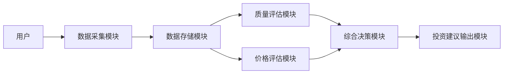

                 


# 《价值投资中的质量vs价格权衡》

## 关键词：
- 价值投资、质量分析、价格分析、投资策略、投资决策

## 摘要：
价值投资是一种以公司基本面分析为基础的投资策略，强调以合理的价格购买具有高质量的公司。本文将深入探讨在价值投资中，如何在质量和价格之间进行权衡，分析影响因素、权衡策略以及具体的数学模型，帮助投资者做出更明智的投资决策。

---

## 引言：价值投资与质量vs价格的权衡

### 1.1 价值投资的定义与核心理念
- 价值投资是由本杰明·格雷厄姆提出的投资策略，强调以低于内在价值的价格买入优质公司。
- 核心理念：市场先生是疯狂的，价格波动是机会，而非反映公司的真实价值。

### 1.2 质量与价格的定义与重要性
- 质量：公司基本面，包括盈利能力、成长性、竞争优势等。
- 价格：市场给出的价格，反映市场的预期和情绪。
- 权衡：在投资中，如何在高质量但高价的公司和低质量但低价的公司之间做出选择。

### 1.3 价值投资中的质量vs价格权衡
- 质量是内在价值的决定因素，价格是市场波动的结果。
- 权衡策略：在不同市场环境下，如何平衡质量和价格，找到最具投资价值的公司。

---

## 第二部分：质量分析

### 2.1 质量的定义与衡量标准

#### 2.1.1 财务指标分析
- **盈利能力**：净利润率、ROE（净资产收益率）。
- **成长性**：收入增长率、净利润增长率。
- **财务健康性**：资产负债率、流动比率。

#### 2.1.2 行业地位与竞争优势
- **市场占有率**：公司在行业中的地位。
- **竞争优势**：护城河，如品牌、技术、成本优势。

#### 2.1.3 管理层与公司治理
- **管理层素质**：历史表现、战略眼光。
- **治理结构**：董事会效率、透明度。

### 2.2 质量评分模型

#### 2.2.1 质量评分模型的构建
- 使用财务指标、行业地位、管理层因素等多维度打分。
- 示例：$质量评分 = 0.4 \times 财务指标 + 0.3 \times 行业地位 + 0.3 \times 管理层因素$。

#### 2.2.2 质量评分与公司分类
- 高质量公司：评分 > 80分。
- 中质量公司：评分 60-80分。
- 低质量公司：评分 < 60分。

---

## 第三部分：价格分析

### 3.1 价格的定义与影响因素

#### 3.1.1 市盈率（P/E）
- 定义：股价除以每股收益。
- 适用场景：适用于盈利稳定的公司。
- 示例：$P/E = \frac{股价}{每股收益}$。

#### 3.1.2 市净率（P/B）
- 定义：股价除以每股净资产。
- 适用场景：适用于净资产驱动的公司。
- 示例：$P/B = \frac{股价}{每股净资产}$。

#### 3.1.3 现金流折现模型（DCF）
- 核心原理：将未来现金流折现为现值。
- 示例：$DCF = \sum_{t=1}^{n} \frac{CF_t}{(1+r)^t}$，其中$CF_t$是第t年的现金流，$r$是折现率。

### 3.2 价格敏感度分析

#### 3.2.1 不同价格区间的投资策略
- 高价区：谨慎投资，寻找质量溢价。
- 中价区：积极投资，挖掘低估公司。
- 低价区：果断投资，寻找潜在收益。

#### 3.2.2 市场环境与价格波动
- 牛市：价格高估，注重质量。
- 熊市：价格低估，注重价格优势。

---

## 第四部分：质量与价格的综合权衡

### 4.1 质量与价格的权衡策略

#### 4.1.1 不同市场环境下的权衡
- 牛市：优先选择高质量、合理价格的公司。
- 熊市：优先选择高质量、低价的公司。

#### 4.1.2 投资组合中的权衡
- 分散投资：平衡高质量高价和低质量低价公司的比例。
- 动态调整：定期评估质量和价格的变化，及时调整投资组合。

### 4.2 数学模型与决策支持

#### 4.2.1 质量与价格的综合评分模型
- 示例：$综合评分 = 0.6 \times 质量评分 + 0.4 \times 价格评分$。

#### 4.2.2 投资决策流程
1. 确定投资目标：收益目标、风险承受能力。
2. 选择分析工具：质量评分模型、价格估值模型。
3. 综合评估：计算综合评分，确定投资标的。
4. 动态监控：定期更新数据，调整投资策略。

---

## 第五部分：系统分析与架构设计

### 5.1 价值投资决策支持系统

#### 5.1.1 系统功能模块
- 数据采集：收集公司基本面数据和市场数据。
- 质量评估：计算质量评分。
- 价格评估：计算价格评分。
- 综合决策：生成投资建议。

#### 5.1.2 系统架构设计


#### 5.1.3 系统接口设计
- 数据接口：与金融数据库对接。
- 用户接口：提供输入参数和输出结果。

---

## 第六部分：项目实战

### 6.1 项目环境与工具安装

#### 6.1.1 环境要求
- Python 3.8+
- 数据分析库：Pandas、NumPy。
- 可视化工具：Matplotlib、Seaborn。

### 6.2 核心代码实现

#### 6.2.1 质量评分模型实现
```python
import pandas as pd

def calculate_quality_score(df):
    # 财务指标权重
    financial_weights = 0.4
    # 行业地位权重
    industry_weights = 0.3
    # 管理层权重
    management_weights = 0.3

    # 计算质量评分
    quality_score = (
        financial_weights * df['financial_score'] +
        industry_weights * df['industry_score'] +
        management_weights * df['management_score']
    )
    return quality_score
```

#### 6.2.2 价格估值模型实现
```python
import numpy as np

def calculate_pe_ratio(df):
    pe_ratio = df['股价'] / df['每股收益']
    return pe_ratio

def calculate_pb_ratio(df):
    pb_ratio = df['股价'] / df['每股净资产']
    return pb_ratio
```

---

## 第七部分：总结与最佳实践

### 7.1 小结
- 价值投资中的质量与价格权衡是动态调整的过程。
- 综合评分模型和数学工具是重要的决策支持工具。

### 7.2 注意事项
- 避免过度依赖单一指标。
- 定期更新数据和模型。
- 结合市场环境和个人风险偏好。

### 7.3 拓展阅读
- 格雷厄姆的《证券分析》。
- 巴菲特的《致股东的信》。

---

## 附录

### 附录A：术语表
- 质量评分：综合公司基本面的评分。
- 价格估值：市场对公司的定价。

### 附录B：公式汇总
- 质量评分公式：$质量评分 = 0.4 \times 财务指标 + 0.3 \times 行业地位 + 0.3 \times 管理层因素$。
- 市盈率公式：$P/E = \frac{股价}{每股收益}$。

### 附录C：工具推荐
- 数据分析工具：Python、Pandas。
- 可视化工具：Matplotlib、Tableau。

---

## 作者：AI天才研究院 & 禅与计算机程序设计艺术

---

通过本文的系统分析和实战案例，读者可以更好地理解价值投资中的质量与价格权衡，并能够实际应用这些方法和工具做出更明智的投资决策。

