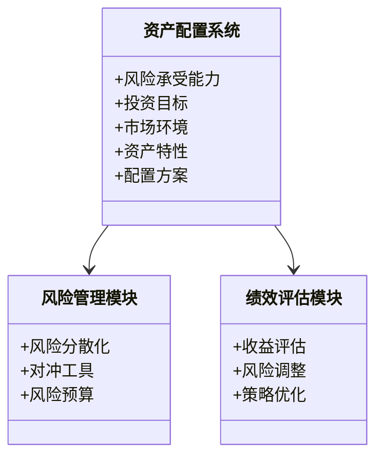
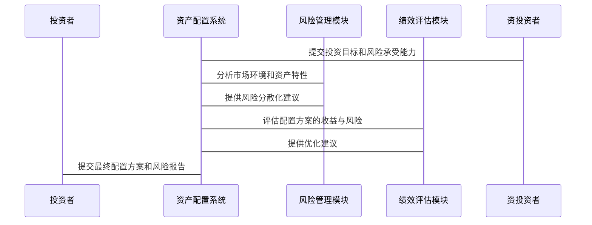

                 


# 《价值投资中的资本配置策略》

## 关键词
- 价值投资
- 资本配置
- 投资策略
- 资产配置
- 风险管理

## 摘要
本文深入探讨了价值投资中的资本配置策略，从理论基础到实际应用，详细分析了如何通过科学的资产配置和风险管理来实现投资目标。文章首先介绍了资本配置的核心概念和价值投资的基本原则，然后从现代投资组合理论、资本资产定价模型等方面阐述了资本配置的理论基础。接着，文章详细分析了不同资产配置策略的特点和应用场景，并通过系统设计和项目实战展示了如何将理论应用于实际投资中。最后，文章总结了资本配置策略的最佳实践和未来发展趋势，为读者提供了全面而深入的指导。

---

# 第一部分: 价值投资中的资本配置概述

## 第1章: 资本配置的基本概念

### 1.1 资本配置的定义与背景
#### 1.1.1 资本配置的定义
- 资本配置是指将资金分配到不同资产类别（如股票、债券、现金等）以实现投资目标的过程。
- 它是投资组合管理的核心，旨在在风险和收益之间找到最佳平衡点。

#### 1.1.2 资本配置的背景与重要性
- 随着金融市场的发展，投资者需要更科学的方法来管理资金。
- 资本配置帮助投资者分散风险，避免过度集中在某一资产类别。
- 在价值投资中，资本配置是实现长期收益的关键策略。

#### 1.1.3 资本配置与投资目标的关系
- 投资目标决定了资本配置的方向和比例。
- 不同的目标（如保本、追求收益）需要不同的资本配置策略。

### 1.2 价值投资的基本原则
#### 1.2.1 价值投资的定义与特点
- 价值投资是一种长期投资策略，强调购买被市场低估的资产。
- 它注重基本面分析，寻找具有安全边际的投资标的。

#### 1.2.2 格雷厄姆的价值投资理念
- 格雷厄姆提出“安全边际”概念，即购买价格低于内在价值。
- 强调长期持有优质资产，避免短期市场波动的干扰。

#### 1.2.3 安全边际的概念与作用
- 安全边际提供了缓冲，确保在市场波动中投资组合的稳定性。
- 它是价值投资中风险管理的核心工具。

### 1.3 资本配置的核心要素
#### 1.3.1 资产配置的类型
- 股票、债券、现金等资产的配置比例。
- 不同资产类别的风险和收益特征对比。

#### 1.3.2 风险管理的重要性
- 风险管理是资本配置的核心，确保投资组合的稳定性。
- 风险分散化是降低投资组合整体风险的重要手段。

#### 1.3.3 时间跨度与资本配置的关系
- 长期投资允许更灵活的资本配置策略。
- 短期投资需要更谨慎的资产选择和风险管理。

---

## 第2章: 资本配置的理论基础

### 2.1 现代投资组合理论
#### 2.1.1 投资组合理论的基本假设
- 投资者追求收益最大化，同时厌恶风险。
- 资产之间存在相关性，可以通过分散化降低风险。

#### 2.1.2 马科维茨的有效前沿模型
- 有效前沿模型展示了在给定风险下，能够实现最高收益的投资组合。
- 它是资本配置的重要理论基础。

#### 2.1.3 现实中的投资组合优化
- 实际投资中，市场摩擦和交易成本会影响理论模型的应用。
- 需要结合实际市场情况调整资本配置策略。

### 2.2 资本资产定价模型（CAPM）
#### 2.2.1 CAPM的理论基础
- CAPM通过系统风险和非系统风险解释资产的预期收益。
- 公式：$$ E(r_i) = R_f + \beta_i (E(r_m) - R_f) $$

#### 2.2.2 CAPM的公式与应用
- 通过CAPM可以计算资产的预期收益，指导资本配置。
- 应用案例：计算股票的合理估值。

#### 2.2.3 CAPM的局限性
- 假设市场是完全有效的，现实中可能存在市场失灵。
- 需要准确估计β系数，实际操作中难度较大。

### 2.3 风险与收益的平衡
#### 2.3.1 风险的种类与度量
- 系统性风险：市场整体波动带来的风险。
- 非系统性风险：特定资产或行业带来的风险。

#### 2.3.2 收益与风险的权衡
- 高收益通常伴随着高风险。
- 资本配置需要在两者之间找到平衡点。

#### 2.3.3 风险调整后的收益评估
- 使用夏普比率等指标衡量风险调整后的收益。
- 公式：$$ \text{夏普比率} = \frac{E(r_i) - R_f}{\sigma_i} $$

---

## 第3章: 资本配置策略的分类与选择

### 3.1 资产配置的主要类型
#### 3.1.1 股票、债券与现金的配置
- 股票：高风险高收益。
- 债券：相对稳定的收益。
- 现金：流动性高，但收益较低。

#### 3.1.2 不同资产类别的风险与收益特征对比
| 资产类别 | 风险 | 收益 |
|----------|------|------|
| 股票     | 高   | 高   |
| 债券     | 中   | 中   |
| 现金     | 低   | 低   |

#### 3.1.3 资产配置的动态调整
- 根据市场变化定期调整资产比例。
- 动态再平衡是保持投资组合稳定的重要手段。

### 3.2 风险管理策略
#### 3.2.1 风险分散化策略
- 通过投资不同资产类别和行业分散风险。
- 使用相关性较低的资产组合。

#### 3.2.2 保险策略与对冲工具
- 利用衍生品（如期权、期货）对冲特定风险。
- 保险策略在极端市场条件下提供保护。

#### 3.2.3 风险预算的制定与执行
- 设定每个资产类别的最大风险敞口。
- 定期监控和调整风险预算。

### 3.3 价值投资中的资产配置策略
#### 3.3.1 买入并持有策略
- 长期持有优质资产，等待其价值回归。
- 适用于具有稳定增长潜力的资产。

#### 3.3.2 逆向投资策略
- 在市场低谷时买入，市场高点时卖出。
- 逆向投资需要较强的纪律性和市场判断力。

#### 3.3.3 高质量资产集中策略
- 集中投资于少数优质资产。
- 通过深度研究确保资产的长期价值。

### 3.4 策略选择的步骤与方法
#### 3.4.1 确定投资目标与风险承受能力
- 明确投资目标（保本、收益、增长）。
- 评估自身的风险承受能力。

#### 3.4.2 分析市场环境与资产特性
- 了解当前市场环境和经济周期。
- 分析资产的流动性、波动性和成长性。

#### 3.4.3 制定并执行资产配置方案
- 根据分析结果制定具体的资产配置比例。
- 定期审查和调整配置方案。

---

## 第4章: 资本配置的系统分析与架构设计

### 4.1 系统功能设计
#### 4.1.1 领域模型（Mermaid 类图）


### 4.2 系统架构设计
#### 4.2.1 系统架构（Mermaid 架构图）
```mermaid
archi
    一个矩形框内包含多个模块，模块间有连线，表示数据流
    模块包括：资产配置系统、风险管理模块、绩效评估模块、数据接口
```

### 4.3 系统接口设计
#### 4.3.1 数据接口
- 输入接口：市场数据、资产信息、投资者需求。
- 输出接口：配置方案、风险评估、绩效报告。

#### 4.3.2 系统交互（Mermaid 序列图）


---

## 第5章: 资本配置的项目实战

### 5.1 环境安装与数据准备
#### 5.1.1 环境安装
- 安装Python、Pandas、Matplotlib等工具。
- 使用Jupyter Notebook进行数据处理和可视化。

#### 5.1.2 数据准备
- 获取历史市场数据（如股票价格、指数数据）。
- 数据清洗和预处理。

### 5.2 核心实现
#### 5.2.1 资产配置模型
```python
import pandas as pd
import numpy as np
import matplotlib.pyplot as plt

# 示例：计算股票和债券的配置比例
def calculate_allocation(stocks_return, bonds_return):
    # 假设目标收益为8%，无风险利率为2%
    target_return = 0.08
    R_f = 0.02
    beta = 1.2  # 假设股票的β系数
    r_m = (stocks_return + bonds_return) / 2  # 市场平均收益
    
    # 使用CAPM计算股票的预期收益
    E_r_stock = R_f + beta * (r_m - R_f)
    E_r_bond = R_f + 0  # 假设债券的预期收益等于无风险利率
    
    # 计算配置比例
    total_return = (E_r_stock * 0.5 + E_r_bond * 0.5)
    allocation_stock = (E_r_stock - R_f) / (total_return - R_f)
    allocation_bond = 1 - allocation_stock
    
    return allocation_stock * 100, allocation_bond * 100

# 示例数据
stocks_return = 0.10
bonds_return = 0.05
allocation_stock, allocation_bond = calculate_allocation(stocks_return, bonds_return)
print(f"股票配置比例：{allocation_stock}%，债券配置比例：{allocation_bond}%")
```

#### 5.2.2 风险管理模块
```python
import numpy as np

# 示例：计算投资组合的夏普比率
def calculate_sharpe_ratio(returns, risk_free_rate):
    excess_return = returns - risk_free_rate
    sharpe_ratio = np.mean(excess_return) / np.std(excess_return)
    return sharpe_ratio

# 示例数据
returns = [0.08, 0.05, 0.12, 0.09, 0.10]
risk_free_rate = 0.02
print(f"夏普比率：{calculate_sharpe_ratio(returns, risk_free_rate)}")
```

#### 5.2.3 绩效评估模块
```python
import pandas as pd
import matplotlib.pyplot as plt

# 示例：绘制投资组合的收益-风险曲线
def plot_efficient_frontier(portfolio_returns, portfolio_risks):
    plt.scatter(portfolio_risks, portfolio_returns, c='red', marker='o')
    plt.xlabel('Risk')
    plt.ylabel('Return')
    plt.title('Efficient Frontier')
    plt.grid(True)
    plt.show()

# 示例数据
portfolio_returns = [0.05, 0.07, 0.06, 0.08]
portfolio_risks = [0.10, 0.12, 0.11, 0.13]
plot_efficient_frontier(portfolio_returns, portfolio_risks)
```

### 5.3 案例分析与解读
#### 5.3.1 案例分析
- 假设投资者有100万元，投资目标为年化收益8%，风险承受能力为中等。
- 市场环境：股票预期收益10%，债券预期收益5%，无风险利率2%。
- 使用CAPM计算股票的预期收益：$$ E(r_{\text{stock}}) = 0.02 + 1.2 \times (r_m - 0.02) $$
- 假设市场平均收益为8%，则股票预期收益为：$$ 0.02 + 1.2 \times (0.08 - 0.02) = 0.12 $$

#### 5.3.2 实际案例分析
- 资产配置比例：股票60%，债券40%。
- 风险管理：使用期权对冲部分股票风险。
- 绩效评估：投资组合的夏普比率为1.2，高于市场平均水平。

### 5.4 项目小结
- 通过实际案例分析，验证了资本配置策略的有效性。
- 强调了风险管理在投资组合中的重要性。
- 展示了如何通过系统设计和实际操作实现资本配置目标。

---

## 第6章: 资本配置的最佳实践与未来展望

### 6.1 最佳实践
#### 6.1.1 定期审查和调整投资组合
- 至少每年审查一次投资组合的配置比例。
- 根据市场变化和个人财务状况调整配置。

#### 6.1.2 保持长期视角
- 避免短期市场波动的干扰。
- 长期视角有助于实现投资目标。

#### 6.1.3 结合定性和定量分析
- 定性分析：基本面分析、行业趋势。
- 定量分析：数学模型、数据分析。

### 6.2 小结
- 资本配置是实现价值投资目标的关键策略。
- 通过科学的资产配置和风险管理，可以有效平衡收益与风险。

### 6.3 注意事项
- 避免过度依赖单一模型，结合实际情况灵活调整。
- 保持对市场的敏感性和对策略的适应性。

### 6.4 拓展阅读
- 阅读《证券投资学》（约翰·C·弗伦奇）深入理解投资组合理论。
- 学习《安全边际》（本杰明·格雷厄姆）掌握价值投资的核心理念。

---

# 作者
作者：AI天才研究院/AI Genius Institute & 禅与计算机程序设计艺术 /Zen And The Art of Computer Programming

