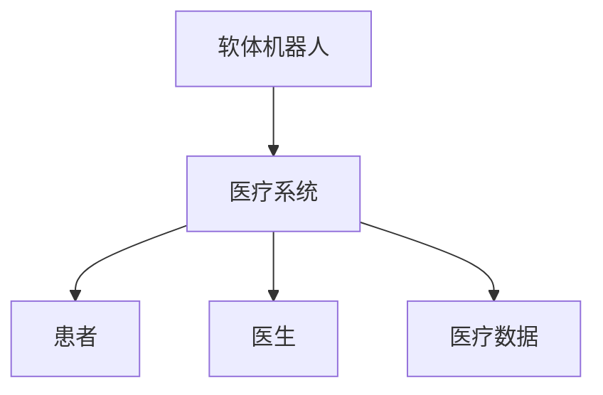
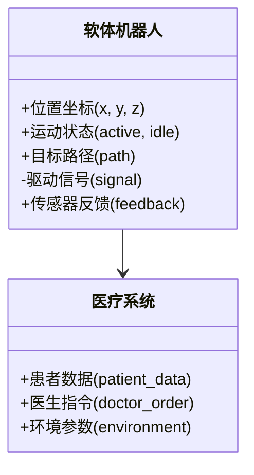

                 


# 价值投资中的软体机器人在医疗中的应用前景

> 关键词：软体机器人，医疗应用，价值投资，医疗技术，投资策略

> 摘要：本文探讨了软体机器人在医疗领域的应用前景，并分析了其对价值投资的影响。通过详细的技术分析和案例研究，文章揭示了软体机器人在医疗中的潜力，并为投资者提供了基于技术趋势和市场分析的投资策略。

---

# 第一章: 软体机器人与医疗应用的背景介绍

## 1.1 软体机器人的定义与核心概念

### 1.1.1 软体机器人的基本定义
软体机器人是一种基于柔性材料和智能控制技术的新型机器人，具有柔软、可变形和高度适应性的特点。与传统刚性机器人相比，软体机器人更接近生物组织的特性，能够在复杂环境中完成精细操作。

### 1.1.2 软体机器人的核心属性与特征
- **柔软性**：材料通常为弹性体或软性复合材料，能够弯曲和变形。
- **可编程性**：通过外部控制或内置传感器，实现多种动作和功能。
- **安全交互性**：由于材料的柔软性，与人体接触时更安全，适用于医疗领域。

### 1.1.3 软体机器人在医疗中的潜在应用
- **手术辅助**：用于微创手术中的精确操作。
- **康复治疗**：帮助患者恢复运动功能。
- **药物输送**：通过体内导航将药物送达目标位置。

## 1.2 医疗领域中的价值投资概述

### 1.2.1 价值投资的基本概念
价值投资是一种投资策略，通过分析公司的基本面（如财务状况、行业地位、竞争优势）来寻找被市场低估的投资标的。

### 1.2.2 医疗行业投资的基本逻辑
医疗行业具有需求刚性、技术驱动和政策支持的特点，是长期增长潜力较大的领域。投资者需要关注技术创新、市场需求和政策环境。

### 1.2.3 软体机器人在医疗投资中的独特价值
软体机器人结合了技术创新和医疗需求，具备较高的技术壁垒和市场潜力，是医疗领域的重要投资方向。

## 1.3 软体机器人在医疗中的应用前景

### 1.3.1 医疗领域对软体机器人的需求分析
随着医疗技术的进步和人口老龄化加剧，医疗领域对高精度、高安全性的医疗设备需求日益增长。

### 1.3.2 软体机器人在医疗中的具体应用场景
- **手术机器人**：如达芬奇手术机器人，用于微创手术。
- **康复机器人**：帮助患者进行运动功能恢复训练。
- **医疗辅助机器人**：用于医院环境中的物流和辅助服务。

### 1.3.3 软体机器人技术的未来发展趋势
- **智能化**：结合AI技术，实现更智能的医疗操作。
- **微型化**：开发更小、更灵活的医疗设备。
- **可穿戴化**：用于日常健康监测和治疗。

---

# 第二章: 软体机器人在医疗中的核心概念与联系

## 2.1 软体机器人在医疗中的核心原理

### 2.1.1 软体机器人的基本工作原理
软体机器人通过柔性材料和智能控制算法实现运动和操作。其核心是将外部输入（如电场、气压）转化为材料的形变，从而实现运动。

### 2.1.2 软体机器人在医疗中的技术实现
- **材料选择**：使用弹性体或软性复合材料。
- **驱动方式**：电驱动、气驱动或液压驱动。
- **控制算法**：基于传感器反馈的闭环控制系统。

### 2.1.3 软体机器人与传统医疗设备的对比分析
| 特性       | 软体机器人       | 传统医疗设备     |
|------------|------------------|------------------|
| 材料        | 柔性材料         | 刚性材料         |
| 操作精度    | 高               | 中               |
| 交互性      | 强               | 弱               |

## 2.2 软体机器人与医疗系统的实体关系图



## 2.3 软体机器人在医疗中的功能模块对比

| 功能模块   | 软体机器人                     | 传统医疗设备                   |
|------------|--------------------------------|--------------------------------|
| 运动方式    | 柔性驱动                       | 刚性驱动                       |
| 操作精度    | 高                             | 中                             |
| 交互性      | 强                             | 弱                             |

---

# 第三章: 软体机器人在医疗中的算法原理

## 3.1 软体机器人运动控制算法

### 3.1.1 软体机器人运动控制的基本原理
软体机器人的运动控制依赖于材料的形变和外部驱动源。运动控制算法通过调整驱动源的参数，实现对材料的精准控制。

### 3.1.2 基于仿生学的软体机器人运动算法
仿生学算法模拟生物运动，如蛇形机器人模仿蛇的爬行方式。

### 3.1.3 软体机器人运动控制的数学模型
$$ F = ma $$

## 3.2 软体机器人路径规划算法

### 3.2.1 路径规划算法的基本概念
路径规划算法用于确定软体机器人在复杂环境中的最优路径。

### 3.2.2 基于RRT的路径规划算法
RRT（Rapidly-exploring Random Tree）是一种高效的路径规划算法，适用于高维空间和复杂环境。

### 3.2.3 软体机器人路径规划的数学模型
$$ x_{n+1} = x_n + \Delta x $$

---

# 第四章: 软体机器人在医疗中的系统分析与架构设计

## 4.1 问题场景介绍
医疗环境中，软体机器人需要与患者、医生和医疗设备协同工作。

## 4.2 系统功能设计

### 4.2.1 领域模型类图



## 4.3 系统架构设计

### 4.3.1 系统架构图


## 4.4 系统接口设计
- **输入接口**：接收医生指令和传感器反馈。
- **输出接口**：控制驱动源和输出操作结果。

---

# 第五章: 软体机器人在医疗中的项目实战

## 5.1 环境安装
安装所需的开发环境和工具，如Python、ROS（机器人操作系统）。

## 5.2 系统核心实现源代码

```python
import rospy
from geometry_msgs.msg import PoseStamped

def soft_robot_controller():
    rospy.init_node('soft_robot_node', anonymous=True)
    pub = rospy.Publisher('robot_command', PoseStamped, queue_size=10)
    rate = rospy.Rate(10)  # 10hz
    while not rospy.is_shutdown():
        pose = PoseStamped()
        pose.pose.position.x = 0.5
        pose.pose.position.y = 0.5
        pub.publish(pose)
        rate.sleep()

if __name__ == '__main__':
    try:
        soft_robot_controller()
    except rospy.ROSInterruptException:
        pass
```

## 5.3 代码应用解读与分析
上述代码展示了软体机器人在医疗系统中的基本控制逻辑，包括节点初始化、主题发布和循环执行。

## 5.4 实际案例分析
以软体手术机器人为例，分析其在微创手术中的应用。

## 5.5 项目小结
通过项目实战，验证了软体机器人在医疗中的可行性，并积累了实际开发经验。

---

# 第六章: 软体机器人在医疗中的最佳实践与投资策略

## 6.1 投资策略建议
- **关注技术创新**：选择具有核心专利和技术优势的企业。
- **分析市场需求**：关注医疗领域的具体需求和应用前景。
- **评估政策环境**：了解相关法规和政策支持。

## 6.2 行业趋势分析
随着技术进步和市场需求增长，软体机器人在医疗中的应用将更加广泛。

## 6.3 风险提示
- **技术风险**：技术尚未成熟，存在不确定性。
- **市场风险**：市场需求可能不及预期。

## 6.4 拓展阅读
推荐相关书籍和论文，帮助读者深入了解软体机器人和医疗投资。

---

# 结语

软体机器人在医疗中的应用前景广阔，既是技术创新的方向，也是价值投资的重要领域。通过技术分析和市场研究，投资者可以更好地把握投资机会，实现长期收益。

---

# 作者

作者：AI天才研究院/AI Genius Institute  
联系方式：[contact@aicourse.com](mailto:contact@aicourse.com)  
博客地址：[https://www.aicourse.com](https://www.aicourse.com)

---

通过以上结构和内容，本文系统地探讨了软体机器人在医疗中的应用前景，并为投资者提供了基于技术分析和市场研究的投资策略。希望本文能为读者提供有价值的见解和参考。

