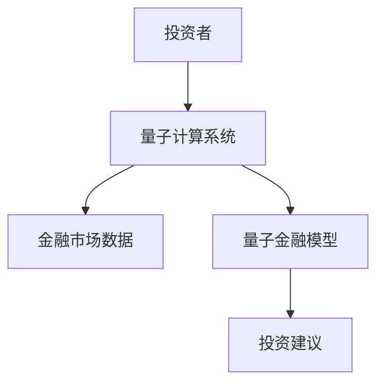

                 

# 价值投资中的量子计算商业化前景

> 关键词：量子计算，价值投资，商业化前景，金融建模，投资策略

> 摘要：本文探讨了量子计算在价值投资中的潜在应用及其商业化前景。通过分析量子计算的基本原理、在金融领域的应用潜力、价值投资的核心策略以及量子计算在其中的商业化路径，本文为投资者和科技从业者提供了全面的视角。结合实际案例和系统架构设计，本文详细阐述了量子计算如何改变传统的投资方式，并提出了未来可能的发展趋势和挑战。

---

# 第一部分: 量子计算基础与价值投资背景

## 第1章: 量子计算的基本概念与原理

### 1.1 量子计算的核心原理

#### 1.1.1 量子位（Qubit）的基本概念
量子位是量子计算的基本单位，与经典计算机中的二进制位不同，量子位可以同时处于多种状态的叠加态。例如，一个量子位可以同时表示0和1，或者任何介于0和1之间的量子态。

- 量子位的叠加态表示为：
  $$ |q\rangle = \alpha|0\rangle + \beta|1\rangle $$
  其中，$\alpha$ 和 $\beta$ 是复数，满足归一化条件：
  $$ |\alpha|^2 + |\beta|^2 = 1 $$

- 量子位的纠缠态：
  $$ |q_1 q_2\rangle = \frac{1}{\sqrt{2}}(|00\rangle + |11\rangle) $$
  当两个量子位处于纠缠态时，对其中一个量子位的测量会立即确定另一个量子位的状态。

#### 1.1.2 量子计算与经典计算的对比
以下是经典计算与量子计算的主要区别：

| 特性                | 经典计算                | 量子计算                |
|---------------------|-------------------------|-------------------------|
| 基础单元          | 二进制位（bit）          | 量子位（qubit）          |
| 并行计算能力        | 串行处理                | 并行处理，指数级增长      |
| 处理特定问题效率    | 对某些问题效率较低       | 对某些问题（如大数分解）效率显著提升 |

#### 1.1.3 量子计算的核心算法
- **Shor算法**：用于大数分解和素性检测，对加密学有重要影响。
- **Grover算法**：用于无序数据库的搜索问题，可以在$\sqrt{N}$次内找到目标，而经典算法需要$O(N)$次。

### 1.2 价值投资的基本原理

#### 1.2.1 价值投资的核心理念
价值投资强调以低于内在价值的价格购买优质资产，长期持有，等待价格回归内在价值。核心在于对公司的基本面分析，包括财务状况、行业地位、竞争优势等。

#### 1.2.2 价值投资的关键分析框架
- **DCF模型**：现金流折现法，用于评估公司的内在价值。
- **PE、PB、ROE等指标**：通过财务比率分析公司的估值。

---

## 第2章: 量子计算在金融领域的应用潜力

### 2.1 量子计算在金融建模中的应用

#### 2.1.1 量子金融模型的基本框架
量子金融模型可以利用量子叠加和纠缠的特性，对金融市场中的复杂问题进行建模。例如，利用量子叠加态表示多个可能的市场情景，从而优化投资组合。

#### 2.1.2 量子计算在风险评估中的应用
- 量子计算可以快速处理复杂的概率分布问题，帮助评估投资组合在不同市场条件下的风险。

#### 2.1.3 量子计算在投资组合优化中的应用
利用Grover算法优化投资组合的收益与风险比，构建最优的投资组合。

---

## 第3章: 量子计算在价值投资中的商业化路径

### 3.1 量子计算在价值投资中的核心应用场景

#### 3.1.1 利用量子计算优化投资组合
- 通过量子计算解决复杂的优化问题，找到最优的投资组合配置。

#### 3.1.2 量子计算在公司基本面分析中的应用
- 利用量子计算处理海量数据，发现潜在的财务风险和投资机会。

---

# 第二部分: 量子计算在金融领域的应用潜力

## 第4章: 量子计算在金融建模中的应用

### 4.1 量子金融模型的设计与实现

#### 4.1.1 系统架构设计

---

## 第5章: 量子计算在市场预测中的潜力

### 5.1 量子计算在股票价格预测中的应用

#### 5.1.1 量子计算的优势
- 处理复杂非线性关系的能力，能够在噪声数据中发现隐藏的模式。

---

# 第三部分: 量子计算在价值投资中的商业化路径

## 第6章: 量子计算在价值投资中的商业化挑战

### 6.1 技术挑战

#### 6.1.1 量子计算的稳定性与纠错技术
- 量子位的高错位率和环境干扰对计算结果的影响。

---

# 第四部分: 量子计算对价值投资的长期影响

## 第7章: 量子计算对价值投资的长期影响

### 7.1 技术进步与市场结构

#### 7.1.1 量子计算对金融市场的颠覆性影响
- 通过量子计算实现的超高效分析可能改变金融市场的竞争格局。

---

## 第8章: 量子计算的商业化解决方案

### 8.1 技术创新与合作

#### 8.1.1 开源社区与量子计算平台
- 通过开放合作加速量子计算技术的商业化。

---

# 结论与展望

量子计算在价值投资中的商业化前景广阔，但也面临技术、市场和监管等多方面的挑战。未来的发展需要技术创新、政策支持和行业合作的共同推动。

---

作者：AI天才研究院 & 禅与计算机程序设计艺术

