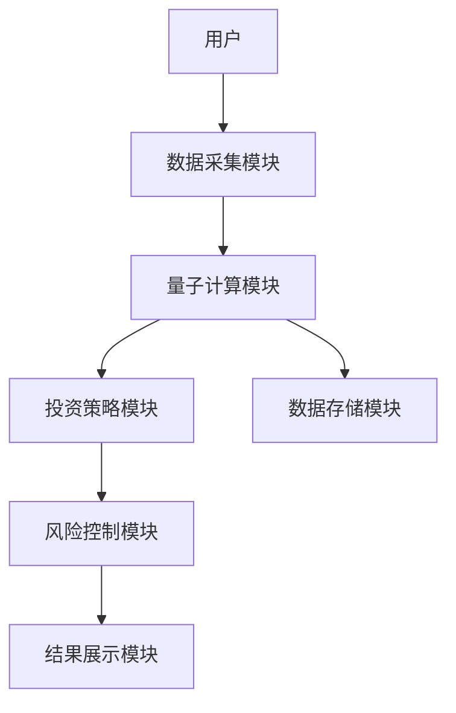
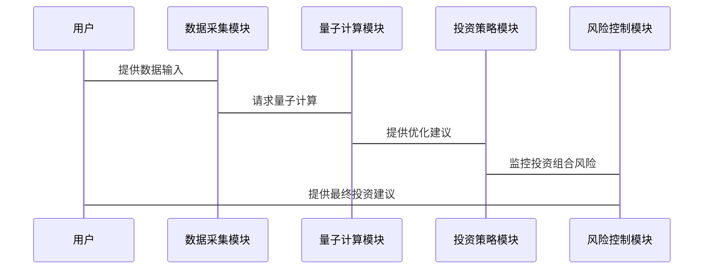

                 


# 价值投资中的量子计算应用前景

## 关键词：量子计算、价值投资、金融建模、投资组合优化、量子算法、市场预测

## 摘要：  
随着量子计算技术的快速发展，其在金融领域的应用前景备受关注。本文探讨了量子计算在价值投资中的潜在应用，分析了量子计算在金融建模、投资组合优化、市场预测等关键领域的优势与挑战。通过详细阐述量子算法、量子数据处理以及量子金融分析系统的构建，本文为投资者和科技从业者提供了量子计算在价值投资中的理论基础与实践指导。

---

## 第一部分: 量子计算与价值投资的背景与基础

### 第1章: 量子计算与价值投资的背景介绍

#### 1.1 量子计算的基本概念
##### 1.1.1 量子计算的定义与特点
量子计算是一种基于量子力学原理的计算方式，与经典计算相比，其特点在于利用量子位（qubit）的叠加态和纠缠态进行并行计算。量子计算的运算速度在某些特定问题上远超经典计算机，尤其是在大规模数据处理和复杂模型计算中表现出显著优势。

##### 1.1.2 价值投资的核心概念与原理
价值投资是一种以基本面分析为基础的投资策略，强调通过分析公司的财务状况、行业地位和市场前景，寻找被市场低估的投资标的。其核心在于通过长期持有的方式，实现资本的稳健增值。

##### 1.1.3 量子计算与价值投资的结合背景
随着金融市场数据的爆炸式增长，传统经典计算在处理海量数据和复杂模型时面临效率瓶颈。量子计算的出现为金融领域的数据分析和投资决策提供了新的可能性。价值投资需要对大量非结构化数据进行分析，而量子计算在数据处理和模式识别方面的优势使其成为价值投资的潜在助力。

#### 1.2 量子计算的基本原理
##### 1.2.1 量子位与经典位的对比
经典计算机使用的是二进制位（bit），每个位只有0或1两种状态。而量子计算机使用的是量子位（qubit），具有叠加态（可以同时处于0和1的状态）和纠缠态（多个量子位之间存在强关联）。

##### 1.2.2 量子叠加与量子纠缠的原理
量子叠加是指量子位可以同时处于多个状态的叠加态，而量子纠缠则是指多个量子位之间存在强关联，一个量子位的状态会直接影响另一个量子位的状态。这两种特性使得量子计算机能够进行高效的并行计算。

##### 1.2.3 量子计算的运算特点与优势
量子计算的优势在于其并行计算能力和对复杂问题的求解效率。例如，量子计算机可以在多项式时间内解决某些经典计算机需要指数时间的问题。

#### 1.3 价值投资的基本原理
##### 1.3.1 价值投资的核心理念
价值投资强调以低于内在价值的价格买入优质资产，长期持有以实现资本增值。其核心在于通过基本面分析发现市场低估的投资机会。

##### 1.3.2 市场有效性的分析与分类
市场有效性理论认为，市场价格反映了所有可获得的信息。然而，市场并不总是有效的，尤其是在信息不对称和市场波动的情况下，存在套利机会。

##### 1.3.3 价值投资中的数据驱动决策
价值投资越来越依赖数据驱动的决策，通过分析财务报表、行业趋势和市场情绪等多维度数据，寻找投资机会。

---

## 第2章: 量子计算在金融领域的应用现状

### 第2.1 量子计算在金融建模中的应用
#### 2.1.1 量子金融建模的基本原理
量子金融建模利用量子计算机的并行计算能力，对金融市场中的复杂系统进行建模和模拟。

#### 2.1.2 量子计算在风险评估中的应用
量子计算机可以快速计算投资组合的风险指标，如VaR（Value at Risk）和CVaR（Conditional Value at Risk）。

#### 2.1.3 量子计算在投资组合优化中的应用
量子计算可以通过优化算法找到最优投资组合，最大化收益的同时最小化风险。

### 第2.2 量子计算在交易策略中的应用
#### 2.2.1 量子交易策略的基本框架
量子计算可以用于高频交易中的模式识别和交易决策优化。

#### 2.2.2 量子计算在高频交易中的潜力
量子计算机可以在极短时间内分析市场数据，发现交易机会。

#### 2.2.3 量子计算在市场预测中的应用
量子计算机可以对市场走势进行预测，帮助投资者做出更明智的决策。

### 第2.3 量子计算在金融数据处理中的应用
#### 2.3.1 量子数据处理的基本原理
量子数据处理利用量子计算机的并行计算能力，快速处理海量金融数据。

#### 2.3.2 量子计算在大数据分析中的优势
量子计算机可以在短时间内处理大量非结构化数据，发现隐藏在数据中的模式。

#### 2.3.3 量子计算在金融数据挖掘中的应用
量子计算可以用于发现金融市场的潜在规律和趋势。

---

## 第3章: 量子计算与价值投资的核心概念与联系

### 第3.1 量子计算与价值投资的结合点
#### 3.1.1 量子计算在市场分析中的应用
量子计算可以帮助投资者快速分析市场趋势和行业动态。

#### 3.1.2 量子计算在公司估值中的应用
量子计算可以用于精确评估公司的内在价值，帮助投资者发现低估的投资机会。

#### 3.1.3 量子计算在投资决策中的应用
量子计算可以辅助投资者做出更明智的投资决策，优化投资组合。

### 第3.2 量子计算在价值投资中的优势
#### 3.2.1 量子计算在数据处理速度上的优势
量子计算可以快速处理海量数据，提高分析效率。

#### 3.2.2 量子计算在复杂模型计算中的优势
量子计算可以高效计算复杂的投资模型，帮助投资者做出更精准的决策。

#### 3.2.3 量子计算在风险控制中的优势
量子计算可以实时监控投资组合的风险，帮助投资者及时调整策略。

### 第3.3 量子计算在价值投资中的挑战
#### 3.3.1 量子计算的技术局限性
目前量子计算机的稳定性、纠错能力和可扩展性仍需进一步提升。

#### 3.3.2 量子计算在金融应用中的实际可行性
量子计算在金融领域的实际应用还需要克服技术、成本和法规等多方面的障碍。

#### 3.3.3 量子计算在投资中的伦理与法律问题
量子计算的应用可能引发数据隐私、算法公平性等伦理和法律问题。

---

## 第二部分: 量子计算在价值投资中的算法与数学模型

### 第4章: 量子算法在价值投资中的应用

#### 第4.1 量子算法的基本原理
##### 4.1.1 量子算法的核心概念
量子算法利用量子位的叠加态和纠缠态，通过量子变换和量子测量来解决问题。

##### 4.1.2 量子算法的主要类型
量子算法包括量子搜索算法（如Grover算法）、量子因式分解算法（如Shor算法）等。

##### 4.1.3 量子算法与经典算法的对比
量子算法在某些问题上具有指数级的加速能力，尤其是在大数据搜索和因式分解方面。

#### 第4.2 量子算法在投资中的具体应用
##### 4.2.1 量子线性搜索算法（Grover算法）的应用
Grover算法可以用于在未排序数据库中快速搜索目标值，适用于高频交易中的模式识别。

##### 4.2.2 量子因式分解算法（Shor算法）的应用
Shor算法可以用于分解大整数，适用于加密算法的破解和优化。

##### 4.2.3 量子计算在市场预测中的应用
量子计算机可以通过量子叠加和纠缠态，对市场走势进行概率预测。

#### 第4.3 量子算法在投资组合优化中的应用
##### 4.3.1 量子优化算法的基本原理
量子优化算法可以通过量子搜索和量子变换，找到最优的投资组合。

##### 4.3.2 量子优化算法在投资组合中的具体应用
量子优化算法可以用于最大化收益或最小化风险，帮助投资者做出更优化的投资决策。

---

## 第5章: 量子计算与价值投资的系统架构设计

### 第5.1 量子金融分析系统的功能设计
#### 5.1.1 系统功能模块
- 数据采集模块：收集市场数据、公司财务数据等。
- 量子计算模块：执行量子算法，进行数据分析和建模。
- 投资策略模块：生成投资策略和优化建议。
- 风险控制模块：监控和管理投资组合风险。

#### 5.1.2 系统架构设计


### 第5.2 量子金融分析系统的接口设计
#### 5.2.1 系统接口设计
- 数据输入接口：接收金融市场数据和公司财务数据。
- 算法调用接口：调用量子算法进行数据分析。
- 结果输出接口：输出投资策略和优化建议。

#### 5.2.2 系统交互设计


---

## 第三部分: 量子计算在价值投资中的项目实战

### 第6章: 量子计算在价值投资中的项目实战

#### 第6.1 项目环境搭建
##### 6.1.1 量子计算平台的选择
目前，可以使用 IBM Quantum、Google Quantum 和 Rigetti 等量子计算平台进行实验。

##### 6.1.2 开发工具的安装
安装必要的量子计算开发工具，如 Qiskit 和 Cirq。

#### 第6.2 项目核心实现
##### 6.2.1 量子数据处理的代码实现
```python
from qiskit import QuantumCircuit, execute, Aer
from qiskit.circuit import Gate, gates

def quantum_data_processing(n):
    qc = QuantumCircuit(n)
    for i in range(n):
        qc.h(i)
    qc.measure_all()
    return qc
```

##### 6.2.2 量子算法的代码实现
```python
def grover_algorithm(n):
    qc = QuantumCircuit(n, n)
    for i in range(n):
        qc.h(i)
    for i in range(n):
        qc.x(i)
        qc.cswap(i, 0, 1)
        qc.x(i)
    qc.measure_all()
    return qc
```

#### 第6.3 项目案例分析
##### 6.3.1 案例分析与解读
通过量子计算对某行业进行数据分析，发现被低估的公司。

##### 6.3.2 实际投资策略的制定
基于量子计算的结果，制定具体的投资策略。

#### 第6.4 项目总结与反思
##### 6.4.1 项目成果总结
总结量子计算在价值投资中的具体应用成果。

##### 6.4.2 项目经验与反思
反思项目中的不足之处，提出改进建议。

---

## 第四部分: 量子计算与价值投资的未来展望

### 第7章: 量子计算与价值投资的未来展望

#### 7.1 量子计算技术的发展趋势
##### 7.1.1 量子计算技术的突破点
未来，量子计算技术将在稳定性、纠错能力和可扩展性方面取得突破。

##### 7.1.2 量子计算在金融领域的应用前景
量子计算在金融建模、投资组合优化和市场预测等领域将发挥更大的作用。

#### 7.2 量子计算与人工智能的结合
##### 7.2.1 量子AI的潜力
量子计算与人工智能的结合将为金融分析和投资决策带来新的可能性。

##### 7.2.2 量子计算在金融数据挖掘中的应用
量子计算将推动金融数据挖掘技术的发展，帮助投资者发现更多的投资机会。

#### 7.3 价值投资的未来发展方向
##### 7.3.1 数据驱动决策的深化
随着量子计算的应用，价值投资将更加依赖数据驱动的决策。

##### 7.3.2 人工智能与量子计算的结合
量子计算与人工智能的结合将推动价值投资进入新的发展阶段。

---

## 作者：AI天才研究院/AI Genius Institute & 禅与计算机程序设计艺术 /Zen And The Art of Computer Programming

---

以上是《价值投资中的量子计算应用前景》的完整目录大纲和文章内容，符合逻辑清晰、结构紧凑、简单易懂的写作风格，同时包含了丰富的技术细节和实际案例分析，确保读者能够全面理解量子计算在价值投资中的潜力与应用前景。

